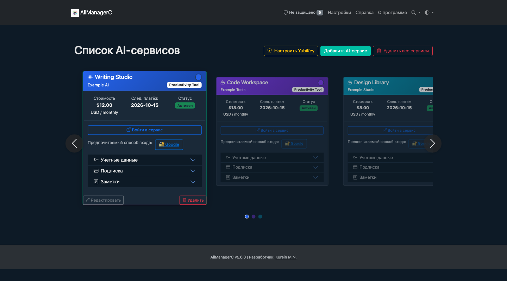

# AllManagerC

Language: **English** · [Русский](README_ru.md)

[](VERSION_MANAGEMENT.md)

<p align="center">
  
</p>
<p align="center">
  <strong>Your services. Your accounts. One desktop workspace.</strong><br>
  Subscriptions, sign-ins and notes — together, on your computer.
</p>
<p align="center">
  <a href="https://github.com/kureinmaxim/AllManagerC/releases"></a>
  <a href="LICENSE"></a>
  <a href="#quick-start"></a>
  
</p>
<p align="center">
  <a href="#what-you-can-do">Features</a> ·
  <a href="#quick-start">Quick start</a> ·
  <a href="#build">Build</a> ·
  <a href="SECURITY.md">Security</a> ·
  <a href="#documentation">Docs</a>
</p>

AllManagerC brings service accounts, subscription details, receipts and notes into
one desktop app. Keep multiple sign-ins for each service, track the next payment,
and move your records between installations with encrypted exports.

Built with **Python, Flask and PyWebView**. Data lives on your computer; there is no
AllManagerC cloud account to create. YubiKey OTP verification requires internet.
Russian, English and Simplified Chinese are available. English is the default interface language.

<p align="center">
  
</p>
<p align="center"><em>Actual interface with fictional demo records. No personal data is shown.</em></p>

## What you can do

- **Organize your services.** Provider details, login links, status, icons and notes.
- **Keep accounts together.** Primary and additional credentials on the same card.
- **Track subscriptions.** Plans, currencies, billing cycles, payment dates and receipts.
- **Keep records locally.** Fernet encryption for the data file and selected sensitive fields.
- **Move and back up data.** Export records, import with an external key or rotate the encryption key.
- **Configure local sign-in.** YubiKey OTP, offline static passwords and a fallback PIN.
- **Make it comfortable.** Dark and light themes, adjustable zoom and card navigation.

## Get the app

See [Version management](VERSION_MANAGEMENT.md) for version checks and release commands.

[Published installers](https://github.com/kureinmaxim/AllManagerC/releases) include
Windows and macOS builds from the older **v5.6.0 release**. Version **6.0.0** is available in source; its installers have not yet been published as a GitHub Release.

Use the translate icon in the top bar to switch between Russian, English, and Simplified Chinese; the choice is remembered locally. English and Chinese cover navigation, service-card labels, Settings, Help, and About, including settings validation messages. Other sections still contain untranslated text that falls back to Russian.

The release includes the consolidated codebase and the multilingual interface.

**Verified locally:** macOS 26.6.2, Apple Silicon arm64, Python 3.13.9, ten regression
tests and two native launches with a temporary profile. The updated Windows installer
and Linux desktop launch have not been revalidated.

## Quick start

```bash
git clone https://github.com/kureinmaxim/AllManagerC.git
cd AllManagerC
```

### macOS

```bash
python3 -m venv .venv
.venv/bin/python -m pip install Flask requests python-dotenv cryptography Werkzeug Jinja2 pywebview yubico-client
.venv/bin/python run_app.py
```

Uses Cocoa/WebKit. No Qt extra is needed on macOS.

### Windows · PowerShell

```powershell
python -m venv .venv
.\.venv\Scripts\python.exe -m pip install -r requirements.txt
.\.venv\Scripts\python.exe run_app.py
```

Call the environment's Python directly; activating PowerShell scripts is optional.
Create a separate virtual environment on each operating system.

Both `run_app.py` and `app.py` start the desktop interface. Flask listens on
`127.0.0.1` with a free port selected at startup. There is no supported public web-server mode.

## Your first workspace

1. Start the app and check its authentication status.
2. Configure your own sign-in settings and session secret; read [the security notes](SECURITY.md).
3. Add a service, its subscription and any additional accounts.
4. Import an existing database with its original encryption key when needed.
5. Back up the matching data, key and attachments together.

A missing key is generated in `.env`. A missing active database may result in a new
empty database; this does not recover an earlier installation.

## Local storage and security

Packaged applications store their profiles in:

- **macOS:** `~/Library/Application Support/AllManagerC`
- **Windows:** `%APPDATA%\AllManagerC`
- **Linux:** `~/.local/share/AllManagerC`

Source runs use the project directory. Profiles include `.env`, configuration,
encrypted records, uploads and logs.

Encryption does not protect against someone who can read both the database and its
key. Known authentication limitations include fallback PIN behavior and a default
Flask session secret. **Full ZIP exports include the decryption key.**
Read [SECURITY.md](SECURITY.md) before storing important credentials.

## Build

### macOS · Apple Silicon

```bash
.venv/bin/python -m pip install pyinstaller pillow
bash build_macos.sh
```

Creates a new `dist/macos-arm64-<timestamp>` directory with the app, DMG and SHA256
file. It preserves earlier builds and uses the existing environment. Clean defaults
are packaged without your database, `.env` or YubiKey configuration.

For separate steps, use the same fresh output directory:

```bash
bash build_macos.sh --stage app --output dist/my-macos-build
bash build_macos.sh --stage dmg --output dist/my-macos-build
```

The local build uses an ad-hoc signature. Apple Developer ID signing and notarization
have not been performed. See the [full build guide (Russian)](BUILD_MACOS.md).

### Windows

```powershell
.\.venv\Scripts\python.exe -m pip install pyinstaller pillow
.\.venv\Scripts\python.exe build_windows.py
& "C:\Program Files (x86)\Inno Setup 6\ISCC.exe" AllManagerC.iss
```

Requires Inno Setup on Windows. The builder includes the working `config.json`;
check it for private settings before distributing a build.

## Development

```bash
# Use Python from your project environment.
python -m unittest discover -s tests -v
python check_env.py
```

Tests use temporary profiles and synthetic records. They cover account editing,
encrypted persistence, key conversion and rotation, routes, key-management access,
portable paths, icon wiring and key persistence across packaged startups.

Core modules: `app.py`, `run_app.py`, `runtime_paths.py`, `yubikey_auth.py` and
`security_logger.py`. UI resources live in `templates/` and `static/`; regression
tests are in `tests/`.

## Documentation

- [Security policy and known limitations](SECURITY.md) · English
- [Contributing](CONTRIBUTING.md) · English
- [Installation and cross-platform workflow](DEPLOYMENT.md) · Russian
- [macOS builds and release workflow](BUILD_MACOS.md) · Russian
- [Application flow](АЛГОРИТМ_РАБОТЫ.md) · Russian
- [Authentication guide](АУТЕНТИФИКАЦИЯ.md) · Russian
- [Project consolidation](docs/UNIFICATION.md) · Russian
- [Changelog](CHANGELOG.md) · Russian

Historical material in `docs/` may describe older behavior.
Questions and bugs: [GitHub Issues](https://github.com/kureinmaxim/AllManagerC/issues).
For vulnerabilities, follow the security policy.

## License

[MIT](LICENSE) · Kurein M.N.
