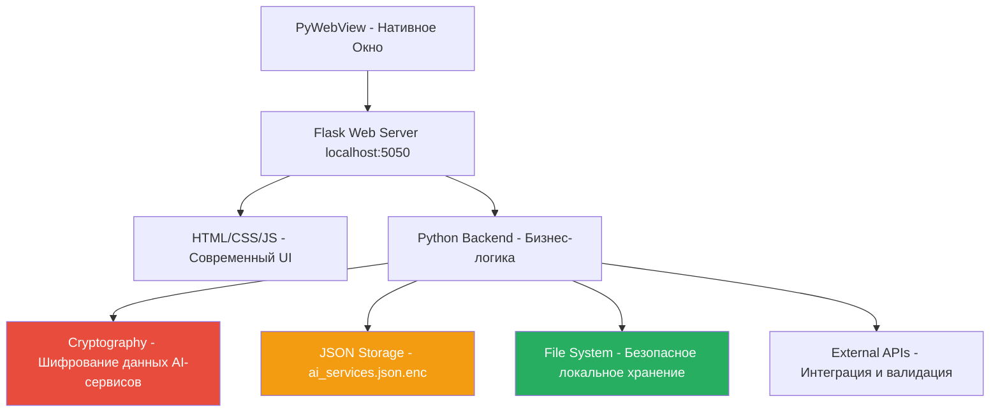

# AI Manager: Учебное Пособие по Архитектуре и Принципам Разработки

## Введение

AI Manager — это современное гибридное приложение для управления подписками на AI-сервисы, построенное на принципе веб-интерфейса (Flask) внутри нативного окна приложения (PyWebView). Это пособие демонстрирует, как создавать кроссплатформенные приложения с локальной безопасностью, используя веб-технологии для интерфейса и Python для бизнес-логики.

## Архитектурный Обзор

### Основная Концепция: Гибридное Приложение с Локальной Безопасностью



**Принцип работы AI Manager:**
1. **PyWebView** создает нативное окно приложения с минимальным потреблением памяти
2. **Flask** запускается в отдельном потоке как локальный веб-сервер на порту 5050
3. **HTML-интерфейс** обеспечивает современный UX для управления AI-сервисами
4. **Python-код** обрабатывает шифрование данных, управление подписками и интеграции
5. **Криптография** защищает API ключи, пароли и персональные данные
6. **Локальное хранение** гарантирует, что данные никогда не покидают устройство

### Ключевые Технологии и Архитектурные Решения

| Компонент | Технология | Назначение | Принципы использования |
|-----------|------------|------------|------------------------|
| **Frontend** | Flask + Jinja2 | Веб-интерфейс | MVC-архитектура, адаптивный дизайн |
| **Desktop Shell** | PyWebView | Нативное окно | Эмуляция браузера, системная интеграция |
| **Security** | Cryptography (Fernet) | Шифрование данных | AES-128, локальное управление ключами |
| **Concurrency** | Threading | Многопоточность | Разделение UI и бизнес-логики |
| **Templating** | Jinja2 | Динамические страницы | Наследование шаблонов, кастомные фильтры |
| **HTTP Client** | Requests | API интеграции | Валидация AI-сервисов, проверка подписок |
| **Data Storage** | JSON + Encryption | Структурированное хранение | Зашифрованные файлы, резервное копирование |
| **Configuration** | Pathlib + JSON | Управление настройками | Кроссплатформенные пути, версионирование |

---

## Учебный План: От Веб-Технологий к Гибридным Приложениям

### Урок 0: Безопасность аутентификации в веб-приложениях

**Ключевые концепции:**
- Историческая эволюция систем аутентификации
- Современные угрозы и методы защиты
- Многофакторная аутентификация (MFA)
- Rate limiting и защита от брутфорса
- Аудит безопасности и мониторинг

**Практические навыки:**
- Анализ текущей реализации безопасности в AI Manager
- Реализация защиты от timing attacks
- Создание системы аудита безопасности
- Внедрение современных стандартов аутентификации

**Примеры из проекта:**
```python
# Современная система аутентификации с защитой от перебора
class ModernAuthentication:
    def __init__(self):
        self.secret_key = secrets.token_urlsafe(32)
        self.session_timeout = 3600
        self.max_attempts = 3
        self.lockout_duration = 1800  # 30 минут
    
    def authenticate_user(self, username, password, totp_code=None):
        # Проверка блокировки аккаунта
        if self.is_account_locked(username):
            return False, "Аккаунт заблокирован"
        
        # Проверка rate limiting
        if self.is_rate_limited(username):
            return False, "Слишком много попыток входа"
        
        # Безопасная проверка пароля
        if not self.verify_password(username, password):
            self.record_failed_attempt(username)
            return False, "Неверные учетные данные"
        
        # Проверка 2FA
        if totp_code and not self.verify_totp(username, totp_code):
            return False, "Неверный код 2FA"
        
        return True, self.create_session(username)
```

### Урок 1: Основы Flask и Веб-Архитектуры для AI Manager

**Ключевые концепции:**
- Эволюция от веб-сайтов к настольным приложениям
- Роутинг и обработка HTTP-запросов в контексте управления AI-сервисами
- Архитектура Flask для локального использования
- Интеграция с PyWebView для создания нативного окна

**Практические навыки:**
- Создание Flask приложения для управления данными
- Настройка роутинга для CRUD операций с AI-сервисами
- Обработка форм и валидация данных подписок
- Интеграция с локальной файловой системой

**Примеры из проекта:**
```python
# Главный маршрут для отображения списка AI-сервисов
@app.route('/')
def index():
    ai_services = load_ai_services()  # Загрузка с дешифрованием
    return render_template('index.html', 
                         ai_services=ai_services,
                         total_monthly_cost=calculate_total_cost(ai_services))
```

### Урок 2: Шаблонизация и Динамический Интерфейс AI Manager

**Ключевые концепции:**
- Современная система шаблонов для управления AI-сервисами
- Наследование шаблонов и компонентная архитектура
- Кастомные фильтры для отображения данных подписок
- Адаптивный дизайн и система тем

**Практические навыки:**
- Создание карточек AI-сервисов с динамическим контентом
- Реализация фильтрации и поиска по сервисам
- Разработка кастомных фильтров для работы с валютой и датами
- Система уведомлений и flash-сообщений

**Примеры из проекта:**
```html
<!-- Карточка AI-сервиса с подпиской -->
<div class="service-card" data-service-type="{{ service.service_type }}">
    <h3>{{ service.name }}</h3>
    <p class="cost">${{ service.subscription.cost_monthly|format_currency }}</p>
    <p class="renewal">{{ service.subscription.renewal_date|days_until }} дней до продления</p>
    <div class="features">
        
            <span class="feature-tag">{{ feature }}</span>
        
    </div>
</div>
```

### Урок 3: Формы и Обработка Данных AI-сервисов

**Ключевые концепции:**
- Сложные формы для добавления AI-сервисов
- Многоуровневая валидация (клиент, сервер, бизнес-логика)
- Безопасная загрузка файлов (логотипы, документы)
- Автоматизация заполнения на основе типа сервиса

**Практические навыки:**
- Создание форм с предзаполнением и автодополнением
- Реализация валидации API ключей в реальном времени
- Обработка файлов с проверкой безопасности
- Система черновиков и автосохранения

**Примеры из проекта:**
```python
# Обработка формы добавления AI-сервиса
@app.route('/add_service', methods=['GET', 'POST'])
def add_service():
    if request.method == 'POST':
        # Извлечение и валидация данных
        service_data = extract_form_data(request)
        
        # Шифрование чувствительных данных
        if 'credentials' in service_data:
            service_data['credentials'] = encrypt_ai_service_credentials(
                service_data['credentials']
            )
        
        # Сохранение с проверкой уникальности
        save_ai_service(service_data)
        flash(f'Сервис "{service_data["name"]}" добавлен!', 'success')
        return redirect(url_for('index'))
```

### Урок 4: Криптография и Безопасность в AI Manager

**Ключевые концепции:**
- Локальное шифрование данных AI-сервисов
- Управление ключами шифрования и их ротация
- Защита API ключей, паролей и токенов
- Аудит безопасности и предотвращение утечек

**Практические навыки:**
- Реализация симметричного шифрования с Fernet
- Создание системы управления ключами
- Разработка аудита криптографических операций
- Безопасное хранение конфигурации

**Примеры из проекта:**
```python
# Криптографический движок AI Manager
class AIManagerCrypto:
    def encrypt_ai_service_credentials(self, credentials):
        encrypted_credentials = {}
        for field, value in credentials.items():
            if value:
                encrypted_value = self.encrypt_data(value, context=f"credential_{field}")
                encrypted_credentials[field] = encrypted_value
        return encrypted_credentials
    
    def rotate_master_key(self):
        # Создание нового ключа и перешифровка всех данных
        new_key = Fernet.generate_key()
        # Миграция существующих сервисов...
```

### Урок 5: Многопоточность и Производительность

**Ключевые концепции:**
- Асинхронное выполнение операций в AI Manager
- Разделение Flask сервера и PyWebView интерфейса
- Фоновые задачи для проверки статуса подписок
- Оптимизация производительности

**Практические навыки:**
- Настройка многопоточной архитектуры
- Реализация фоновых задач без блокировки UI
- Профилирование и мониторинг производительности
- Оптимизация криптографических операций

### Урок 6: Конфигурация и Управление Настройками

**Ключевые концепции:**
- Система конфигурации AI Manager
- Управление путями данных на разных платформах
- Миграции данных и обновления схемы
- Резервное копирование и восстановление

**Практические навыки:**
- Создание кроссплатформенной системы конфигурации
- Реализация миграций данных между версиями
- Автоматическое резервное копирование
- Управление версиями схемы данных

### Урок 7: PyWebView и Интеграция с ОС

**Ключевые концепции:**
- Создание нативного окна приложения
- Интеграция с системными уведомлениями
- Управление жизненным циклом приложения
- Упаковка и распространение

**Практические навыки:**
- Настройка PyWebView для production использования
- Реализация системных уведомлений
- Создание установщиков для разных платформ
- Автоматические обновления

### Урок 8: Внешние API и Интеграции

**Ключевые концепции:**
- Интеграция с API AI-сервисов
- Валидация API ключей и токенов
- Мониторинг статуса подписок
- Обработка ошибок и retry логика

**Практические навыки:**
- Создание HTTP клиентов для AI API
- Реализация валидации ключей в реальном времени
- Система мониторинга и уведомлений
- Обработка rate limiting и ошибок API

### Урок 9: Комплексный Обзор и Производственное Развертывание

**Ключевые концепции:**
- Архитектурные паттерны гибридных приложений
- Безопасность и производительность в production
- Мониторинг и логирование
- Планы развития и масштабирования

**Практические навыки:**
- Оптимизация приложения для production
- Настройка мониторинга и алертов
- Планирование архитектуры для новых функций
- Документирование и поддержка

### Урок 10: Отладка приложения через браузер

**Ключевые концепции:**
- Инструменты разработчика браузера (Chrome DevTools)
- Диагностика веб-приложений
- Анализ сетевых запросов и ответов
- Отладка JavaScript кода
- Профилирование производительности

**Практические навыки:**
- Использование Console для диагностики
- Анализ Network вкладки для мониторинга запросов
- Отладка через Sources с точками останова
- Проверка Application данных (cookies, localStorage)
- Решение типичных проблем веб-приложений
- Отладка на мобильных устройствах

---

## Методические Указания для Преподавателей

### Рекомендуемый Подход к Обучению

**1. Практико-ориентированное обучение:**
- Каждый урок строится вокруг реального функционала AI Manager
- Студенты создают работающие компоненты на каждом занятии
- Код из уроков можно использовать в реальных проектах

**2. Прогрессивное усложнение:**
- Начинаем с простых Flask маршрутов
- Постепенно добавляем безопасность, производительность, интеграции
- Заканчиваем полнофункциональным приложением

**3. Акцент на безопасности:**
- Криптография и защита данных рассматриваются как приоритет
- Каждый компонент анализируется с точки зрения безопасности
- Студенты изучают best practices для персональных данных

**4. Современные технологии:**
- Использование актуальных версий библиотек
- Адаптивный дизайн и современный UX
- Кроссплатформенная разработка

### Структура Каждого Урока

```
1. Историческая справка (5-10 мин)
   - Эволюция технологий
   - Контекст и мотивация

2. Теоретические основы (15-20 мин)
   - Ключевые концепции
   - Архитектурные принципы

3. Практический разбор (30-40 мин)
   - Построчный анализ кода из AI Manager
   - Объяснение паттернов и решений

4. Hands-on практика (20-30 мин)
   - Создание собственных компонентов
   - Модификация существующего кода

5. Обсуждение и Q&A (10-15 мин)
   - Ответы на вопросы
   - Обсуждение альтернативных подходов
```

### Требования к Окружению

**Программное обеспечение:**
- Python 3.8+ с pip
- Современный браузер (Chrome, Firefox, Safari, Edge)
- Редактор кода (VS Code, PyCharm, Sublime Text)
- Git для версионирования

**Python пакеты:**
```bash
pip install flask jinja2 cryptography pywebview pathlib requests
```

**Дополнительные инструменты:**
- Postman или curl для тестирования API
- SQLite Browser для просмотра данных (опционально)
- Browser DevTools для отладки frontend

### Оценка и Контроль Знаний

**Практические задания (70%):**
- Создание форм для управления AI-сервисами
- Реализация системы шифрования данных
- Разработка API интеграций
- Построение полнофункционального компонента

**Теоретические вопросы (20%):**
- Понимание архитектурных принципов
- Знание вопросов безопасности
- Объяснение выбора технологий

**Итоговый проект (10%):**
- Расширение функциональности AI Manager
- Добавление нового типа AI-сервиса
- Улучшение безопасности или производительности

### Типичные Проблемы и Решения

**Проблема: Сложность настройки криптографии**
*Решение:* Предоставить готовые скрипты для генерации ключей и начальной настройки

**Проблема: Различия между ОС**
*Решение:* Использовать кроссплатформенные библиотеки (pathlib) и предоставить примеры для каждой ОС

**Проблема: Сложность отладки многопоточности**
*Решение:* Начинать с однопоточной версии, постепенно добавлять threading

**Проблема: Понимание гибридной архитектуры**
*Решение:* Диаграммы и визуализация потока данных между компонентами

### Дополнительные Ресурсы

**Документация:**
- [Flask Documentation](https://flask.palletsprojects.com/)
- [PyWebView Documentation](https://pywebview.flowrl.com/)
- [Cryptography Documentation](https://cryptography.io/)

**Примеры кода:**
- Готовые шаблоны для быстрого старта
- Набор утилит для типичных задач
- Примеры интеграций с популярными AI API

**Дополнительные проекты:**
- Расширение AI Manager для командной работы
- Интеграция с облачными хранилищами
- Мобильное приложение-компаньон

---

## Структура Репозитория Курса

```
AiManager-Course/
├── lessons/                    # Материалы уроков
│   ├── lesson-01-flask-basics.md
│   ├── lesson-02-templating.md
│   ├── lesson-03-forms-data.md
│   ├── lesson-04-cryptography.md
│   ├── lesson-05-multithreading.md
│   ├── lesson-06-configuration.md
│   ├── lesson-07-pywebview-gui.md
│   ├── lesson-08-external-api-integration.md
│   ├── lesson-09-comprehensive-review.md
│   └── lesson-10-debugging.md
├── examples/                   # Примеры кода
│   ├── basic-flask-app/
│   ├── encryption-examples/
│   ├── form-templates/
│   └── api-integrations/
├── assignments/                # Задания и проекты
│   ├── assignment-01-flask-setup.md
│   ├── assignment-02-ui-components.md
│   └── final-project.md
├── resources/                  # Дополнительные ресурсы
│   ├── setup-scripts/
│   ├── testing-data/
│   └── reference-materials/
└── AiManager/                  # Полный исходный код
    ├── app.py
    ├── crypto_manager.py
    ├── templates/
    ├── static/
    └── data/
```

## Заключение

Этот курс предоставляет студентам практические навыки создания современных гибридных приложений с акцентом на безопасность и производительность. AI Manager служит примером того, как веб-технологии могут быть эффективно использованы для создания настольных приложений без ущерба для пользовательского опыта или безопасности данных.

Курс готовит специалистов, способных разрабатывать приложения, которые сочетают в себе удобство веб-интерфейсов с безопасностью и производительностью нативных приложений.

---

*Это руководство является частью образовательной программы "AI Manager: Архитектура и принципы разработки современных гибридных приложений"*
