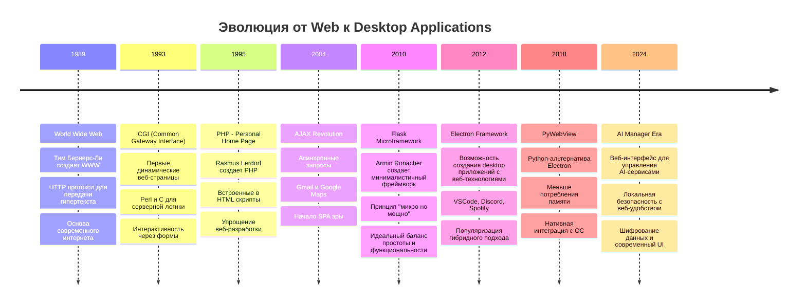
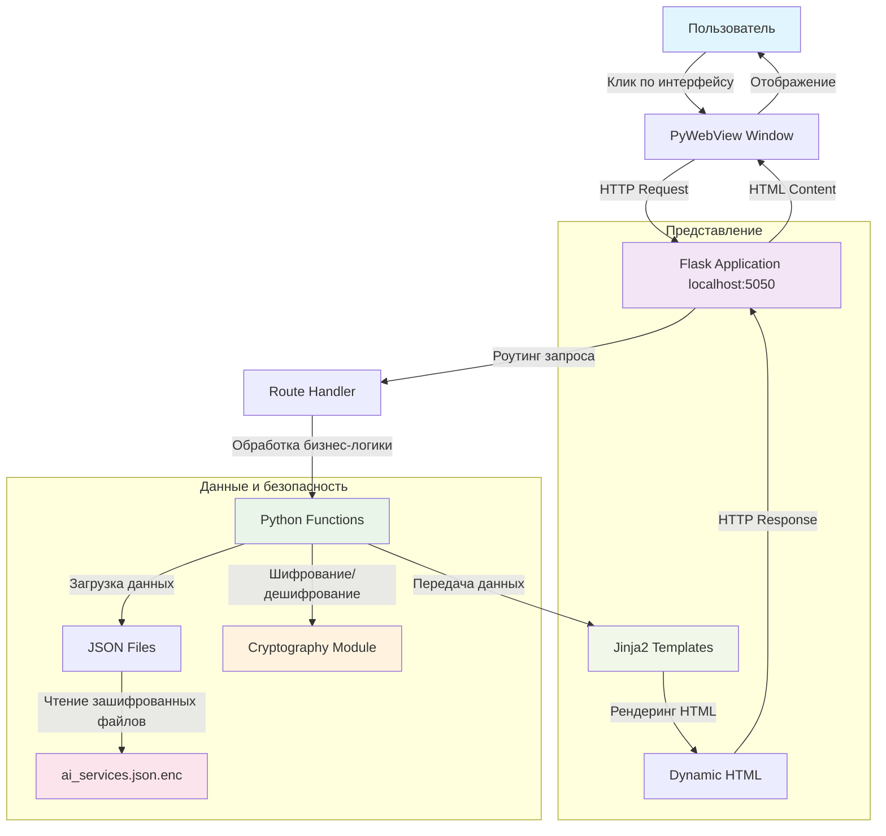
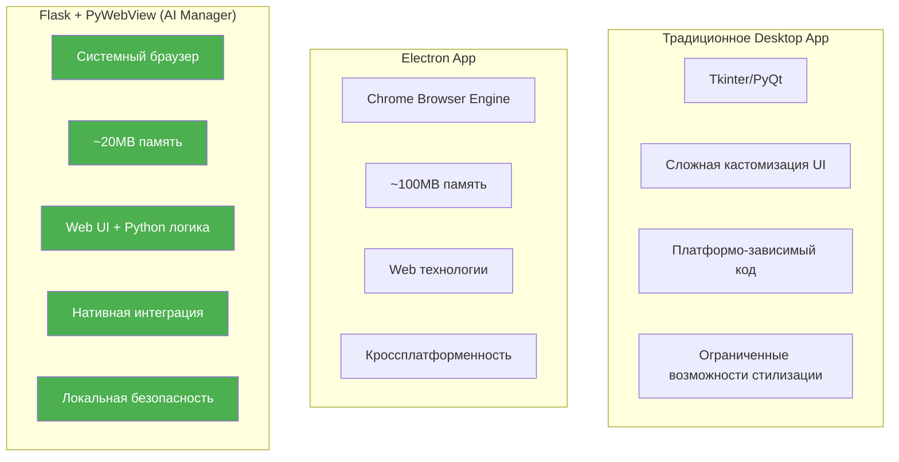
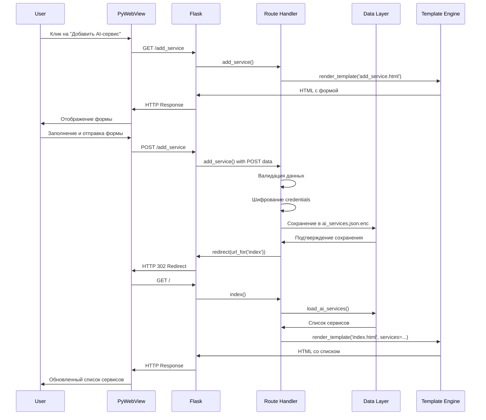

# Урок 1: Основы Flask и Веб-Архитектуры для AI Manager

## 🎯 Цели урока

К концу этого урока вы будете понимать:
- Что такое веб-сервер и как он работает в контексте настольных приложений
- Историю развития веб-фреймворков и их применение в десктопных решениях
- Архитектуру Flask и принципы работы в гибридных приложениях
- Основы роутинга и обработки HTTP-запросов
- Как создать веб-интерфейс для управления AI-сервисами

## 📚 Историческая справка и эволюция веб-технологий

### Путь от веб-сайтов к настольным приложениям



### Почему Flask для AI Manager?

**Flask** был выбран для AI Manager по следующим причинам:

1. **Минимализм** — только необходимые компоненты, никаких лишних зависимостей
2. **Гибкость** — разработчик сам выбирает архитектуру и инструменты
3. **Простота** — быстрый старт и легкое понимание кода
4. **Расширяемость** — богатая экосистема расширений
5. **Производительность** — минимальные накладные расходы
6. **Интеграция** — отлично работает с PyWebView для создания десктопных приложений

**Философия Flask**: "Делать простые вещи легкими, а сложные — возможными"

## 🏗️ Архитектура гибридного приложения AI Manager

### Общая схема работы системы



### Подробное объяснение компонентов

**1. PyWebView Window** — это нативное окно операционной системы, которое содержит встроенный веб-браузер. Преимущества:
- Нативный внешний вид (заголовок окна, кнопки управления)
- Меньше потребления памяти по сравнению с Electron
- Доступ к системным API
- Интеграция с системными уведомлениями

**2. Flask Application** — локальный веб-сервер, работающий на localhost:5050. Особенности:
- Работает в отдельном потоке
- Обрабатывает HTTP-запросы от PyWebView
- Предоставляет RESTful API для интерфейса
- Управляет сессиями и состоянием приложения

**3. Route Handlers** — функции Python, обрабатывающие конкретные URL. Они:
- Получают данные из запросов
- Выполняют бизнес-логику
- Возвращают HTML или JSON ответы

## 🔧 Детальный разбор архитектуры Flask в AI Manager

### Инициализация приложения — построчный анализ

```python
# app.py, строки 1-15 — Импорты и настройка
import json                    # Для работы с JSON данными AI-сервисов
import os                      # Для работы с файловой системой и путями
import threading              # Для запуска Flask в отдельном потоке
import webbrowser            # Для открытия внешних ссылок
from datetime import datetime # Для работы с датами (создание, обновление записей)
from pathlib import Path     # Современный способ работы с путями файлов

# Flask и его компоненты
from flask import Flask, render_template, request, redirect, url_for, flash, jsonify

# Криптография для защиты данных AI-сервисов
from cryptography.fernet import Fernet

# PyWebView для создания десктопного окна
import webview

# Загрузка переменных окружения
from dotenv import load_dotenv

load_dotenv()  # Загружаем .env файл если существует
```

**Почему именно эти импорты?**
- `json` — AI Manager хранит данные о сервисах в JSON формате для читаемости и простоты
- `threading` — Flask должен работать в фоновом потоке, чтобы не блокировать PyWebView
- `cryptography.fernet` — для защиты паролей и API ключей AI-сервисов
- `webview` — создание нативного окна без тяжелого Chrome

### Создание экземпляра Flask — глубокий анализ

```python
# app.py, строки 20-25
app = Flask(__name__)

# Почему именно __name__?
# __name__ содержит имя текущего модуля
# Flask использует это для:
# 1. Определения корневой папки приложения
# 2. Поиска папок templates/ и static/
# 3. Настройки путей для загрузки ресурсов
```

**Преимущества такого подхода:**
- **Автоматическое определение путей** — Flask сам находит templates и static
- **Портабельность** — приложение работает из любой директории
- **Отладка** — логи содержат понятные имена модулей

### Конфигурация приложения — безопасность и настройки

```python
# app.py, строки 30-50 — Конфигурация безопасности и путей
app.config['SECRET_KEY'] = os.getenv("FLASK_SECRET_KEY", "ai-manager-secret-key-2024")
# SECRET_KEY используется для:
# - Подписи сессионных cookie
# - Защиты от CSRF атак
# - Шифрования flash-сообщений

# Определение папки данных приложения
if os.name == 'nt':  # Windows
    APP_DATA_DIR = Path.home() / "AppData" / "Local" / "AiManager"
else:  # macOS и Linux
    APP_DATA_DIR = Path.home() / ".local" / "share" / "AiManager"

# Создание необходимых директорий
APP_DATA_DIR.mkdir(parents=True, exist_ok=True)
UPLOAD_FOLDER = APP_DATA_DIR / "uploads"
UPLOAD_FOLDER.mkdir(exist_ok=True)

# Настройка путей для Flask
app.config['UPLOAD_FOLDER'] = str(UPLOAD_FOLDER)
app.config['MAX_CONTENT_LENGTH'] = 16 * 1024 * 1024  # 16MB максимум для файлов
app.config['ALLOWED_EXTENSIONS'] = {'txt', 'pdf', 'png', 'jpg', 'jpeg', 'enc'}
```

**Детальное объяснение конфигурации:**

1. **SECRET_KEY** — критически важный параметр безопасности:
   - Используется для криптографической подписи данных
   - Если ключ скомпрометирован, атакующий может подделать сессии
   - В продакшене должен быть случайной строкой длиной 32+ символа

2. **APP_DATA_DIR** — кроссплатформенное определение папки данных:
   - Windows: `%LOCALAPPDATA%\AiManager`
   - macOS: `~/Library/Application Support/AiManager`  
   - Linux: `~/.local/share/AiManager`

3. **MAX_CONTENT_LENGTH** — защита от DoS атак через большие файлы:
   - Ограничивает размер загружаемых файлов
   - Предотвращает переполнение диска
   - 16MB достаточно для логотипов AI-сервисов и документов

### Система роутинга — сердце веб-приложения

```python
# app.py, строки 60-80 — Главный маршрут
@app.route('/')
def index():
    """Главная страница со списком AI-сервисов."""
    try:
        # Загружаем список AI-сервисов из зашифрованного файла
        ai_services = load_ai_services()
        
        # Передаем данные в шаблон для отображения
        return render_template('index.html', 
                             ai_services=ai_services,
                             total_services=len(ai_services))
    except Exception as e:
        # Логируем ошибку для отладки
        app.logger.error(f'Ошибка загрузки главной страницы: {e}')
        
        # Показываем пользователю дружелюбную ошибку
        flash('Произошла ошибка при загрузке AI-сервисов', 'error')
        return render_template('index.html', ai_services=[], total_services=0)
```

**Построчный анализ декоратора @app.route:**

```python
@app.route('/')
# Этот декоратор регистрирует функцию как обработчик URL
# '/' означает корневой путь (главная страница)
# По умолчанию обрабатывает только GET запросы

def index():
    # Имя функции становится именем маршрута для url_for()
    # url_for('index') вернет '/'
```

**Преимущества такой архитектуры роутинга:**
- **Декларативность** — URL и функция связаны явно
- **Автоматическая документация** — легко понять структуру приложения
- **Реверсивность** — url_for() генерирует URL по имени функции
- **Гибкость** — один URL может обрабатываться разными методами

### Обработка форм и данных AI-сервисов

```python
# app.py, строки 100-150 — Добавление нового AI-сервиса
@app.route('/add_service', methods=['GET', 'POST'])
def add_service():
    """Добавление нового AI-сервиса."""
    
    if request.method == 'GET':
        # GET запрос — отображаем форму добавления
        return render_template('add_service.html')
    
    # POST запрос — обрабатываем отправленные данные
    try:
        # Извлекаем данные из формы
        service_data = {
            'id': generate_unique_id(),                    # Уникальный идентификатор
            'name': request.form.get('name', '').strip(),  # Название сервиса
            'service_type': request.form.get('service_type', ''),  # Тип: ChatGPT, Claude, etc.
            'provider': request.form.get('provider', ''),  # Провайдер: OpenAI, Anthropic
            'login_url': request.form.get('login_url', ''), # URL для входа
            
            # Информация о подписке
            'subscription': {
                'plan': request.form.get('subscription_plan', ''),
                'cost_monthly': float(request.form.get('cost_monthly', 0) or 0),
                'renewal_date': request.form.get('renewal_date', ''),
                'status': request.form.get('subscription_status', 'active')
            },
            
            # Даты создания и обновления
            'created_at': datetime.now().isoformat(),
            'updated_at': datetime.now().isoformat()
        }
        
        # Обработка credentials отдельно для шифрования
        credentials = {}
        for field in ['username', 'password', 'api_key', 'access_token']:
            value = request.form.get(field, '').strip()
            if value:  # Шифруем только непустые значения
                credentials[field] = encrypt_data(value)
        
        service_data['credentials'] = credentials
        
        # Валидация данных
        if not service_data['name']:
            flash('Название сервиса обязательно', 'error')
            return render_template('add_service.html')
        
        # Сохранение в список
        ai_services = load_ai_services()
        ai_services.append(service_data)
        save_ai_services(ai_services)
        
        flash(f'AI-сервис "{service_data["name"]}" успешно добавлен!', 'success')
        return redirect(url_for('index'))
        
    except Exception as e:
        app.logger.error(f'Ошибка добавления AI-сервиса: {e}')
        flash('Произошла ошибка при добавлении сервиса', 'error')
        return render_template('add_service.html')
```

**Детальный анализ обработки форм:**

1. **Разделение GET и POST**:
   - GET — показываем форму пользователю
   - POST — обрабатываем отправленные данные
   - Это стандартный RESTful подход

2. **Структура данных AI-сервиса**:
   ```python
   {
       'id': 'uuid-string',           # Уникальный идентификатор
       'name': 'ChatGPT Plus',        # Пользовательское название
       'service_type': 'chatgpt',     # Тип для категоризации
       'provider': 'OpenAI',          # Компания-провайдер
       'login_url': 'https://...',    # Ссылка для быстрого входа
       'subscription': {              # Информация о подписке
           'plan': 'Plus',
           'cost_monthly': 20.0,
           'renewal_date': '2024-02-15',
           'status': 'active'
       },
       'credentials': {               # Зашифрованные данные доступа
           'username': 'encrypted_string',
           'password': 'encrypted_string'
       }
   }
   ```

3. **Безопасность через шифрование**:
   - Пароли и API ключи никогда не хранятся в открытом виде
   - Используется симметричное шифрование Fernet (AES 128)
   - Ключ шифрования хранится отдельно от данных

### Шаблонизация и динамический контент

```python
# app.py, строки 200-220 — Передача данных в шаблоны
@app.route('/services')
def services():
    """Страница списка всех AI-сервисов с фильтрацией."""
    
    # Получаем параметры фильтрации из URL
    service_type = request.args.get('type', '')
    provider = request.args.get('provider', '')
    status = request.args.get('status', '')
    
    # Загружаем все сервисы
    all_services = load_ai_services()
    
    # Применяем фильтры
    filtered_services = all_services
    if service_type:
        filtered_services = [s for s in filtered_services 
                           if s.get('service_type') == service_type]
    if provider:
        filtered_services = [s for s in filtered_services 
                           if s.get('provider') == provider]
    if status:
        filtered_services = [s for s in filtered_services 
                           if s.get('subscription', {}).get('status') == status]
    
    # Подготовка данных для шаблона
    template_data = {
        'ai_services': filtered_services,
        'total_services': len(filtered_services),
        'filters': {
            'service_type': service_type,
            'provider': provider, 
            'status': status
        },
        'available_types': get_unique_service_types(all_services),
        'available_providers': get_unique_providers(all_services)
    }
    
    return render_template('services.html', **template_data)
```

**Анализ шаблонизации:**

1. **render_template()** — функция Flask для рендеринга HTML:
   - Ищет файл в папке `templates/`
   - Передает переменные в контекст шаблона
   - Возвращает готовый HTML

2. **Контекст шаблона** — данные, доступные в HTML:
   ```html
   <!-- В шаблоне services.html -->
   <h1>AI Сервисы ({{ total_services }})</h1>
   
   
       <div class="service-card">
           <h3>{{ service.name }}</h3>
           <p>Провайдер: {{ service.provider }}</p>
           <p>Подписка: ${{ service.subscription.cost_monthly }}/мес</p>
       </div>
   
   ```

## 📊 Анализ производительности и преимуществ архитектуры

### Сравнение подходов к созданию приложений



### Преимущества архитектуры AI Manager

**1. Производительность:**
- **Низкое потребление памяти** — использует системный браузер вместо встроенного Chrome
- **Быстрый запуск** — Flask загружается за ~500ms
- **Эффективная обработка** — Python оптимизирован для серверных задач

**2. Безопасность:**
- **Локальность** — данные не передаются по сети
- **Шифрование** — все чувствительные данные зашифрованы
- **Изоляция** — приложение работает в защищенной среде

**3. Разработка и поддержка:**
- **Разделение ответственности** — UI и логика независимы
- **Веб-технологии** — использование привычных HTML/CSS/JS
- **Модульность** — легко добавлять новые функции

**4. Пользовательский опыт:**
- **Знакомый интерфейс** — веб-стандарты UX
- **Адаптивность** — поддержка разных разрешений экрана
- **Темы и кастомизация** — гибкая стилизация через CSS

## 🚀 Практический пример: Создание API для управления AI-сервисами

### RESTful API маршруты

```python
# app.py, строки 300-350 — API endpoints
@app.route('/api/services', methods=['GET'])
def api_get_services():
    """API endpoint для получения списка AI-сервисов."""
    try:
        services = load_ai_services()
        
        # Удаляем чувствительные данные перед отправкой
        safe_services = []
        for service in services:
            safe_service = service.copy()
            # Маскируем credentials
            if 'credentials' in safe_service:
                safe_service['credentials'] = {
                    key: '***' if value else '' 
                    for key, value in safe_service['credentials'].items()
                }
            safe_services.append(safe_service)
        
        return jsonify({
            'success': True,
            'data': safe_services,
            'count': len(safe_services)
        })
    except Exception as e:
        return jsonify({
            'success': False,
            'error': str(e)
        }), 500

@app.route('/api/services/<service_id>', methods=['DELETE'])
def api_delete_service(service_id):
    """API endpoint для удаления AI-сервиса."""
    try:
        services = load_ai_services()
        
        # Находим и удаляем сервис
        service_to_delete = None
        updated_services = []
        
        for service in services:
            if service.get('id') == service_id:
                service_to_delete = service
            else:
                updated_services.append(service)
        
        if not service_to_delete:
            return jsonify({
                'success': False,
                'error': 'Сервис не найден'
            }), 404
        
        # Сохраняем обновленный список
        save_ai_services(updated_services)
        
        return jsonify({
            'success': True,
            'message': f'Сервис "{service_to_delete["name"]}" удален'
        })
        
    except Exception as e:
        return jsonify({
            'success': False,
            'error': str(e)
        }), 500
```

**Анализ API архитектуры:**

1. **RESTful принципы**:
   - GET `/api/services` — получить список
   - DELETE `/api/services/<id>` — удалить конкретный сервис
   - Стандартные HTTP статус коды

2. **Безопасность API**:
   - Маскирование чувствительных данных
   - Валидация входных параметров
   - Обработка ошибок с понятными сообщениями

3. **Структура ответов**:
   ```json
   {
       "success": true,
       "data": [...],
       "count": 5
   }
   ```

## 🔍 Детальный анализ кода проекта AI Manager

### Файловая структура и ее назначение

```
AiManager/
├── app.py                    # Главный файл Flask приложения
├── config.json              # Конфигурация приложения
├── requirements.txt         # Python зависимости
├── templates/               # HTML шаблоны
│   ├── layout.html         # Базовый шаблон для всех страниц
│   ├── index.html          # Главная страница со списком AI-сервисов
│   ├── add_service.html    # Форма добавления нового сервиса
│   ├── edit_service.html   # Форма редактирования сервиса
│   ├── settings.html       # Страница настроек приложения
│   └── help.html           # Справочная информация
├── static/                 # Статические файлы
│   ├── css/
│   │   └── style.css       # Стили приложения
│   ├── js/
│   │   └── main.js         # JavaScript логика
│   └── images/             # Изображения и иконки
├── data/                   # Папка с данными
│   └── ai_services.json.enc # Зашифрованный файл с данными сервисов
└── uploads/                # Загруженные пользователем файлы
```

### Главный модуль app.py — полный анализ

```python
# Блок 1: Импорты и настройка окружения (строки 1-20)
import json
import os
import threading
import time
import webbrowser
from datetime import datetime
from pathlib import Path

from flask import Flask, render_template, request, redirect, url_for, flash, jsonify
from cryptography.fernet import Fernet
import webview

# Почему именно эти библиотеки?
# json - для работы с данными AI-сервисов
# threading - Flask работает в отдельном потоке от PyWebView
# cryptography - защита паролей и API ключей
# webview - создание нативного окна приложения

# Блок 2: Создание Flask приложения (строки 25-30)
app = Flask(__name__)
app.config['SECRET_KEY'] = 'ai-manager-secret-key-2024'

# SECRET_KEY критически важен для:
# - Защиты сессий от подделки
# - Шифрования flash-сообщений
# - CSRF защиты (если используется)

# Блок 3: Определение путей данных (строки 35-50)
def get_app_data_dir():
    """Получение кроссплатформенной папки данных приложения."""
    if os.name == 'nt':  # Windows
        base = Path.home() / "AppData" / "Local"
    elif os.sys.platform == 'darwin':  # macOS
        base = Path.home() / "Library" / "Application Support"
    else:  # Linux и другие Unix-системы
        base = Path.home() / ".local" / "share"
    
    app_dir = base / "AiManager"
    app_dir.mkdir(parents=True, exist_ok=True)
    return app_dir

APP_DATA_DIR = get_app_data_dir()
DATA_FILE = APP_DATA_DIR / "ai_services.json.enc"

# Преимущества такого подхода:
# - Соответствие стандартам ОС для хранения данных приложений
# - Автоматическое создание необходимых папок
# - Кроссплатформенная совместимость
```

## 🎯 Практические упражнения

### Упражнение 1: Базовое Flask приложение
Создайте минимальное Flask приложение для управления списком задач:

```python
from flask import Flask, render_template

app = Flask(__name__)

@app.route('/')
def index():
    tasks = [
        {'id': 1, 'title': 'Изучить Flask', 'completed': False},
        {'id': 2, 'title': 'Создать API', 'completed': True}
    ]
    return render_template('index.html', tasks=tasks)

if __name__ == '__main__':
    app.run(debug=True)
```

**Задания:**
1. Создайте шаблон `index.html` для отображения задач
2. Добавьте маршрут для добавления новой задачи
3. Реализуйте удаление задач

### Упражнение 2: Роутинг с параметрами
Добавьте маршруты для работы с AI-сервисами:

```python
@app.route('/service/<service_id>')
def view_service(service_id):
    # Найти сервис по ID и отобразить детали
    pass

@app.route('/services/type/<service_type>')
def services_by_type(service_type):
    # Отфильтровать сервисы по типу
    pass
```

### Упражнение 3: JSON API
Создайте API endpoint для получения статистики:

```python
@app.route('/api/stats')
def api_stats():
    services = load_ai_services()
    stats = {
        'total_services': len(services),
        'active_subscriptions': len([s for s in services 
                                   if s.get('subscription', {}).get('status') == 'active']),
        'monthly_cost': sum(s.get('subscription', {}).get('cost_monthly', 0) for s in services)
    }
    return jsonify(stats)
```

## 📊 Диаграмма жизненного цикла запроса



## 🌟 Лучшие практики Flask в контексте AI Manager

### 1. Структура кода
```python
# ✅ Хорошо - четкое разделение ответственности
@app.route('/api/services/<service_id>')
def api_get_service(service_id):
    """Получение информации о конкретном AI-сервисе."""
    try:
        service = find_service_by_id(service_id)
        if not service:
            return jsonify({'error': 'Service not found'}), 404
        
        return jsonify({
            'success': True,
            'data': sanitize_service_data(service)
        })
    except Exception as e:
        app.logger.error(f'Error fetching service {service_id}: {e}')
        return jsonify({'error': 'Internal server error'}), 500

# ❌ Плохо - смешение логики и представления
@app.route('/service/<service_id>')
def show_service(service_id):
    services = json.load(open('data.json'))
    service = None
    for s in services:
        if s['id'] == service_id:
            service = s
            break
    return render_template('service.html', service=service)
```

### 2. Обработка ошибок
```python
# ✅ Правильная обработка ошибок
@app.errorhandler(404)
def not_found(error):
    """Обработка ошибки 404 - страница не найдена."""
    return render_template('errors/404.html'), 404

@app.errorhandler(500)
def internal_error(error):
    """Обработка внутренних ошибок сервера."""
    app.logger.error(f'Server Error: {error}')
    return render_template('errors/500.html'), 500

# Контекстная обработка ошибок в маршрутах
@app.route('/delete_service/<service_id>')
def delete_service(service_id):
    try:
        result = delete_ai_service(service_id)
        if result:
            flash('Сервис успешно удален', 'success')
        else:
            flash('Сервис не найден', 'error')
    except Exception as e:
        app.logger.error(f'Delete error: {e}')
        flash('Произошла ошибка при удалении', 'error')
    
    return redirect(url_for('index'))
```

### 3. Безопасность
```python
# ✅ Безопасная работа с пользовательскими данными
from werkzeug.utils import secure_filename
import html

@app.route('/add_service', methods=['POST'])
def add_service():
    # Санитизация входных данных
    name = html.escape(request.form.get('name', '').strip())
    provider = html.escape(request.form.get('provider', '').strip())
    
    # Безопасная работа с файлами
    if 'logo' in request.files:
        file = request.files['logo']
        if file.filename:
            filename = secure_filename(file.filename)
            file.save(os.path.join(app.config['UPLOAD_FOLDER'], filename))
    
    # Валидация данных
    if not name:
        flash('Название сервиса обязательно', 'error')
        return redirect(url_for('add_service'))
```

## 📚 Дополнительные материалы и ресурсы

### Официальная документация
- [Flask Documentation](https://flask.palletsprojects.com/) — полная документация по Flask
- [Jinja2 Templates](https://jinja.palletsprojects.com/) — документация по шаблонизатору
- [Werkzeug](https://werkzeug.palletsprojects.com/) — WSGI утилиты, используемые Flask
- [PyWebView](https://pywebview.flowrl.com/) — документация по PyWebView

### Расширения для Flask
- **Flask-Login** — управление пользовательскими сессиями
- **Flask-WTF** — работа с формами и CSRF защита
- **Flask-SQLAlchemy** — ORM для работы с базами данных
- **Flask-Migrate** — миграции схемы базы данных
- **Flask-Mail** — отправка электронной почты
- **Flask-Caching** — кэширование для повышения производительности

### Полезные инструменты разработки
- **Flask-DebugToolbar** — панель отладки для разработки
- **pytest-flask** — тестирование Flask приложений
- **Flask-Profiler** — профилирование производительности

## 🎯 Контрольные вопросы

1. **Архитектура**: Объясните, почему Flask был выбран для AI Manager вместо традиционных GUI фреймворков?

2. **Роутинг**: Как работает декоратор `@app.route()` и что происходит при обработке HTTP-запроса?

3. **Безопасность**: Почему важно использовать `SECRET_KEY` и как он влияет на безопасность приложения?

4. **Данные**: Объясните структуру хранения данных AI-сервисов и преимущества такого подхода.

5. **Производительность**: Сравните потребление ресурсов между Electron и PyWebView + Flask решениями.

## 🚀 Следующий урок

В следующем уроке **"Шаблонизация и Динамический Контент"** мы подробно изучим:
- Систему шаблонов Jinja2 и ее применение в AI Manager
- Создание адаптивного пользовательского интерфейса
- Динамическое отображение данных AI-сервисов
- Наследование шаблонов и компонентный подход
- Кастомные фильтры для отображения информации о подписках

---

*Этот урок является частью курса "AI Manager: Архитектура и принципы разработки современных гибридных приложений"*
