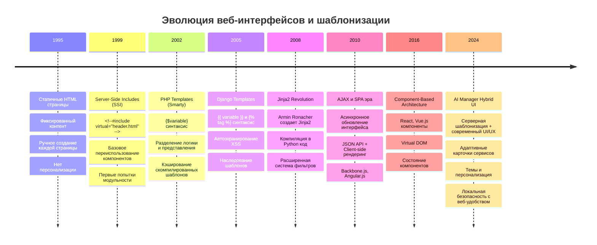
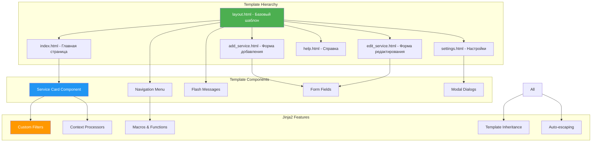

# Урок 2: Шаблонизация и Динамический Интерфейс AI Manager

## 🎯 Цели урока

К концу этого урока вы будете понимать:
- Эволюцию шаблонизации от статичных страниц к современным компонентным интерфейсам
- Принципы работы Jinja2 и его применение в AI Manager
- Архитектуру наследования шаблонов для создания консистентного UI
- Создание адаптивных карточек AI-сервисов с динамическим контентом
- Кастомные фильтры для отображения информации о подписках и стоимости
- Систему тем и персонализации интерфейса

## 📚 Историческая справка и эволюция веб-интерфейсов

### От статических страниц к динамическим приложениям



### Почему Jinja2 для AI Manager?

**Jinja2** был выбран для AI Manager как оптимальный баланс между производительностью и функциональностью:

1. **Производительность** — шаблоны компилируются в Python код, обеспечивая высокую скорость рендеринга
2. **Безопасность** — автоматическое экранирование HTML предотвращает XSS атаки
3. **Гибкость** — богатая система фильтров и функций для обработки данных AI-сервисов
4. **Читаемость** — понятный синтаксис, похожий на Django, но более мощный
5. **Интеграция** — нативная поддержка в Flask без дополнительных зависимостей
6. **Наследование** — мощная система наследования для создания консистентного интерфейса

**Философия Jinja2 в AI Manager**: "Мощность Python с безопасностью шаблонов для создания современного UI"

## 🏗️ Архитектура шаблонной системы AI Manager

### Принцип работы рендеринга в гибридном приложении

```mermaid
graph TD
    A[Пользователь кликает в PyWebView] -->|HTTP Request| B[Flask Route Handler]
    B -->|Загрузка данных| C[load_ai_services()]
    C -->|Зашифрованные данные| D[Decrypt AI Services Data]
    D -->|Обработка данных| E[Data Processing & Filtering]
    E -->|Контекст шаблона| F[Jinja2 Template Engine]
    
    subgraph "Template Compilation Process"
        F -->|Парсинг| G[AST - Abstract Syntax Tree]
        G -->|Компиляция| H[Python Code Generation]
        H -->|Кэширование| I[Compiled Template Cache]
    end
    
    subgraph "Rendering Process"
        I -->|Context Data| J[Template Execution]
        J -->|HTML Generation| K[Dynamic HTML Output]
        K -->|CSS Classes & JS| L[Styled & Interactive UI]
    end
    
    L -->|HTTP Response| M[PyWebView Display]
    M -->|Visual Output| N[User Interface]
    
    style A fill:#e3f2fd
    style F fill:#f3e5f5
    style I fill:#e8f5e8
    style K fill:#fff3e0
    style N fill:#e8f5e8
```

### Компоненты шаблонной системы AI Manager



## 💻 Детальный анализ базового шаблона layout.html

### Структура главного шаблона — построчное объяснение

```html
<!-- templates/layout.html - Фундамент всего интерфейса AI Manager -->
<!DOCTYPE html>
<html lang="ru" data-theme="{{ request.cookies.get('theme', 'light') }}">
<!--
Строка 2: Атрибут data-theme позволяет CSS переключать темы через селекторы
[data-theme="dark"] .element { background: #333; }
request.cookies.get('theme', 'light') - получаем сохраненную тему или light по умолчанию
-->

<head>
    <!-- Базовые мета-теги для корректного отображения -->
    <meta charset="UTF-8">
    <meta name="viewport" content="width=device-width, initial-scale=1.0">
    <!--
    viewport meta-tag критически важен для адаптивности:
    - width=device-width: ширина равна ширине устройства
    - initial-scale=1.0: без масштабирования при загрузке
    Без этого тега мобильные браузеры отображают desktop версию
    -->
    
    <!-- Динамический заголовок страницы -->
    <title>AI Manager - Управление AI-сервисами</title>
    <!--
     создает блок, который дочерние шаблоны могут переопределить:
    ChatGPT Plus - переопределение в дочернем шаблоне
    Если блок не переопределен, используется "AI Manager"
    -->
    
    <!-- Favicon и мета-информация -->
    <link rel="icon" type="image/x-icon" href="{{ url_for('static', filename='favicon.ico') }}">
    <!--
    url_for('static', filename='favicon.ico') генерирует:
    - В разработке: /static/favicon.ico
    - В продакшене: /static/favicon.ico?v=hash (для кэша)
    Функция url_for() автоматически строит правильные URL
    -->
    
    <!-- Основные стили приложения -->
    <link rel="stylesheet" href="{{ url_for('static', filename='css/style.css') }}">
    
    <!--
     позволяет дочерним шаблонам добавлять специфичные стили:
    
    <link rel="stylesheet" href="custom.css">
    
    -->
    
    <!-- Мета-теги для конкретных страниц -->
    
</head>

<body class="theme-{{ request.cookies.get('theme', 'light') }}" 
      data-ui-scale="{{ request.cookies.get('ui_scale', '100') }}">
<!--
Классы body для стилизации:
- theme-light или theme-dark для CSS селекторов
- data-ui-scale для масштабирования интерфейса (80%, 90%, 100%)

Атрибуты данных используются для:
1. CSS селекторов: [data-ui-scale="90"] { transform: scale(0.9); }
2. JavaScript: document.body.dataset.uiScale
-->

    <!-- Навигационная панель -->
    <nav class="navbar navbar-expand-lg" role="navigation" aria-label="Основная навигация">
    <!--
    role="navigation" и aria-label улучшают доступность для screen readers
    navbar-expand-lg - Bootstrap класс для адаптивной навигации
    -->
        <div class="container-fluid">
            <!-- Логотип и название приложения -->
            <div class="navbar-brand">
                <span class="brand-icon">🤖</span>
                <span class="brand-text">AI Manager</span>
                <span class="version-badge">v{{ config.get('VERSION', '4.0.0') }}</span>
                <!--
                config.get('VERSION', '4.0.0') - получаем версию из конфигурации Flask
                Если VERSION не определена, используем '4.0.0' по умолчанию
                -->
            </div>
            
            <!-- Основное меню навигации -->
            <ul class="navbar-nav me-auto" role="menubar">
            <!--
            role="menubar" указывает screen readers, что это основное меню
            me-auto - Bootstrap класс для выравнивания по левому краю
            -->
                {% set navigation_items = [
                    {'endpoint': 'index', 'title': 'AI Сервисы', 'icon': '🤖', 'description': 'Управление AI-сервисами'},
                    {'endpoint': 'add_service', 'title': 'Добавить', 'icon': '➕', 'description': 'Добавить новый сервис'},
                    {'endpoint': 'settings', 'title': 'Настройки', 'icon': '⚙️', 'description': 'Конфигурация приложения'},
                    {'endpoint': 'help', 'title': 'Справка', 'icon': '❓', 'description': 'Помощь и документация'}
                ] %}
                <!--
                 создает переменную в контексте шаблона
                Это позволяет переиспользовать список навигации в разных местах
                Каждый элемент содержит:
                - endpoint: имя Flask route для url_for()
                - title: отображаемый текст
                - icon: эмодзи или символ
                - description: для title атрибута (tooltip)
                -->
                
                
                <li class="nav-item" role="none">
                <!--
                role="none" убирает семантику списка для screen readers
                так как мы используем role="menubar" на родителе
                -->
                    <a class="nav-link {{ 'active' if request.endpoint == item.endpoint else '' }}" 
                       href="{{ url_for(item.endpoint) }}"
                       role="menuitem"
                       title="{{ item.description }}"
                       aria-current="{{ 'page' if request.endpoint == item.endpoint else 'false' }}">
                    <!--
                    Построчный анализ навигационной ссылки:
                    
                    1. class="nav-link {{ 'active' if request.endpoint == item.endpoint else '' }}"
                       - Условное добавление класса 'active' для текущей страницы
                       - request.endpoint содержит имя текущего route (например: 'index')
                       - Если текущая страница совпадает, добавляется класс 'active'
                    
                    2. href="{{ url_for(item.endpoint) }}"
                       - url_for() генерирует URL по имени route
                       - url_for('index') -> '/'
                       - url_for('add_service') -> '/add_service'
                    
                    3. role="menuitem" - для screen readers
                    
                    4. title="{{ item.description }}" - tooltip при наведении
                    
                    5. aria-current="page" - указывает screen readers текущую страницу
                    -->
                        <span class="nav-icon" aria-hidden="true">{{ item.icon }}</span>
                        <span class="nav-text">{{ item.title }}</span>
                        <!--
                        aria-hidden="true" скрывает декоративные иконки от screen readers
                        Основной текст остается доступным в nav-text
                        -->
                    </a>
                </li>
                
            </ul>
            
            <!-- Элементы управления интерфейсом -->
            <div class="navbar-controls">
                <!-- Переключатель темы -->
                <div class="theme-switcher" role="group" aria-label="Переключение темы">
                    <button class="btn btn-outline-secondary" 
                            onclick="toggleTheme()" 
                            title="Переключить тему"
                            aria-label="Переключить между светлой и темной темой">
                        <span class="theme-icon">🌓</span>
                    </button>
                </div>
                
                <!-- Масштабирование интерфейса -->
                <div class="ui-scale-control" role="group" aria-label="Масштабирование интерфейса">
                    <select class="form-select form-select-sm" 
                            onchange="changeUIScale(this.value)"
                            aria-label="Выбор масштаба интерфейса">
                        <option value="80" {{ 'selected' if request.cookies.get('ui_scale') == '80' else '' }}>80%</option>
                        <option value="90" {{ 'selected' if request.cookies.get('ui_scale') == '90' else '' }}>90%</option>
                        <option value="100" {{ 'selected' if request.cookies.get('ui_scale', '100') == '100' else '' }}>100%</option>
                        <!--
                        Условная установка selected атрибута:
                        {{ 'selected' if condition else '' }}
                        
                        request.cookies.get('ui_scale', '100') - получаем масштаб из cookie
                        Если cookie не существует, используем '100' по умолчанию
                        -->
                    </select>
                </div>
            </div>
        </div>
    </nav>

    <!-- Основной контент страницы -->
    <main class="main-content" role="main" aria-label="Основное содержимое">
    <!--
    role="main" указывает основную область контента
    aria-label предоставляет описание для screen readers
    -->
        <!-- Система flash-сообщений -->
        
        <!--
         создает локальную переменную в блоке шаблона
        get_flashed_messages(with_categories=true) возвращает список:
        [('success', 'Сервис добавлен'), ('error', 'Ошибка валидации')]
        with_categories=true включает категории сообщений
        -->
            
                <div class="flash-messages-container" role="alert" aria-live="polite">
                <!--
                role="alert" - важные сообщения для screen readers
                aria-live="polite" - читать сообщения когда пользователь не занят
                -->
                
                    <div class="alert alert-{{ category }} alert-dismissible fade show" 
                         role="alert"
                         data-category="{{ category }}">
                    <!--
                    class="alert alert-{{ category }}" генерирует:
                    - alert-success для успешных операций
                    - alert-error для ошибок
                    - alert-warning для предупреждений
                    - alert-info для информационных сообщений
                    
                    alert-dismissible fade show - Bootstrap классы для анимации
                    data-category сохраняет тип сообщения для JS обработки
                    -->
                        <!-- Иконка сообщения -->
                        <span class="alert-icon" aria-hidden="true">
                            ✅
                            ❌
                            ⚠️
                            ℹ️
                        </span>
                        <!--
                        Условная иконка на основе категории сообщения:
                         - проверка условия
                         - альтернативное условие
                         - значение по умолчанию
                         - завершение условного блока
                        -->
                        
                        <!-- Текст сообщения -->
                        <span class="alert-message">{{ message }}</span>
                        <!--
                        {{ message }} выводит текст с автоматическим экранированием HTML
                        Jinja2 автоматически конвертирует < > & в &lt; &gt; &amp;
                        Это предотвращает XSS атаки через пользовательский ввод
                        -->
                        
                        <!-- Кнопка закрытия -->
                        <button type="button" 
                                class="btn-close" 
                                data-bs-dismiss="alert" 
                                aria-label="Закрыть сообщение"
                                onclick="this.parentElement.remove()">
                            <span aria-hidden="true">&times;</span>
                        </button>
                        <!--
                        data-bs-dismiss="alert" - Bootstrap атрибут для автозакрытия
                        onclick="this.parentElement.remove()" - JavaScript для удаления элемента
                        aria-label объясняет функцию кнопки для screen readers
                        -->
        </div>
    
    </div>

        
        
        <!-- Блок основного контента для дочерних шаблонов -->
        
        <!-- Этот блок переопределяется в дочерних шаблонах -->

        <!--
         - основной блок для переопределения
        Каждый дочерний шаблон должен определить этот блок:
        
        
        
        <h1>Содержимое страницы</h1>

        -->
    </main>

    <!-- Футер приложения -->
    <footer class="footer bg-body-tertiary border-top" role="contentinfo" aria-label="Информация о приложении">
    <!--
    bg-body-tertiary - Bootstrap класс для адаптивного фона
    border-top - верхняя граница для визуального разделения
    role="contentinfo" - семантическая роль футера
    -->
        <div class="container-fluid">
            <div class="footer-content">
                <!-- Информация о приложении -->
                <div class="footer-info">
                    <span class="copyright">
                        &copy; {{ moment().format('YYYY') }} AI Manager
                        <!--
                        {{ moment().format('YYYY') }} - кастомная функция для текущего года
                        Можно заменить на {{ current_year }} из context processor
                        -->
                    </span>
                    <span class="version">
                        Версия {{ config.get('VERSION', '4.0.0') }}
                    </span>
    </div>
    
                <!-- Дополнительная информация -->
                <div class="footer-extra">
                    
                    <span class="last-updated">
                        Обновлено: {{ config.get('last_updated')|format_datetime }}
                        <!--
                        |format_datetime - кастомный фильтр для форматирования даты
                        Конвертирует ISO строку в читаемый формат: "15.01.2024 14:30"
                        -->
                    </span>
        
                    
                    <span class="data-location" title="Расположение файлов данных">
                        📁 {{ config.get('data_dir', '~/.local/share/AiManager')|truncate(30) }}
                        <!--
                        |truncate(30) - обрезает длинные пути до 30 символов
                        title атрибут показывает полный путь при наведении
                        -->
                    </span>
    </div>
</div>
        </div>
    </footer>

    <!-- JavaScript файлы -->
    <script src="{{ url_for('static', filename='js/main.js') }}"></script>
    
    <!--
     позволяет дочерним шаблонам добавлять свой JavaScript:
    
    <script>
        // Специфичный код для страницы
    </script>
    
    -->
</body>
</html>
```

### Преимущества архитектуры базового шаблона

**1. Консистентность интерфейса:**
- Единый стиль навигации и футера на всех страницах
- Централизованное управление темами и масштабированием
- Стандартизованная система сообщений

**2. Доступность (Accessibility):**
- Семантические HTML5 элементы (nav, main, footer)
- ARIA атрибуты для screen readers
- Клавиатурная навигация через role и aria-label

**3. Производительность:**
- Кэширование скомпилированного шаблона
- Минимальная генерация HTML через условные блоки
- Оптимизированные CSS классы

**4. Масштабируемость:**
- Блочная архитектура для легкого расширения
- Переиспользуемые компоненты навигации
- Централизованная конфигурация

## 🎨 Анализ шаблона главной страницы index.html

### Динамическое отображение AI-сервисов

```html
<!-- templates/index.html - Главная страница с карточками AI-сервисов -->

<!--
 указывает родительский шаблон
Все блоки из layout.html становятся доступными для переопределения
-->

Мои AI-сервисы
<!--
Переопределяем блок title из layout.html
Результат: <title>Мои AI-сервисы - AI Manager - Управление AI-сервисами</title>
-->


<meta name="description" content="Управление подписками на AI-сервисы: ChatGPT, Claude, Midjourney и другие">
<meta name="keywords" content="AI, сервисы, подписки, управление, ChatGPT, Claude">

<!--
Добавляем SEO мета-теги специфичные для главной страницы
Эти теги помогают поисковым системам понять содержимое
-->


<div class="services-page">
    <!-- Заголовок страницы с статистикой -->
    <div class="page-header">
        <div class="header-main">
            <h1 class="page-title">
                <span class="title-icon">🤖</span>
                Мои AI-сервисы
                <!--
                Использование эмодзи как иконок:
                - Универсальная поддержка во всех браузерах
                - Не требуют дополнительных файлов
                - Автоматически адаптируются к теме
                -->
            </h1>
            
            <div class="services-stats">
                <span class="stat-item">
                    <span class="stat-value">{{ ai_services|length }}</span>
                    <span class="stat-label">{{ 'сервис' if ai_services|length == 1 else 'сервисов' }}</span>
                    <!--
                    Детальный анализ статистики:
                    
                    1. {{ ai_services|length }}
                       - |length - фильтр Jinja2 для подсчета элементов списка
                       - Эквивалент len(ai_services) в Python
                    
                    2. {{ 'сервис' if ai_services|length == 1 else 'сервисов' }}
                       - Тернарный оператор для правильного склонения
                       - if condition else alternative
                       - 1 сервис, 2 сервиса, 5 сервисов
                    -->
                </span>
                
                
                <!--
                 создает переменную в контексте шаблона
                
                ai_services|sum(attribute='subscription.cost_monthly'):
                - sum() - встроенный фильтр для суммирования
                - attribute='subscription.cost_monthly' - путь к полю для суммирования
                - Обходит каждый сервис и суммирует subscription.cost_monthly
                -->
                
                
                <span class="stat-item cost-stat">
                    <span class="stat-value">${{ "%.2f"|format(total_monthly_cost) }}</span>
                    <span class="stat-label">в месяц</span>
                    <!--
                    "%.2f"|format(total_monthly_cost):
                    - format() фильтр для форматирования чисел
                    - %.2f - формат с 2 десятичными знаками
                    19.9 -> $19.90
                    20.0 -> $20.00
                    -->
                </span>
                
                
                
                <!--
                Сложная фильтрация с selectattr:
                
                ai_services|selectattr('subscription.status', 'equalto', 'active')|list
                - selectattr() фильтрует объекты по значению атрибута
                - 'subscription.status' - путь к полю (поддерживает точечную нотацию)
                - 'equalto' - тип сравнения (равно)
                - 'active' - значение для сравнения
                - |list - конвертирует итератор в список
                -->
                
                <span class="stat-item">
                    <span class="stat-value">{{ active_services|length }}</span>
                    <span class="stat-label">активных</span>
                </span>
            </div>
        </div>
        
        <!-- Кнопки действий -->
        <div class="header-actions">
            <a href="{{ url_for('add_service') }}" 
               class="btn btn-primary"
               role="button"
               aria-label="Добавить новый AI-сервис">
                <span class="btn-icon">➕</span>
                <span class="btn-text">Добавить сервис</span>
            </a>
            
            <div class="btn-group" role="group" aria-label="Дополнительные действия">
                <button class="btn btn-outline-secondary dropdown-toggle" 
                        data-bs-toggle="dropdown" 
                        aria-expanded="false"
                        aria-label="Меню дополнительных действий">
                    <span class="btn-icon">⚙️</span>
                    <span class="btn-text">Действия</span>
                </button>
                
                <ul class="dropdown-menu">
                    <li><a class="dropdown-item" href="{{ url_for('export_data') }}">
                        📤 Экспорт данных
                    </a></li>
                    <li><a class="dropdown-item" href="{{ url_for('import_data') }}">
                        📥 Импорт данных
                    </a></li>
                    <li><hr class="dropdown-divider"></li>
                    <li><a class="dropdown-item" href="{{ url_for('settings') }}">
                        ⚙️ Настройки
                    </a></li>
                </ul>
            </div>
        </div>
    </div>

    <!-- Фильтры и поиск -->
    <div class="filters-section">
        <div class="filters-row">
            <!-- Поиск по названию -->
            <div class="search-group">
                <div class="search-input-wrapper">
                    <input type="text" 
                           class="form-control search-input" 
                           placeholder="Поиск по названию сервиса..."
                           id="serviceSearch"
                           oninput="filterServices()"
                           aria-label="Поиск AI-сервисов">
                    <span class="search-icon">🔍</span>
                </div>
            </div>
            
            <!-- Фильтр по типу сервиса -->
            <div class="filter-group">
                <label for="typeFilter" class="filter-label">Тип сервиса:</label>
                <select class="form-select" id="typeFilter" onchange="filterServices()">
                    <option value="">Все типы</option>
                    
                    <!--
                    Сложная обработка данных для фильтра:
                    
                    ai_services|map(attribute='service_type')|unique|sort:
                    1. |map(attribute='service_type') - извлекает значения поля service_type
                    2. |unique - убирает дубликаты
                    3. |sort - сортирует по алфавиту
                    
                    Результат: ['chatgpt', 'claude', 'midjourney'] (отсортированный список уникальных типов)
                    -->
                        
                        <option value="{{ service_type }}">
                            {{ service_type|title }}
                            <!--
                            |title фильтр конвертирует первую букву в заглавную:
                            'chatgpt' -> 'Chatgpt'
                            'midjourney' -> 'Midjourney'
                            -->
                        </option>
                        
                    
                </select>
        </div>
        
            <!-- Фильтр по провайдеру -->
            <div class="filter-group">
                <label for="providerFilter" class="filter-label">Провайдер:</label>
                <select class="form-select" id="providerFilter" onchange="filterServices()">
                    <option value="">Все провайдеры</option>
                    
                        
                        <option value="{{ provider }}">{{ provider }}</option>
                        
            
                </select>
            </div>
        
            <!-- Фильтр по статусу подписки -->
            <div class="filter-group">
                <label for="statusFilter" class="filter-label">Статус:</label>
                <select class="form-select" id="statusFilter" onchange="filterServices()">
                    <option value="">Все статусы</option>
                    <option value="active">Активные</option>
                    <option value="expired">Истекшие</option>
                    <option value="cancelled">Отмененные</option>
            </select>
        </div>
        </div>
    </div>
    
    <!-- Основная область с карточками сервисов -->
    
        <div class="services-grid" id="servicesGrid">
        <!--
        CSS Grid для адаптивного отображения карточек:
        .services-grid {
            display: grid;
            grid-template-columns: repeat(auto-fill, minmax(350px, 1fr));
            gap: 1.5rem;
        }
        
        - auto-fill: создает столько колонок, сколько помещается
        - minmax(350px, 1fr): минимум 350px, максимум равная доля
        - gap: 1.5rem: отступы между карточками
        -->
        
        
            <div class="service-card" 
                 data-service-id="{{ service.id }}"
                 data-service-type="{{ service.service_type|lower }}"
                 data-provider="{{ service.provider|lower }}"
                 data-status="{{ service.subscription.status|lower }}">
            <!--
            data-* атрибуты для JavaScript фильтрации:
            - data-service-id: уникальный идентификатор
            - data-service-type: тип для фильтрации
            - data-provider: провайдер для фильтрации  
            - data-status: статус подписки для фильтрации
            
            |lower фильтр приводит к нижнему регистру для надежного сравнения
            -->
            
                <!-- Заголовок карточки с иконкой и именем -->
                <div class="card-header">
                    <div class="service-identity">
                        
                            
                            <!--
                            Обработка ошибок загрузки изображений:
                            - loading="lazy": ленивая загрузка для производительности
                            - onerror: если изображение не загружается, скрываем его и показываем fallback
                            - alt: описание для screen readers
                            -->
                            <div class="service-icon-fallback" style="display: none;">
                                {{ service.service_type[0]|upper if service.service_type else '🤖' }}
                                <!--
                                Fallback иконка если изображение не загружается:
                                service.service_type[0]|upper - первая буква типа сервиса заглавными
                                if service.service_type else '🤖' - робот если тип не определен
                                -->
                            </div>
                        
                            <div class="service-icon-fallback">
                                {{ service.service_type[0]|upper if service.service_type else '🤖' }}
                </div>
            
                        
                        <div class="service-names">
                            <h3 class="service-name">{{ service.name }}</h3>
                            <!--
                            {{ service.name }} - автоматическое экранирование HTML
                            Если service.name содержит <script>, будет отображено &lt;script&gt;
                            -->
                            
                            <div class="service-details">
                                <span class="service-type-badge">
                                    {{ service.service_type|title if service.service_type else 'AI Service' }}
                                </span>
                                
                                
                                <span class="service-provider">
                                    от {{ service.provider }}
                                </span>
        
                            </div>
                        </div>
                    </div>
    
                    <!-- Статус подписки -->
                    <div class="subscription-status">
                        
                        
                        <!--
                         создает словарь конфигурации статусов
                        Это позволяет централизованно управлять отображением статусов:
                        - icon: иконка для статуса
                        - class: CSS класс для стилизации
                        - text: текст для отображения
                        -->
                        
                        
                        <!--
                        status_config.get(status, default) работает как Python dict.get():
                        - Если status найден в словаре, возвращает соответствующую конфигурацию
                        - Если не найден, возвращает конфигурацию для 'active' как default
                        -->
                        
                        <span class="status-indicator {{ current_status.class }}">
                            <span class="status-icon">{{ current_status.icon }}</span>
                            <span class="status-text">{{ current_status.text }}</span>
                        </span>
                    </div>
                </div>

                <!-- Основная информация о подписке -->
                <div class="card-body">
                    
                    <div class="subscription-info">
                        <!-- Стоимость подписки -->
                        
                        <div class="cost-display">
                            <span class="cost-amount">
                                ${{ "%.2f"|format(service.subscription.cost_monthly) }}
                                <!--
                                Форматирование стоимости:
                                "%.2f"|format(value) обеспечивает 2 десятичных знака
                                19.9 -> $19.90
                                20.0 -> $20.00
                                -->
                            </span>
                            <span class="cost-period">в месяц</span>
                        </div>
                        
                        
                        <!-- План подписки -->
                        
                        <div class="plan-info">
                            <span class="plan-label">План:</span>
                            <span class="plan-name">{{ service.subscription.plan }}</span>
    </div>
                        
                        
                        <!-- Дата продления -->
                        
                        <div class="renewal-info">
                            <span class="renewal-label">Продление:</span>
                            <span class="renewal-date">
                                {{ service.subscription.renewal_date|format_date }}
                                <!--
                                |format_date - кастомный фильтр для форматирования даты
                                Конвертирует '2024-02-15' в '15 февраля 2024'
                                -->
                            </span>
                            
                            
                            <!--
                            |days_until - кастомный фильтр для подсчета дней до даты
                            Возвращает количество дней от сегодня до renewal_date
                            -->
                            
                            
                                
                                    <span class="renewal-status expired">
                                        (истекла {{ days_until_renewal|abs }} дн. назад)
                                        <!--
                                        |abs - фильтр для абсолютного значения
                                        -5 -> 5 (5 дней назад)
                                        -->
                                    </span>
                                
                                    <span class="renewal-status warning">
                                        (через {{ days_until_renewal }} дн.)
                                    </span>
                    
                                    <span class="renewal-status normal">
                                        (через {{ days_until_renewal }} дн.)
                                    </span>
                                
                    
                </div>
                        
                    </div>
                    
                    
                    <!-- Функции и возможности сервиса -->
                    
                    <div class="service-features">
                        <div class="features-label">Возможности:</div>
                        <div class="features-list">
                            
                            <!--
                            service.features[:3] - Python slice нотация в Jinja2
                            Показываем только первые 3 функции для компактности
                            -->
                            <span class="feature-tag">{{ feature }}</span>
                            
                    
                            
                            <span class="feature-tag more-features" 
                                  title="{{ service.features[3:]|join(', ') }}">
                                +{{ service.features|length - 3 }} еще
                                <!--
                                Показываем количество скрытых функций:
                                service.features|length - 3 - вычисление в шаблоне
                                
                                title="{{ service.features[3:]|join(', ') }}"
                                - service.features[3:] - функции начиная с 4-й
                                - |join(', ') - объединяет список строкой ', '
                                - Результат: "API, Интеграции, Автоматизация"
                                -->
                            </span>
                            
                        </div>
                    </div>
                    
                    
                    <!-- Дополнительная информация -->
                    
                    <div class="cabinet-info">
                        <span class="cabinet-label">Кабинет:</span>
                        <a href="{{ service.personal_cabinet }}" 
                           target="_blank" 
                           rel="noopener noreferrer"
                           class="cabinet-link"
                           aria-label="Открыть личный кабинет {{ service.name }}">
                            🔗 Перейти
                            <!--
                            target="_blank" - открыть в новой вкладке
                            rel="noopener noreferrer" - безопасность при открытии внешних ссылок
                            - noopener: предотвращает доступ к window.opener
                            - noreferrer: не передает HTTP referer
                            -->
                        </a>
                    </div>
                    
                </div>
                
                <!-- Действия с карточкой -->
                <div class="card-actions">
                    <div class="action-buttons">
                        <!-- Редактирование -->
                        <a href="{{ url_for('edit_service', service_id=service.id) }}" 
                           class="btn btn-sm btn-outline-primary"
                           title="Редактировать {{ service.name }}"
                           aria-label="Редактировать сервис {{ service.name }}">
                            <span class="btn-icon">✏️</span>
                            <span class="btn-text">Изменить</span>
                        </a>
                        
                        <!-- Быстрый вход -->
                        
                        <a href="{{ service.login_url }}" 
                           target="_blank" 
                           rel="noopener noreferrer"
                           class="btn btn-sm btn-outline-success"
                           title="Быстрый вход в {{ service.name }}"
                           aria-label="Войти в сервис {{ service.name }}">
                            <span class="btn-icon">🚀</span>
                            <span class="btn-text">Войти</span>
                        </a>
                        
                        
                        <!-- Удаление -->
                        <button class="btn btn-sm btn-outline-danger" 
                                onclick="confirmDelete('{{ service.id }}', '{{ service.name|e }}')"
                                title="Удалить {{ service.name }}"
                                aria-label="Удалить сервис {{ service.name }}">
                            <!--
                            onclick="confirmDelete('{{ service.id }}', '{{ service.name|e }}')"
                            
                            {{ service.name|e }} - |e фильтр принудительно экранирует HTML
                            Это критически важно для JavaScript строк:
                            service.name = "Test & Co" -> confirmDelete('123', 'Test &amp; Co')
                            Без |e фильтра: confirmDelete('123', 'Test & Co') - некорректный JS
                            -->
                            <span class="btn-icon">🗑️</span>
                            <span class="btn-text">Удалить</span>
                        </button>
                    </div>
                    
                    <!-- Время последнего обновления -->
                    
                    <div class="last-updated">
                        <small class="text-muted">
                            Обновлено: {{ service.updated_at|format_datetime }}
                        </small>
                    </div>
                    
                </div>
            </div>
        
        </div>
        
        <!-- Пагинация (если нужна) -->
        
        <div class="pagination-section">
            <nav aria-label="Навигация по страницам сервисов">
                <div class="pagination-info">
                    Показано {{ ai_services|length }} из {{ ai_services|length }} сервисов
                </div>
            </nav>
        </div>
        
        
    
        <!-- Пустое состояние - когда нет сервисов -->
        <div class="empty-state">
            <div class="empty-state-content">
                <div class="empty-icon">🤖</div>
                <h3 class="empty-title">Нет добавленных AI-сервисов</h3>
                <p class="empty-description">
                    Добавьте свой первый AI-сервис, чтобы начать управление подписками 
                    и отслеживать расходы на искусственный интеллект.
                </p>
                
                <div class="empty-actions">
                    <a href="{{ url_for('add_service') }}" 
                       class="btn btn-primary btn-lg"
                       role="button">
                        <span class="btn-icon">➕</span>
                        <span class="btn-text">Добавить первый сервис</span>
                    </a>
                    
                    <a href="{{ url_for('import_data') }}" 
                       class="btn btn-outline-secondary btn-lg"
                       role="button">
                        <span class="btn-icon">📥</span>
                        <span class="btn-text">Импортировать данные</span>
                    </a>
                </div>
                
                <!-- Популярные сервисы для быстрого добавления -->
                <div class="popular-services">
                    <p class="popular-label">Популярные AI-сервисы:</p>
                    <div class="popular-list">
                        
                        
                        
                        <a href="{{ url_for('add_service', preset=service.type) }}" 
                           class="popular-service-link"
                           title="Быстро добавить {{ service.name }}">
                            {{ service.name }}
                        </a>
                        
                        <!--
                        url_for('add_service', preset=service.type) генерирует:
                        /add_service?preset=chatgpt
                        
                        Это позволяет предзаполнить форму добавления сервиса
                        -->
                    </div>
                </div>
            </div>
        </div>
    
</div>



<script>
// JavaScript для фильтрации сервисов
function filterServices() {
    const searchTerm = document.getElementById('serviceSearch').value.toLowerCase();
    const typeFilter = document.getElementById('typeFilter').value.toLowerCase();
    const providerFilter = document.getElementById('providerFilter').value.toLowerCase();
    const statusFilter = document.getElementById('statusFilter').value.toLowerCase();
    
    const serviceCards = document.querySelectorAll('.service-card');
    let visibleCount = 0;
    
    serviceCards.forEach(card => {
        const name = card.querySelector('.service-name').textContent.toLowerCase();
        const type = card.dataset.serviceType;
        const provider = card.dataset.provider;
        const status = card.dataset.status;
        
        const matchesSearch = !searchTerm || name.includes(searchTerm);
        const matchesType = !typeFilter || type === typeFilter;
        const matchesProvider = !providerFilter || provider === providerFilter;
        const matchesStatus = !statusFilter || status === statusFilter;
        
        const shouldShow = matchesSearch && matchesType && matchesProvider && matchesStatus;
        
        card.style.display = shouldShow ? 'block' : 'none';
        if (shouldShow) visibleCount++;
    });
    
    // Обновляем счетчик отфильтрованных сервисов
    updateFilterResults(visibleCount);
}

function updateFilterResults(count) {
    const totalCount = {{ ai_services|length }};
    <!--
    {{ ai_services|length }} внедряется на этапе рендеринга шаблона
    Становится: const totalCount = 5;
    -->
    
    let message = '';
    if (count === totalCount) {
        message = `Показано ${count} из ${totalCount} сервисов`;
    } else {
        message = `Найдено ${count} из ${totalCount} сервисов`;
    }
    
    // Обновляем информацию о фильтрации
    const filterInfo = document.querySelector('.filter-results') || createFilterInfo();
    filterInfo.textContent = message;
    filterInfo.className = `filter-results ${count === 0 ? 'no-results' : ''}`;
}

function confirmDelete(serviceId, serviceName) {
    const message = `Вы уверены, что хотите удалить сервис "${serviceName}"?\n\nЭто действие нельзя отменить.`;
    
    if (confirm(message)) {
        // Отправляем DELETE запрос
        fetch(`/api/services/${serviceId}`, {
            method: 'DELETE',
            headers: {
                'Content-Type': 'application/json',
            }
        })
        .then(response => response.json())
        .then(data => {
            if (data.success) {
                // Удаляем карточку из DOM
                const card = document.querySelector(`[data-service-id="${serviceId}"]`);
                if (card) {
                    card.remove();
                }
                
                // Показываем сообщение об успехе
                showFlashMessage('success', data.message || 'Сервис успешно удален');
                
                // Обновляем статистику
                updatePageStats();
            } else {
                showFlashMessage('error', data.error || 'Ошибка при удалении сервиса');
            }
        })
        .catch(error => {
            console.error('Ошибка:', error);
            showFlashMessage('error', 'Произошла ошибка при удалении сервиса');
        });
    }
}

// Инициализация при загрузке страницы
document.addEventListener('DOMContentLoaded', function() {
    // Сохраняем состояние фильтров в localStorage
    const filters = ['serviceSearch', 'typeFilter', 'providerFilter', 'statusFilter'];
    
    filters.forEach(filterId => {
        const element = document.getElementById(filterId);
        if (element) {
            // Восстанавливаем значение из localStorage
            const savedValue = localStorage.getItem(filterId);
            if (savedValue) {
                element.value = savedValue;
            }
            
            // Сохраняем изменения в localStorage
            element.addEventListener('change', () => {
                localStorage.setItem(filterId, element.value);
            });
            element.addEventListener('input', () => {
                localStorage.setItem(filterId, element.value);
        });
}
    });
    
    // Применяем сохраненные фильтры
    filterServices();
});
</script>

```

## 🎨 Система кастомных фильтров для AI Manager

### Фильтры для работы с датами и временем

```python
# app.py - Кастомные фильтры для шаблонов
from datetime import datetime, timedelta
import locale

def format_datetime_filter(iso_string):
    """Форматирует ISO строку даты в читаемый формат."""
    if not iso_string:
        return "Не указано"
    
    try:
        # Парсим ISO строку в объект datetime
        dt = datetime.fromisoformat(iso_string.replace('Z', '+00:00'))
        
        # Устанавливаем русскую локаль для названий месяцев
        try:
            locale.setlocale(locale.LC_TIME, 'ru_RU.UTF-8')
        except locale.Error:
            pass  # Fallback если русская локаль недоступна
        
        # Форматируем в читаемый вид
        return dt.strftime('%d %B %Y в %H:%M')
        # Результат: "15 января 2024 в 14:30"
        
    except (ValueError, TypeError) as e:
        app.logger.warning(f'Ошибка форматирования даты {iso_string}: {e}')
        return str(iso_string)

def format_date_filter(date_string):
    """Форматирует дату без времени."""
    if not date_string:
        return "Не указано"
    
    try:
        # Поддерживаем разные форматы входных данных
        if 'T' in date_string:  # ISO формат с временем
            dt = datetime.fromisoformat(date_string.split('T')[0])
        else:  # Только дата YYYY-MM-DD
            dt = datetime.strptime(date_string, '%Y-%m-%d')
        
        return dt.strftime('%d %B %Y')
        # Результат: "15 января 2024"
        
    except (ValueError, TypeError):
        return date_string

def days_until_filter(date_string):
    """Вычисляет количество дней до указанной даты."""
    if not date_string:
        return None
    
    try:
        # Парсим дату
        if 'T' in date_string:
            target_date = datetime.fromisoformat(date_string.split('T')[0]).date()
        else:
            target_date = datetime.strptime(date_string, '%Y-%m-%d').date()
        
        # Вычисляем разность с сегодняшней датой
        today = datetime.now().date()
        delta = (target_date - today).days
        
        return delta
        # Положительное число - дней до даты
        # Отрицательное число - дней прошло после даты
        
    except (ValueError, TypeError):
        return None

def time_ago_filter(iso_string):
    """Показывает время в формате 'N времени назад'."""
    if not iso_string:
        return "Неизвестно"
    
    try:
        dt = datetime.fromisoformat(iso_string.replace('Z', '+00:00'))
        now = datetime.now(dt.tzinfo) if dt.tzinfo else datetime.now()
        
        delta = now - dt
        
        if delta.days > 0:
            if delta.days == 1:
                return "вчера"
            elif delta.days < 7:
                return f"{delta.days} дн. назад"
            elif delta.days < 30:
                weeks = delta.days // 7
                return f"{weeks} нед. назад"
            else:
                months = delta.days // 30
                return f"{months} мес. назад"
        else:
            seconds = delta.seconds
            if seconds < 60:
                return "только что"
            elif seconds < 3600:
                minutes = seconds // 60
                return f"{minutes} мин. назад"
            else:
                hours = seconds // 3600
                return f"{hours} ч. назад"
                
    except (ValueError, TypeError):
        return "Неизвестно"

# Регистрируем фильтры в Flask приложении
app.jinja_env.filters['format_datetime'] = format_datetime_filter
app.jinja_env.filters['format_date'] = format_date_filter
app.jinja_env.filters['days_until'] = days_until_filter
app.jinja_env.filters['time_ago'] = time_ago_filter
```

### Фильтры для работы с подписками и стоимостью

```python
def format_currency_filter(amount, currency='USD'):
    """Форматирует денежные суммы с учетом валюты."""
    if amount is None or amount == 0:
        return "Бесплатно"
    
    try:
        amount = float(amount)
        
        # Словарь символов валют
        currency_symbols = {
            'USD': '$',
            'EUR': '€',
            'RUB': '₽',
            'GBP': '£'
        }
        
        symbol = currency_symbols.get(currency.upper(), currency)
        
        # Форматируем с учетом больших сумм
        if amount >= 1000:
            return f"{symbol}{amount:,.2f}"  # $1,234.56
        else:
            return f"{symbol}{amount:.2f}"   # $19.99
            
    except (ValueError, TypeError):
        return str(amount)

def subscription_status_filter(status):
    """Конвертирует статус подписки в читаемый формат."""
    status_map = {
        'active': 'Активна',
        'expired': 'Истекла',
        'cancelled': 'Отменена',
        'trial': 'Пробная',
        'suspended': 'Приостановлена',
        'pending': 'Ожидает активации'
    }
    
    return status_map.get(status.lower() if status else '', 'Неизвестно')

def subscription_urgency_filter(renewal_date):
    """Определяет срочность продления подписки."""
    if not renewal_date:
        return 'unknown'
    
    try:
        days = days_until_filter(renewal_date)
        if days is None:
            return 'unknown'
        
        if days < 0:
            return 'expired'      # Просрочена
        elif days <= 3:
            return 'critical'     # Критично (1-3 дня)
        elif days <= 7:
            return 'warning'      # Предупреждение (4-7 дней)
        elif days <= 30:
            return 'normal'       # Нормально (8-30 дней)
        else:
            return 'good'         # Хорошо (>30 дней)
            
    except:
        return 'unknown'

def calculate_annual_cost_filter(monthly_cost):
    """Вычисляет годовую стоимость подписки."""
    if not monthly_cost:
        return 0
    
    try:
        monthly = float(monthly_cost)
        annual = monthly * 12
        return annual
    except (ValueError, TypeError):
        return 0

# Регистрация фильтров для подписок
app.jinja_env.filters['format_currency'] = format_currency_filter
app.jinja_env.filters['subscription_status'] = subscription_status_filter
app.jinja_env.filters['subscription_urgency'] = subscription_urgency_filter
app.jinja_env.filters['annual_cost'] = calculate_annual_cost_filter
```

### Фильтры для безопасности и конфиденциальности

```python
def mask_sensitive_filter(text, visible_chars=4, mask_char='*'):
    """Маскирует чувствительную информацию."""
    if not text:
        return ""
    
    text_str = str(text)
    
    if len(text_str) <= visible_chars:
        return text_str
    
    # Показываем первые visible_chars символов, остальное маскируем
    visible = text_str[:visible_chars]
    masked_length = len(text_str) - visible_chars
    
    return visible + mask_char * min(masked_length, 8)  # Максимум 8 звездочек

def secure_email_filter(email):
    """Безопасное отображение email адреса."""
    if not email or '@' not in email:
        return email
    
    local, domain = email.split('@', 1)
    
    # Маскируем локальную часть, оставляя первый и последний символ
    if len(local) <= 2:
        masked_local = '*' * len(local)
    else:
        masked_local = local[0] + '*' * (len(local) - 2) + local[-1]
    
    return f"{masked_local}@{domain}"

def truncate_smart_filter(text, max_length=100, suffix='...'):
    """Умное обрезание текста по словам."""
    if not text or len(text) <= max_length:
        return text
    
    # Обрезаем по максимальной длине
    truncated = text[:max_length - len(suffix)]
    
    # Ищем последний пробел, чтобы не разрывать слова
    last_space = truncated.rfind(' ')
    if last_space > max_length * 0.7:  # Если пробел не слишком далеко
        truncated = truncated[:last_space]
    
    return truncated + suffix

# Регистрация фильтров безопасности
app.jinja_env.filters['mask_sensitive'] = mask_sensitive_filter
app.jinja_env.filters['secure_email'] = secure_email_filter
app.jinja_env.filters['truncate_smart'] = truncate_smart_filter
```

### Использование кастомных фильтров в шаблонах

```html
<!-- Примеры использования кастомных фильтров -->

<!-- Отображение дат и времени -->
<p>Создан: {{ service.created_at|format_datetime }}</p>
<!-- Результат: Создан: 15 января 2024 в 14:30 -->

<p>Продление: {{ service.subscription.renewal_date|format_date }}</p>
<!-- Результат: Продление: 28 февраля 2024 -->

<p>Осталось: {{ service.subscription.renewal_date|days_until }} дней</p>
<!-- Результат: Осталось: 15 дней -->

<!-- Работа с валютой и стоимостью -->
<div class="cost-info">
    <span class="monthly">{{ service.subscription.cost_monthly|format_currency }}</span>
    <span class="annual">({{ service.subscription.cost_monthly|annual_cost|format_currency }} в год)</span>
</div>
<!-- Результат: $19.99 ($239.88 в год) -->

<!-- Статус подписки с индикацией срочности -->
<div class="status-{{ service.subscription.renewal_date|subscription_urgency }}">
    {{ service.subscription.status|subscription_status }}
</div>
<!-- Результат: <div class="status-warning">Активна</div> -->

<!-- Безопасное отображение чувствительных данных -->
<p>Email: {{ service.credentials.username|secure_email }}</p>
<!-- Результат: Email: j***n@example.com -->

<p>API Key: {{ service.credentials.api_key|mask_sensitive(6) }}</p>
<!-- Результат: API Key: sk-abc****** -->

<!-- Умное обрезание описаний -->
<p class="description">{{ service.description|truncate_smart(150) }}</p>
<!-- Результат: Длинное описание сервиса обрезается по словам... -->

<!-- Время последней активности -->
<small>Последнее обновление: {{ service.updated_at|time_ago }}</small>
<!-- Результат: Последнее обновление: 2 часа назад -->
```

## 🎯 Практические упражнения

### Упражнение 1: Создание карточки AI-сервиса
Создайте макрос для карточки AI-сервиса с полной информацией:

```html

<div class="service-card" data-service-id="{{ service.id }}">
    <!-- Ваш код карточки -->
        </div>


<!-- Использование -->

    {{ render_ai_service_card(service) }}

```

### Упражнение 2: Система фильтрации
Добавьте продвинутую фильтрацию:
1. Фильтр по диапазону стоимости
2. Фильтр по дате истечения подписки
3. Поиск по описанию и функциям

### Упражнение 3: Адаптивная сетка
Создайте адаптивную CSS Grid систему:
```css
.services-grid {
    display: grid;
    grid-template-columns: repeat(auto-fill, minmax(300px, 1fr));
    gap: 1.5rem;
}

@media (max-width: 768px) {
    .services-grid {
        grid-template-columns: 1fr;
    }
}
```

## 📚 Дополнительные материалы

### Полезные ресурсы
- [Jinja2 Documentation](https://jinja.palletsprojects.com/) — полная документация
- [Flask Templates Guide](https://flask.palletsprojects.com/en/2.3.x/templating/) — интеграция с Flask
- [CSS Grid Guide](https://css-tricks.com/snippets/css/complete-guide-grid/) — руководство по CSS Grid

### Расширения и библиотеки
- **jinja2-time** — дополнительные фильтры для работы с временем
- **jinja2-humanize** — человекочитаемые форматы чисел и дат
- **Flask-Moment** — локализация дат и времени

## 🎯 Контрольные вопросы

1. **Наследование**: Объясните разницу между ,  и ?

2. **Фильтры**: Как создать кастомный фильтр для форматирования валюты?

3. **Безопасность**: Почему важно использовать |e фильтр в JavaScript коде?

4. **Производительность**: Как Jinja2 оптимизирует рендеринг шаблонов?

5. **Контекст**: Что такое контекстные процессоры и как они работают?

## 🚀 Следующий урок

В следующем уроке **"Формы и Обработка Данных AI-сервисов"** мы изучим:
- Создание сложных форм для добавления AI-сервисов
- Валидацию данных подписок и API ключей
- Безопасную загрузку логотипов и документов
- Обработку ошибок и пользовательскую обратную связь
- Автоматическое заполнение форм на основе типа сервиса

---

*Этот урок является частью курса "AI Manager: Архитектура и принципы разработки современных гибридных приложений"*
