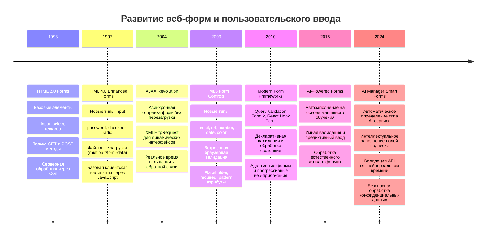
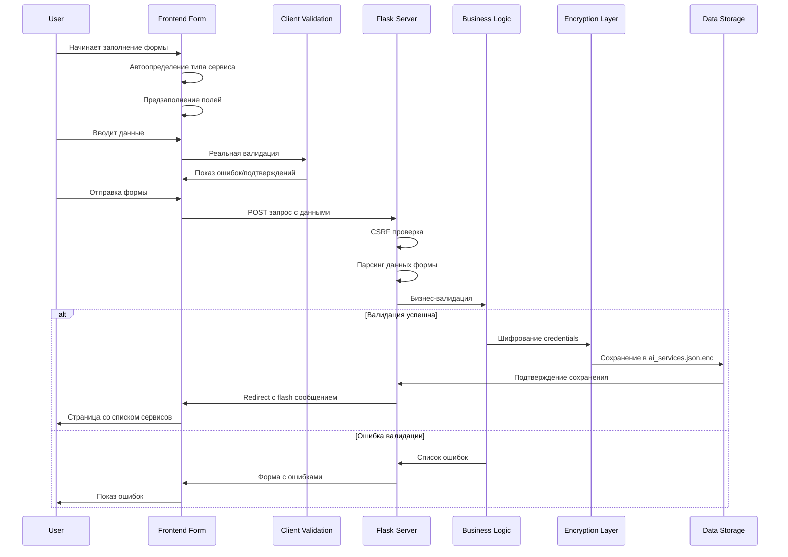
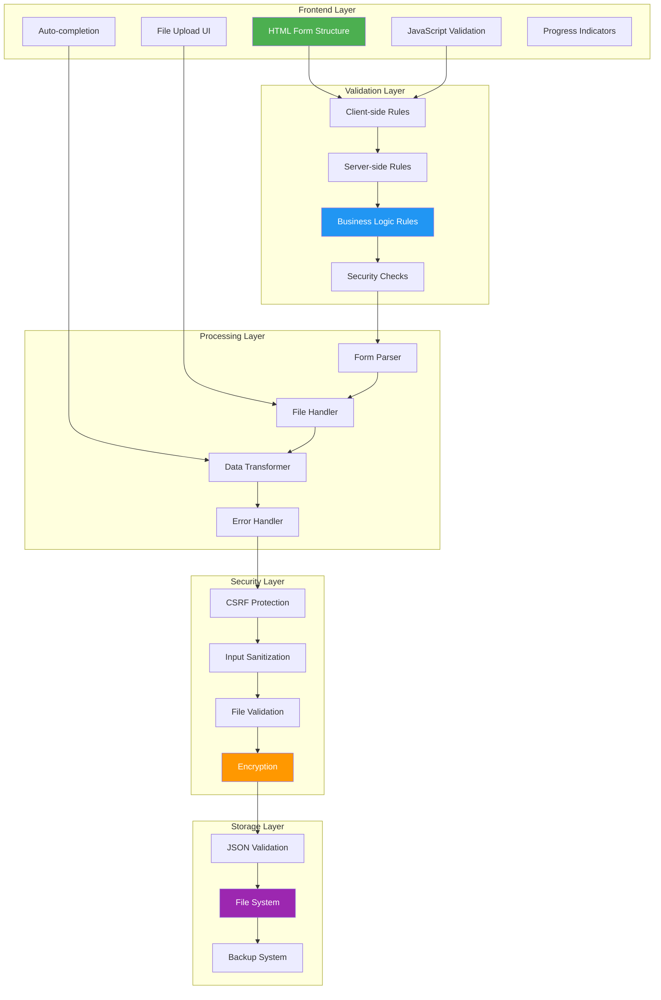

# Урок 3: Формы и Обработка Данных AI-сервисов

## 🎯 Цели урока

К концу этого урока вы будете понимать:
- Эволюцию веб-форм от простых полей до сложных интерактивных интерфейсов
- Создание комплексных форм для управления AI-сервисами и подписками
- Многоуровневую валидацию данных (клиент, сервер, бизнес-логика)
- Безопасную обработку файлов (логотипы, документы, чеки)
- Систему обратной связи и уведомлений пользователя
- Автоматизацию заполнения форм на основе типа AI-сервиса

## 📚 Историческая справка: От простых форм к интеллектуальным интерфейсам

### Эволюция форм в веб-разработке



### Принципы современных форм в AI Manager

**1. Прогрессивное улучшение (Progressive Enhancement):**
- Формы работают без JavaScript (серверная обработка)
- JavaScript добавляет интерактивность и улучшенный UX
- Адаптация к возможностям браузера и устройства

**2. Безопасность на всех уровнях:**
- Клиентская валидация для UX
- Серверная валидация для безопасности
- Шифрование чувствительных данных
- Защита от CSRF и XSS атак

**3. Доступность (Accessibility):**
- Семантическая разметка и ARIA атрибуты
- Клавиатурная навигация
- Поддержка screen readers
- Контрастные цвета и четкие указания

## 🏗️ Архитектура форм в AI Manager

### Жизненный цикл формы AI-сервиса



### Компоненты системы форм



## 💻 Создание формы добавления AI-сервиса

### HTML структура с семантической разметкой

```html
<!-- templates/add_service.html - Комплексная форма добавления AI-сервиса -->


Добавить AI-сервис


<meta name="description" content="Добавление нового AI-сервиса в систему управления подписками">
<meta name="keywords" content="добавить, AI, сервис, подписка, форма">



<link rel="stylesheet" href="{{ url_for('static', filename='css/forms.css') }}">
<style>
/* Стили для прогресс-индикатора */
.form-progress {
    background: linear-gradient(90deg, #4caf50 var(--progress, 0%), #e0e0e0 var(--progress, 0%));
    height: 4px;
    margin-bottom: 2rem;
    border-radius: 2px;
    transition: all 0.3s ease;
}

/* Адаптивная сетка для полей формы */
.form-grid {
    display: grid;
    grid-template-columns: repeat(auto-fit, minmax(300px, 1fr));
    gap: 1.5rem;
    margin-bottom: 2rem;
}

/* Стили для групп полей */
.field-group {
    background: var(--bg-secondary);
    padding: 1.5rem;
    border-radius: 0.5rem;
    border: 1px solid var(--border-color);
}

/* Индикаторы валидации */
.field-valid {
    border-color: #4caf50;
    background-color: rgba(76, 175, 80, 0.1);
}

.field-invalid {
    border-color: #f44336;
    background-color: rgba(244, 67, 54, 0.1);
}

.validation-message {
    display: flex;
    align-items: center;
    margin-top: 0.5rem;
    font-size: 0.875rem;
}

.validation-icon {
    margin-right: 0.5rem;
}
</style>



<div class="add-service-page">
    <!-- Заголовок с навигацией -->
    <div class="page-header">
        <nav aria-label="Хлебные крошки">
            <ol class="breadcrumb">
                <li class="breadcrumb-item">
                    <a href="{{ url_for('index') }}">AI-сервисы</a>
                </li>
                <li class="breadcrumb-item active" aria-current="page">
                    Добавить новый
                </li>
            </ol>
        </nav>
        
        <h1 class="page-title">
            <span class="title-icon">➕</span>
            Добавить AI-сервис
        </h1>
        
        <p class="page-description">
            Добавьте новый AI-сервис для отслеживания подписки, управления доступом и контроля расходов
        </p>
    </div>
    
    <!-- Прогресс заполнения формы -->
    <div class="form-progress" 
         role="progressbar" 
         aria-label="Прогресс заполнения формы"
         aria-valuenow="0" 
         aria-valuemin="0" 
         aria-valuemax="100">
    </div>

    <!-- Основная форма -->
    <form method="POST" 
          enctype="multipart/form-data" 
          class="service-form" 
          id="addServiceForm"
          novalidate
          aria-label="Форма добавления AI-сервиса">
    <!--
    Атрибуты формы:
    - method="POST": отправка данных методом POST
    - enctype="multipart/form-data": поддержка загрузки файлов
    - novalidate: отключение браузерной валидации для кастомной
    - aria-label: описание для screen readers
    -->
    
        <!-- Быстрый выбор типа сервиса -->
        <div class="service-type-selector" role="group" aria-labelledby="service-type-label">
            <h3 id="service-type-label" class="section-title">
                <span class="section-icon">🎯</span>
                Тип AI-сервиса
            </h3>
            
            <div class="type-cards">
                {% set service_types = [
                    {
                        'id': 'chatgpt',
                        'name': 'ChatGPT',
                        'icon': '🤖',
                        'provider': 'OpenAI',
                        'description': 'Разговорный AI и генерация текста',
                        'typical_cost': 20.0,
                        'features': ['Диалоги', 'Кодирование', 'Анализ текста', 'Переводы']
                    },
                    {
                        'id': 'claude',
                        'name': 'Claude',
                        'icon': '🧠',
                        'provider': 'Anthropic',
                        'description': 'AI-ассистент с фокусом на безопасность',
                        'typical_cost': 20.0,
                        'features': ['Анализ документов', 'Программирование', 'Исследования']
                    },
                    {
                        'id': 'midjourney',
                        'name': 'Midjourney',
                        'icon': '🎨',
                        'provider': 'Midjourney',
                        'description': 'Генерация изображений по текстовым описаниям',
                        'typical_cost': 10.0,
                        'features': ['Генерация изображений', 'Художественные стили', 'Высокое разрешение']
                    },
                    {
                        'id': 'copilot',
                        'name': 'GitHub Copilot',
                        'icon': '💻',
                        'provider': 'GitHub',
                        'description': 'AI-помощник для программирования',
                        'typical_cost': 10.0,
                        'features': ['Автодополнение кода', 'Рефакторинг', 'Документация']
                    },
                    {
                        'id': 'custom',
                        'name': 'Другой сервис',
                        'icon': '⚙️',
                        'provider': '',
                        'description': 'Пользовательский AI-сервис',
                        'typical_cost': 0,
                        'features': []
                    }
                ] %}
                
                
                <div class="type-card" 
                     data-type="{{ service_type.id }}"
                     role="button"
                     tabindex="0"
                     aria-label="Выбрать {{ service_type.name }}"
                     onclick="selectServiceType('{{ service_type.id }}', {{ service_type|tojson|e }})"
                     onkeydown="if(event.key==='Enter'||event.key===' ') selectServiceType('{{ service_type.id }}', {{ service_type|tojson|e }})">
                <!--
                Построчный анализ карточки типа сервиса:
                
                1. data-type="{{ service_type.id }}" - идентификатор для JavaScript
                2. role="button" - семантическая роль кнопки для screen readers
                3. tabindex="0" - включение в табуляцию клавиатуры
                4. onclick/onkeydown - обработка мыши и клавиатуры
                5. {{ service_type|tojson|e }} - безопасная передача данных в JavaScript:
                   - |tojson конвертирует Python объект в JSON
                   - |e экранирует специальные символы для безопасности
                -->
                
                    <div class="type-icon">{{ service_type.icon }}</div>
                    <div class="type-info">
                        <h4 class="type-name">{{ service_type.name }}</h4>
                        
                        <p class="type-provider">{{ service_type.provider }}</p>
                        
                        <p class="type-description">{{ service_type.description }}</p>
                        
                        
                        <p class="type-cost">
                            <span class="cost-label">Обычная стоимость:</span>
                            <span class="cost-value">${{ "%.0f"|format(service_type.typical_cost) }}/мес</span>
                        </p>
                        
                        
                        
                        <div class="type-features">
                            
                            <span class="feature-tag">{{ feature }}</span>
                            
                            
                            <span class="feature-more">+{{ service_type.features|length - 2 }}</span>
                            
                        </div>
                        
                    </div>
                    
                    <div class="type-selector">
                        <input type="radio" 
                               name="service_type_preset" 
                               value="{{ service_type.id }}"
                               id="type_{{ service_type.id }}"
                               class="sr-only">
                        <!--
                        name="service_type_preset" - группирует radio кнопки
                        class="sr-only" - скрывает визуально, но оставляет для screen readers
                        -->
                        <label for="type_{{ service_type.id }}" class="type-check">
                            <span class="check-icon">✓</span>
                        </label>
                    </div>
                </div>
                
            </div>
        </div>
        
        <!-- Основная информация о сервисе -->
        <div class="form-section" id="basic-info-section">
            <h3 class="section-title">
                <span class="section-icon">📝</span>
                Основная информация
                <span class="required-indicator" title="Обязательные поля отмечены звездочкой">*</span>
            </h3>
            
            <div class="form-grid">
                <!-- Название сервиса -->
            <div class="form-group">
                    <label for="service_name" class="form-label required">
                        Название сервиса
                        <span class="required-mark" aria-label="обязательное поле">*</span>
                    </label>
                <input type="text" 
                           id="service_name" 
                       name="name" 
                           class="form-control"
                       value="{{ request.form.get('name', '') }}"
                       required 
                       maxlength="100"
                           placeholder="Например: ChatGPT Plus"
                           aria-describedby="service_name_help service_name_error"
                           oninput="validateField(this); updateProgress()">
                    <!--
                    Детальный анализ поля ввода:
                    
                    1. value="{{ request.form.get('name', '') }}" - сохранение введенных данных при ошибке
                    2. required - HTML5 валидация (дублируется в JavaScript)
                    3. maxlength="100" - ограничение длины на уровне браузера
                    4. aria-describedby - связывает поле с описанием и ошибками
                    5. oninput - валидация в реальном времени при вводе
                    -->
                    
                    <div id="service_name_help" class="form-help">
                        Уникальное название для идентификации сервиса в вашем списке
                    </div>
                    <div id="service_name_error" class="validation-message" style="display: none;"></div>
            </div>
            
                <!-- Тип сервиса (текстовое поле) -->
            <div class="form-group">
                    <label for="service_type" class="form-label">
                        Тип сервиса
                    </label>
                <input type="text" 
                           id="service_type" 
                           name="service_type" 
                           class="form-control"
                           value="{{ request.form.get('service_type', '') }}"
                           placeholder="chatgpt, claude, midjourney..."
                           list="service_types_list"
                           aria-describedby="service_type_help"
                           oninput="validateField(this)">
                    <!--
                    list="service_types_list" связывает input с datalist для автодополнения
                    Пользователь может выбрать из предложений или ввести свое значение
                    -->
                    
                    <datalist id="service_types_list">
                        <option value="chatgpt">ChatGPT</option>
                        <option value="claude">Claude</option>
                        <option value="midjourney">Midjourney</option>
                        <option value="copilot">GitHub Copilot</option>
                        <option value="dalle">DALL-E</option>
                        <option value="stable-diffusion">Stable Diffusion</option>
                        <option value="coding">Coding Assistant</option>
                        <option value="translation">Translation</option>
                        <option value="analysis">Data Analysis</option>
                    </datalist>
                    
                    <div id="service_type_help" class="form-help">
                        Категория AI-сервиса для группировки и фильтрации
                    </div>
            </div>
            
                <!-- Провайдер -->
            <div class="form-group">
                    <label for="provider" class="form-label">
                        Провайдер
                    </label>
                    <input type="text" 
                           id="provider" 
                           name="provider" 
                           class="form-control"
                           value="{{ request.form.get('provider', '') }}"
                           placeholder="OpenAI, Anthropic, Google..."
                           list="providers_list"
                           aria-describedby="provider_help"
                           oninput="validateField(this)">
                    
                    <datalist id="providers_list">
                        <option value="OpenAI">OpenAI</option>
                        <option value="Anthropic">Anthropic</option>
                        <option value="Google">Google</option>
                        <option value="Microsoft">Microsoft</option>
                        <option value="GitHub">GitHub</option>
                        <option value="Midjourney">Midjourney</option>
                        <option value="Stability AI">Stability AI</option>
                        <option value="Cohere">Cohere</option>
                        <option value="Hugging Face">Hugging Face</option>
                    </datalist>
                    
                    <div id="provider_help" class="form-help">
                        Компания, предоставляющая AI-сервис
                    </div>
                </div>

                <!-- URL для входа -->
                <div class="form-group">
                    <label for="login_url" class="form-label">
                        URL для входа
                    </label>
                    <input type="url" 
                           id="login_url" 
                           name="login_url" 
                           class="form-control"
                           value="{{ request.form.get('login_url', '') }}"
                           placeholder="https://chat.openai.com"
                           pattern="https?://.+"
                           aria-describedby="login_url_help login_url_error"
                           oninput="validateField(this)">
                    <!--
                    type="url" - HTML5 тип для URL валидации
                    pattern="https?://.+" - регулярное выражение для проверки URL
                    Паттерн требует http:// или https:// в начале
                    -->
                    
                    <div id="login_url_help" class="form-help">
                        Прямая ссылка на страницу входа в сервис для быстрого доступа
                    </div>
                    <div id="login_url_error" class="validation-message" style="display: none;"></div>
                </div>
            </div>
        </div>

        <!-- Информация о подписке -->
        <div class="form-section" id="subscription-section">
            <h3 class="section-title">
                <span class="section-icon">💳</span>
                Подписка и оплата
            </h3>
            
            <div class="form-grid">
                <!-- План подписки -->
                <div class="form-group">
                    <label for="subscription_plan" class="form-label">
                        План подписки
                    </label>
                    <input type="text" 
                           id="subscription_plan" 
                           name="subscription_plan" 
                           class="form-control"
                           value="{{ request.form.get('subscription_plan', '') }}"
                           placeholder="Plus, Pro, Team, Enterprise..."
                           list="plans_list"
                           aria-describedby="subscription_plan_help"
                           oninput="validateField(this)">
                    
                    <datalist id="plans_list">
                        <option value="Free">Бесплатный</option>
                        <option value="Plus">Plus</option>
                        <option value="Pro">Pro</option>
                        <option value="Team">Team</option>
                        <option value="Business">Business</option>
                        <option value="Enterprise">Enterprise</option>
                        <option value="Premium">Premium</option>
                        <option value="Standard">Standard</option>
                    </datalist>
                    
                    <div id="subscription_plan_help" class="form-help">
                        Название тарифного плана вашей подписки
                    </div>
                </div>

                <!-- Стоимость в месяц -->
                <div class="form-group">
                    <label for="cost_monthly" class="form-label">
                        Стоимость в месяц
                    </label>
                    <div class="input-group">
                        <span class="input-group-text">$</span>
                        <input type="number" 
                               id="cost_monthly" 
                               name="cost_monthly" 
                               class="form-control"
                               value="{{ request.form.get('cost_monthly', '') }}"
                               min="0"
                               max="10000"
                               step="0.01"
                               placeholder="19.99"
                               aria-describedby="cost_monthly_help cost_monthly_error"
                               oninput="validateField(this); calculateAnnualCost()">
                        <!--
                        Валидация числового поля:
                        - min="0": не допускаем отрицательные значения
                        - max="10000": разумный лимит для AI-сервисов
                        - step="0.01": точность до центов
                        - calculateAnnualCost(): автоматический расчет годовой стоимости
                        -->
                    </div>
                    
                    <div id="cost_monthly_help" class="form-help">
                        <span class="cost-help-text">Ежемесячная стоимость подписки в долларах США</span>
                        <span id="annual_cost_display" class="annual-cost" style="display: none;">
                            Годовая стоимость: <strong id="annual_cost_value">$0.00</strong>
                        </span>
                    </div>
                    <div id="cost_monthly_error" class="validation-message" style="display: none;"></div>
                </div>

                <!-- Дата продления -->
                <div class="form-group">
                    <label for="renewal_date" class="form-label">
                        Дата следующего продления
                    </label>
                    <input type="date" 
                           id="renewal_date" 
                           name="renewal_date" 
                           class="form-control"
                           value="{{ request.form.get('renewal_date', '') }}"
                           min="{{ today_date }}"
                           aria-describedby="renewal_date_help renewal_date_error"
                           oninput="validateField(this); calculateDaysUntilRenewal()">
                    <!--
                    type="date" - HTML5 поле для выбора даты
                    min="{{ today_date }}" - нельзя выбрать прошедшую дату
                    today_date передается из Flask контекста
                    -->
                    
                    <div id="renewal_date_help" class="form-help">
                        <span class="renewal-help-text">Когда необходимо продлить подписку</span>
                        <span id="days_until_renewal" class="days-until" style="display: none;"></span>
                    </div>
                    <div id="renewal_date_error" class="validation-message" style="display: none;"></div>
                </div>

                <!-- Статус подписки -->
                <div class="form-group">
                    <label for="subscription_status" class="form-label">
                        Статус подписки
                    </label>
                    <select id="subscription_status" 
                            name="subscription_status" 
                            class="form-select"
                            aria-describedby="subscription_status_help"
                            onchange="validateField(this)">
                        
                        
                        <option value="">Выберите статус</option>
                        
                        <option value="{{ value }}" 
                                {{ 'selected' if request.form.get('subscription_status') == value else '' }}>
                            {{ icon }} {{ label }}
                    </option>
                        
                </select>
                    
                    <div id="subscription_status_help" class="form-help">
                        Текущее состояние вашей подписки
                    </div>
                </div>
            </div>
        </div>
        
        <!-- Доступы и безопасность -->
        <div class="form-section" id="credentials-section">
            <h3 class="section-title">
                <span class="section-icon">🔐</span>
                Доступы и безопасность
                <span class="security-notice">Данные будут зашифрованы</span>
            </h3>
            
            <div class="security-info">
                <div class="security-badge">
                    <span class="security-icon">🛡️</span>
                    <span class="security-text">
                        Все пароли и API ключи шифруются с использованием AES-128 
                        перед сохранением и хранятся в безопасном формате
                    </span>
                </div>
            </div>
            
            <div class="form-grid">
                <!-- Имя пользователя/Email -->
            <div class="form-group">
                    <label for="username" class="form-label">
                        Имя пользователя / Email
                    </label>
                <input type="text" 
                       id="username" 
                       name="username" 
                           class="form-control sensitive-field"
                           value="{{ request.form.get('username', '') }}"
                           placeholder="your@email.com"
                           autocomplete="username"
                           aria-describedby="username_help"
                           oninput="validateField(this)">
                    <!--
                    class="sensitive-field" - специальный класс для чувствительных данных
                    autocomplete="username" - помогает браузеру/менеджеру паролей
                    -->
                    
                    <div id="username_help" class="form-help">
                        Логин для входа в AI-сервис (будет зашифрован)
                    </div>
            </div>
            
                <!-- Пароль -->
            <div class="form-group">
                    <label for="password" class="form-label">
                        Пароль
                    </label>
                    <div class="password-input-group">
                    <input type="password" 
                           id="password" 
                           name="password" 
                               class="form-control sensitive-field"
                               placeholder="••••••••"
                               autocomplete="new-password"
                               aria-describedby="password_help"
                               oninput="validateField(this)">
                        <button type="button" 
                                class="password-toggle-btn" 
                                onclick="togglePasswordVisibility('password')"
                                aria-label="Показать/скрыть пароль"
                                tabindex="-1">
                            <span class="toggle-icon">👁️</span>
                        </button>
                </div>
                    <!--
                    Группа пароля с кнопкой показа:
                    - type="password" скрывает символы
                    - togglePasswordVisibility() переключает видимость
                    - tabindex="-1" исключает кнопку из табуляции
                    -->
                    
                    <div id="password_help" class="form-help">
                        Пароль для входа в сервис (будет зашифрован при сохранении)
                    </div>
            </div>
            
                <!-- API ключ -->
            <div class="form-group">
                    <label for="api_key" class="form-label">
                        API ключ
                        <span class="optional-mark">(опционально)</span>
                    </label>
                    <div class="api-key-input-group">
                        <input type="password" 
                               id="api_key" 
                               name="api_key" 
                               class="form-control sensitive-field font-mono"
                               placeholder="sk-..."
                               aria-describedby="api_key_help api_key_error"
                               oninput="validateField(this); checkApiKeyFormat(this)">
                        <!--
                        class="font-mono" - моноширинный шрифт для ключей
                        checkApiKeyFormat() - проверка формата API ключа
                        -->
                        
                        <button type="button" 
                                class="password-toggle-btn" 
                                onclick="togglePasswordVisibility('api_key')"
                                aria-label="Показать/скрыть API ключ">
                            <span class="toggle-icon">👁️</span>
                        </button>
                        
                        <button type="button" 
                                class="test-api-btn" 
                                onclick="testApiKey()"
                                title="Проверить валидность API ключа"
                                aria-label="Тестировать API ключ">
                            <span class="test-icon">🔍</span>
                        </button>
            </div>
                    
                    <div id="api_key_help" class="form-help">
                        API ключ для программного доступа к сервису (если доступен)
                    </div>
                    <div id="api_key_error" class="validation-message" style="display: none;"></div>
                    <div id="api_key_test_result" class="test-result" style="display: none;"></div>
        </div>
        
                <!-- Токен доступа -->
                <div class="form-group">
                    <label for="access_token" class="form-label">
                        Токен доступа
                        <span class="optional-mark">(опционально)</span>
                    </label>
                    <textarea id="access_token" 
                              name="access_token" 
                              class="form-control sensitive-field font-mono"
                              rows="3"
                              placeholder="JWT токен или другой токен аутентификации..."
                              aria-describedby="access_token_help"
                              oninput="validateField(this)"></textarea>
                    <!--
                    textarea для длинных токенов (JWT могут быть очень длинными)
                    rows="3" - начальная высота в 3 строки
                    -->
                    
                    <div id="access_token_help" class="form-help">
                        Долговременный токен доступа или JWT токен (будет зашифрован)
                    </div>
                </div>
            </div>
        </div>

        <!-- Функции и возможности -->
        <div class="form-section" id="features-section">
            <h3 class="section-title">
                <span class="section-icon">⚡</span>
                Функции и возможности
            </h3>
            
            <div class="form-group">
                <label for="features" class="form-label">
                    Основные функции сервиса
                </label>
                <div class="features-input-container">
                    <input type="text" 
                           id="features_input" 
                           class="form-control"
                           placeholder="Введите функцию и нажмите Enter..."
                           aria-describedby="features_help"
                           onkeydown="handleFeatureInput(event)">
                    <!--
                    handleFeatureInput(event) обрабатывает добавление функций:
                    - Enter: добавляет функцию в список
                    - Backspace на пустом поле: удаляет последнюю функцию
                    -->
                    
                    <div class="features-suggestions" id="features_suggestions" style="display: none;">
                        <!-- Предложения популярных функций -->
                        
                        
                        
                        <span class="feature-suggestion" 
                              onclick="addFeature('{{ feature }}')"
                              role="button"
                              tabindex="0">
                            {{ feature }}
                        </span>
                        
                    </div>
                </div>
                
                <div id="features_list" class="features-list">
                    <!-- Динамически добавляемые функции -->
                </div>
                
                <!-- Скрытое поле для отправки функций -->
                <input type="hidden" name="features" id="features_hidden" value="">
                
                <div id="features_help" class="form-help">
                    Добавьте основные функции и возможности AI-сервиса. 
                    Нажмите Enter для добавления или выберите из популярных.
                </div>
            </div>
        </div>

        <!-- Файлы и документы -->
        <div class="form-section" id="files-section">
            <h3 class="section-title">
                <span class="section-icon">📎</span>
                Файлы и документы
            </h3>
            
            <div class="form-grid">
                <!-- Логотип/иконка сервиса -->
                <div class="form-group">
                    <label for="logo" class="form-label">
                        Логотип сервиса
                        <span class="optional-mark">(опционально)</span>
                    </label>
                    <div class="file-upload-area" 
                         ondrop="handleFileDrop(event, 'logo')" 
                         ondragover="handleDragOver(event)"
                         ondragleave="handleDragLeave(event)">
                        <!--
                        Drag & Drop интерфейс:
                        - ondrop: обрабатывает сброшенные файлы
                        - ondragover: показывает что можно сбросить файл
                        - ondragleave: убирает индикацию при уходе курсора
                        -->
                        
                <input type="file" 
                               id="logo" 
                               name="logo" 
                               class="file-input"
                               accept="image/png,image/jpeg,image/gif,image/webp"
                               aria-describedby="logo_help logo_error"
                               onchange="handleFileSelect(this, 'logo')">
                        <!--
                        accept="image/*" ограничивает типы файлов
                        onchange срабатывает при выборе файла
                        -->
                        
                        <div class="file-upload-content">
                            <div class="upload-icon">📷</div>
                            <div class="upload-text">
                                <span class="upload-main">Перетащите изображение сюда</span>
                                <span class="upload-sub">или <button type="button" class="upload-link" onclick="document.getElementById('logo').click()">выберите файл</button></span>
                            </div>
                            <div class="upload-restrictions">
                                PNG, JPEG, GIF, WebP • Максимум 5MB
                            </div>
            </div>
            
                        <div id="logo_preview" class="file-preview" style="display: none;">
                            <!-- Превью загруженного изображения -->
                        </div>
                    </div>
                    
                    <div id="logo_help" class="form-help">
                        Изображение для быстрой идентификации сервиса в списке
                    </div>
                    <div id="logo_error" class="validation-message" style="display: none;"></div>
                </div>

                <!-- Документы (чеки, договоры) -->
            <div class="form-group">
                    <label for="documents" class="form-label">
                        Документы
                        <span class="optional-mark">(опционально)</span>
                    </label>
                    <div class="file-upload-area" 
                         ondrop="handleFileDrop(event, 'documents')" 
                         ondragover="handleDragOver(event)"
                         ondragleave="handleDragLeave(event)">
                        
                <input type="file" 
                               id="documents" 
                               name="documents" 
                               class="file-input"
                               accept=".pdf,.doc,.docx,.txt,.png,.jpg,.jpeg"
                               multiple
                               aria-describedby="documents_help"
                               onchange="handleFileSelect(this, 'documents')">
                        <!--
                        multiple позволяет выбрать несколько файлов
                        accept включает документы и изображения
                        -->
                        
                        <div class="file-upload-content">
                            <div class="upload-icon">📄</div>
                            <div class="upload-text">
                                <span class="upload-main">Перетащите документы сюда</span>
                                <span class="upload-sub">или <button type="button" class="upload-link" onclick="document.getElementById('documents').click()">выберите файлы</button></span>
                            </div>
                            <div class="upload-restrictions">
                                PDF, DOC, TXT, изображения • Максимум 10MB на файл
            </div>
        </div>
        
                        <div id="documents_preview" class="files-preview">
                            <!-- Список загруженных документов -->
                        </div>
                    </div>
                    
                    <div id="documents_help" class="form-help">
                        Чеки об оплате, договоры, инструкции и другие связанные документы
                    </div>
                </div>
            </div>
        </div>

        <!-- Дополнительная информация -->
        <div class="form-section" id="additional-section">
            <h3 class="section-title">
                <span class="section-icon">📝</span>
                Дополнительная информация
            </h3>
            
            <div class="form-group">
                <label for="personal_cabinet" class="form-label">
                    Ссылка на личный кабинет
                    <span class="optional-mark">(опционально)</span>
                </label>
                <input type="url" 
                       id="personal_cabinet" 
                       name="personal_cabinet" 
                       class="form-control"
                       value="{{ request.form.get('personal_cabinet', '') }}"
                       placeholder="https://dashboard.example.com"
                       aria-describedby="personal_cabinet_help"
                       oninput="validateField(this)">
                
                <div id="personal_cabinet_help" class="form-help">
                    Прямая ссылка на панель управления или дашборд сервиса
                </div>
            </div>
            
            <div class="form-group">
                <label for="notes" class="form-label">
                    Заметки и комментарии
                    <span class="optional-mark">(опционально)</span>
                </label>
                <textarea id="notes" 
                          name="notes" 
                          class="form-control"
                          rows="4"
                          maxlength="1000"
                          placeholder="Дополнительная информация о сервисе, особенности использования, контакты поддержки..."
                          aria-describedby="notes_help notes_counter"
                          oninput="updateCharacterCount(this)">{{ request.form.get('notes', '') }}</textarea>
                <!--
                maxlength="1000" ограничивает длину заметок
                updateCharacterCount() показывает оставшиеся символы
                -->
                
                <div class="form-help-row">
                    <div id="notes_help" class="form-help">
                        Любая дополнительная информация о сервисе
                    </div>
                    <div id="notes_counter" class="character-counter">
                        <span id="notes_current">0</span> / 1000 символов
                    </div>
                </div>
            </div>
        </div>
        
        <!-- Кнопки действий -->
        <div class="form-actions">
            <div class="actions-main">
                <button type="submit" 
                        class="btn btn-primary btn-lg"
                        id="submitBtn"
                        aria-describedby="submit_help">
                    <span class="btn-icon">💾</span>
                    <span class="btn-text">Сохранить AI-сервис</span>
                    <span class="btn-loader" style="display: none;">
                        <span class="spinner"></span>
                    </span>
            </button>
                
                <button type="button" 
                        class="btn btn-outline-secondary btn-lg"
                        onclick="saveDraft()"
                        title="Сохранить черновик для продолжения позже">
                    <span class="btn-icon">📋</span>
                    <span class="btn-text">Сохранить черновик</span>
                </button>
            </div>
            
            <div class="actions-secondary">
                <a href="{{ url_for('index') }}" 
                   class="btn btn-outline-danger"
                   onclick="return confirmExit()">
                    <span class="btn-icon">❌</span>
                    <span class="btn-text">Отмена</span>
                </a>
                
                <button type="reset" 
                        class="btn btn-outline-secondary"
                        onclick="return confirmReset()">
                    <span class="btn-icon">🔄</span>
                    <span class="btn-text">Очистить форму</span>
                </button>
            </div>
            
            <div id="submit_help" class="form-help">
                Все данные будут зашифрованы и сохранены локально на вашем устройстве
            </div>
        </div>
    </form>
</div>



<script>
// Состояние формы
let formState = {
    currentSection: 0,
    totalSections: 6,
    requiredFields: ['service_name'],
    validFields: new Set(),
    features: [],
    uploadedFiles: {}
};

// Инициализация формы при загрузке
document.addEventListener('DOMContentLoaded', function() {
    initializeForm();
    loadDraftIfExists();
    updateProgress();
    
    // Автосохранение черновика каждые 30 секунд
    setInterval(autosaveDraft, 30000);
});

function initializeForm() {
    // Обработка URL параметров для предзаполнения
    const urlParams = new URLSearchParams(window.location.search);
    const preset = urlParams.get('preset');
    
    if (preset) {
        const presetButton = document.querySelector(`[data-type="${preset}"]`);
        if (presetButton) {
            presetButton.click();
        }
    }
    
    // Установка минимальной даты для продления
    const renewalDateField = document.getElementById('renewal_date');
    if (renewalDateField) {
        const today = new Date().toISOString().split('T')[0];
        renewalDateField.min = today;
    }
    
    // Инициализация drag & drop для файлов
    initializeFileUpload();
    
    // Инициализация функций
    initializeFeaturesInput();
}

// Выбор типа сервиса с предзаполнением
function selectServiceType(typeId, typeData) {
    // Отмечаем выбранную карточку
    document.querySelectorAll('.type-card').forEach(card => {
        card.classList.remove('selected');
    });
    
    const selectedCard = document.querySelector(`[data-type="${typeId}"]`);
    selectedCard.classList.add('selected');
    
    // Отмечаем radio кнопку
    const radioInput = document.getElementById(`type_${typeId}`);
    radioInput.checked = true;
    
    // Предзаполняем поля формы
    if (typeData && typeId !== 'custom') {
        document.getElementById('service_name').value = typeData.name;
        document.getElementById('service_type').value = typeId;
        document.getElementById('provider').value = typeData.provider || '';
        
        if (typeData.typical_cost > 0) {
            document.getElementById('cost_monthly').value = typeData.typical_cost;
            calculateAnnualCost();
        }
        
        // Устанавливаем статус как активный по умолчанию
        document.getElementById('subscription_status').value = 'active';
        
        // Добавляем функции из предустановки
        if (typeData.features && typeData.features.length > 0) {
            formState.features = [...typeData.features];
            updateFeaturesDisplay();
        }
        
        // URL для популярных сервисов
        const commonUrls = {
            'chatgpt': 'https://chat.openai.com',
            'claude': 'https://claude.ai',
            'midjourney': 'https://www.midjourney.com',
            'copilot': 'https://github.com/features/copilot'
        };
        
        if (commonUrls[typeId]) {
            document.getElementById('login_url').value = commonUrls[typeId];
        }
    }
    
    // Валидируем заполненные поля
    ['service_name', 'service_type', 'provider', 'login_url'].forEach(fieldId => {
        const field = document.getElementById(fieldId);
        if (field && field.value) {
            validateField(field);
        }
    });
    
    updateProgress();
    
    // Анимация прокрутки к основной информации
    setTimeout(() => {
        document.getElementById('basic-info-section').scrollIntoView({ 
            behavior: 'smooth', 
            block: 'start' 
        });
    }, 300);
}

// Валидация поля в реальном времени
function validateField(field) {
    const fieldId = field.id;
    const value = field.value.trim();
    const fieldType = field.type;
    
    let isValid = true;
    let errorMessage = '';
    
    // Очистка предыдущих состояний
    field.classList.remove('field-valid', 'field-invalid');
    
    const errorElement = document.getElementById(`${fieldId}_error`);
    if (errorElement) {
        errorElement.style.display = 'none';
        errorElement.innerHTML = '';
    }
    
    // Валидация обязательных полей
    if (field.hasAttribute('required') && !value) {
        isValid = false;
        errorMessage = 'Это поле обязательно для заполнения';
    }
    
    // Специфичная валидация по типам
    if (value && isValid) {
        switch (fieldType) {
            case 'email':
                const emailRegex = /^[^\s@]+@[^\s@]+\.[^\s@]+$/;
                if (!emailRegex.test(value)) {
                    isValid = false;
                    errorMessage = 'Введите корректный email адрес';
                }
                break;
                
            case 'url':
                try {
                    new URL(value);
                } catch {
                    isValid = false;
                    errorMessage = 'Введите корректный URL (начинающийся с http:// или https://)';
                }
                break;
                
            case 'number':
                const numValue = parseFloat(value);
                const min = parseFloat(field.min);
                const max = parseFloat(field.max);
                
                if (isNaN(numValue)) {
                    isValid = false;
                    errorMessage = 'Введите корректное число';
                } else if (min !== undefined && numValue < min) {
                    isValid = false;
                    errorMessage = `Значение должно быть не менее ${min}`;
                } else if (max !== undefined && numValue > max) {
                    isValid = false;
                    errorMessage = `Значение должно быть не более ${max}`;
                }
                break;
                
            case 'date':
                const inputDate = new Date(value);
                const today = new Date();
                today.setHours(0, 0, 0, 0);
                
                if (fieldId === 'renewal_date' && inputDate < today) {
                    isValid = false;
                    errorMessage = 'Дата продления не может быть в прошлом';
                }
                break;
        }
    }
    
    // Специфичная валидация для конкретных полей
    if (value && isValid) {
        switch (fieldId) {
            case 'service_name':
                if (value.length < 2) {
                    isValid = false;
                    errorMessage = 'Название должно содержать минимум 2 символа';
                } else if (value.length > 100) {
                    isValid = false;
                    errorMessage = 'Название слишком длинное (максимум 100 символов)';
                }
                break;
                
            case 'api_key':
                // Проверка формата API ключей популярных сервисов
                if (value.startsWith('sk-') && value.length < 40) {
                    isValid = false;
                    errorMessage = 'OpenAI API ключ слишком короткий';
                } else if (value.startsWith('claude-') && value.length < 30) {
                    isValid = false;
                    errorMessage = 'Claude API ключ слишком короткий';
                }
                break;
        }
    }
    
    // Применяем результат валидации
    if (isValid && value) {
        field.classList.add('field-valid');
        formState.validFields.add(fieldId);
        
        if (errorElement) {
            errorElement.innerHTML = `
                <span class="validation-icon">✅</span>
                <span class="validation-text">Корректно заполнено</span>
            `;
            errorElement.className = 'validation-message validation-success';
            errorElement.style.display = 'flex';
        }
    } else if (!isValid) {
        field.classList.add('field-invalid');
        formState.validFields.delete(fieldId);
        
        if (errorElement && errorMessage) {
            errorElement.innerHTML = `
                <span class="validation-icon">❌</span>
                <span class="validation-text">${errorMessage}</span>
            `;
            errorElement.className = 'validation-message validation-error';
            errorElement.style.display = 'flex';
        }
    } else {
        formState.validFields.delete(fieldId);
    }
    
    return isValid;
}

// Обновление прогресса заполнения
function updateProgress() {
    const totalFields = [
        'service_name', 'service_type', 'provider', 'login_url',
        'subscription_plan', 'cost_monthly', 'renewal_date', 'subscription_status'
    ];
    
    const filledFields = totalFields.filter(fieldId => {
        const field = document.getElementById(fieldId);
        return field && field.value.trim();
    });
    
    const progress = Math.round((filledFields.length / totalFields.length) * 100);
    
    const progressBar = document.querySelector('.form-progress');
    if (progressBar) {
        progressBar.style.setProperty('--progress', `${progress}%`);
        progressBar.setAttribute('aria-valuenow', progress);
    }
    
    // Обновляем текст прогресса
    const progressText = document.getElementById('progress_text');
    if (progressText) {
        progressText.textContent = `Заполнено ${progress}%`;
    }
}

// Расчет годовой стоимости
function calculateAnnualCost() {
    const monthlyField = document.getElementById('cost_monthly');
    const annualDisplay = document.getElementById('annual_cost_display');
    const annualValue = document.getElementById('annual_cost_value');
    
    const monthlyValue = parseFloat(monthlyField.value);
    
    if (!isNaN(monthlyValue) && monthlyValue > 0) {
        const annualCost = monthlyValue * 12;
        annualValue.textContent = `$${annualCost.toFixed(2)}`;
        annualDisplay.style.display = 'block';
    } else {
        annualDisplay.style.display = 'none';
    }
}

// Расчет дней до продления
function calculateDaysUntilRenewal() {
    const renewalField = document.getElementById('renewal_date');
    const daysDisplay = document.getElementById('days_until_renewal');
    
    if (!renewalField.value) {
        daysDisplay.style.display = 'none';
        return;
    }
    
    const renewalDate = new Date(renewalField.value);
    const today = new Date();
    today.setHours(0, 0, 0, 0);
    
    const diffTime = renewalDate - today;
    const diffDays = Math.ceil(diffTime / (1000 * 60 * 60 * 24));
    
    let message = '';
    let className = '';
    
    if (diffDays < 0) {
        message = `Просрочено на ${Math.abs(diffDays)} дн.`;
        className = 'expired';
    } else if (diffDays === 0) {
        message = 'Продление сегодня!';
        className = 'today';
    } else if (diffDays <= 7) {
        message = `Осталось ${diffDays} дн.`;
        className = 'warning';
    } else {
        message = `Осталось ${diffDays} дн.`;
        className = 'normal';
    }
    
    daysDisplay.innerHTML = `<span class="days-${className}">${message}</span>`;
    daysDisplay.style.display = 'block';
}

// Управление функциями сервиса
function initializeFeaturesInput() {
    const featuresInput = document.getElementById('features_input');
    const suggestionsContainer = document.getElementById('features_suggestions');
    
    // Показ/скрытие предложений
    featuresInput.addEventListener('focus', () => {
        suggestionsContainer.style.display = 'block';
    });
    
    featuresInput.addEventListener('blur', (e) => {
        // Задержка для обработки клика по предложению
        setTimeout(() => {
            suggestionsContainer.style.display = 'none';
        }, 200);
    });
}

function handleFeatureInput(event) {
    const input = event.target;
    const value = input.value.trim();
    
    if (event.key === 'Enter' && value) {
        event.preventDefault();
        addFeature(value);
        input.value = '';
    } else if (event.key === 'Backspace' && !value && formState.features.length > 0) {
        event.preventDefault();
        removeFeature(formState.features.length - 1);
    }
}

function addFeature(featureText) {
    const trimmed = featureText.trim();
    
    if (!trimmed || formState.features.includes(trimmed)) {
        return;
    }
    
    formState.features.push(trimmed);
    updateFeaturesDisplay();
    updateFeaturesHidden();
}

function removeFeature(index) {
    formState.features.splice(index, 1);
    updateFeaturesDisplay();
    updateFeaturesHidden();
}

function updateFeaturesDisplay() {
    const container = document.getElementById('features_list');
    
    container.innerHTML = formState.features.map((feature, index) => `
        <span class="feature-tag" data-index="${index}">
            <span class="feature-text">${feature}</span>
            <button type="button" 
                    class="feature-remove" 
                    onclick="removeFeature(${index})"
                    aria-label="Удалить функцию ${feature}">
                ×
            </button>
        </span>
    `).join('');
}

function updateFeaturesHidden() {
    document.getElementById('features_hidden').value = JSON.stringify(formState.features);
}

// Обработка загрузки файлов
function initializeFileUpload() {
    // Предотвращение стандартного поведения drag & drop
    ['dragenter', 'dragover', 'dragleave', 'drop'].forEach(eventName => {
        document.addEventListener(eventName, preventDefaults, false);
    });
    
    function preventDefaults(e) {
        e.preventDefault();
        e.stopPropagation();
    }
}

function handleDragOver(event) {
    event.preventDefault();
    event.currentTarget.classList.add('drag-over');
}

function handleDragLeave(event) {
    event.preventDefault();
    event.currentTarget.classList.remove('drag-over');
}

function handleFileDrop(event, fieldType) {
    event.preventDefault();
    event.currentTarget.classList.remove('drag-over');
    
    const files = event.dataTransfer.files;
    processFiles(files, fieldType);
}

function handleFileSelect(input, fieldType) {
    const files = input.files;
    processFiles(files, fieldType);
}

function processFiles(files, fieldType) {
    for (let file of files) {
        if (validateFile(file, fieldType)) {
            if (fieldType === 'logo') {
                displayImagePreview(file, 'logo_preview');
            } else if (fieldType === 'documents') {
                addDocumentToList(file);
            }
        }
    }
}

function validateFile(file, fieldType) {
    const maxSizes = {
        'logo': 5 * 1024 * 1024,      // 5MB для логотипов
        'documents': 10 * 1024 * 1024  // 10MB для документов
    };
    
    const allowedTypes = {
        'logo': ['image/png', 'image/jpeg', 'image/gif', 'image/webp'],
        'documents': [
            'application/pdf', 'application/msword', 
            'application/vnd.openxmlformats-officedocument.wordprocessingml.document',
            'text/plain', 'image/png', 'image/jpeg'
        ]
    };
    
    if (file.size > maxSizes[fieldType]) {
        showError(`Файл "${file.name}" слишком большой. Максимальный размер: ${maxSizes[fieldType] / 1024 / 1024}MB`);
        return false;
    }
    
    if (!allowedTypes[fieldType].includes(file.type)) {
        showError(`Файл "${file.name}" имеет неподдерживаемый формат`);
        return false;
    }
    
    return true;
}

function displayImagePreview(file, previewId) {
    const preview = document.getElementById(previewId);
        const reader = new FileReader();
        
        reader.onload = function(e) {
        preview.innerHTML = `
            <div class="image-preview-container">
                
                <div class="preview-info">
                    <div class="file-name">${file.name}</div>
                    <div class="file-size">${(file.size / 1024).toFixed(1)} KB</div>
                </div>
                <button type="button" 
                        class="remove-preview" 
                        onclick="removeFilePreview('${previewId}')"
                        aria-label="Удалить файл">
                    ×
                </button>
            </div>
        `;
        preview.style.display = 'block';
        };
        
    reader.readAsDataURL(file);
}

// Автосохранение и черновики
function saveDraft() {
    const formData = new FormData(document.getElementById('addServiceForm'));
    const draftData = {
        timestamp: new Date().toISOString(),
        data: Object.fromEntries(formData.entries()),
        features: formState.features
    };
    
    localStorage.setItem('ai_service_draft', JSON.stringify(draftData));
    showSuccess('Черновик сохранен');
}

function autosaveDraft() {
    if (formState.validFields.size > 0) {
        saveDraft();
    }
}

function loadDraftIfExists() {
    const draftData = localStorage.getItem('ai_service_draft');
    
    if (draftData) {
        const confirmLoad = confirm(
            'Найден сохраненный черновик. Загрузить его?\n\n' +
            'Нажмите "OK" для загрузки или "Отмена" для начала заново.'
        );
        
        if (confirmLoad) {
            loadDraft(JSON.parse(draftData));
    } else {
            localStorage.removeItem('ai_service_draft');
    }
}
}

function loadDraft(draftData) {
    // Загружаем данные полей
    Object.entries(draftData.data).forEach(([key, value]) => {
        const field = document.querySelector(`[name="${key}"]`);
        if (field) {
            field.value = value;
            validateField(field);
        }
    });
    
    // Загружаем функции
    if (draftData.features) {
        formState.features = draftData.features;
        updateFeaturesDisplay();
        updateFeaturesHidden();
    }
    
    updateProgress();
    showSuccess('Черновик загружен');
}

// Обработка отправки формы
document.getElementById('addServiceForm').addEventListener('submit', function(event) {
    event.preventDefault();
    
    const submitBtn = document.getElementById('submitBtn');
    const btnText = submitBtn.querySelector('.btn-text');
    const btnLoader = submitBtn.querySelector('.btn-loader');
    
    // Показываем состояние загрузки
    submitBtn.disabled = true;
    btnText.style.display = 'none';
    btnLoader.style.display = 'inline-block';
    
    // Финальная валидация всех полей
    let isFormValid = true;
    const requiredFields = ['service_name'];
    
    requiredFields.forEach(fieldId => {
        const field = document.getElementById(fieldId);
        if (!validateField(field)) {
            isFormValid = false;
        }
    });
    
    if (!isFormValid) {
        submitBtn.disabled = false;
        btnText.style.display = 'inline';
        btnLoader.style.display = 'none';
        
        showError('Пожалуйста, исправьте ошибки в форме');
        
        // Прокрутка к первой ошибке
        const firstError = document.querySelector('.field-invalid');
        if (firstError) {
            firstError.scrollIntoView({ behavior: 'smooth', block: 'center' });
            firstError.focus();
        }
        return;
    }
    
    // Обновляем скрытое поле функций
    updateFeaturesHidden();
    
    // Отправляем форму
    const formData = new FormData(this);
    
    fetch(this.action, {
        method: 'POST',
        body: formData
    })
    .then(response => {
        if (response.redirected) {
            // Успешная отправка - Flask сделал redirect
            localStorage.removeItem('ai_service_draft');
            window.location.href = response.url;
        } else {
            return response.text();
        }
    })
    .then(html => {
        if (html) {
            // Ошибка валидации - показываем ответ сервера
            document.open();
            document.write(html);
            document.close();
        }
    })
    .catch(error => {
        console.error('Ошибка отправки формы:', error);
        showError('Произошла ошибка при сохранении. Попробуйте еще раз.');
        
        submitBtn.disabled = false;
        btnText.style.display = 'inline';
        btnLoader.style.display = 'none';
    });
});

// Вспомогательные функции
function showSuccess(message) {
    showFlashMessage('success', message);
}

function showError(message) {
    showFlashMessage('error', message);
}

function showFlashMessage(type, message) {
    // Создаем временное flash сообщение
    const container = document.querySelector('.flash-messages-container') || createFlashContainer();
    
    const alertDiv = document.createElement('div');
    alertDiv.className = `alert alert-${type} alert-dismissible fade show`;
    alertDiv.innerHTML = `
        <span class="alert-icon">${type === 'success' ? '✅' : '❌'}</span>
        <span class="alert-message">${message}</span>
        <button type="button" class="btn-close" onclick="this.parentElement.remove()">
            <span>&times;</span>
        </button>
    `;
    
    container.appendChild(alertDiv);
    
    // Автоудаление через 5 секунд
    setTimeout(() => {
        if (alertDiv.parentNode) {
            alertDiv.remove();
        }
    }, 5000);
}

function createFlashContainer() {
    const container = document.createElement('div');
    container.className = 'flash-messages-container';
    container.setAttribute('role', 'alert');
    container.setAttribute('aria-live', 'polite');
    
    const mainContent = document.querySelector('.main-content');
    mainContent.insertBefore(container, mainContent.firstChild);
    
    return container;
}

function confirmExit() {
    if (formState.validFields.size > 0) {
        return confirm(
            'У вас есть несохраненные изменения. Вы уверены, что хотите покинуть страницу?\n\n' +
            'Изменения будут потеряны.'
        );
    }
    return true;
}

function confirmReset() {
    if (formState.validFields.size > 0) {
        return confirm(
            'Вы уверены, что хотите очистить всю форму?\n\n' +
            'Все введенные данные будут потеряны.'
        );
    }
    return true;
}

// Переключение видимости пароля
function togglePasswordVisibility(fieldId) {
    const field = document.getElementById(fieldId);
    const toggleBtn = field.nextElementSibling;
    const icon = toggleBtn.querySelector('.toggle-icon');
    
    if (field.type === 'password') {
        field.type = 'text';
        icon.textContent = '🙈';
        toggleBtn.setAttribute('aria-label', 'Скрыть пароль');
    } else {
        field.type = 'password';
        icon.textContent = '👁️';
        toggleBtn.setAttribute('aria-label', 'Показать пароль');
    }
}

// Счетчик символов
function updateCharacterCount(textarea) {
    const current = textarea.value.length;
    const max = textarea.maxLength;
    const counter = document.getElementById(`${textarea.id}_current`);
    
    if (counter) {
        counter.textContent = current;
        
        const counterContainer = counter.parentElement;
        if (current > max * 0.9) {
            counterContainer.classList.add('warning');
        } else {
            counterContainer.classList.remove('warning');
        }
    }
}

// Тестирование API ключа
function testApiKey() {
    const apiKeyField = document.getElementById('api_key');
    const testButton = document.querySelector('.test-api-btn');
    const resultDiv = document.getElementById('api_key_test_result');
    
    const apiKey = apiKeyField.value.trim();
    if (!apiKey) {
        showError('Введите API ключ для тестирования');
        return;
    }
    
    // Показываем состояние загрузки
    testButton.disabled = true;
    testButton.innerHTML = '<span class="spinner"></span>';
    
    // Определяем тип API ключа и тестируем
    let testUrl = '';
    let headers = {};
    
    if (apiKey.startsWith('sk-')) {
        // OpenAI API
        testUrl = '/api/test_openai_key';
        headers = {'Authorization': `Bearer ${apiKey}`};
    } else if (apiKey.startsWith('claude-')) {
        // Anthropic Claude API
        testUrl = '/api/test_claude_key';
        headers = {'x-api-key': apiKey};
    } else {
        // Общий тест
        testUrl = '/api/test_generic_key';
    }
    
    fetch(testUrl, {
        method: 'POST',
        headers: {
            'Content-Type': 'application/json',
            ...headers
        },
        body: JSON.stringify({ api_key: apiKey })
    })
    .then(response => response.json())
    .then(data => {
        if (data.valid) {
            resultDiv.innerHTML = `
                <span class="test-success">
                    ✅ API ключ валиден
                    ${data.details ? `<br><small>${data.details}</small>` : ''}
                </span>
            `;
            resultDiv.className = 'test-result test-success';
        } else {
            resultDiv.innerHTML = `
                <span class="test-error">
                    ❌ ${data.error || 'API ключ недействителен'}
                </span>
            `;
            resultDiv.className = 'test-result test-error';
        }
        resultDiv.style.display = 'block';
    })
    .catch(error => {
        console.error('Ошибка тестирования API ключа:', error);
        resultDiv.innerHTML = `
            <span class="test-error">
                ❌ Ошибка при тестировании ключа
            </span>
        `;
        resultDiv.className = 'test-result test-error';
        resultDiv.style.display = 'block';
    })
    .finally(() => {
        testButton.disabled = false;
        testButton.innerHTML = '<span class="test-icon">🔍</span>';
    });
}

function checkApiKeyFormat(field) {
    const value = field.value.trim();
    const testButton = document.querySelector('.test-api-btn');
    
    if (value.length > 10) {
        testButton.disabled = false;
        testButton.style.opacity = '1';
    } else {
        testButton.disabled = true;
        testButton.style.opacity = '0.5';
    }
}
</script>


## 🔧 Серверная обработка формы добавления AI-сервиса

### Маршрут добавления с многоуровневой валидацией

```python
# app.py - Обработка формы добавления AI-сервиса
import uuid
import os
import json
from datetime import datetime, date
from decimal import Decimal, InvalidOperation
from werkzeug.utils import secure_filename
from flask import Flask, request, redirect, url_for, flash, render_template

@app.route('/add_service', methods=['GET', 'POST'])
def add_service():
    """
    Добавление нового AI-сервиса с комплексной валидацией.
    
    GET: Отображение формы с предзаполнением (если есть preset параметр)
    POST: Обработка отправленных данных с валидацией и сохранением
    """
    
    if request.method == 'GET':
        # Подготавливаем данные для отображения формы
        context = {
            'today_date': date.today().isoformat(),
            'preset_type': request.args.get('preset'),
            'form_errors': {},
            'form_data': {}
        }
        return render_template('add_service.html', **context)
    
    # POST запрос - обработка данных формы
    try:
        # Этап 1: Извлечение и первичная обработка данных
        form_data = extract_form_data(request)
        app.logger.info(f'Получены данные формы для нового AI-сервиса: {form_data.get("name", "Без названия")}')
        
        # Этап 2: Валидация данных на нескольких уровнях
        validation_result = validate_service_data(form_data)
        if not validation_result['is_valid']:
            # Возвращаем форму с ошибками валидации
            return render_form_with_errors(form_data, validation_result['errors'])
        
        # Этап 3: Обработка загруженных файлов
        files_result = process_uploaded_files(request.files, form_data['id'])
        if files_result['errors']:
            # Ошибки при обработке файлов
            return render_form_with_errors(form_data, files_result['errors'])
        
        # Этап 4: Шифрование чувствительных данных
        encrypted_data = encrypt_sensitive_fields(form_data)
        
        # Этап 5: Сохранение в базу данных
        save_result = save_ai_service(encrypted_data, files_result['files'])
        if not save_result['success']:
            return render_form_with_errors(form_data, [save_result['error']])
        
        # Успешное сохранение
        flash(f'AI-сервис "{form_data["name"]}" успешно добавлен!', 'success')
        app.logger.info(f'Успешно добавлен AI-сервис: {form_data["name"]} (ID: {form_data["id"]})')
        
        return redirect(url_for('index'))
        
    except Exception as e:
        # Обработка непредвиденных ошибок
        app.logger.error(f'Критическая ошибка при добавлении AI-сервиса: {e}', exc_info=True)
        flash('Произошла критическая ошибка. Попробуйте еще раз или обратитесь к администратору.', 'error')
        
        # Пытаемся сохранить введенные данные для пользователя
        try:
            form_data = extract_form_data(request)
            return render_form_with_errors(form_data, ['Внутренняя ошибка сервера'])
        except:
            return redirect(url_for('add_service'))

def extract_form_data(request):
    """
    Извлекает и структурирует данные из формы.
    
    Args:
        request: Flask request объект
        
    Returns:
        dict: Структурированные данные сервиса
    """
    
    # Генерируем уникальный ID для нового сервиса
    service_id = str(uuid.uuid4())
    current_time = datetime.now().isoformat()
    
    # Базовая структура данных AI-сервиса
    service_data = {
        'id': service_id,
            'name': request.form.get('name', '').strip(),
        'service_type': request.form.get('service_type', '').strip().lower(),
        'provider': request.form.get('provider', '').strip(),
        'login_url': request.form.get('login_url', '').strip(),
        'personal_cabinet': request.form.get('personal_cabinet', '').strip(),
        'notes': request.form.get('notes', '').strip(),
        'created_at': current_time,
        'updated_at': current_time
    }
    
    # Обработка данных подписки
    subscription_data = {
        'plan': request.form.get('subscription_plan', '').strip(),
        'status': request.form.get('subscription_status', 'active'),
        'renewal_date': request.form.get('renewal_date', ''),
        'cost_monthly': parse_decimal_safely(request.form.get('cost_monthly', '0'))
        }
        
    service_data['subscription'] = subscription_data
    
    # Обработка credentials (будут зашифрованы позже)
    credentials = {}
    for field in ['username', 'password', 'api_key', 'access_token']:
        value = request.form.get(field, '').strip()
        if value:  # Сохраняем только непустые значения
            credentials[field] = value
    
    service_data['credentials'] = credentials
    
    # Обработка функций сервиса
    features_json = request.form.get('features', '[]')
    try:
        features = json.loads(features_json)
        if isinstance(features, list):
            # Очищаем и валидируем функции
            service_data['features'] = [
                feature.strip() for feature in features 
                if isinstance(feature, str) and feature.strip()
            ][:20]  # Лимит 20 функций
        else:
            service_data['features'] = []
    except (json.JSONDecodeError, TypeError):
        service_data['features'] = []
    
    return service_data

def parse_decimal_safely(value_str):
    """
    Безопасно конвертирует строку в Decimal для денежных сумм.
    
    Args:
        value_str: Строковое представление числа
        
    Returns:
        Decimal: Числовое значение или 0 при ошибке
    """
    if not value_str:
        return Decimal('0.00')
    
    try:
        # Очищаем строку от лишних символов
        cleaned = value_str.replace(',', '.').replace(' ', '').replace('$', '')
        value = Decimal(cleaned)
        
        # Проверяем разумные границы для стоимости AI-сервисов
        if value < 0:
            return Decimal('0.00')
        elif value > 10000:  # $10,000 в месяц - разумный максимум
            return Decimal('10000.00')
        
        return value.quantize(Decimal('0.01'))  # Округляем до центов
        
    except (InvalidOperation, ValueError):
        return Decimal('0.00')

def validate_service_data(data):
    """
    Многоуровневая валидация данных AI-сервиса.
    
    Args:
        data: Словарь с данными сервиса
        
    Returns:
        dict: Результат валидации с ошибками
    """
    
    errors = []
    is_valid = True
    
    # Уровень 1: Обязательные поля
    required_fields = {
        'name': 'Название сервиса обязательно',
    }
    
    for field, error_message in required_fields.items():
        if not data.get(field):
            errors.append(error_message)
            is_valid = False
    
    # Уровень 2: Формат и длина полей
    if data.get('name'):
        name = data['name']
        if len(name) < 2:
            errors.append('Название сервиса должно содержать минимум 2 символа')
            is_valid = False
        elif len(name) > 100:
            errors.append('Название сервиса не должно превышать 100 символов')
            is_valid = False
        
        # Проверка на дубликаты имен
        if is_service_name_exists(name):
            errors.append(f'Сервис с названием "{name}" уже существует')
            is_valid = False
    
    # Валидация URL полей
    url_fields = ['login_url', 'personal_cabinet']
    for field in url_fields:
        url_value = data.get(field)
        if url_value and not is_valid_url(url_value):
            field_name = 'URL для входа' if field == 'login_url' else 'Ссылка на личный кабинет'
            errors.append(f'{field_name} имеет некорректный формат')
            is_valid = False
    
    # Валидация подписки
    subscription = data.get('subscription', {})
    
    # Проверка даты продления
    renewal_date = subscription.get('renewal_date')
    if renewal_date:
        try:
            renewal_dt = datetime.strptime(renewal_date, '%Y-%m-%d').date()
            if renewal_dt < date.today():
                errors.append('Дата продления не может быть в прошлом')
                is_valid = False
        except ValueError:
            errors.append('Некорректный формат даты продления')
            is_valid = False
    
    # Валидация стоимости
    cost_monthly = subscription.get('cost_monthly', Decimal('0'))
    if cost_monthly and cost_monthly < 0:
        errors.append('Стоимость не может быть отрицательной')
        is_valid = False
    elif cost_monthly and cost_monthly > 10000:
        errors.append('Стоимость не может превышать $10,000 в месяц')
        is_valid = False
    
    # Валидация статуса подписки
    valid_statuses = ['active', 'trial', 'expired', 'cancelled', 'suspended']
    status = subscription.get('status', 'active')
    if status not in valid_statuses:
        errors.append('Некорректный статус подписки')
        is_valid = False
    
    # Уровень 3: Бизнес-логика валидация
    
    # Проверка соответствия типа сервиса и провайдера
    service_type = data.get('service_type', '').lower()
    provider = data.get('provider', '').lower()
    
    known_combinations = {
        'chatgpt': ['openai'],
        'claude': ['anthropic'],
        'midjourney': ['midjourney'],
        'copilot': ['github', 'microsoft']
    }
    
    if service_type in known_combinations and provider:
        if provider not in known_combinations[service_type]:
            expected = ', '.join(known_combinations[service_type])
            errors.append(f'Для типа "{service_type}" ожидается провайдер: {expected}')
            # Не делаем ошибку критической, только предупреждение
    
    # Валидация API ключей
    credentials = data.get('credentials', {})
    api_key = credentials.get('api_key')
    
    if api_key:
        api_validation = validate_api_key_format(api_key, service_type)
        if not api_validation['is_valid']:
            errors.append(f'API ключ: {api_validation["error"]}')
            is_valid = False
    
    # Валидация функций
    features = data.get('features', [])
    if len(features) > 20:
        errors.append('Максимальное количество функций: 20')
        is_valid = False
    
    # Проверка на подозрительные функции (потенциальные XSS)
    suspicious_patterns = ['<script', 'javascript:', 'data:', 'vbscript:']
    for feature in features:
        if any(pattern in feature.lower() for pattern in suspicious_patterns):
            errors.append('Обнаружены подозрительные данные в функциях')
            is_valid = False
            break
    
    return {
        'is_valid': is_valid,
        'errors': errors,
        'warnings': []  # Можно добавить предупреждения
    }

def is_service_name_exists(name):
    """
    Проверяет, существует ли сервис с таким именем.
    
    Args:
        name: Название сервиса для проверки
        
    Returns:
        bool: True если сервис существует
    """
    try:
        existing_services = load_ai_services()
        return any(
            service.get('name', '').lower() == name.lower() 
            for service in existing_services
        )
    except Exception:
        # В случае ошибки загрузки, разрешаем создание
        return False

def is_valid_url(url):
    """
    Проверяет корректность URL.
    
    Args:
        url: URL для проверки
        
    Returns:
        bool: True если URL корректный
    """
    from urllib.parse import urlparse
    
    try:
        result = urlparse(url)
        return all([
            result.scheme in ['http', 'https'],
            result.netloc,
            not any(char in url for char in ['<', '>', '"', "'"])  # XSS защита
        ])
    except:
        return False

def validate_api_key_format(api_key, service_type):
    """
    Валидирует формат API ключа в зависимости от типа сервиса.
    
    Args:
        api_key: API ключ для проверки
        service_type: Тип AI-сервиса
        
    Returns:
        dict: Результат валидации
    """
    
    if not api_key:
        return {'is_valid': True, 'error': None}  # Пустой ключ допустим
    
    # Общие проверки
    if len(api_key) < 10:
        return {'is_valid': False, 'error': 'API ключ слишком короткий'}
    
    if any(char in api_key for char in [' ', '\n', '\t']):
        return {'is_valid': False, 'error': 'API ключ не должен содержать пробелы'}
    
    # Специфичные проверки по типу сервиса
    if service_type == 'chatgpt' or 'openai' in service_type:
        if not api_key.startswith('sk-'):
            return {'is_valid': False, 'error': 'OpenAI API ключ должен начинаться с "sk-"'}
        if len(api_key) < 40:
            return {'is_valid': False, 'error': 'OpenAI API ключ слишком короткий'}
    
    elif service_type == 'claude' or 'anthropic' in service_type:
        if not api_key.startswith('claude-'):
            return {'is_valid': False, 'error': 'Claude API ключ должен начинаться с "claude-"'}
        if len(api_key) < 30:
            return {'is_valid': False, 'error': 'Claude API ключ слишком короткий'}
    
    elif service_type == 'copilot':
        if not (api_key.startswith('ghp_') or api_key.startswith('github_pat_')):
            return {'is_valid': False, 'error': 'GitHub токен имеет некорректный формат'}
    
    return {'is_valid': True, 'error': None}

def process_uploaded_files(files, service_id):
    """
    Обрабатывает загруженные файлы с валидацией.
    
    Args:
        files: Объект files из request
        service_id: ID сервиса для именования файлов
        
    Returns:
        dict: Результат обработки файлов
    """
    
    result = {
        'files': {},
        'errors': []
    }
    
    # Конфигурация для типов файлов
    file_configs = {
        'logo': {
            'max_size': 5 * 1024 * 1024,  # 5MB
            'allowed_types': ['image/png', 'image/jpeg', 'image/gif', 'image/webp'],
            'allowed_extensions': {'.png', '.jpg', '.jpeg', '.gif', '.webp'}
        },
        'documents': {
            'max_size': 10 * 1024 * 1024,  # 10MB
            'allowed_types': [
                'application/pdf', 'application/msword',
                'application/vnd.openxmlformats-officedocument.wordprocessingml.document',
                'text/plain', 'image/png', 'image/jpeg'
            ],
            'allowed_extensions': {'.pdf', '.doc', '.docx', '.txt', '.png', '.jpg', '.jpeg'}
        }
    }
    
    for field_name, config in file_configs.items():
        if field_name in files:
            uploaded_file = files[field_name]
            
            if uploaded_file and uploaded_file.filename:
                # Валидация файла
                validation_result = validate_uploaded_file(uploaded_file, config)
                if validation_result['errors']:
                    result['errors'].extend(validation_result['errors'])
                    continue
                
                # Сохранение файла
                try:
                    saved_filename = save_uploaded_file(
                        uploaded_file, service_id, field_name
                    )
                    result['files'][field_name] = saved_filename
                    
                    app.logger.info(f'Файл сохранен: {saved_filename} для сервиса {service_id}')
                    
                except Exception as e:
                    app.logger.error(f'Ошибка сохранения файла {field_name}: {e}')
                    result['errors'].append(f'Ошибка сохранения файла {field_name}')
    
    return result

def validate_uploaded_file(file, config):
    """
    Валидирует загруженный файл.
    
    Args:
        file: Загруженный файл
        config: Конфигурация валидации
        
    Returns:
        dict: Результат валидации
    """
    
    errors = []
    
    # Проверка размера файла
    file.seek(0, 2)  # Переход в конец файла
    file_size = file.tell()
    file.seek(0)     # Возврат в начало
    
    if file_size > config['max_size']:
        max_mb = config['max_size'] / (1024 * 1024)
        errors.append(f'Размер файла "{file.filename}" превышает {max_mb:.1f}MB')
    
    # Проверка расширения файла
    filename = secure_filename(file.filename)
    if '.' not in filename:
        errors.append(f'Файл "{file.filename}" должен иметь расширение')
    else:
        extension = '.' + filename.rsplit('.', 1)[1].lower()
        if extension not in config['allowed_extensions']:
            allowed = ', '.join(config['allowed_extensions'])
            errors.append(f'Недопустимое расширение файла "{file.filename}". Разрешены: {allowed}')
    
    # Проверка MIME типа (дополнительная безопасность)
    if hasattr(file, 'content_type') and file.content_type:
        if file.content_type not in config['allowed_types']:
            errors.append(f'Недопустимый тип файла "{file.filename}": {file.content_type}')
    
    # Проверка на потенциально вредоносные файлы
    dangerous_extensions = {'.exe', '.bat', '.cmd', '.scr', '.vbs', '.js'}
    if any(filename.lower().endswith(ext) for ext in dangerous_extensions):
        errors.append(f'Файл "{file.filename}" может быть опасным')
    
    return {'errors': errors}

def save_uploaded_file(file, service_id, file_type):
    """
    Сохраняет загруженный файл с безопасным именем.
    
    Args:
        file: Загруженный файл
        service_id: ID сервиса
        file_type: Тип файла (logo, documents)
        
    Returns:
        str: Имя сохраненного файла
    """
    
    # Получаем безопасное имя файла
    original_filename = secure_filename(file.filename)
    extension = ''
    
    if '.' in original_filename:
        extension = '.' + original_filename.rsplit('.', 1)[1].lower()
    
    # Генерируем уникальное имя файла
    timestamp = datetime.now().strftime('%Y%m%d_%H%M%S')
    new_filename = f'{service_id}_{timestamp}_{file_type}{extension}'
    
    # Определяем путь сохранения
    upload_folder = Path(app.config['UPLOAD_FOLDER'])
    file_path = upload_folder / new_filename
    
    # Создаем директорию если не существует
    upload_folder.mkdir(parents=True, exist_ok=True)
    
    # Сохраняем файл
    file.save(str(file_path))
    
    # Дополнительная проверка сохранения
    if not file_path.exists() or file_path.stat().st_size == 0:
        raise Exception(f'Файл не был сохранен или пуст: {new_filename}')
    
    return new_filename

def encrypt_sensitive_fields(data):
    """
    Шифрует чувствительные поля данных.
    
    Args:
        data: Данные сервиса
        
    Returns:
        dict: Данные с зашифрованными полями
    """
    
    encrypted_data = data.copy()
    
    # Поля для шифрования
    sensitive_fields = ['username', 'password', 'api_key', 'access_token']
    credentials = data.get('credentials', {})
    encrypted_credentials = {}
    
    for field in sensitive_fields:
        value = credentials.get(field)
        if value:
            try:
                encrypted_value = encrypt_data(value)
                encrypted_credentials[field] = encrypted_value
                app.logger.debug(f'Зашифровано поле {field} для сервиса {data["id"]}')
            except Exception as e:
                app.logger.error(f'Ошибка шифрования поля {field}: {e}')
                raise Exception(f'Ошибка шифрования конфиденциальных данных')
    
    encrypted_data['credentials'] = encrypted_credentials
    return encrypted_data

def save_ai_service(service_data, files_data):
    """
    Сохраняет данные AI-сервиса в зашифрованный файл.
    
    Args:
        service_data: Данные сервиса
        files_data: Информация о файлах
        
    Returns:
        dict: Результат сохранения
    """
    
    try:
        # Добавляем информацию о файлах
        final_data = service_data.copy()
        final_data.update(files_data)
        
        # Загружаем существующие сервисы
        existing_services = load_ai_services()
        
        # Добавляем новый сервис
        existing_services.append(final_data)
        
        # Сохраняем обновленный список
        save_ai_services(existing_services)
        
        app.logger.info(f'AI-сервис сохранен: {service_data["name"]} (ID: {service_data["id"]})')
        
        return {'success': True, 'service_id': service_data['id']}
        
    except Exception as e:
        app.logger.error(f'Ошибка сохранения AI-сервиса: {e}', exc_info=True)
        return {'success': False, 'error': 'Ошибка сохранения данных'}

def render_form_with_errors(form_data, errors):
    """
    Отображает форму с ошибками и сохраненными данными.
    
    Args:
        form_data: Данные формы для сохранения
        errors: Список ошибок
        
    Returns:
        Response: Отрендеренная форма
    """
    
    # Показываем ошибки пользователю
    for error in errors:
        flash(error, 'error')
    
    # Подготавливаем контекст для формы
    context = {
        'today_date': date.today().isoformat(),
        'form_errors': errors,
        'form_data': form_data
    }
    
    return render_template('add_service.html', **context), 400
```

## 🎯 Практические упражнения

### Упражнение 1: Создание формы регистрации пользователя
Создайте форму регистрации с валидацией:

```html
<form method="POST" id="registrationForm" novalidate>
    <!-- Email -->
    <div class="form-group">
        <label for="email" class="form-label required">Email</label>
        <input type="email" id="email" name="email" required 
               oninput="validateField(this)">
        <div class="validation-message"></div>
            </div>
    
    <!-- Пароль с индикатором силы -->
    <div class="form-group">
        <label for="password" class="form-label required">Пароль</label>
        <input type="password" id="password" name="password" required
               oninput="validatePassword(this)">
        <div class="password-strength"></div>
        </div>
    
    <!-- Подтверждение пароля -->
    <div class="form-group">
        <label for="confirm_password" class="form-label required">Подтвердите пароль</label>
        <input type="password" id="confirm_password" name="confirm_password" required
               oninput="validatePasswordMatch(this)">
    </div>
</form>
```

### Упражнение 2: Ajax отправка формы
Реализуйте асинхронную отправку формы:

```javascript
async function submitFormAsync(formElement) {
    const formData = new FormData(formElement);
    
    try {
        const response = await fetch(formElement.action, {
            method: 'POST',
            body: formData
        });
        
        const result = await response.json();
        
        if (result.success) {
            showSuccess(result.message);
            // Redirect или обновление UI
        } else {
            showErrors(result.errors);
        }
    } catch (error) {
        showError('Ошибка сети. Попробуйте еще раз.');
    }
}
```

### Упражнение 3: Мастер многошаговой формы
Создайте многошаговую форму с навигацией:

```javascript
class FormWizard {
    constructor(formElement) {
        this.form = formElement;
        this.steps = Array.from(formElement.querySelectorAll('.form-step'));
        this.currentStep = 0;
        this.init();
    }
    
    init() {
        this.showStep(0);
        this.attachEventListeners();
    }
    
    showStep(stepIndex) {
        this.steps.forEach((step, index) => {
            step.style.display = index === stepIndex ? 'block' : 'none';
        });
        this.updateProgress();
    }
    
    nextStep() {
        if (this.validateCurrentStep()) {
            this.currentStep++;
            this.showStep(this.currentStep);
        }
    }
    
    validateCurrentStep() {
        const currentStepElement = this.steps[this.currentStep];
        const inputs = currentStepElement.querySelectorAll('input[required]');
        
        return Array.from(inputs).every(input => validateField(input));
    }
}
```

## 📚 Дополнительные материалы

### Полезные библиотеки и инструменты
- **WTForms** — мощная библиотека для создания и валидации форм
- **Flask-WTF** — интеграция WTForms с Flask и CSRF защита
- **Cerberus** — легковесная библиотека валидации данных
- **Marshmallow** — сериализация и валидация сложных объектов

### Руководства по безопасности
- [OWASP Form Security](https://owasp.org/www-community/vulnerabilities/Improper_Data_Validation) — руководство по безопасности форм
- [Flask Security](https://flask.palletsprojects.com/en/2.3.x/security/) — безопасность Flask приложений
- [File Upload Security](https://owasp.org/www-community/vulnerabilities/Unrestricted_File_Upload) — безопасная загрузка файлов

## 🎯 Контрольные вопросы

1. **Валидация**: В чем разница между клиентской и серверной валидацией? Почему нужны обе?

2. **Безопасность**: Какие угрозы безопасности существуют при работе с формами и как их предотвратить?

3. **Файлы**: Как безопасно обрабатывать загрузку файлов в веб-приложении?

4. **UX**: Как улучшить пользовательский опыт при заполнении сложных форм?

5. **Производительность**: Как оптимизировать обработку больших форм на сервере?

## 🚀 Следующий урок

В следующем уроке **"Криптография и Безопасность в AI Manager"** мы изучим:
- Шифрование данных AI-сервисов с помощью Fernet
- Безопасное хранение API ключей и паролей
- Управление ключами шифрования и их ротация
- Защиту от утечек конфиденциальной информации
- Аудит безопасности и логирование

---

*Этот урок является частью курса "AI Manager: Архитектура и принципы разработки современных гибридных приложений"*
