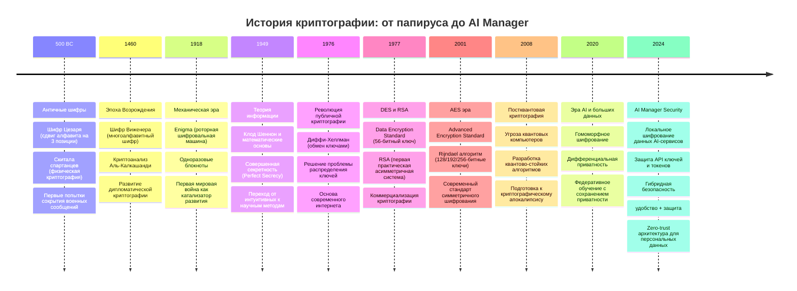
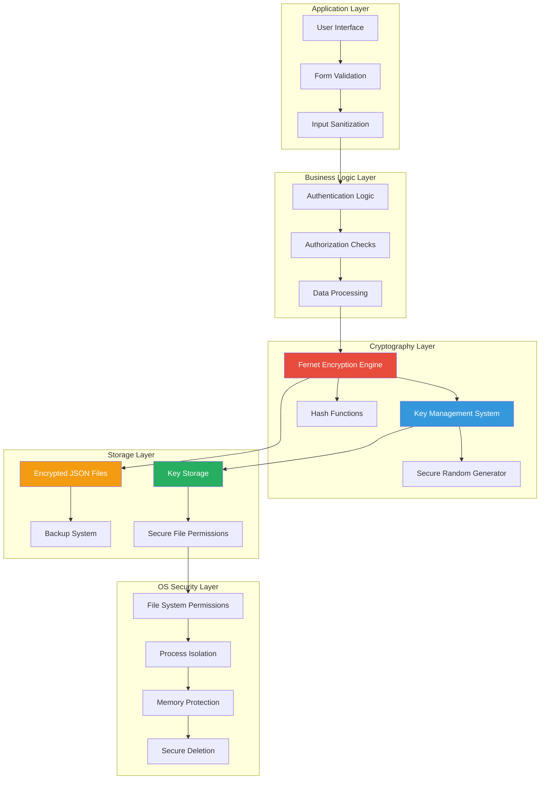
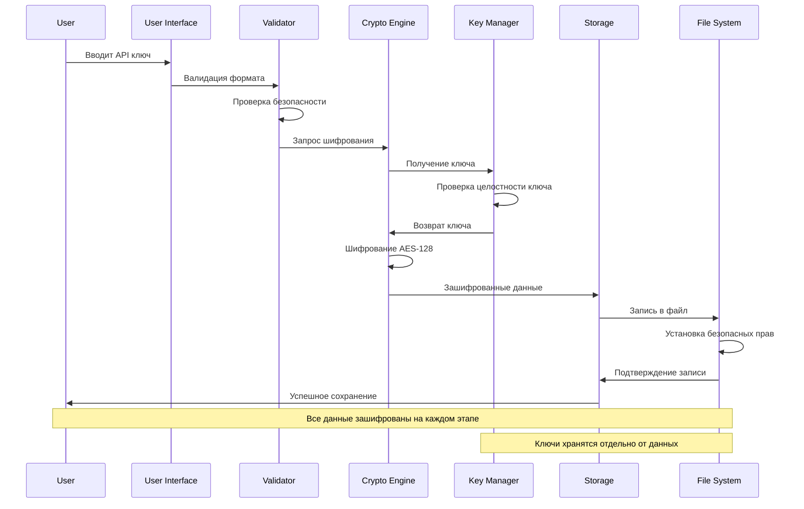

# Урок 4: Криптография и Безопасность в AI Manager

## 🎯 Цели урока

К концу этого урока вы будете понимать:
- Историю развития криптографии и ее применение в современных приложениях
- Принципы симметричного и асимметричного шифрования в контексте AI Manager
- Реализацию надежного шифрования с библиотекой cryptography (Fernet)
- Безопасное управление ключами шифрования и их жизненным циклом
- Защиту API ключей, паролей и токенов AI-сервисов
- Аудит безопасности и предотвращение утечек данных

## 📚 Историческая справка: От древних шифров до современной криптографии

### Эволюция криптографии и ее роль в цифровую эпоху



### Почему криптография критична для AI Manager?

**AI Manager обрабатывает особо чувствительные данные:**

1. **API ключи** — прямой доступ к дорогим AI-сервисам
2. **Пароли** — учетные данные пользователей
3. **Токены доступа** — долговременные права доступа
4. **Персональная информация** — данные о подписках и расходах
5. **Бизнес-логика** — стратегии использования AI

**Принципы безопасности AI Manager:**
- **Локальность** — данные никогда не покидают устройство пользователя
- **Шифрование по умолчанию** — все чувствительные данные зашифрованы
- **Минимизация доверия** — даже разработчики не могут получить доступ к данным
- **Аудируемость** — все операции с данными логируются

## 🔐 Архитектура безопасности AI Manager

### Многоуровневая система защиты



### Поток данных в системе безопасности



## 💻 Реализация шифрования в AI Manager

### Криптографический движок на основе Fernet

```python
# crypto_manager.py - Основной модуль криптографии AI Manager
import os
import base64
import json
import secrets
import hashlib
from pathlib import Path
from datetime import datetime, timedelta
from typing import Optional, Dict, Any, List
from cryptography.fernet import Fernet, InvalidToken
from cryptography.hazmat.primitives import hashes, serialization
from cryptography.hazmat.primitives.kdf.pbkdf2 import PBKDF2HMAC

class AIManagerCrypto:
    """
    Криптографический движок AI Manager.
    
    Обеспечивает:
    - Симметричное шифрование данных AI-сервисов
    - Безопасное управление ключами
    - Ротацию ключей и миграцию данных
    - Аудит криптографических операций
    """
    
    def __init__(self, config_dir: Path):
        """
        Инициализация криптографического движка.
        
        Args:
            config_dir: Путь к директории конфигурации приложения
        """
        self.config_dir = Path(config_dir)
        self.keys_dir = self.config_dir / "keys"
        self.audit_file = self.config_dir / "crypto_audit.log"
        
        # Создаем необходимые директории с безопасными правами
        self._ensure_secure_directories()
        
        # Инициализируем основной ключ шифрования
        self.master_key = self._load_or_create_master_key()
        self.fernet = Fernet(self.master_key)
        
        # Инициализируем аудит
        self._init_audit_logging()
        
        self._log_crypto_event("INIT", "Криптографический движок инициализирован")
    
    def _ensure_secure_directories(self) -> None:
        """
        Создает директории с безопасными правами доступа.
        
        На Unix системах устанавливает права 700 (только владелец).
        На Windows использует соответствующие ACL.
        """
        directories = [self.config_dir, self.keys_dir]
        
        for directory in directories:
            directory.mkdir(parents=True, exist_ok=True)
            
            # Устанавливаем безопасные права доступа
            if os.name != 'nt':  # Unix-like системы
                os.chmod(directory, 0o700)
            else:  # Windows
                self._set_windows_permissions(directory)
    
    def _set_windows_permissions(self, path: Path) -> None:
        """
        Устанавливает безопасные права доступа на Windows.
        
        Args:
            path: Путь к файлу или директории
        """
        try:
            import win32security
            import win32api
            import ntsecuritycon
            
            # Получаем SID текущего пользователя
            current_user = win32api.GetUserName()
            user_sid, domain, type = win32security.LookupAccountName("", current_user)
            
            # Создаем DACL только для текущего пользователя
            dacl = win32security.ACL()
            dacl.AddAccessAllowedAce(
                win32security.ACL_REVISION,
                ntsecuritycon.FILE_ALL_ACCESS,
                user_sid
            )
            
            # Применяем DACL
            win32security.SetFileSecurity(
                str(path),
                win32security.DACL_SECURITY_INFORMATION,
                dacl
            )
            
        except ImportError:
            # Если win32 модули недоступны, используем icacls
            os.system(f'icacls "{path}" /inheritance:r /grant:r "{os.getenv("USERNAME")}:(OI)(CI)F"')
    
    def _load_or_create_master_key(self) -> bytes:
        """
        Загружает существующий или создает новый мастер-ключ.
            
        Returns:
            bytes: Мастер-ключ для Fernet шифрования
        """
        key_file = self.keys_dir / "master.key"
        
        if key_file.exists():
            try:
                with open(key_file, 'rb') as f:
                    key_data = f.read()
                
                # Проверяем целостность ключа
                if len(key_data) == 44:  # Base64 Fernet ключ
                    # Проверяем, что это валидный Fernet ключ
                    test_fernet = Fernet(key_data)
                    # Тестируем шифрование/дешифрование
                    test_data = b"test"
                    encrypted = test_fernet.encrypt(test_data)
                    decrypted = test_fernet.decrypt(encrypted)
                    
                    if decrypted == test_data:
                        self._log_crypto_event("KEY_LOAD", "Мастер-ключ успешно загружен")
                        return key_data
                
                # Если ключ поврежден, создаем новый
                self._log_crypto_event("KEY_CORRUPT", "Поврежденный ключ обнаружен, создается новый")
                
        except Exception as e:
                self._log_crypto_event("KEY_ERROR", f"Ошибка загрузки ключа: {e}")
    
        # Создаем новый мастер-ключ
        return self._create_new_master_key()
    
    def _create_new_master_key(self) -> bytes:
        """
        Создает новый мастер-ключ и сохраняет его.
        
        Returns:
            bytes: Новый мастер-ключ
        """
        # Генерируем криптографически стойкий ключ
        key = Fernet.generate_key()
        key_file = self.keys_dir / "master.key"
        
        # Создаем резервную копию старого ключа (если существует)
        if key_file.exists():
            backup_file = self.keys_dir / f"master.key.backup.{int(datetime.now().timestamp())}"
            key_file.rename(backup_file)
            self._log_crypto_event("KEY_BACKUP", f"Старый ключ сохранен как {backup_file.name}")
    
        # Сохраняем новый ключ
        with open(key_file, 'wb') as f:
            f.write(key)
        
        # Устанавливаем безопасные права
        if os.name != 'nt':
            os.chmod(key_file, 0o600)  # Только владелец может читать/писать
        else:
            self._set_windows_permissions(key_file)
        
        self._log_crypto_event("KEY_CREATE", "Новый мастер-ключ создан и сохранен")
        return key
    
    def _init_audit_logging(self) -> None:
        """Инициализирует систему аудита криптографических операций."""
        if not self.audit_file.exists():
            self._log_crypto_event("AUDIT_INIT", "Файл аудита создан")
    
    def _log_crypto_event(self, event_type: str, description: str, 
                         additional_data: Optional[Dict] = None) -> None:
    """
        Логирует криптографические события для аудита.
    
    Args:
            event_type: Тип события (ENCRYPT, DECRYPT, KEY_CREATE, etc.)
            description: Описание события
            additional_data: Дополнительные данные для логирования
        """
        log_entry = {
            'timestamp': datetime.now().isoformat(),
            'event_type': event_type,
            'description': description,
            'pid': os.getpid(),
            'user': os.getenv('USER', os.getenv('USERNAME', 'unknown'))
        }
        
        if additional_data:
            log_entry.update(additional_data)
        
        try:
            with open(self.audit_file, 'a', encoding='utf-8') as f:
                f.write(json.dumps(log_entry) + '\n')
        except Exception as e:
            # Критическая ошибка - не можем логировать
            print(f"CRITICAL: Ошибка записи в аудит лог: {e}")
    
    def encrypt_data(self, data: str, context: str = "general") -> str:
        """
        Шифрует данные с добавлением контекстной информации.
        
        Args:
            data: Данные для шифрования
            context: Контекст использования данных
            
        Returns:
            str: Зашифрованные данные в Base64 формате
            
        Raises:
            ValueError: Если данные пустые
            CryptoError: При ошибке шифрования
        """
        if not data:
            raise ValueError("Данные для шифрования не могут быть пустыми")
        
        try:
            # Добавляем метаданные к данным
            payload = {
                'data': data,
                'context': context,
                'timestamp': datetime.now().isoformat(),
                'version': '1.0'
            }
            
            # Конвертируем в JSON и затем в байты
            json_data = json.dumps(payload, ensure_ascii=False)
            data_bytes = json_data.encode('utf-8')
            
            # Шифруем
            encrypted_bytes = self.fernet.encrypt(data_bytes)
            
            # Конвертируем в Base64 для хранения в JSON
            encrypted_b64 = base64.b64encode(encrypted_bytes).decode('ascii')
            
            self._log_crypto_event(
                "ENCRYPT", 
                f"Данные зашифрованы (контекст: {context})",
                {'data_length': len(data), 'context': context}
            )
            
            return encrypted_b64
            
        except Exception as e:
            self._log_crypto_event("ENCRYPT_ERROR", f"Ошибка шифрования: {e}")
            raise CryptoError(f"Ошибка шифрования данных: {e}")
    
    def decrypt_data(self, encrypted_data: str, expected_context: Optional[str] = None) -> str:
        """
        Дешифрует данные с проверкой контекста.
        
        Args:
            encrypted_data: Зашифрованные данные в Base64
            expected_context: Ожидаемый контекст для проверки
            
        Returns:
            str: Дешифрованные данные
            
        Raises:
            CryptoError: При ошибке дешифрования или неверном контексте
        """
        if not encrypted_data:
            raise ValueError("Зашифрованные данные не могут быть пустыми")
        
        try:
            # Декодируем из Base64
            encrypted_bytes = base64.b64decode(encrypted_data)
            
            # Дешифруем
            decrypted_bytes = self.fernet.decrypt(encrypted_bytes)
            
            # Конвертируем в JSON
            json_data = decrypted_bytes.decode('utf-8')
            payload = json.loads(json_data)
            
            # Проверяем контекст если указан
            if expected_context and payload.get('context') != expected_context:
                self._log_crypto_event(
                    "DECRYPT_CONTEXT_MISMATCH",
                    f"Несоответствие контекста: ожидался {expected_context}, получен {payload.get('context')}"
                )
                raise CryptoError(f"Несоответствие контекста данных")
            
            # Извлекаем оригинальные данные
            original_data = payload.get('data')
            if original_data is None:
                raise CryptoError("Поврежденная структура зашифрованных данных")
            
            self._log_crypto_event(
                "DECRYPT",
                f"Данные дешифрованы (контекст: {payload.get('context')})",
                {'context': payload.get('context')}
            )
            
            return original_data
            
        except InvalidToken:
            self._log_crypto_event("DECRYPT_INVALID_TOKEN", "Попытка дешифрования с неверным ключом")
            raise CryptoError("Неверный ключ шифрования или поврежденные данные")
        except json.JSONDecodeError as e:
            self._log_crypto_event("DECRYPT_JSON_ERROR", f"Ошибка парсинга JSON: {e}")
            raise CryptoError("Поврежденная структура зашифрованных данных")
        except Exception as e:
            self._log_crypto_event("DECRYPT_ERROR", f"Ошибка дешифрования: {e}")
            raise CryptoError(f"Ошибка дешифрования данных: {e}")
    
    def encrypt_ai_service_credentials(self, credentials: Dict[str, str]) -> Dict[str, str]:
        """
        Шифрует учетные данные AI-сервиса.
        
        Args:
            credentials: Словарь с учетными данными
            
        Returns:
            Dict[str, str]: Зашифрованные учетные данные
        """
        encrypted_credentials = {}
        
        for field, value in credentials.items():
            if value:  # Шифруем только непустые значения
        try:
                    encrypted_value = self.encrypt_data(value, context=f"credential_{field}")
                    encrypted_credentials[field] = encrypted_value
                    
                    self._log_crypto_event(
                        "CREDENTIAL_ENCRYPT",
                        f"Учетные данные зашифрованы: {field}",
                        {'field': field}
                    )
                    
        except Exception as e:
                    self._log_crypto_event(
                        "CREDENTIAL_ENCRYPT_ERROR",
                        f"Ошибка шифрования поля {field}: {e}"
                    )
                    raise CryptoError(f"Ошибка шифрования поля {field}")
        
        return encrypted_credentials
    
    def decrypt_ai_service_credentials(self, encrypted_credentials: Dict[str, str]) -> Dict[str, str]:
        """
        Дешифрует учетные данные AI-сервиса.
        
        Args:
            encrypted_credentials: Зашифрованные учетные данные
            
        Returns:
            Dict[str, str]: Дешифрованные учетные данные
        """
        decrypted_credentials = {}
        
        for field, encrypted_value in encrypted_credentials.items():
            if encrypted_value:
        try:
                    decrypted_value = self.decrypt_data(
                        encrypted_value, 
                        expected_context=f"credential_{field}"
                    )
                    decrypted_credentials[field] = decrypted_value
                    
                    self._log_crypto_event(
                        "CREDENTIAL_DECRYPT",
                        f"Учетные данные дешифрованы: {field}",
                        {'field': field}
                    )
                    
        except Exception as e:
                    self._log_crypto_event(
                        "CREDENTIAL_DECRYPT_ERROR",
                        f"Ошибка дешифрования поля {field}: {e}"
                    )
                    # Не прерываем процесс из-за одного поврежденного поля
                    decrypted_credentials[field] = f"[ОШИБКА ДЕШИФРОВАНИЯ: {field}]"
        
        return decrypted_credentials
    
    def hash_data(self, data: str, salt: Optional[bytes] = None) -> Dict[str, str]:
        """
        Создает криптографический хеш данных для проверки целостности.
        
        Args:
            data: Данные для хеширования
            salt: Соль для хеширования (генерируется если не указана)
            
        Returns:
            Dict[str, str]: Хеш и соль в Base64 формате
        """
        if salt is None:
            salt = secrets.token_bytes(32)  # 256-битная соль
        
        # Используем PBKDF2 для создания стойкого хеша
        kdf = PBKDF2HMAC(
            algorithm=hashes.SHA256(),
            length=32,
            salt=salt,
            iterations=100000,  # 100k итераций для защиты от brute force
        )
        
        hash_bytes = kdf.derive(data.encode('utf-8'))
        
        return {
            'hash': base64.b64encode(hash_bytes).decode('ascii'),
            'salt': base64.b64encode(salt).decode('ascii'),
            'algorithm': 'PBKDF2-SHA256',
            'iterations': 100000
        }
    
    def verify_hash(self, data: str, hash_info: Dict[str, str]) -> bool:
        """
        Проверяет соответствие данных сохраненному хешу.
        
        Args:
            data: Данные для проверки
            hash_info: Информация о хеше из hash_data()
            
        Returns:
            bool: True если данные соответствуют хешу
        """
        try:
            salt = base64.b64decode(hash_info['salt'])
            expected_hash = base64.b64decode(hash_info['hash'])
            iterations = hash_info.get('iterations', 100000)
            
            kdf = PBKDF2HMAC(
                algorithm=hashes.SHA256(),
                length=32,
                salt=salt,
                iterations=iterations,
            )
            
            computed_hash = kdf.derive(data.encode('utf-8'))
            
            return secrets.compare_digest(expected_hash, computed_hash)
            
        except Exception as e:
            self._log_crypto_event("HASH_VERIFY_ERROR", f"Ошибка проверки хеша: {e}")
            return False
    
    def rotate_master_key(self) -> Dict[str, Any]:
    """
        Выполняет ротацию мастер-ключа с перешифровкой всех данных.
    
    Returns:
            Dict[str, Any]: Результат операции ротации
        """
        self._log_crypto_event("KEY_ROTATION_START", "Начало ротации мастер-ключа")
        
        try:
            # Создаем новый ключ
            new_key = Fernet.generate_key()
            new_fernet = Fernet(new_key)
            
            # Загружаем все зашифрованные данные
            ai_services = self._load_encrypted_services()
            
            # Перешифровываем каждый сервис
            migrated_services = []
            errors = []
            
            for service in ai_services:
                try:
                    # Дешифруем старым ключом
                    if 'credentials' in service:
                        decrypted_credentials = self.decrypt_ai_service_credentials(
                            service['credentials']
                        )
                        
                        # Шифруем новым ключом
                        old_fernet = self.fernet
                        self.fernet = new_fernet
                        
                        new_encrypted_credentials = self.encrypt_ai_service_credentials(
                            decrypted_credentials
                        )
                        
                        service['credentials'] = new_encrypted_credentials
                        
                        # Возвращаем старый fernet для других сервисов
                        self.fernet = old_fernet
                    
                    migrated_services.append(service)
                    
                except Exception as e:
                    error_msg = f"Ошибка миграции сервиса {service.get('name', 'unknown')}: {e}"
                    errors.append(error_msg)
                    self._log_crypto_event("KEY_ROTATION_SERVICE_ERROR", error_msg)
            
            if errors:
                # Если есть ошибки, прерываем ротацию
                self._log_crypto_event("KEY_ROTATION_ABORTED", f"Ротация прервана из-за ошибок: {errors}")
                return {
                    'success': False,
                    'errors': errors,
                    'message': 'Ротация ключа прервана из-за ошибок миграции данных'
                }
            
            # Сохраняем перешифрованные данные
            self._save_encrypted_services(migrated_services)
            
            # Обновляем мастер-ключ
            old_key_backup = self._backup_current_key()
            self.master_key = new_key
            self.fernet = new_fernet
            self._save_master_key(new_key)
            
            self._log_crypto_event(
                "KEY_ROTATION_SUCCESS",
                "Ротация мастер-ключа завершена успешно",
                {
                    'services_migrated': len(migrated_services),
                    'old_key_backup': old_key_backup
                }
            )
            
            return {
                'success': True,
                'services_migrated': len(migrated_services),
                'old_key_backup': old_key_backup,
                'message': 'Ротация ключа выполнена успешно'
            }
            
        except Exception as e:
            self._log_crypto_event("KEY_ROTATION_CRITICAL_ERROR", f"Критическая ошибка ротации: {e}")
            return {
                'success': False,
                'error': str(e),
                'message': 'Критическая ошибка при ротации ключа'
            }
    
    def _load_encrypted_services(self) -> List[Dict[str, Any]]:
        """Загружает зашифрованные данные сервисов."""
        # Здесь должна быть логика загрузки из ai_services.json.enc
        # Это зависит от реализации файлового хранилища
        pass
    
    def _save_encrypted_services(self, services: List[Dict[str, Any]]) -> None:
        """Сохраняет зашифрованные данные сервисов."""
        # Здесь должна быть логика сохранения в ai_services.json.enc
        pass
    
    def _backup_current_key(self) -> str:
        """Создает резервную копию текущего ключа."""
        timestamp = int(datetime.now().timestamp())
        backup_name = f"master.key.backup.{timestamp}"
        backup_path = self.keys_dir / backup_name
        
        with open(self.keys_dir / "master.key", 'rb') as src:
            with open(backup_path, 'wb') as dst:
                dst.write(src.read())
        
        return backup_name
    
    def _save_master_key(self, key: bytes) -> None:
        """Сохраняет новый мастер-ключ."""
        key_file = self.keys_dir / "master.key"
        
        with open(key_file, 'wb') as f:
            f.write(key)
    
        # Устанавливаем безопасные права
    if os.name != 'nt':
            os.chmod(key_file, 0o600)
    else:
            self._set_windows_permissions(key_file)
    
    def get_crypto_stats(self) -> Dict[str, Any]:
        """
        Возвращает статистику работы криптографической системы.
        
        Returns:
            Dict[str, Any]: Статистика криптографических операций
        """
        try:
            stats = {
                'master_key_age': self._get_master_key_age(),
                'total_operations': self._count_crypto_operations(),
                'last_rotation': self._get_last_rotation_date(),
                'audit_log_size': self._get_audit_log_size(),
                'key_strength': 'AES-128 (Fernet)',
                'encryption_standard': 'FIPS 140-2 Level 1 compatible'
            }
            
            return stats
        
    except Exception as e:
            self._log_crypto_event("STATS_ERROR", f"Ошибка получения статистики: {e}")
            return {'error': str(e)}
    
    def _get_master_key_age(self) -> str:
        """Возвращает возраст мастер-ключа."""
        key_file = self.keys_dir / "master.key"
        if key_file.exists():
            creation_time = datetime.fromtimestamp(key_file.stat().st_ctime)
            age = datetime.now() - creation_time
            return f"{age.days} дней"
        return "Неизвестно"
    
    def _count_crypto_operations(self) -> int:
        """Подсчитывает количество криптографических операций."""
        try:
            count = 0
            if self.audit_file.exists():
                with open(self.audit_file, 'r', encoding='utf-8') as f:
                    for line in f:
                        try:
                            entry = json.loads(line.strip())
                            if entry.get('event_type') in ['ENCRYPT', 'DECRYPT']:
                                count += 1
                        except json.JSONDecodeError:
                            continue
            return count
        except Exception:
            return 0
    
    def _get_last_rotation_date(self) -> Optional[str]:
        """Возвращает дату последней ротации ключа."""
        try:
            if self.audit_file.exists():
                with open(self.audit_file, 'r', encoding='utf-8') as f:
                    lines = f.readlines()
                    
                # Ищем последнюю ротацию с конца файла
                for line in reversed(lines):
                    try:
                        entry = json.loads(line.strip())
                        if entry.get('event_type') == 'KEY_ROTATION_SUCCESS':
                            return entry.get('timestamp')
                    except json.JSONDecodeError:
                        continue
            return None
        except Exception:
            return None
    
    def _get_audit_log_size(self) -> str:
        """Возвращает размер файла аудита."""
        try:
            if self.audit_file.exists():
                size_bytes = self.audit_file.stat().st_size
                if size_bytes < 1024:
                    return f"{size_bytes} байт"
                elif size_bytes < 1024 * 1024:
                    return f"{size_bytes / 1024:.1f} KB"
                else:
                    return f"{size_bytes / (1024 * 1024):.1f} MB"
            return "0 байт"
        except Exception:
            return "Неизвестно"

class CryptoError(Exception):
    """Исключение для ошибок криптографических операций."""
    pass

class SecureDataManager:
    """
    Менеджер для безопасной работы с данными AI-сервисов.
    
    Интегрирует криптографический движок с системой хранения данных.
    """
    
    def __init__(self, data_dir: Path):
        self.data_dir = Path(data_dir)
        self.crypto = AIManagerCrypto(data_dir)
        self.data_file = data_dir / "ai_services.json.enc"
    
    def save_ai_service(self, service_data: Dict[str, Any]) -> bool:
        """
        Сохраняет данные AI-сервиса с шифрованием чувствительных полей.
        
        Args:
            service_data: Данные сервиса для сохранения
            
        Returns:
            bool: True если сохранение успешно
        """
        try:
            # Загружаем существующие сервисы
            services = self.load_ai_services()
            
            # Шифруем чувствительные данные
            if 'credentials' in service_data:
                service_data['credentials'] = self.crypto.encrypt_ai_service_credentials(
                    service_data['credentials']
                )
            
            # Добавляем или обновляем сервис
            service_id = service_data.get('id')
            existing_index = None
            
            for i, existing_service in enumerate(services):
                if existing_service.get('id') == service_id:
                    existing_index = i
                    break
            
            if existing_index is not None:
                services[existing_index] = service_data
            else:
                services.append(service_data)
            
            # Сохраняем обновленный список
            return self._save_services_to_file(services)
                
        except Exception as e:
            self.crypto._log_crypto_event("SAVE_ERROR", f"Ошибка сохранения сервиса: {e}")
            return False
    
    def load_ai_services(self) -> List[Dict[str, Any]]:
        """
        Загружает и дешифрует данные всех AI-сервисов.
        
        Returns:
            List[Dict[str, Any]]: Список сервисов с дешифрованными данными
        """
        try:
            if not self.data_file.exists():
                return []
            
            # Загружаем зашифрованные данные
            with open(self.data_file, 'r', encoding='utf-8') as f:
                encrypted_data = f.read()
            
            if not encrypted_data.strip():
                return []
            
            # Дешифруем основные данные
            decrypted_json = self.crypto.decrypt_data(encrypted_data, context="ai_services_data")
            services = json.loads(decrypted_json)
            
            # Дешифруем credentials для каждого сервиса
            for service in services:
                if 'credentials' in service and service['credentials']:
                    service['credentials'] = self.crypto.decrypt_ai_service_credentials(
                        service['credentials']
                    )
            
            return services
            
        except Exception as e:
            self.crypto._log_crypto_event("LOAD_ERROR", f"Ошибка загрузки сервисов: {e}")
            return []
    
    def _save_services_to_file(self, services: List[Dict[str, Any]]) -> bool:
        """
        Сохраняет список сервисов в зашифрованный файл.
        
        Args:
            services: Список сервисов для сохранения
            
        Returns:
            bool: True если сохранение успешно
        """
        try:
            # Конвертируем в JSON
            json_data = json.dumps(services, ensure_ascii=False, indent=2)
            
            # Шифруем весь файл
            encrypted_data = self.crypto.encrypt_data(json_data, context="ai_services_data")
            
            # Создаем резервную копию
            if self.data_file.exists():
                backup_file = self.data_file.with_suffix(
                    f'.backup.{int(datetime.now().timestamp())}'
                )
                self.data_file.rename(backup_file)
            
            # Сохраняем зашифрованные данные
            with open(self.data_file, 'w', encoding='utf-8') as f:
                f.write(encrypted_data)
            
            # Устанавливаем безопасные права доступа
            if os.name != 'nt':
                os.chmod(self.data_file, 0o600)
            
            return True
            
        except Exception as e:
            self.crypto._log_crypto_event("SAVE_FILE_ERROR", f"Ошибка сохранения файла: {e}")
            return False
```

## 🔐 Интеграция с Flask приложением

### Инициализация криптографии в AI Manager

```python
# app.py - Интеграция криптографического движка
from pathlib import Path
from crypto_manager import SecureDataManager, CryptoError

# Глобальный менеджер безопасности
secure_data_manager = None

def init_crypto_system():
    """
    Инициализирует криптографическую систему AI Manager.
    
    Вызывается при запуске приложения.
    """
    global secure_data_manager
    
    try:
        # Определяем директорию данных приложения
        app_data_dir = get_app_data_dir()
        
        # Инициализируем менеджер безопасности
        secure_data_manager = SecureDataManager(app_data_dir)
        
        app.logger.info("Криптографическая система инициализирована успешно")
        
        # Проверяем состояние системы безопасности
        crypto_stats = secure_data_manager.crypto.get_crypto_stats()
        app.logger.info(f"Статистика криптографии: {crypto_stats}")
        
        return True
        
    except Exception as e:
        app.logger.error(f"Критическая ошибка инициализации криптографии: {e}")
        return False

def encrypt_data(data, context="general"):
    """
    Публичная функция для шифрования данных.
    
    Args:
        data: Данные для шифрования
        context: Контекст использования
        
    Returns:
        str: Зашифрованные данные
        
    Raises:
        CryptoError: При ошибке шифрования
    """
    if not secure_data_manager:
        raise CryptoError("Криптографическая система не инициализирована")
    
    return secure_data_manager.crypto.encrypt_data(data, context)

def decrypt_data(encrypted_data, expected_context=None):
    """
    Публичная функция для дешифрования данных.
    
    Args:
        encrypted_data: Зашифрованные данные
        expected_context: Ожидаемый контекст
        
    Returns:
        str: Дешифрованные данные
        
    Raises:
        CryptoError: При ошибке дешифрования
    """
    if not secure_data_manager:
        raise CryptoError("Криптографическая система не инициализирована")
    
    return secure_data_manager.crypto.decrypt_data(encrypted_data, expected_context)

def load_ai_services():
    """
    Загружает список AI-сервисов с автоматическим дешифрованием.
    
    Returns:
        List[Dict]: Список сервисов с дешифрованными данными
    """
    if not secure_data_manager:
        app.logger.error("Попытка загрузки данных без инициализации криптографии")
        return []
    
    return secure_data_manager.load_ai_services()

def save_ai_services(services_list):
    """
    Сохраняет список AI-сервисов с автоматическим шифрованием.
    
    Args:
        services_list: Список сервисов для сохранения
        
    Returns:
        bool: True если сохранение успешно
    """
    if not secure_data_manager:
        app.logger.error("Попытка сохранения данных без инициализации криптографии")
        return False
    
    # Сохраняем каждый сервис через менеджер безопасности
    try:
        # Создаем временный файл со всеми сервисами
        return secure_data_manager._save_services_to_file(services_list)
    except Exception as e:
        app.logger.error(f"Ошибка сохранения сервисов: {e}")
        return False

# Инициализация при запуске приложения
@app.before_first_request
def initialize_security():
    """Инициализирует систему безопасности перед первым запросом."""
    if not init_crypto_system():
        app.logger.critical("КРИТИЧЕСКАЯ ОШИБКА: Не удалось инициализировать криптографию")
        # В реальном приложении здесь должно быть аварийное завершение
```

### Маршруты для управления безопасностью

```python
# app.py - Маршруты для управления криптографией
@app.route('/security/status')
def security_status():
    """Отображает состояние системы безопасности."""
    if not secure_data_manager:
        return jsonify({'error': 'Система безопасности не инициализирована'}), 500
    
    try:
        stats = secure_data_manager.crypto.get_crypto_stats()
        return render_template('security_status.html', stats=stats)
    except Exception as e:
        app.logger.error(f"Ошибка получения статуса безопасности: {e}")
        return jsonify({'error': 'Ошибка получения статуса'}), 500

@app.route('/security/rotate_key', methods=['POST'])
def rotate_master_key():
    """Выполняет ротацию мастер-ключа."""
    if not secure_data_manager:
        flash('Система безопасности не инициализирована', 'error')
        return redirect(url_for('index'))
    
    try:
        # Подтверждение от пользователя
        confirmation = request.form.get('confirmation')
        if confirmation != 'ROTATE_KEY':
            flash('Неверное подтверждение. Введите "ROTATE_KEY" для подтверждения.', 'error')
            return redirect(url_for('security_status'))
        
        # Выполняем ротацию ключа
        result = secure_data_manager.crypto.rotate_master_key()
        
        if result['success']:
            flash(f'Ротация ключа выполнена успешно. Мигрировано сервисов: {result["services_migrated"]}', 'success')
            app.logger.info(f"Ротация мастер-ключа выполнена: {result}")
        else:
            flash(f'Ошибка ротации ключа: {result["message"]}', 'error')
            app.logger.error(f"Ошибка ротации ключа: {result}")
        
        return redirect(url_for('security_status'))
        
    except Exception as e:
        app.logger.error(f"Критическая ошибка ротации ключа: {e}")
        flash('Критическая ошибка при ротации ключа', 'error')
        return redirect(url_for('security_status'))

@app.route('/security/audit_log')
def view_audit_log():
    """Отображает журнал аудита криптографических операций."""
    if not secure_data_manager:
        return jsonify({'error': 'Система безопасности не инициализирована'}), 500
    
    try:
        audit_entries = []
        audit_file = secure_data_manager.crypto.audit_file
        
        if audit_file.exists():
            with open(audit_file, 'r', encoding='utf-8') as f:
                for line in f:
                    try:
                        entry = json.loads(line.strip())
                        audit_entries.append(entry)
                    except json.JSONDecodeError:
                        continue
        
        # Сортируем по времени (новые сначала)
        audit_entries.sort(key=lambda x: x.get('timestamp', ''), reverse=True)
        
        return render_template('audit_log.html', entries=audit_entries[:100])  # Последние 100 записей
        
    except Exception as e:
        app.logger.error(f"Ошибка просмотра журнала аудита: {e}")
        return jsonify({'error': 'Ошибка доступа к журналу аудита'}), 500

@app.route('/api/test_encryption', methods=['POST'])
def test_encryption():
    """API для тестирования шифрования/дешифрования."""
    if not secure_data_manager:
        return jsonify({'error': 'Система безопасности не инициализирована'}), 500
    
    try:
        test_data = request.json.get('data', 'test string')
        context = request.json.get('context', 'test')
        
        # Тестируем шифрование
        encrypted = secure_data_manager.crypto.encrypt_data(test_data, context)
        
        # Тестируем дешифрование
        decrypted = secure_data_manager.crypto.decrypt_data(encrypted, context)
        
        # Проверяем целостность
        success = (decrypted == test_data)
        
        return jsonify({
            'success': success,
            'original_length': len(test_data),
            'encrypted_length': len(encrypted),
            'decrypted_matches': success,
            'context': context
        })
        
    except Exception as e:
        return jsonify({
            'success': False,
            'error': str(e)
        }), 500
```

## 🎯 Практические упражнения

### Упражнение 1: Создание системы шифрования паролей
Реализуйте простую систему шифрования:

```python
from cryptography.fernet import Fernet
import base64

class SimplePasswordManager:
    def __init__(self):
        self.key = Fernet.generate_key()
        self.cipher = Fernet(self.key)
    
    def encrypt_password(self, password: str) -> str:
        """Шифрует пароль."""
        encrypted = self.cipher.encrypt(password.encode())
        return base64.b64encode(encrypted).decode()
    
    def decrypt_password(self, encrypted_password: str) -> str:
        """Дешифрует пароль."""
        encrypted_bytes = base64.b64decode(encrypted_password)
        decrypted = self.cipher.decrypt(encrypted_bytes)
        return decrypted.decode()
```

### Упражнение 2: Валидация силы пароля
Создайте функцию для оценки силы пароля:

```python
import re
import math

def assess_password_strength(password: str) -> dict:
    """
    Оценивает силу пароля по различным критериям.
    
    Returns:
        dict: Оценка силы пароля
    """
    score = 0
    feedback = []
    
    # Длина пароля
    if len(password) >= 12:
        score += 25
    elif len(password) >= 8:
        score += 15
    else:
        feedback.append("Пароль должен содержать минимум 8 символов")
    
    # Проверка символов
    if re.search(r'[a-z]', password):
        score += 5
    else:
        feedback.append("Добавьте строчные буквы")
    
    if re.search(r'[A-Z]', password):
        score += 5
    else:
        feedback.append("Добавьте заглавные буквы")
    
    if re.search(r'\d', password):
        score += 5
    else:
        feedback.append("Добавьте цифры")
    
    if re.search(r'[!@#$%^&*(),.?":{}|<>]', password):
        score += 10
    else:
        feedback.append("Добавьте специальные символы")
    
    # Энтропия
    char_set_size = 0
    if re.search(r'[a-z]', password):
        char_set_size += 26
    if re.search(r'[A-Z]', password):
        char_set_size += 26
    if re.search(r'\d', password):
        char_set_size += 10
    if re.search(r'[!@#$%^&*(),.?":{}|<>]', password):
        char_set_size += 32
    
    entropy = len(password) * math.log2(char_set_size) if char_set_size > 0 else 0
    
    if entropy >= 60:
        score += 25
    elif entropy >= 40:
        score += 15
    
    # Определение уровня силы
    if score >= 80:
        strength = "Очень сильный"
    elif score >= 60:
        strength = "Сильный"
    elif score >= 40:
        strength = "Средний"
    elif score >= 20:
        strength = "Слабый"
    else:
        strength = "Очень слабый"
    
    return {
        'score': min(score, 100),
        'strength': strength,
        'entropy': round(entropy, 1),
        'feedback': feedback
    }
```

### Упражнение 3: Безопасное хранение конфигурации
Создайте систему для безопасного хранения настроек:

```python
import json
from pathlib import Path

class SecureConfig:
    def __init__(self, config_path: Path, crypto_manager):
        self.config_path = config_path
        self.crypto = crypto_manager
        self._config = {}
    
    def set_secure(self, key: str, value: str, context: str = "config"):
        """Устанавливает зашифрованное значение."""
        encrypted_value = self.crypto.encrypt_data(value, context)
        self._config[key] = {
            'encrypted': True,
            'value': encrypted_value,
            'context': context
        }
    
    def set_plain(self, key: str, value):
        """Устанавливает незашифрованное значение."""
        self._config[key] = {
            'encrypted': False,
            'value': value
        }
    
    def get(self, key: str, default=None):
        """Получает значение (автоматически дешифрует если нужно)."""
        if key not in self._config:
            return default
        
        item = self._config[key]
        if item['encrypted']:
            return self.crypto.decrypt_data(
                item['value'], 
                item.get('context', 'config')
            )
        else:
            return item['value']
    
    def save(self):
        """Сохраняет конфигурацию в файл."""
        config_json = json.dumps(self._config, indent=2)
        encrypted_config = self.crypto.encrypt_data(config_json, "config_file")
        
        with open(self.config_path, 'w') as f:
            f.write(encrypted_config)
    
    def load(self):
        """Загружает конфигурацию из файла."""
        if not self.config_path.exists():
            return
        
        with open(self.config_path, 'r') as f:
            encrypted_config = f.read()
        
        config_json = self.crypto.decrypt_data(encrypted_config, "config_file")
        self._config = json.loads(config_json)
```

## 📚 Дополнительные материалы

### Криптографические стандарты и библиотеки
- **cryptography** — современная криптографическая библиотека для Python
- **PyNaCl** — высокоуровневая криптография на основе NaCl
- **bcrypt** — специализированная библиотека для хеширования паролей
- **Argon2** — современный алгоритм хеширования паролей

### Документация и стандарты
- [NIST Cryptographic Standards](https://csrc.nist.gov/projects/cryptographic-standards-and-guidelines) — криптографические стандарты
- [OWASP Cryptographic Storage](https://owasp.org/www-project-cheat-sheets/cheatsheets/Cryptographic_Storage_Cheat_Sheet.html) — безопасное хранение данных
- [RFC 7517 JSON Web Key](https://tools.ietf.org/html/rfc7517) — стандарт управления ключами

## 🎯 Контрольные вопросы

1. **Алгоритмы**: В чем разница между симметричным и асимметричным шифрованием? Когда использовать каждый тип?

2. **Ключи**: Как безопасно управлять ключами шифрования в локальном приложении?

3. **Угрозы**: Какие угрозы безопасности существуют для данных AI-сервисов и как их предотвратить?

4. **Производительность**: Как оптимизировать производительность криптографических операций?

5. **Аудит**: Какую информацию нужно логировать для эффективного аудита безопасности?

## 🚀 Следующий урок

В следующем уроке **"Многопоточность и Производительность"** мы изучим:
- Асинхронное выполнение операций в AI Manager
- Многопоточную архитектуру Flask + PyWebView
- Оптимизацию производительности криптографических операций
- Фоновые задачи и уведомления пользователя
- Профилирование и мониторинг производительности

---

*Этот урок является частью курса "AI Manager: Архитектура и принципы разработки современных гибридных приложений"*
