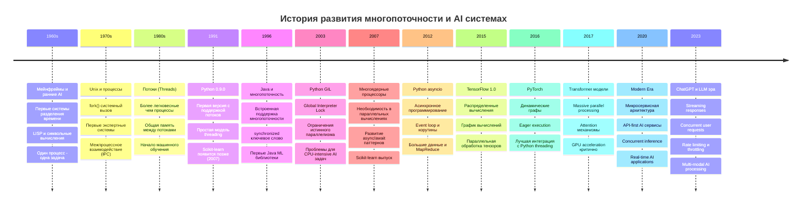
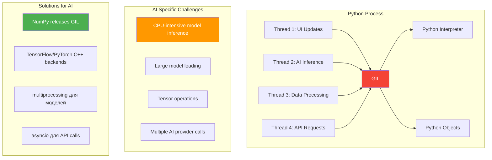
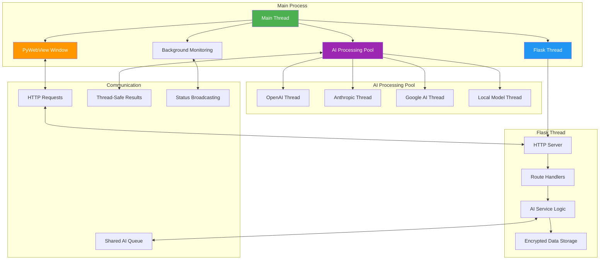
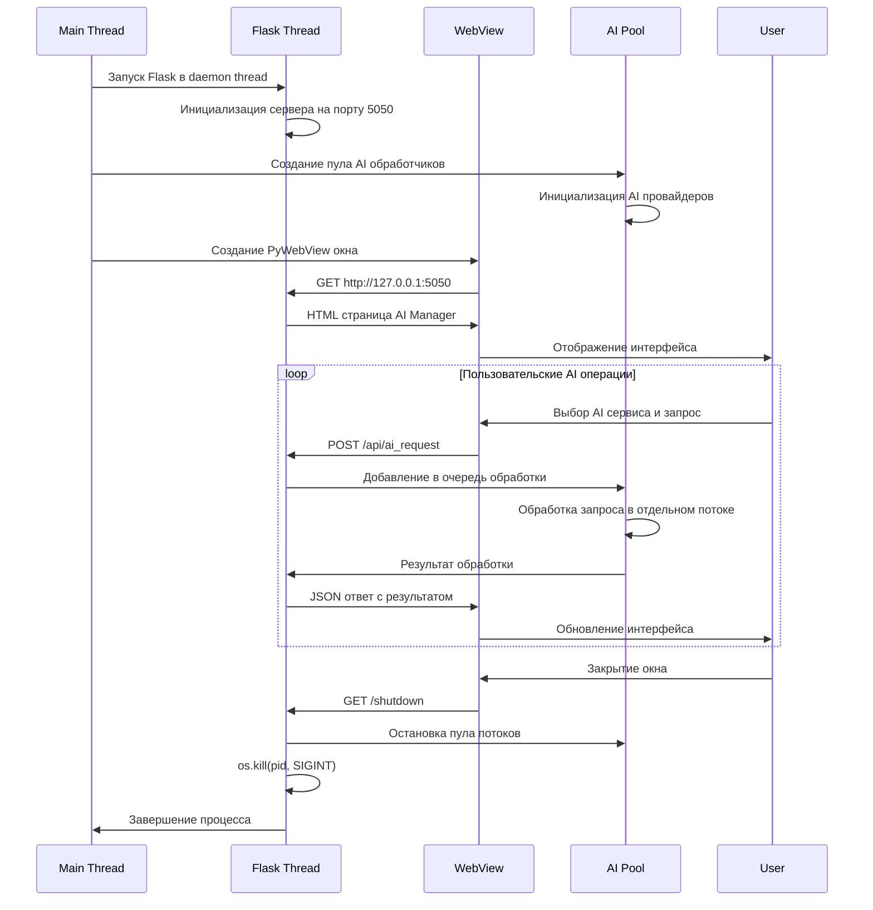
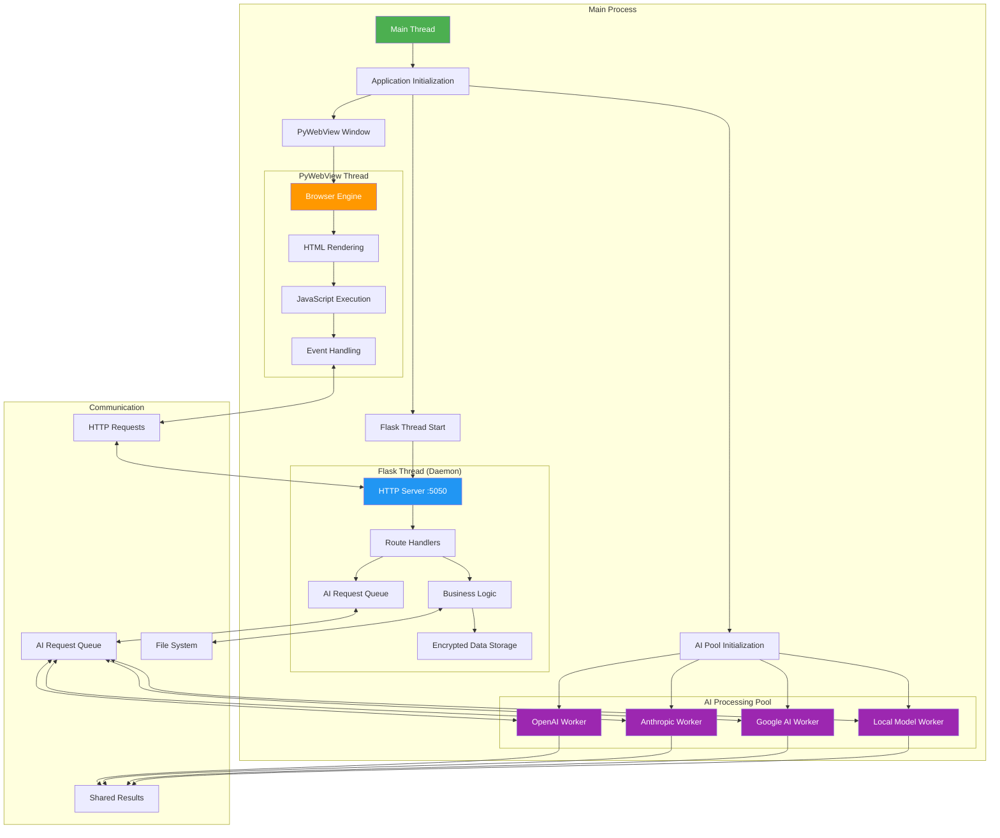

# Урок 5: Многопоточность и Архитектура AI Manager Приложения

## 🎯 Цели урока

К концу этого урока вы будете понимать:
- Историю развития многопоточности в контексте AI приложений
- Принципы работы потоков в Python для AI сервисов
- Архитектуру гибридных приложений для управления AI
- Синхронизацию потоков при работе с множественными AI провайдерами
- Паттерны проектирования многопоточных AI Manager приложений
- Обработку concurrent AI запросов и управление ресурсами

## 📚 Историческая справка

### Эволюция многопоточности в AI приложениях



### Global Interpreter Lock (GIL) в контексте AI приложений

**GIL** создает особые вызовы при разработке AI приложений, поскольку многие операции машинного обучения являются CPU-intensive:



**Почему GIL особенно проблематичен для AI:**
- **Model inference** - CPU-intensive операции блокируются
- **Data preprocessing** - Pandas/NumPy операции могут быть медленными
- **Multiple API calls** - Concurrent запросы к разным AI провайдерам
- **Real-time processing** - Потоковая обработка данных

**Обходные пути для AI приложений:**
- **NumPy/SciPy** освобождают GIL для математических операций
- **TensorFlow/PyTorch** используют C++ бэкенды
- **multiprocessing** для параллельного запуска моделей
- **asyncio** для неблокирующих I/O операций с AI API

## 🏗️ Архитектура многопоточного AI Manager приложения

### Модель AI Manager Architecture



### Жизненный цикл потоков в AI Manager



## 💻 Реализация многопоточности для AI сервисов

### Базовые концепции threading для AI

```python
import threading
import time
import queue
from datetime import datetime
from typing import Dict, List, Any, Optional, Callable
import logging
from dataclasses import dataclass
from enum import Enum

class AIProvider(Enum):
    """Перечисление AI провайдеров."""
    OPENAI = "openai"
    ANTHROPIC = "anthropic"
    GOOGLE = "google"
    LOCAL = "local"

@dataclass
class AIRequest:
    """Структура AI запроса."""
    id: str
    provider: AIProvider
    model: str
    prompt: str
    parameters: Dict[str, Any]
    callback: Optional[Callable] = None
    priority: int = 1
    created_at: datetime = None
    
    def __post_init__(self):
        if self.created_at is None:
            self.created_at = datetime.now()

@dataclass
class AIResponse:
    """Структура AI ответа."""
    request_id: str
    provider: AIProvider
    success: bool
    content: str = ""
    error: str = ""
    tokens_used: int = 0
    processing_time: float = 0.0
    completed_at: datetime = None
    
    def __post_init__(self):
        if self.completed_at is None:
            self.completed_at = datetime.now()

class ThreadSafeAIManager:
    """Thread-safe менеджер для работы с множественными AI провайдерами."""
    
    def __init__(self, max_workers: int = 4):
        self.max_workers = max_workers
        self.logger = logging.getLogger(__name__)
        
        # Thread-safe структуры данных
        self.request_queue = queue.PriorityQueue()
        self.result_storage = {}
        self.active_requests = {}
        
        # Синхронизация
        self.results_lock = threading.RLock()
        self.stats_lock = threading.Lock()
        self.shutdown_event = threading.Event()
        
        # Статистика
        self.stats = {
            'total_requests': 0,
            'successful_requests': 0,
            'failed_requests': 0,
            'average_response_time': 0.0,
            'provider_stats': {provider: {'requests': 0, 'avg_time': 0.0} 
                             for provider in AIProvider}
        }
        
        # Пул рабочих потоков
        self.workers = []
        self.start_workers()
    
    def start_workers(self):
        """Запускает рабочие потоки для обработки AI запросов."""
        for i in range(self.max_workers):
            worker = threading.Thread(
                target=self._worker_loop,
                name=f"AIWorker-{i}",
                daemon=True
            )
            worker.start()
            self.workers.append(worker)
            self.logger.info(f"Запущен AI worker поток: {worker.name}")
    
    def _worker_loop(self):
        """Основной цикл рабочего потока."""
        thread_name = threading.current_thread().name
        self.logger.info(f"AI Worker {thread_name} начал работу")
        
        while not self.shutdown_event.is_set():
            try:
                # Получаем запрос из приоритетной очереди
                # timeout=1 позволяет проверять shutdown_event
                priority, timestamp, request = self.request_queue.get(timeout=1)
                
                self.logger.info(f"Worker {thread_name} обрабатывает запрос {request.id}")
                
                # Регистрируем активный запрос
                with self.results_lock:
                    self.active_requests[request.id] = {
                        'request': request,
                        'worker': thread_name,
                        'started_at': datetime.now()
                    }
                
                # Обрабатываем запрос
                response = self._process_ai_request(request)
                
                # Сохраняем результат
                with self.results_lock:
                    self.result_storage[request.id] = response
                    if request.id in self.active_requests:
                        del self.active_requests[request.id]
                
                # Обновляем статистику
                self._update_stats(request, response)
                
                # Вызываем callback если есть
                if request.callback:
                    try:
                        request.callback(response)
                    except Exception as e:
                        self.logger.error(f"Ошибка в callback для {request.id}: {e}")
                
                self.request_queue.task_done()
                
            except queue.Empty:
                # Таймаут - проверяем shutdown_event и продолжаем
                continue
            except Exception as e:
                self.logger.error(f"Ошибка в worker {thread_name}: {e}")
                # При ошибке помечаем задачу как выполненную
                self.request_queue.task_done()
        
        self.logger.info(f"AI Worker {thread_name} завершил работу")
    
    def _process_ai_request(self, request: AIRequest) -> AIResponse:
        """Обрабатывает один AI запрос."""
        start_time = time.time()
        
        try:
            # Симуляция обработки разными провайдерами
            if request.provider == AIProvider.OPENAI:
                result = self._call_openai(request)
            elif request.provider == AIProvider.ANTHROPIC:
                result = self._call_anthropic(request)
            elif request.provider == AIProvider.GOOGLE:
                result = self._call_google(request)
            elif request.provider == AIProvider.LOCAL:
                result = self._call_local_model(request)
            else:
                raise ValueError(f"Неизвестный провайдер: {request.provider}")
            
            processing_time = time.time() - start_time
            
            return AIResponse(
                request_id=request.id,
                provider=request.provider,
                success=True,
                content=result.get('content', ''),
                tokens_used=result.get('tokens', 0),
                processing_time=processing_time
            )
            
        except Exception as e:
            processing_time = time.time() - start_time
            
            return AIResponse(
                request_id=request.id,
                provider=request.provider,
                success=False,
                error=str(e),
                processing_time=processing_time
            )
    
    def _call_openai(self, request: AIRequest) -> Dict[str, Any]:
        """Симуляция вызова OpenAI API."""
        # В реальном приложении здесь был бы вызов OpenAI API
        import random
        time.sleep(random.uniform(0.5, 2.0))  # Симуляция сетевой задержки
        
        if random.random() < 0.9:  # 90% успеха
            return {
                'content': f"OpenAI ответ на: {request.prompt[:50]}...",
                'tokens': random.randint(50, 500)
            }
        else:
            raise Exception("OpenAI API временно недоступен")
    
    def _call_anthropic(self, request: AIRequest) -> Dict[str, Any]:
        """Симуляция вызова Anthropic API."""
        import random
        time.sleep(random.uniform(0.3, 1.5))
        
        if random.random() < 0.95:  # 95% успеха
            return {
                'content': f"Claude ответ на: {request.prompt[:50]}...",
                'tokens': random.randint(40, 400)
            }
        else:
            raise Exception("Anthropic API rate limit exceeded")
    
    def _call_google(self, request: AIRequest) -> Dict[str, Any]:
        """Симуляция вызова Google AI API."""
        import random
        time.sleep(random.uniform(0.8, 2.5))
        
        if random.random() < 0.85:  # 85% успеха
            return {
                'content': f"Gemini ответ на: {request.prompt[:50]}...",
                'tokens': random.randint(60, 600)
            }
        else:
            raise Exception("Google AI quota exceeded")
    
    def _call_local_model(self, request: AIRequest) -> Dict[str, Any]:
        """Симуляция локальной модели."""
        import random
        time.sleep(random.uniform(2.0, 5.0))  # Локальная модель медленнее
        
        return {
            'content': f"Локальная модель ответ на: {request.prompt[:50]}...",
            'tokens': random.randint(30, 300)
        }
    
    def submit_request(self, request: AIRequest) -> str:
        """Отправляет запрос на обработку."""
        # Приоритет: чем меньше число, тем выше приоритет
        # Используем timestamp как tie-breaker
        priority_tuple = (request.priority, time.time(), request)
        
        self.request_queue.put(priority_tuple)
        
        with self.stats_lock:
            self.stats['total_requests'] += 1
        
        self.logger.info(f"Запрос {request.id} добавлен в очередь (приоритет: {request.priority})")
        return request.id
    
    def get_result(self, request_id: str, timeout: float = None) -> Optional[AIResponse]:
        """Получает результат обработки запроса."""
        start_wait = time.time()
        
        while timeout is None or (time.time() - start_wait) < timeout:
            with self.results_lock:
                if request_id in self.result_storage:
                    return self.result_storage.pop(request_id)
            
            # Проверяем, активен ли запрос
            with self.results_lock:
                if request_id not in self.active_requests:
                    # Запрос не найден ни в активных, ни в результатах
                    return None
            
            time.sleep(0.1)  # Короткая пауза
        
        return None  # Таймаут
    
    def _update_stats(self, request: AIRequest, response: AIResponse):
        """Обновляет статистику."""
        with self.stats_lock:
            if response.success:
                self.stats['successful_requests'] += 1
            else:
                self.stats['failed_requests'] += 1
            
            # Обновляем среднее время ответа
            total_requests = self.stats['total_requests']
            current_avg = self.stats['average_response_time']
            new_avg = ((current_avg * (total_requests - 1)) + response.processing_time) / total_requests
            self.stats['average_response_time'] = new_avg
            
            # Статистика по провайдерам
            provider_stats = self.stats['provider_stats'][request.provider]
            provider_stats['requests'] += 1
            
            provider_requests = provider_stats['requests']
            provider_avg = provider_stats['avg_time']
            new_provider_avg = ((provider_avg * (provider_requests - 1)) + response.processing_time) / provider_requests
            provider_stats['avg_time'] = new_provider_avg
    
    def get_stats(self) -> Dict[str, Any]:
        """Возвращает текущую статистику."""
        with self.stats_lock:
            return self.stats.copy()
    
    def get_active_requests(self) -> Dict[str, Any]:
        """Возвращает информацию об активных запросах."""
        with self.results_lock:
            return {
                request_id: {
                    'provider': info['request'].provider.value,
                    'model': info['request'].model,
                    'worker': info['worker'],
                    'duration': (datetime.now() - info['started_at']).total_seconds()
                }
                for request_id, info in self.active_requests.items()
            }
    
    def shutdown(self, timeout: float = 10.0):
        """Корректно завершает работу менеджера."""
        self.logger.info("Начинается завершение работы AI Manager...")
        
        # Устанавливаем флаг завершения
        self.shutdown_event.set()
        
        # Ждем завершения всех активных задач
        self.logger.info("Ожидание завершения активных задач...")
        self.request_queue.join()
        
        # Ждем завершения потоков
        for worker in self.workers:
            worker.join(timeout=timeout/len(self.workers))
            if worker.is_alive():
                self.logger.warning(f"Worker {worker.name} не завершился за отведенное время")
        
        self.logger.info("AI Manager завершил работу")

# Пример использования AI Manager
def demonstrate_ai_manager():
    """Демонстрирует работу многопоточного AI Manager."""
    import uuid
    
    # Создаем менеджер
    ai_manager = ThreadSafeAIManager(max_workers=3)
    
    # Создаем несколько запросов
    requests = []
    
    # Высокий приоритет - срочный запрос
    urgent_request = AIRequest(
        id=str(uuid.uuid4()),
        provider=AIProvider.OPENAI,
        model="gpt-4",
        prompt="Срочно нужен ответ на важный вопрос!",
        parameters={},
        priority=0  # Высший приоритет
    )
    requests.append(urgent_request)
    
    # Обычные запросы
    for i in range(5):
        request = AIRequest(
            id=str(uuid.uuid4()),
            provider=AIProvider(list(AIProvider)[i % len(AIProvider)]),
            model=f"model-{i}",
            prompt=f"Обычный вопрос номер {i}",
            parameters={},
            priority=1  # Обычный приоритет
        )
        requests.append(request)
    
    # Отправляем все запросы
    request_ids = []
    for request in requests:
        request_id = ai_manager.submit_request(request)
        request_ids.append(request_id)
        print(f"Отправлен запрос {request_id} к {request.provider.value}")
    
    # Получаем результаты
    results = []
    for request_id in request_ids:
        print(f"Ожидание результата для {request_id}...")
        result = ai_manager.get_result(request_id, timeout=10.0)
        
        if result:
            results.append(result)
            status = "✅ Успешно" if result.success else "❌ Ошибка"
            print(f"{status} {request_id}: {result.content[:50] if result.success else result.error}")
        else:
            print(f"⏰ Таймаут для {request_id}")
    
    # Показываем статистику
    stats = ai_manager.get_stats()
    print("\n📊 Статистика:")
    print(f"Всего запросов: {stats['total_requests']}")
    print(f"Успешных: {stats['successful_requests']}")
    print(f"Неудачных: {stats['failed_requests']}")
    print(f"Среднее время ответа: {stats['average_response_time']:.2f}с")
    
    print("\n📈 По провайдерам:")
    for provider, provider_stats in stats['provider_stats'].items():
        if provider_stats['requests'] > 0:
            print(f"{provider.value}: {provider_stats['requests']} запросов, "
                  f"{provider_stats['avg_time']:.2f}с среднее время")
    
    # Корректное завершение
    ai_manager.shutdown()

if __name__ == "__main__":
    # Настройка логирования
    logging.basicConfig(
        level=logging.INFO,
        format='%(asctime)s - %(name)s - %(levelname)s - %(message)s'
    )
    
    demonstrate_ai_manager()
```

## 🔄 Интеграция с Flask для AI Manager

### Flask приложение с многопоточной обработкой AI

```python
import threading
import time
from flask import Flask, request, jsonify, render_template
import queue
import logging
import uuid
from datetime import datetime
from typing import Dict, List, Any

class ThreadSafeAIFlaskApp:
    """Flask приложение с поддержкой многопоточной обработки AI запросов."""
    
    def __init__(self):
        self.app = Flask(__name__)
        self.app.config['SECRET_KEY'] = 'your-ai-manager-secret-key'
        
        # Инициализируем AI Manager
        self.ai_manager = ThreadSafeAIManager(max_workers=4)
        
        # Thread-safe структуры для веб-интерфейса
        self.web_results = {}
        self.web_results_lock = threading.Lock()
        
        # Настройка логирования
        logging.basicConfig(level=logging.INFO)
        self.logger = logging.getLogger(__name__)
        
        self.setup_routes()
    
    def setup_routes(self):
        """Настройка маршрутов Flask для AI Manager."""
        
        @self.app.route('/')
        def index():
            """Главная страница AI Manager."""
            return render_template('ai_manager_index.html')
        
        @self.app.route('/api/ai_request', methods=['POST'])
        def submit_ai_request():
            """Отправляет AI запрос на обработку."""
            try:
                data = request.get_json()
                
                # Валидация входных данных
                required_fields = ['provider', 'model', 'prompt']
                for field in required_fields:
                    if field not in data:
                        return jsonify({
                            'error': f'Отсутствует обязательное поле: {field}'
                        }), 400
                
                # Создаем AI запрос
                request_id = str(uuid.uuid4())
                ai_request = AIRequest(
                    id=request_id,
                    provider=AIProvider(data['provider']),
                    model=data['model'],
                    prompt=data['prompt'],
                    parameters=data.get('parameters', {}),
                    priority=data.get('priority', 1)
                )
                
                # Отправляем на обработку
                self.ai_manager.submit_request(ai_request)
                
                self.logger.info(f"AI запрос {request_id} принят для обработки")
                
                return jsonify({
                    'request_id': request_id,
                    'status': 'accepted',
                    'message': 'Запрос принят для обработки'
                })
                
            except ValueError as e:
                return jsonify({'error': f'Неверный провайдер: {str(e)}'}), 400
            except Exception as e:
                self.logger.error(f"Ошибка при создании AI запроса: {e}")
                return jsonify({'error': str(e)}), 500
        
        @self.app.route('/api/ai_result/<request_id>')
        def get_ai_result(request_id):
            """Получает результат AI запроса."""
            try:
                # Проверяем кэш веб-результатов
                with self.web_results_lock:
                    if request_id in self.web_results:
                        result = self.web_results.pop(request_id)
                        return jsonify(result)
                
                # Проверяем в AI Manager
                result = self.ai_manager.get_result(request_id, timeout=0.1)
                
                if result is None:
                    # Проверяем, активен ли запрос
                    active_requests = self.ai_manager.get_active_requests()
                    if request_id in active_requests:
                        return jsonify({
                            'status': 'processing',
                            'message': 'Запрос обрабатывается',
                            'worker': active_requests[request_id]['worker'],
                            'duration': active_requests[request_id]['duration']
                        })
                    else:
                        return jsonify({
                            'status': 'not_found',
                            'message': 'Запрос не найден'
                        }), 404
                
                # Формируем ответ
                response_data = {
                    'request_id': result.request_id,
                    'provider': result.provider.value,
                    'status': 'completed',
                    'success': result.success,
                    'processing_time': result.processing_time,
                    'completed_at': result.completed_at.isoformat()
                }
                
                if result.success:
                    response_data.update({
                        'content': result.content,
                        'tokens_used': result.tokens_used
                    })
                else:
                    response_data['error'] = result.error
                
                return jsonify(response_data)
                
            except Exception as e:
                self.logger.error(f"Ошибка при получении результата {request_id}: {e}")
                return jsonify({'error': str(e)}), 500
        
        @self.app.route('/api/ai_stats')
        def get_ai_stats():
            """Возвращает статистику AI Manager."""
            try:
                stats = self.ai_manager.get_stats()
                active_requests = self.ai_manager.get_active_requests()
                
                return jsonify({
                    'stats': stats,
                    'active_requests': active_requests,
                    'timestamp': datetime.now().isoformat()
                })
                
            except Exception as e:
                self.logger.error(f"Ошибка при получении статистики: {e}")
                return jsonify({'error': str(e)}), 500
        
        @self.app.route('/api/ai_batch', methods=['POST'])
        def submit_batch_request():
            """Отправляет пакет AI запросов."""
            try:
                data = request.get_json()
                requests_data = data.get('requests', [])
                
                if not requests_data:
                    return jsonify({'error': 'Пустой пакет запросов'}), 400
                
                batch_id = str(uuid.uuid4())
                request_ids = []
                
                # Создаем и отправляем все запросы
                for i, req_data in enumerate(requests_data):
                    request_id = f"{batch_id}-{i}"
                    
                    ai_request = AIRequest(
                        id=request_id,
                        provider=AIProvider(req_data['provider']),
                        model=req_data['model'],
                        prompt=req_data['prompt'],
                        parameters=req_data.get('parameters', {}),
                        priority=req_data.get('priority', 1)
                    )
                    
                    self.ai_manager.submit_request(ai_request)
                    request_ids.append(request_id)
                
                self.logger.info(f"Пакет {batch_id} с {len(request_ids)} запросами принят")
                
                return jsonify({
                    'batch_id': batch_id,
                    'request_ids': request_ids,
                    'status': 'accepted',
                    'message': f'Пакет из {len(request_ids)} запросов принят'
                })
                
            except Exception as e:
                self.logger.error(f"Ошибка при обработке пакетного запроса: {e}")
                return jsonify({'error': str(e)}), 500
        
        @self.app.route('/api/ai_batch_status/<batch_id>')
        def get_batch_status(batch_id):
            """Получает статус пакетного запроса."""
            try:
                # Находим все запросы пакета
                active_requests = self.ai_manager.get_active_requests()
                batch_requests = {
                    req_id: info for req_id, info in active_requests.items()
                    if req_id.startswith(batch_id)
                }
                
                # Проверяем завершенные запросы
                completed_count = 0
                failed_count = 0
                total_requests = 0
                
                # Получаем общее количество запросов в пакете (из активных + потенциально завершенных)
                # Это упрощенная логика - в реальном приложении стоит хранить метаданные пакета
                
                return jsonify({
                    'batch_id': batch_id,
                    'active_requests': len(batch_requests),
                    'completed_requests': completed_count,
                    'failed_requests': failed_count,
                    'timestamp': datetime.now().isoformat()
                })
                
            except Exception as e:
                self.logger.error(f"Ошибка при получении статуса пакета {batch_id}: {e}")
                return jsonify({'error': str(e)}), 500
        
        @self.app.route('/shutdown', methods=['POST'])
        def shutdown():
            """Корректное завершение работы AI Manager."""
            try:
                self.logger.info("Получен запрос на завершение работы")
                
                # Завершаем AI Manager
                self.ai_manager.shutdown(timeout=5.0)
                
                # Завершаем Flask приложение
                import os
                import signal
                os.kill(os.getpid(), signal.SIGTERM)
                
                return jsonify({'status': 'shutting_down'})
                
            except Exception as e:
                self.logger.error(f"Ошибка при завершении работы: {e}")
                return jsonify({'error': str(e)}), 500
    
    def run(self, host='127.0.0.1', port=5050, debug=False):
        """Запускает Flask сервер с AI Manager."""
        self.logger.info(f"🚀 Запуск AI Manager Flask приложения на {host}:{port}")
        
        # Важно: threaded=True для поддержки множественных запросов
        self.app.run(host=host, port=port, debug=debug, threaded=True)

# HTML шаблон для демонстрации (сохранить как templates/ai_manager_index.html)
AI_MANAGER_HTML_TEMPLATE = '''
<!DOCTYPE html>
<html lang="ru">
<head>
    <meta charset="UTF-8">
    <meta name="viewport" content="width=device-width, initial-scale=1.0">
    <title>AI Manager - Многопоточная Обработка</title>
    <style>
        body {
            font-family: -apple-system, BlinkMacSystemFont, 'Segoe UI', Roboto, sans-serif;
            margin: 0;
            padding: 20px;
            background: linear-gradient(135deg, #667eea 0%, #764ba2 100%);
            color: #333;
            min-height: 100vh;
        }
        
        .container {
            max-width: 1200px;
            margin: 0 auto;
            background: white;
            border-radius: 10px;
            padding: 30px;
            box-shadow: 0 10px 30px rgba(0,0,0,0.2);
        }
        
        h1 {
            color: #4a5568;
            margin-bottom: 30px;
            text-align: center;
        }
        
        .section {
            margin-bottom: 30px;
            padding: 20px;
            border-radius: 8px;
            background: #f7fafc;
            border-left: 4px solid #4299e1;
        }
        
        .form-group {
            margin-bottom: 15px;
        }
        
        .form-group label {
            display: block;
            margin-bottom: 5px;
            font-weight: 600;
            color: #4a5568;
        }
        
        .form-group select,
        .form-group input,
        .form-group textarea {
            width: 100%;
            padding: 10px;
            border: 2px solid #e2e8f0;
            border-radius: 6px;
            font-size: 14px;
            transition: border-color 0.2s;
        }
        
        .form-group select:focus,
        .form-group input:focus,
        .form-group textarea:focus {
            outline: none;
            border-color: #4299e1;
        }
        
        .button {
            background: linear-gradient(45deg, #4299e1, #667eea);
            color: white;
            border: none;
            padding: 12px 24px;
            border-radius: 6px;
            cursor: pointer;
            font-size: 14px;
            margin: 5px;
            transition: transform 0.2s, box-shadow 0.2s;
        }
        
        .button:hover {
            transform: translateY(-2px);
            box-shadow: 0 5px 15px rgba(0,0,0,0.2);
        }
        
        .button:disabled {
            background: #a0aec0;
            cursor: not-allowed;
            transform: none;
            box-shadow: none;
        }
        
        .result {
            background: #edf2f7;
            padding: 15px;
            border-radius: 6px;
            margin-top: 15px;
            border-left: 4px solid #38a169;
            font-family: monospace;
            white-space: pre-wrap;
            max-height: 300px;
            overflow-y: auto;
        }
        
        .result.error {
            border-left-color: #e53e3e;
            background: #fed7d7;
        }
        
        .stats-grid {
            display: grid;
            grid-template-columns: repeat(auto-fit, minmax(250px, 1fr));
            gap: 15px;
            margin-top: 20px;
        }
        
        .stat-card {
            background: white;
            padding: 15px;
            border-radius: 8px;
            border: 1px solid #e2e8f0;
            text-align: center;
        }
        
        .stat-card h4 {
            margin: 0 0 10px 0;
            color: #4a5568;
        }
        
        .stat-card .value {
            font-size: 2em;
            font-weight: bold;
            color: #4299e1;
        }
        
        .loading {
            display: inline-block;
            width: 20px;
            height: 20px;
            border: 3px solid #f3f3f3;
            border-top: 3px solid #4299e1;
            border-radius: 50%;
            animation: spin 1s linear infinite;
        }
        
        @keyframes spin {
            0% { transform: rotate(0deg); }
            100% { transform: rotate(360deg); }
        }
        
        .request-status {
            background: #e6fffa;
            border: 1px solid #81e6d9;
            padding: 10px;
            border-radius: 6px;
            margin: 10px 0;
        }
        
        .provider-stats {
            display: grid;
            grid-template-columns: repeat(auto-fit, minmax(200px, 1fr));
            gap: 10px;
            margin-top: 15px;
        }
        
        .provider-card {
            background: linear-gradient(45deg, #667eea, #764ba2);
            color: white;
            padding: 15px;
            border-radius: 8px;
            text-align: center;
        }
    </style>
</head>
<body>
    <div class="container">
        <h1>🤖 AI Manager - Многопоточная Обработка</h1>
        
        <!-- Секция отправки запроса -->
        <div class="section">
            <h3>📝 Отправка AI запроса</h3>
            <p>Демонстрация многопоточной обработки запросов к различным AI провайдерам</p>
            
            <div class="form-group">
                <label for="providerSelect">AI Провайдер:</label>
                <select id="providerSelect">
                    <option value="openai">OpenAI (GPT)</option>
                    <option value="anthropic">Anthropic (Claude)</option>
                    <option value="google">Google (Gemini)</option>
                    <option value="local">Локальная модель</option>
                </select>
            </div>
            
            <div class="form-group">
                <label for="modelInput">Модель:</label>
                <input type="text" id="modelInput" placeholder="gpt-4, claude-3, gemini-pro..." value="gpt-4">
            </div>
            
            <div class="form-group">
                <label for="promptInput">Промпт:</label>
                <textarea id="promptInput" rows="4" placeholder="Введите ваш запрос к AI...">Расскажи мне про многопоточность в Python</textarea>
            </div>
            
            <div class="form-group">
                <label for="prioritySelect">Приоритет:</label>
                <select id="prioritySelect">
                    <option value="0">Высокий (0)</option>
                    <option value="1" selected>Обычный (1)</option>
                    <option value="2">Низкий (2)</option>
                </select>
            </div>
            
            <button class="button" onclick="submitAIRequest()">🚀 Отправить запрос</button>
            <button class="button" onclick="submitBatchRequests()">📦 Пакетные запросы</button>
            <button class="button" onclick="loadStats()">📊 Обновить статистику</button>
            
            <div id="requestResult" class="result" style="display: none;"></div>
        </div>
        
        <!-- Секция статистики -->
        <div class="section">
            <h3>📊 Статистика AI Manager</h3>
            <p>Текущее состояние многопоточной обработки</p>
            
            <div id="statsContainer" class="stats-grid">
                <div class="stat-card">
                    <h4>Всего запросов</h4>
                    <div class="value" id="totalRequests">0</div>
                </div>
                <div class="stat-card">
                    <h4>Успешных</h4>
                    <div class="value" id="successfulRequests">0</div>
                </div>
                <div class="stat-card">
                    <h4>Неудачных</h4>
                    <div class="value" id="failedRequests">0</div>
                </div>
                <div class="stat-card">
                    <h4>Среднее время</h4>
                    <div class="value" id="averageTime">0.0с</div>
                </div>
            </div>
            
            <div id="providerStats" class="provider-stats"></div>
            <div id="activeRequests"></div>
        </div>
        
        <!-- Секция активных запросов -->
        <div class="section">
            <h3>⚡ Активные запросы</h3>
            <p>Запросы, обрабатываемые в данный момент</p>
            
            <div id="activeRequestsList">
                <p>Нет активных запросов</p>
            </div>
        </div>
    </div>
    
    <script>
        // Глобальные переменные
        let pendingRequests = new Map();
        
        // Автоматическое обновление статистики
        setInterval(loadStats, 5000);
        setInterval(checkPendingRequests, 2000);
        
        // Загрузка статистики при старте
        window.addEventListener('load', loadStats);
        
        async function submitAIRequest() {
            const provider = document.getElementById('providerSelect').value;
            const model = document.getElementById('modelInput').value.trim();
            const prompt = document.getElementById('promptInput').value.trim();
            const priority = parseInt(document.getElementById('prioritySelect').value);
            
            if (!model || !prompt) {
                showResult('Заполните все поля!', true);
                return;
            }
            
            const requestData = {
                provider: provider,
                model: model,
                prompt: prompt,
                priority: priority,
                parameters: {}
            };
            
            showResult('Отправка запроса...', false, true);
            
            try {
                const response = await fetch('/api/ai_request', {
                    method: 'POST',
                    headers: {
                        'Content-Type': 'application/json'
                    },
                    body: JSON.stringify(requestData)
                });
                
                const result = await response.json();
                
                if (response.ok) {
                    const requestId = result.request_id;
                    pendingRequests.set(requestId, {
                        provider: provider,
                        model: model,
                        startTime: Date.now()
                    });
                    
                    showResult(`Запрос принят! ID: ${requestId}\\nОжидание результата...`, false, true);
                    
                    // Начинаем отслеживание результата
                    checkRequestResult(requestId);
                } else {
                    showResult(`Ошибка: ${result.error}`, true);
                }
                
            } catch (error) {
                showResult(`Ошибка сети: ${error.message}`, true);
            }
        }
        
        async function submitBatchRequests() {
            const providers = ['openai', 'anthropic', 'google', 'local'];
            const prompts = [
                'Что такое искусственный интеллект?',
                'Объясни машинное обучение простыми словами',
                'Как работают нейронные сети?',
                'Что такое глубокое обучение?'
            ];
            
            const batchRequests = providers.map((provider, index) => ({
                provider: provider,
                model: 'model-' + index,
                prompt: prompts[index],
                priority: 1,
                parameters: {}
            }));
            
            showResult('Отправка пакетных запросов...', false, true);
            
            try {
                const response = await fetch('/api/ai_batch', {
                    method: 'POST',
                    headers: {
                        'Content-Type': 'application/json'
                    },
                    body: JSON.stringify({ requests: batchRequests })
                });
                
                const result = await response.json();
                
                if (response.ok) {
                    const batchId = result.batch_id;
                    const requestIds = result.request_ids;
                    
                    // Добавляем все запросы в отслеживание
                    requestIds.forEach((requestId, index) => {
                        pendingRequests.set(requestId, {
                            provider: providers[index],
                            model: 'model-' + index,
                            startTime: Date.now(),
                            batchId: batchId
                        });
                    });
                    
                    showResult(`Пакет отправлен! Batch ID: ${batchId}\\nЗапросов в пакете: ${requestIds.length}\\nОтслеживание результатов...`, false, true);
                    
                    // Отслеживаем все запросы
                    requestIds.forEach(checkRequestResult);
                } else {
                    showResult(`Ошибка: ${result.error}`, true);
                }
                
            } catch (error) {
                showResult(`Ошибка сети: ${error.message}`, true);
            }
        }
        
        async function checkRequestResult(requestId, attempt = 0) {
            const maxAttempts = 30; // 30 секунд ожидания
            
            if (attempt >= maxAttempts) {
                pendingRequests.delete(requestId);
                updatePendingDisplay();
                return;
            }
            
            try {
                const response = await fetch(`/api/ai_result/${requestId}`);
                const result = await response.json();
                
                if (result.status === 'completed') {
                    pendingRequests.delete(requestId);
                    
                    const duration = Date.now() - (pendingRequests.get(requestId)?.startTime || Date.now());
                    
                    if (result.success) {
                        showResult(`✅ Запрос ${requestId} завершен успешно!\\n` +
                                 `Провайдер: ${result.provider}\\n` +
                                 `Время обработки: ${result.processing_time.toFixed(2)}с\\n` +
                                 `Токенов использовано: ${result.tokens_used}\\n\\n` +
                                 `Ответ: ${result.content}`, false);
                    } else {
                        showResult(`❌ Запрос ${requestId} завершен с ошибкой:\\n${result.error}`, true);
                    }
                    
                    updatePendingDisplay();
                    loadStats(); // Обновляем статистику
                    
                } else if (result.status === 'processing') {
                    // Запрос еще обрабатывается, повторяем через секунду
                    setTimeout(() => checkRequestResult(requestId, attempt + 1), 1000);
                    
                } else if (result.status === 'not_found') {
                    pendingRequests.delete(requestId);
                    showResult(`⚠️ Запрос ${requestId} не найден`, true);
                    updatePendingDisplay();
                }
                
            } catch (error) {
                // Повторяем при ошибке сети
                setTimeout(() => checkRequestResult(requestId, attempt + 1), 1000);
            }
        }
        
        function checkPendingRequests() {
            updatePendingDisplay();
        }
        
        function updatePendingDisplay() {
            const container = document.getElementById('activeRequestsList');
            
            if (pendingRequests.size === 0) {
                container.innerHTML = '<p>Нет активных запросов</p>';
                return;
            }
            
            let html = '';
            pendingRequests.forEach((info, requestId) => {
                const duration = ((Date.now() - info.startTime) / 1000).toFixed(1);
                html += `
                    <div class="request-status">
                        <strong>ID:</strong> ${requestId.substring(0, 8)}...<br>
                        <strong>Провайдер:</strong> ${info.provider}<br>
                        <strong>Модель:</strong> ${info.model}<br>
                        <strong>Длительность:</strong> ${duration}с
                        <span class="loading"></span>
                    </div>
                `;
            });
            
            container.innerHTML = html;
        }
        
        async function loadStats() {
            try {
                const response = await fetch('/api/ai_stats');
                const data = await response.json();
                
                if (response.ok) {
                    updateStatsDisplay(data.stats, data.active_requests);
                } else {
                    console.error('Ошибка загрузки статистики:', data.error);
                }
                
            } catch (error) {
                console.error('Ошибка сети при загрузке статистики:', error);
            }
        }
        
        function updateStatsDisplay(stats, activeRequests) {
            // Обновляем основные метрики
            document.getElementById('totalRequests').textContent = stats.total_requests;
            document.getElementById('successfulRequests').textContent = stats.successful_requests;
            document.getElementById('failedRequests').textContent = stats.failed_requests;
            document.getElementById('averageTime').textContent = stats.average_response_time.toFixed(2) + 'с';
            
            // Обновляем статистику по провайдерам
            const providerContainer = document.getElementById('providerStats');
            let providerHtml = '';
            
            for (const [provider, providerStats] of Object.entries(stats.provider_stats)) {
                if (providerStats.requests > 0) {
                    providerHtml += `
                        <div class="provider-card">
                            <h4>${provider.toUpperCase()}</h4>
                            <div>Запросов: ${providerStats.requests}</div>
                            <div>Среднее время: ${providerStats.avg_time.toFixed(2)}с</div>
                        </div>
                    `;
                }
            }
            
            if (providerHtml) {
                providerContainer.innerHTML = providerHtml;
            } else {
                providerContainer.innerHTML = '<p>Нет данных по провайдерам</p>';
            }
        }
        
        function showResult(message, isError = false, isLoading = false) {
            const resultDiv = document.getElementById('requestResult');
            resultDiv.style.display = 'block';
            resultDiv.className = 'result' + (isError ? ' error' : '');
            
            if (isLoading) {
                resultDiv.innerHTML = `<span class="loading"></span> ${message}`;
            } else {
                resultDiv.textContent = message;
            }
        }
    </script>
</body>
</html>
'''

# Использование
if __name__ == "__main__":
    # Создаем директорию для шаблонов если её нет
    import os
    os.makedirs('templates', exist_ok=True)
    
    # Сохраняем HTML шаблон
    with open('templates/ai_manager_index.html', 'w', encoding='utf-8') as f:
        f.write(AI_MANAGER_HTML_TEMPLATE)
    
    # Запускаем приложение
    app = ThreadSafeAIFlaskApp()
    app.run(debug=True)
```

## 🚀 Практические упражнения

### Упражнение 1: Базовая многопоточность для AI

Создайте простое приложение с:
1. Главным потоком UI
2. Фоновым потоком для AI inference
3. Обменом данными через thread-safe очередь

```python
# Ваша задача: реализовать простой AI менеджер
class SimpleAIManager:
    def __init__(self):
        # TODO: Инициализация очереди запросов
        # TODO: Создание рабочего потока
        pass
    
    def submit_request(self, prompt: str) -> str:
        # TODO: Добавить запрос в очередь
        pass
    
    def get_result(self, request_id: str) -> str:
        # TODO: Получить результат
        pass
```

### Упражнение 2: Producer-Consumer для AI сервисов

Реализуйте:
1. Несколько производителей AI запросов
2. Несколько потребителей (AI провайдеры)
3. Thread-safe очередь с приоритетами

### Упражнение 3: Гибридное AI приложение

Создайте минимальную версию:
1. Flask сервер в отдельном потоке
2. PyWebView окно для AI интерфейса
3. Многопоточная обработка AI запросов
4. Корректное завершение работы

## 📊 Диаграмма архитектуры AI Manager



## 🌟 Лучшие практики многопоточности для AI

### 1. Проектирование AI потоков

```python
# ✅ Хорошо - четкое разделение ответственности
def ui_thread():
    """Только UI логика и взаимодействие с пользователем"""
    pass

def ai_inference_thread():
    """Только AI inference и обработка моделей"""
    pass

def data_processing_thread():
    """Только preprocessing и postprocessing данных"""
    pass

def api_communication_thread():
    """Только взаимодействие с внешними AI API"""
    pass

# ❌ Плохо - смешанная ответственность
def mixed_ai_thread():
    """UI + AI inference + API calls в одном потоке"""
    pass
```

### 2. Управление ресурсами для AI моделей

```python
# ✅ Хорошо - изоляция ресурсов по потокам
class AIResourceManager:
    def __init__(self):
        self.gpu_lock = threading.Lock()
        self.memory_semaphore = threading.Semaphore(2)  # Максимум 2 модели в памяти
        
    def allocate_gpu(self):
        return self.gpu_lock.acquire(blocking=False)
    
    def allocate_memory(self):
        return self.memory_semaphore.acquire(timeout=30)

# ❌ Плохо - конкуренция за ресурсы
def load_all_models_everywhere():
    model1 = load_openai_model()  # Может вызвать OOM
    model2 = load_local_model()   # Конкурирует за GPU
    return model1, model2
```

### 3. Обработка ошибок в AI потоках

```python
# ✅ Хорошо - структурированная обработка ошибок
def ai_worker_thread():
    try:
        while running:
            request = get_next_request()
            result = process_ai_request(request)
            store_result(request.id, result)
    except AIModelError as e:
        logger.error(f"Ошибка модели: {e}")
        # Специфичная обработка для AI ошибок
        handle_model_error(e)
    except Exception as e:
        logger.error(f"Общая ошибка в AI потоке: {e}")
        # Уведомление главного потока об ошибке
        error_queue.put(e)

# ❌ Плохо - необработанные исключения AI
def ai_worker_thread():
    while running:
        request = get_next_request()
        result = process_ai_request(request)  # Может вызвать исключение
        store_result(request.id, result)
```

## 📚 Дополнительные материалы

### Полезные ссылки для AI и многопоточности
- [Threading в Python](https://docs.python.org/3/library/threading.html)
- [AsyncIO для AI приложений](https://docs.python.org/3/library/asyncio.html)
- [PyTorch и многопоточность](https://pytorch.org/docs/stable/notes/multiprocessing.html)
- [TensorFlow и параллелизм](https://www.tensorflow.org/guide/distributed_training)

### Специфичные для AI решения
- **ray** - Распределенные AI вычисления
- **celery** - Очередь задач для ML pipeline
- **dask** - Параллельные вычисления для данных
- **joblib** - Простой параллелизм для scikit-learn

## 🎯 Контрольные вопросы

1. Почему GIL особенно проблематичен для AI приложений?
2. Как организовать эффективную очередь AI запросов?
3. Когда использовать threading, а когда multiprocessing для AI?
4. Как обеспечить thread-safety при работе с AI моделями?
5. Какие особенности имеет многопоточность при работе с GPU?

## 🚀 Следующий урок

В следующем уроке мы изучим **управление конфигурацией и данными для AI сервисов**, научимся создавать гибкие системы настроек для различных AI провайдеров и обеспечивать миграцию данных между версиями приложения.

---

*Этот урок является частью курса "AI Manager: Архитектура и принципы разработки гибридных приложений"*
