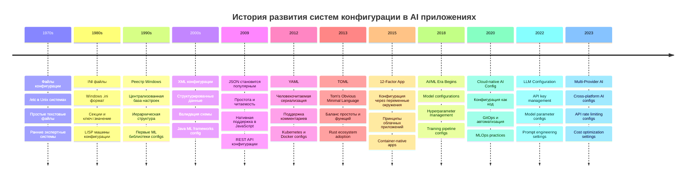
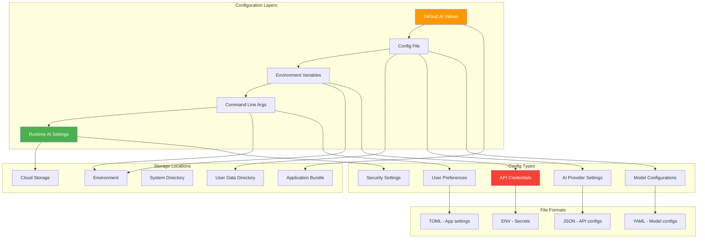
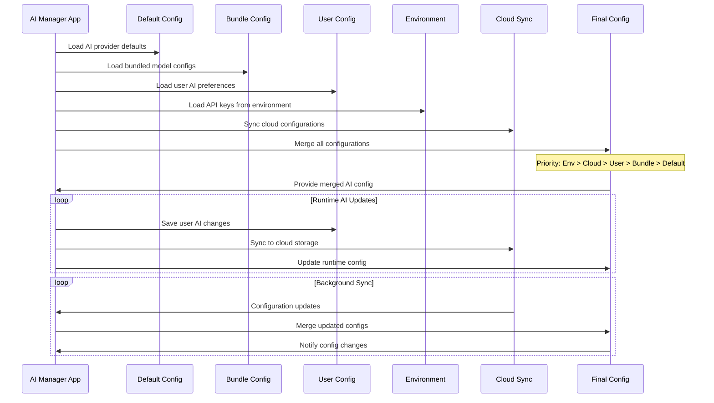
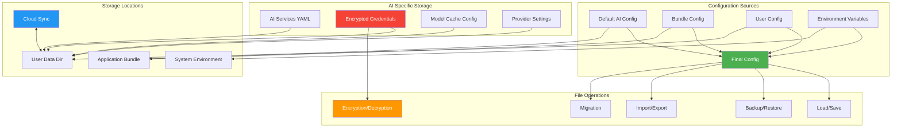

# Урок 6: Управление Конфигурацией и Данными в AI Manager

## 🎯 Цели урока

К концу этого урока вы будете понимать:
- Принципы управления конфигурацией в AI приложениях
- Стратегии хранения и миграции данных AI сервисов
- Кроссплатформенное управление файлами и путями
- Версионирование конфигураций и обратная совместимость
- Паттерны для работы с пользовательскими настройками AI провайдеров
- Безопасное хранение API ключей и credentials

## 📚 Историческая справка

### Эволюция систем конфигурации в AI контексте



### Принципы 12-Factor App для AI приложений

**12-Factor App** определяет лучшие практики, особенно актуальные для AI приложений:

1. **Codebase** - одна кодовая база, много развертываний (AI models отдельно)
2. **Dependencies** - явно объявленные зависимости (PyTorch, TensorFlow)
3. **Config** - конфигурация в переменных окружения (API keys, endpoints)
4. **Backing services** - внешние сервисы как ресурсы (OpenAI, Anthropic APIs)
5. **Build, release, run** - строгое разделение этапов (model training/inference)
6. **Processes** - приложение как один или несколько процессов
7. **Port binding** - экспорт сервисов через порты
8. **Concurrency** - масштабирование через модель процессов (AI workers)
9. **Disposability** - быстрый запуск и корректное завершение
10. **Dev/prod parity** - среды максимально похожи
11. **Logs** - логи как потоки событий (ML metrics logging)
12. **Admin processes** - административные задачи как разовые процессы

## 🏗️ Архитектура системы конфигурации AI Manager

### Многоуровневая система настроек для AI



### Жизненный цикл конфигурации AI Manager



## 💻 Реализация системы конфигурации AI Manager

### Базовый менеджер конфигурации для AI

```python
import os
import json
import sys
import shutil
from pathlib import Path
from typing import Dict, Any, Optional, Union, List
from dataclasses import dataclass, asdict
from datetime import datetime
import logging
from enum import Enum
import yaml
from cryptography.fernet import Fernet
import base64

class AIProvider(Enum):
    """Поддерживаемые AI провайдеры."""
    OPENAI = "openai"
    ANTHROPIC = "anthropic"
    GOOGLE = "google"
    AZURE_OPENAI = "azure_openai"
    LOCAL = "local"

@dataclass
class AIServiceConfig:
    """Конфигурация AI сервиса."""
    provider: str
    name: str
    model: str
    api_endpoint: str
    max_tokens: int = 4000
    temperature: float = 0.7
    timeout: int = 30
    retry_attempts: int = 3
    cost_per_1k_tokens: float = 0.0
    enabled: bool = True
    rate_limit_rpm: int = 60  # requests per minute
    rate_limit_tpm: int = 90000  # tokens per minute

@dataclass
class AppInfo:
    """Информация о AI Manager приложении."""
    name: str
    version: str
    developer: str
    last_updated: str
    build_date: str
    supported_providers: List[str]

@dataclass
class UISettings:
    """Настройки пользовательского интерфейса."""
    theme: str = "light"
    scale: int = 100
    language: str = "ru"
    auto_start: bool = False
    save_chat_history: bool = True
    show_token_usage: bool = True
    default_provider: str = "openai"

@dataclass
class SecuritySettings:
    """Настройки безопасности."""
    auto_lock_timeout: int = 300
    require_password: bool = False
    encrypt_exports: bool = True
    mask_api_keys: bool = True
    log_api_calls: bool = False
    secure_memory: bool = True

@dataclass
class AdvancedSettings:
    """Продвинутые настройки."""
    log_level: str = "INFO"
    debug_mode: bool = False
    performance_monitoring: bool = False
    cache_responses: bool = True
    cache_ttl_hours: int = 24
    concurrent_requests: int = 5
    backup_frequency_hours: int = 6

class AIConfigurationManager:
    """Менеджер конфигурации AI Manager приложения."""
    
    def __init__(self, app_name: str = "AIManager"):
        self.app_name = app_name
        self.logger = logging.getLogger(__name__)
        
        # Определяем пути
        self.app_data_dir = self._get_app_data_dir()
        self.config_file = self.app_data_dir / 'config.json'
        self.ai_services_file = self.app_data_dir / 'ai_services.yaml'
        self.credentials_file = self.app_data_dir / 'credentials.enc'
        self.backup_dir = self.app_data_dir / 'backups'
        
        # Инициализируем шифрование для credentials
        self.encryption_key = self._get_or_create_encryption_key()
        self.cipher = Fernet(self.encryption_key)
        
        # Конфигурации по уровням
        self.default_config = self._get_default_config()
        self.bundle_config = self._load_bundle_config()
        self.user_config = self._load_user_config()
        self.env_config = self._load_env_config()
        
        # AI сервисы
        self.ai_services = self._load_ai_services()
        self.credentials = self._load_credentials()
        
        # Финальная конфигурация
        self.final_config = self._merge_configs()
        
        # Создаем необходимые директории
        self._ensure_directories()
    
    def _get_app_data_dir(self) -> Path:
        """Определяет директорию для данных AI Manager приложения."""
        is_frozen = getattr(sys, 'frozen', False)
        
        if is_frozen:
            # Собранное приложение
            if sys.platform == 'darwin':  # macOS
                return Path.home() / 'Library' / 'Application Support' / self.app_name
            elif sys.platform == 'win32':  # Windows
                appdata = os.environ.get('APPDATA', str(Path.home()))
                return Path(appdata) / self.app_name
            else:  # Linux
                return Path.home() / '.local' / 'share' / self.app_name
        else:
            # Режим разработки
            return Path.cwd() / 'data'
    
    def _get_or_create_encryption_key(self) -> bytes:
        """Получает или создает ключ шифрования для credentials."""
        key_file = self.app_data_dir / '.key'
        
        if key_file.exists():
            try:
                with open(key_file, 'rb') as f:
                    return f.read()
            except Exception as e:
                self.logger.warning(f"Не удалось загрузить ключ шифрования: {e}")
        
        # Создаем новый ключ
        key = Fernet.generate_key()
        
        try:
            # Создаем директорию если не существует
            key_file.parent.mkdir(parents=True, exist_ok=True)
            
            with open(key_file, 'wb') as f:
                f.write(key)
            
            # Устанавливаем права доступа только для владельца
            if os.name != 'nt':  # Unix-like системы
                os.chmod(key_file, 0o600)
            
            self.logger.info("Создан новый ключ шифрования для credentials")
            
        except Exception as e:
            self.logger.error(f"Не удалось сохранить ключ шифрования: {e}")
            # Возвращаем временный ключ в памяти
        
        return key
    
    def _get_default_config(self) -> Dict[str, Any]:
        """Возвращает конфигурацию по умолчанию для AI Manager."""
        return {
            'app_info': asdict(AppInfo(
                name=self.app_name,
                version='4.0.0',
                developer='AI Manager Team',
                last_updated=datetime.now().isoformat(),
                build_date=datetime.now().isoformat(),
                supported_providers=[provider.value for provider in AIProvider]
            )),
            'ui_settings': asdict(UISettings()),
            'security': asdict(SecuritySettings()),
            'advanced': asdict(AdvancedSettings())
        }
    
    def _load_bundle_config(self) -> Optional[Dict[str, Any]]:
        """Загружает конфигурацию из бандла приложения."""
        is_frozen = getattr(sys, 'frozen', False)
        
        if is_frozen:
            try:
                # В собранном приложении конфиг находится в ресурсах
                bundle_path = Path(sys._MEIPASS) / 'config.json'
                if bundle_path.exists():
                    return self._load_json_file(bundle_path)
            except Exception as e:
                self.logger.warning(f"Не удалось загрузить bundle config: {e}")
        else:
            # В режиме разработки ищем в корне проекта
            bundle_path = Path.cwd() / 'config.json'
            if bundle_path.exists():
                return self._load_json_file(bundle_path)
        
        return None
    
    def _load_user_config(self) -> Optional[Dict[str, Any]]:
        """Загружает пользовательскую конфигурацию."""
        if self.config_file.exists():
            return self._load_json_file(self.config_file)
        return None
    
    def _load_env_config(self) -> Dict[str, Any]:
        """Загружает конфигурацию из переменных окружения."""
        env_config = {}
        
        # Маппинг переменных окружения на конфигурацию AI Manager
        env_mappings = {
            'AI_MANAGER_THEME': ('ui_settings', 'theme'),
            'AI_MANAGER_DEBUG': ('advanced', 'debug_mode'),
            'AI_MANAGER_LOG_LEVEL': ('advanced', 'log_level'),
            'AI_MANAGER_SCALE': ('ui_settings', 'scale'),
            'AI_MANAGER_DEFAULT_PROVIDER': ('ui_settings', 'default_provider'),
            'AI_MANAGER_CACHE_TTL': ('advanced', 'cache_ttl_hours'),
            'AI_MANAGER_CONCURRENT_REQUESTS': ('advanced', 'concurrent_requests'),
            'AI_MANAGER_AUTO_LOCK_TIMEOUT': ('security', 'auto_lock_timeout'),
            'AI_MANAGER_REQUIRE_PASSWORD': ('security', 'require_password'),
        }
        
        for env_var, (section, key) in env_mappings.items():
            value = os.environ.get(env_var)
            if value is not None:
                if section not in env_config:
                    env_config[section] = {}
                
                # Преобразуем типы
                if key in ['debug_mode', 'auto_start', 'encrypt_exports', 
                          'require_password', 'cache_responses', 'performance_monitoring']:
                    env_config[section][key] = value.lower() in ('true', '1', 'yes')
                elif key in ['scale', 'auto_lock_timeout', 'cache_ttl_hours', 'concurrent_requests']:
                    try:
                        env_config[section][key] = int(value)
                    except ValueError:
                        self.logger.warning(f"Некорректное значение {env_var}: {value}")
                else:
                    env_config[section][key] = value
        
        return env_config
    
    def _load_ai_services(self) -> Dict[str, AIServiceConfig]:
        """Загружает конфигурации AI сервисов."""
        services = {}
        
        if self.ai_services_file.exists():
            try:
                with open(self.ai_services_file, 'r', encoding='utf-8') as f:
                    services_data = yaml.safe_load(f) or {}
                
                for service_id, service_data in services_data.items():
                    try:
                        services[service_id] = AIServiceConfig(**service_data)
                    except Exception as e:
                        self.logger.error(f"Ошибка загрузки сервиса {service_id}: {e}")
                        
            except Exception as e:
                self.logger.error(f"Ошибка загрузки AI сервисов: {e}")
        
        # Если нет сохраненных сервисов, создаем по умолчанию
        if not services:
            services = self._create_default_ai_services()
            self._save_ai_services(services)
        
        return services
    
    def _create_default_ai_services(self) -> Dict[str, AIServiceConfig]:
        """Создает AI сервисы по умолчанию."""
        default_services = {
            'openai_gpt4': AIServiceConfig(
                provider=AIProvider.OPENAI.value,
                name='OpenAI GPT-4',
                model='gpt-4',
                api_endpoint='https://api.openai.com/v1/chat/completions',
                max_tokens=4000,
                temperature=0.7,
                cost_per_1k_tokens=0.03,
                rate_limit_rpm=60,
                rate_limit_tpm=90000
            ),
            'openai_gpt35': AIServiceConfig(
                provider=AIProvider.OPENAI.value,
                name='OpenAI GPT-3.5 Turbo',
                model='gpt-3.5-turbo',
                api_endpoint='https://api.openai.com/v1/chat/completions',
                max_tokens=4000,
                temperature=0.7,
                cost_per_1k_tokens=0.002,
                rate_limit_rpm=100,
                rate_limit_tpm=150000
            ),
            'anthropic_claude3': AIServiceConfig(
                provider=AIProvider.ANTHROPIC.value,
                name='Anthropic Claude 3',
                model='claude-3-sonnet-20240229',
                api_endpoint='https://api.anthropic.com/v1/messages',
                max_tokens=4000,
                temperature=0.7,
                cost_per_1k_tokens=0.015,
                rate_limit_rpm=50,
                rate_limit_tpm=100000
            ),
            'google_gemini': AIServiceConfig(
                provider=AIProvider.GOOGLE.value,
                name='Google Gemini Pro',
                model='gemini-pro',
                api_endpoint='https://generativelanguage.googleapis.com/v1/models',
                max_tokens=2048,
                temperature=0.7,
                cost_per_1k_tokens=0.001,
                rate_limit_rpm=60,
                rate_limit_tpm=120000
            )
        }
        
        return default_services
    
    def _load_credentials(self) -> Dict[str, str]:
        """Загружает зашифрованные credentials."""
        if not self.credentials_file.exists():
            return {}
        
        try:
            with open(self.credentials_file, 'rb') as f:
                encrypted_data = f.read()
            
            decrypted_data = self.cipher.decrypt(encrypted_data)
            credentials = json.loads(decrypted_data.decode('utf-8'))
            
            self.logger.info(f"Загружено {len(credentials)} credentials")
            return credentials
            
        except Exception as e:
            self.logger.error(f"Ошибка загрузки credentials: {e}")
            return {}
    
    def _save_credentials(self, credentials: Dict[str, str]):
        """Сохраняет зашифрованные credentials."""
        try:
            # Создаем резервную копию если файл существует
            if self.credentials_file.exists():
                backup_path = self.credentials_file.with_suffix('.enc.backup')
                shutil.copy2(self.credentials_file, backup_path)
            
            # Шифруем и сохраняем
            json_data = json.dumps(credentials, indent=2)
            encrypted_data = self.cipher.encrypt(json_data.encode('utf-8'))
            
            with open(self.credentials_file, 'wb') as f:
                f.write(encrypted_data)
            
            # Устанавливаем права доступа
            if os.name != 'nt':
                os.chmod(self.credentials_file, 0o600)
            
            self.logger.info(f"Сохранено {len(credentials)} credentials")
            
        except Exception as e:
            self.logger.error(f"Ошибка сохранения credentials: {e}")
            raise
    
    def _save_ai_services(self, services: Dict[str, AIServiceConfig]):
        """Сохраняет конфигурации AI сервисов."""
        try:
            # Создаем резервную копию
            if self.ai_services_file.exists():
                backup_path = self.ai_services_file.with_suffix('.yaml.backup')
                shutil.copy2(self.ai_services_file, backup_path)
            
            # Конвертируем в словарь для сериализации
            services_data = {
                service_id: asdict(service_config) 
                for service_id, service_config in services.items()
            }
            
            with open(self.ai_services_file, 'w', encoding='utf-8') as f:
                yaml.dump(services_data, f, default_flow_style=False, allow_unicode=True)
            
            self.logger.info(f"Сохранено {len(services)} AI сервисов")
            
        except Exception as e:
            self.logger.error(f"Ошибка сохранения AI сервисов: {e}")
            raise
    
    def _load_json_file(self, file_path: Path) -> Optional[Dict[str, Any]]:
        """Безопасно загружает JSON файл."""
        try:
            with open(file_path, 'r', encoding='utf-8') as f:
                return json.load(f)
        except (json.JSONDecodeError, IOError) as e:
            self.logger.error(f"Ошибка загрузки {file_path}: {e}")
            return None
    
    def _merge_configs(self) -> Dict[str, Any]:
        """Объединяет конфигурации с приоритетом."""
        # Базовая конфигурация
        config = self.default_config.copy()
        
        # Применяем конфигурации по приоритету
        configs_to_merge = [
            self.bundle_config,
            self.user_config,
            self.env_config
        ]
        
        for cfg in configs_to_merge:
            if cfg:
                config = self._deep_merge(config, cfg)
        
        return config
    
    def _deep_merge(self, base: Dict[str, Any], override: Dict[str, Any]) -> Dict[str, Any]:
        """Глубоко объединяет словари."""
        result = base.copy()
        
        for key, value in override.items():
            if key in result and isinstance(result[key], dict) and isinstance(value, dict):
                result[key] = self._deep_merge(result[key], value)
            else:
                result[key] = value
        
        return result
    
    def _ensure_directories(self):
        """Создает необходимые директории."""
        directories = [
            self.app_data_dir,
            self.backup_dir,
            self.app_data_dir / 'logs',
            self.app_data_dir / 'cache',
            self.app_data_dir / 'exports'
        ]
        
        for directory in directories:
            directory.mkdir(parents=True, exist_ok=True)
    
    def get(self, key_path: str, default: Any = None) -> Any:
        """
        Получает значение по пути ключа.
        
        Args:
            key_path: Путь к ключу через точку (например, 'ui_settings.theme')
            default: Значение по умолчанию
            
        Returns:
            Значение конфигурации
        """
        keys = key_path.split('.')
        value = self.final_config
        
        for key in keys:
            if isinstance(value, dict) and key in value:
                value = value[key]
            else:
                return default
        
        return value
    
    def set(self, key_path: str, value: Any, save: bool = True):
        """
        Устанавливает значение по пути ключа.
        
        Args:
            key_path: Путь к ключу через точку
            value: Новое значение
            save: Сохранить изменения в файл
        """
        keys = key_path.split('.')
        target = self.final_config
        
        # Навигируем до предпоследнего ключа
        for key in keys[:-1]:
            if key not in target:
                target[key] = {}
            target = target[key]
        
        # Устанавливаем значение
        target[keys[-1]] = value
        
        if save:
            self.save_user_config()
    
    def add_ai_service(self, service_id: str, service_config: AIServiceConfig):
        """Добавляет новый AI сервис."""
        self.ai_services[service_id] = service_config
        self._save_ai_services(self.ai_services)
        self.logger.info(f"Добавлен AI сервис: {service_id}")
    
    def remove_ai_service(self, service_id: str) -> bool:
        """Удаляет AI сервис."""
        if service_id in self.ai_services:
            del self.ai_services[service_id]
            self._save_ai_services(self.ai_services)
            self.logger.info(f"Удален AI сервис: {service_id}")
            return True
        return False
    
    def get_ai_service(self, service_id: str) -> Optional[AIServiceConfig]:
        """Получает конфигурацию AI сервиса."""
        return self.ai_services.get(service_id)
    
    def get_all_ai_services(self) -> Dict[str, AIServiceConfig]:
        """Получает все AI сервисы."""
        return self.ai_services.copy()
    
    def get_enabled_ai_services(self) -> Dict[str, AIServiceConfig]:
        """Получает только включенные AI сервисы."""
        return {
            service_id: service_config 
            for service_id, service_config in self.ai_services.items() 
            if service_config.enabled
        }
    
    def set_credential(self, key: str, value: str):
        """Устанавливает credential (API ключ и т.д.)."""
        self.credentials[key] = value
        self._save_credentials(self.credentials)
        self.logger.info(f"Обновлен credential: {key}")
    
    def get_credential(self, key: str) -> Optional[str]:
        """Получает credential."""
        return self.credentials.get(key)
    
    def remove_credential(self, key: str) -> bool:
        """Удаляет credential."""
        if key in self.credentials:
            del self.credentials[key]
            self._save_credentials(self.credentials)
            self.logger.info(f"Удален credential: {key}")
            return True
        return False
    
    def get_credential_keys(self) -> List[str]:
        """Получает список ключей credentials."""
        return list(self.credentials.keys())
    
    def save_user_config(self):
        """Сохраняет пользовательскую конфигурацию."""
        try:
            # Создаем резервную копию если файл существует
            if self.config_file.exists():
                self._create_backup()
            
            # Фильтруем только пользовательские настройки
            user_settings = self._extract_user_settings()
            
            # Сохраняем с метаданными
            config_data = {
                'metadata': {
                    'version': '4.0',
                    'created_at': datetime.now().isoformat(),
                    'app_version': self.get('app_info.version', '4.0.0')
                },
                'settings': user_settings
            }
            
            with open(self.config_file, 'w', encoding='utf-8') as f:
                json.dump(config_data, f, indent=2, ensure_ascii=False)
            
            # Устанавливаем права доступа (только для владельца)
            if os.name != 'nt':
                os.chmod(self.config_file, 0o600)
            
            self.logger.info(f"Конфигурация сохранена: {self.config_file}")
            
        except Exception as e:
            self.logger.error(f"Ошибка сохранения конфигурации: {e}")
            raise
    
    def _extract_user_settings(self) -> Dict[str, Any]:
        """Извлекает только пользовательские настройки."""
        # Исключаем системные секции, которые не должны изменяться пользователем
        system_sections = {'app_info'}
        
        user_settings = {}
        for section, values in self.final_config.items():
            if section not in system_sections:
                user_settings[section] = values
        
        return user_settings
    
    def _create_backup(self):
        """Создает резервную копию конфигурации."""
        timestamp = datetime.now().strftime('%Y%m%d_%H%M%S')
        backup_file = self.backup_dir / f'config_backup_{timestamp}.json'
        
        try:
            shutil.copy2(self.config_file, backup_file)
            
            # Ограничиваем количество резервных копий
            self._cleanup_old_backups(max_backups=10)
            
        except Exception as e:
            self.logger.warning(f"Не удалось создать резервную копию: {e}")
    
    def _cleanup_old_backups(self, max_backups: int):
        """Удаляет старые резервные копии."""
        backup_files = list(self.backup_dir.glob('config_backup_*.json'))
        backup_files.sort(key=lambda x: x.stat().st_mtime, reverse=True)
        
        for old_backup in backup_files[max_backups:]:
            try:
                old_backup.unlink()
            except Exception as e:
                self.logger.warning(f"Не удалось удалить старую резервную копию {old_backup}: {e}")
    
    def export_config(self, file_path: Path, include_credentials: bool = False):
        """Экспортирует конфигурацию в файл."""
        export_data = {
            'metadata': {
                'exported_at': datetime.now().isoformat(),
                'app_version': self.get('app_info.version'),
                'export_version': '4.0',
                'includes_credentials': include_credentials
            },
            'config': self._extract_user_settings(),
            'ai_services': {
                service_id: asdict(service_config) 
                for service_id, service_config in self.ai_services.items()
            }
        }
        
        # Добавляем credentials если запрошено
        if include_credentials:
            export_data['credentials'] = self.credentials.copy()
        
        with open(file_path, 'w', encoding='utf-8') as f:
            json.dump(export_data, f, indent=2, ensure_ascii=False)
        
        self.logger.info(f"Конфигурация экспортирована: {file_path}")
    
    def import_config(self, file_path: Path, merge: bool = True):
        """Импортирует конфигурацию из файла."""
        with open(file_path, 'r', encoding='utf-8') as f:
            import_data = json.load(f)
        
        # Импортируем основную конфигурацию
        imported_config = import_data.get('config', {})
        if merge:
            self.final_config = self._deep_merge(self.final_config, imported_config)
        else:
            # Полная замена пользовательских настроек
            for section, values in imported_config.items():
                self.final_config[section] = values
        
        # Импортируем AI сервисы
        imported_services = import_data.get('ai_services', {})
        for service_id, service_data in imported_services.items():
            try:
                self.ai_services[service_id] = AIServiceConfig(**service_data)
            except Exception as e:
                self.logger.error(f"Ошибка импорта AI сервиса {service_id}: {e}")
        
        # Импортируем credentials если есть
        imported_credentials = import_data.get('credentials', {})
        if imported_credentials:
            if merge:
                self.credentials.update(imported_credentials)
            else:
                self.credentials = imported_credentials
            self._save_credentials(self.credentials)
        
        # Сохраняем изменения
        self.save_user_config()
        self._save_ai_services(self.ai_services)
        
        self.logger.info(f"Конфигурация импортирована: {file_path}")
    
    def reset_to_defaults(self, section: Optional[str] = None):
        """Сбрасывает конфигурацию к значениям по умолчанию."""
        if section:
            if section in self.default_config:
                self.final_config[section] = self.default_config[section].copy()
        else:
            self.final_config = self.default_config.copy()
            # Также сбрасываем AI сервисы
            self.ai_services = self._create_default_ai_services()
            self._save_ai_services(self.ai_services)
        
        self.save_user_config()
        self.logger.info(f"Конфигурация сброшена к значениям по умолчанию: {section or 'все'}")
    
    def validate_config(self) -> Dict[str, Any]:
        """Валидирует конфигурацию и возвращает отчет."""
        issues = []
        
        # Проверяем обязательные секции
        required_sections = ['app_info', 'ui_settings', 'security', 'advanced']
        for section in required_sections:
            if section not in self.final_config:
                issues.append(f"Отсутствует обязательная секция: {section}")
        
        # Проверяем типы данных
        type_checks = {
            ('ui_settings', 'scale'): int,
            ('ui_settings', 'auto_start'): bool,
            ('security', 'auto_lock_timeout'): int,
            ('security', 'require_password'): bool,
            ('advanced', 'debug_mode'): bool,
            ('advanced', 'cache_ttl_hours'): int,
            ('advanced', 'concurrent_requests'): int,
        }
        
        for (section, key), expected_type in type_checks.items():
            value = self.get(f"{section}.{key}")
            if value is not None and not isinstance(value, expected_type):
                issues.append(f"Неверный тип для {section}.{key}: ожидается {expected_type.__name__}")
        
        # Проверяем диапазоны значений
        range_checks = {
            ('ui_settings', 'scale'): (50, 200),
            ('security', 'auto_lock_timeout'): (0, 3600),
            ('advanced', 'cache_ttl_hours'): (1, 168),  # 1 час - 1 неделя
            ('advanced', 'concurrent_requests'): (1, 20),
        }
        
        for (section, key), (min_val, max_val) in range_checks.items():
            value = self.get(f"{section}.{key}")
            if value is not None and not (min_val <= value <= max_val):
                issues.append(f"Значение {section}.{key} вне допустимого диапазона: {min_val}-{max_val}")
        
        # Валидируем AI сервисы
        for service_id, service_config in self.ai_services.items():
            if not service_config.name:
                issues.append(f"AI сервис {service_id} без имени")
            
            if not service_config.api_endpoint:
                issues.append(f"AI сервис {service_id} без API endpoint")
            
            if service_config.max_tokens <= 0:
                issues.append(f"AI сервис {service_id} имеет некорректный max_tokens")
            
            if not (0.0 <= service_config.temperature <= 2.0):
                issues.append(f"AI сервис {service_id} имеет некорректную temperature")
        
        # Проверяем наличие credentials для включенных сервисов
        enabled_providers = {service.provider for service in self.ai_services.values() if service.enabled}
        
        for provider in enabled_providers:
            if provider != AIProvider.LOCAL.value:  # Локальные модели не требуют API ключей
                credential_key = f"{provider}_api_key"
                if not self.get_credential(credential_key):
                    issues.append(f"Отсутствует API ключ для {provider}: {credential_key}")
        
        return {
            'valid': len(issues) == 0,
            'issues': issues,
            'checked_at': datetime.now().isoformat(),
            'ai_services_count': len(self.ai_services),
            'enabled_services_count': len([s for s in self.ai_services.values() if s.enabled]),
            'credentials_count': len(self.credentials)
        }
    
    def get_stats(self) -> Dict[str, Any]:
        """Возвращает статистику конфигурации."""
        enabled_services = self.get_enabled_ai_services()
        
        return {
            'total_ai_services': len(self.ai_services),
            'enabled_ai_services': len(enabled_services),
            'providers_in_use': len(set(service.provider for service in enabled_services.values())),
            'total_credentials': len(self.credentials),
            'config_file_size_kb': self.config_file.stat().st_size / 1024 if self.config_file.exists() else 0,
            'last_modified': datetime.fromtimestamp(
                self.config_file.stat().st_mtime
            ).isoformat() if self.config_file.exists() else None,
            'app_data_dir': str(self.app_data_dir),
            'backup_count': len(list(self.backup_dir.glob('config_backup_*.json')))
        }

# Глобальный экземпляр менеджера конфигурации
config_manager = AIConfigurationManager()

# Функции для обратной совместимости
def get_config(key_path: str, default: Any = None) -> Any:
    """Получает значение конфигурации."""
    return config_manager.get(key_path, default)

def set_config(key_path: str, value: Any, save: bool = True):
    """Устанавливает значение конфигурации."""
    config_manager.set(key_path, value, save)

def save_config():
    """Сохраняет конфигурацию."""
    config_manager.save_user_config()

def get_ai_service(service_id: str) -> Optional[AIServiceConfig]:
    """Получает AI сервис."""
    return config_manager.get_ai_service(service_id)

def get_credential(key: str) -> Optional[str]:
    """Получает credential."""
    return config_manager.get_credential(key)

def set_credential(key: str, value: str):
    """Устанавливает credential."""
    config_manager.set_credential(key, value)

# Пример использования
def example_usage():
    """Пример использования AI Configuration Manager."""
    
    # Получение конфигурации
    theme = get_config('ui_settings.theme', 'light')
    print(f"Текущая тема: {theme}")
    
    # Настройка AI сервиса
    openai_service = get_ai_service('openai_gpt4')
    if openai_service:
        print(f"OpenAI сервис: {openai_service.name}, модель: {openai_service.model}")
    
    # Установка credentials
    api_key = os.environ.get('OPENAI_API_KEY')
    if api_key:
        set_credential('openai_api_key', api_key)
        print("OpenAI API ключ установлен")
    
    # Валидация конфигурации
    validation_result = config_manager.validate_config()
    if validation_result['valid']:
        print("✅ Конфигурация валидна")
    else:
        print("❌ Найдены проблемы в конфигурации:")
        for issue in validation_result['issues']:
            print(f"  - {issue}")
    
    # Статистика
    stats = config_manager.get_stats()
    print(f"\n📊 Статистика:")
    print(f"AI сервисов: {stats['total_ai_services']} (включено: {stats['enabled_ai_services']})")
    print(f"Провайдеров: {stats['providers_in_use']}")
    print(f"Credentials: {stats['total_credentials']}")

if __name__ == "__main__":
    example_usage()
```

## 🚀 Практические упражнения

### Упражнение 1: Система настроек AI провайдеров

Создайте систему настроек:
1. Конфигурация по умолчанию для различных AI провайдеров
2. Пользовательские настройки с переопределением
3. Переменные окружения для API ключей

### Упражнение 2: Миграция данных AI сервисов

Реализуйте:
1. Версионирование структуры данных AI сервисов
2. Автоматическую миграцию при обновлении приложения
3. Откат изменений при ошибках

### Упражнение 3: Кроссплатформенность AI Manager

Добавьте поддержку:
1. Разных ОС (Windows, macOS, Linux)
2. Портативного режима
3. Синхронизации конфигурации через облако

## 📊 Диаграмма системы конфигурации AI Manager



## 🌟 Лучшие практики конфигурации для AI

### 1. Принципы конфигурации AI сервисов

```python
# ✅ Хорошо - многоуровневая конфигурация с fallback
def get_ai_config(provider: str, model: str):
    config = merge_configs([
        default_ai_config[provider],
        user_ai_config.get(provider, {}),
        env_ai_config.get(provider, {}),
        runtime_overrides.get(provider, {})
    ])
    return config

# ❌ Плохо - жестко заданные значения
OPENAI_MODEL = "gpt-4"
ANTHROPIC_MODEL = "claude-3"
MAX_TOKENS = 4000
```

### 2. Безопасное хранение API ключей

```python
# ✅ Хорошо - шифрование credentials
class SecureCredentialManager:
    def __init__(self):
        self.cipher = Fernet(self.load_encryption_key())
    
    def store_api_key(self, provider: str, api_key: str):
        encrypted_key = self.cipher.encrypt(api_key.encode())
        self.save_encrypted_credential(f"{provider}_api_key", encrypted_key)
    
    def get_api_key(self, provider: str) -> str:
        encrypted_key = self.load_encrypted_credential(f"{provider}_api_key")
        return self.cipher.decrypt(encrypted_key).decode()

# ❌ Плохо - открытое хранение
def store_api_key(provider: str, api_key: str):
    with open('config.json', 'w') as f:
        json.dump({f"{provider}_api_key": api_key}, f)  # Попадет в Git
```

### 3. Валидация конфигурации AI

```python
# ✅ Хорошо - комплексная валидация
def validate_ai_service_config(config: AIServiceConfig) -> List[str]:
    issues = []
    
    # Проверка обязательных полей
    if not config.api_endpoint:
        issues.append("API endpoint не может быть пустым")
    
    # Проверка диапазонов
    if not (0.0 <= config.temperature <= 2.0):
        issues.append("Temperature должна быть между 0.0 и 2.0")
    
    if config.max_tokens <= 0:
        issues.append("Max tokens должен быть больше 0")
    
    # Проверка URL
    try:
        import validators
        if not validators.url(config.api_endpoint):
            issues.append("Некорректный URL API endpoint")
    except ImportError:
        pass
    
    return issues

# ❌ Плохо - отсутствие валидации
def save_ai_config(config):
    # Сохраняем без проверок
    save_to_file(config)
```

## 📚 Дополнительные материалы

### Полезные ссылки
- [The Twelve-Factor App](https://12factor.net/)
- [Python ConfigParser](https://docs.python.org/3/library/configparser.html)
- [YAML Specification](https://yaml.org/spec/)
- [Cryptography Library](https://cryptography.io/en/latest/)

### Форматы конфигурации для AI
- **YAML** - человекочитаемый, отлично для AI моделей
- **JSON** - простой, хорош для API конфигов
- **TOML** - читаемый и функциональный
- **Environment variables** - 12-factor approach для секретов

## 🎯 Контрольные вопросы

1. Какие уровни конфигурации должны быть в AI приложении?
2. Как безопасно хранить API ключи различных AI провайдеров?
3. Где хранить конфигурацию в разных операционных системах?
4. Как обеспечить миграцию при добавлении новых AI провайдеров?
5. Когда использовать переменные окружения vs файлы конфигурации?

## 🚀 Следующий урок

В следующем уроке мы изучим **PyWebView и создание нативного GUI для AI Manager**, научимся создавать кроссплатформенные десктопные приложения с веб-интерфейсом для управления AI сервисами.

---

*Этот урок является частью курса "AI Manager: Архитектура и принципы разработки гибридных приложений"*
