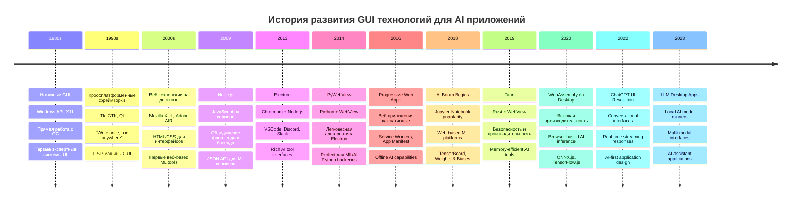
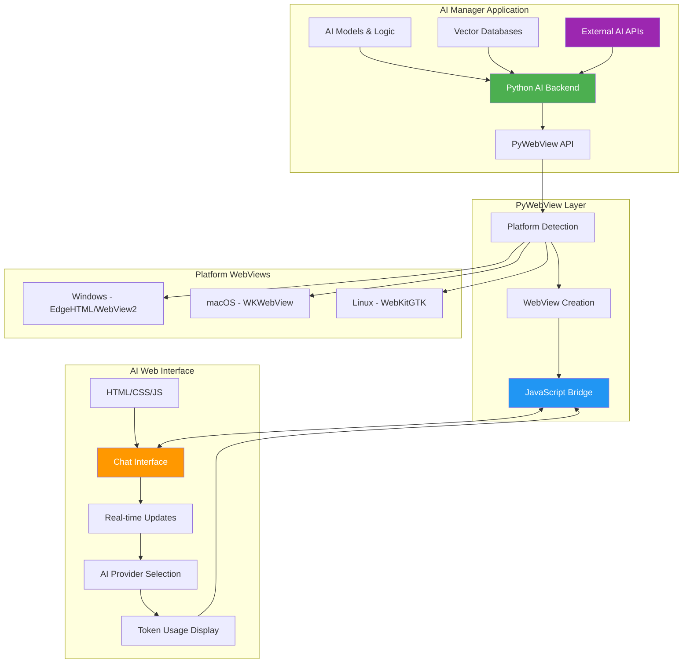
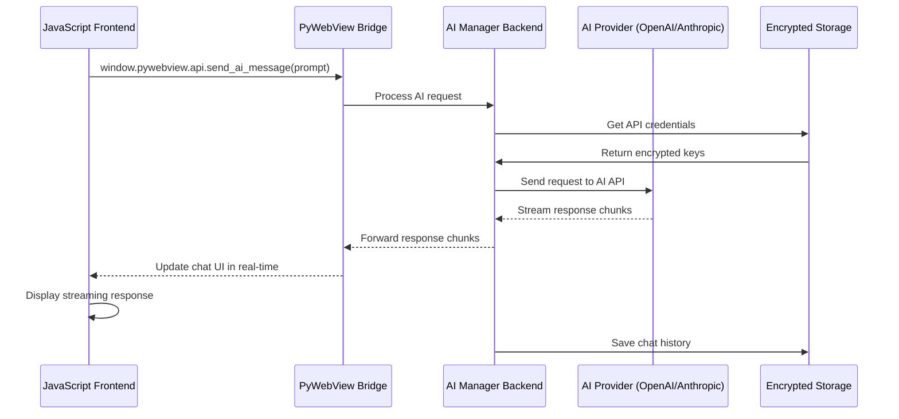
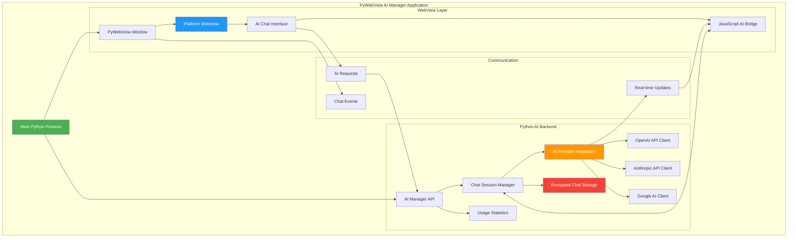

# Урок 7: PyWebView и Создание Нативного GUI для AI Manager

## 🎯 Цели урока

К концу этого урока вы будете понимать:
- Историю развития гибридных AI десктопных приложений
- Принципы работы PyWebView с AI интерфейсами
- Создание кроссплатформенных GUI для управления AI сервисами
- Взаимодействие между JavaScript и Python для AI операций
- Real-time обновления чатов и AI responses
- Упаковка и распространение AI Manager приложений

## 📚 Историческая справка

### Эволюция GUI технологий для AI приложений



### Сравнение подходов к AI GUI

| Подход | Преимущества для AI | Недостатки | Примеры AI Apps |
|--------|-------------------|------------|-----------------|
| **Нативный** | Максимальная производительность для inference, GPU access | Разная кодовая база для каждой ОС | Xcode ML, Visual Studio IntelliCode |
| **Кроссплатформенный** | Единая кодовая база, хорош для научных вычислений | Ограниченные возможности GPU | Spyder, PyCharm |
| **Веб-технологии** | Быстрая разработка AI UI, rich visualizations | Потребление ресурсов, GPU limitations | Jupyter Lab, Weights & Biases |
| **Гибридный (PyWebView)** | Баланс производительности и простоты, доступ к Python AI libs | Ограничения веб-движка | AI Manager, Local AI assistants |

## 🏗️ PyWebView: Концепции и архитектура для AI

### Принцип работы PyWebView в AI контексте



### Архитектура коммуникации для AI операций



## 💻 Создание PyWebView приложения для AI Manager

### Базовая структура AI Manager приложения

```python
import webview
import threading
import time
import sys
import json
import asyncio
from pathlib import Path
from typing import Dict, List, Any, Optional
from dataclasses import dataclass, asdict
from datetime import datetime
import logging

@dataclass
class ChatMessage:
    """Структура сообщения в чате."""
    id: str
    role: str  # 'user', 'assistant', 'system'
    content: str
    timestamp: datetime
    provider: str = ""
    model: str = ""
    tokens_used: int = 0
    cost: float = 0.0

@dataclass
class ChatSession:
    """Структура сессии чата."""
    id: str
    title: str
    messages: List[ChatMessage]
    created_at: datetime
    updated_at: datetime
    provider: str = ""
    model: str = ""
    total_tokens: int = 0
    total_cost: float = 0.0

class AIManagerAPI:
    """API для взаимодействия между JavaScript и Python в AI Manager."""
    
    def __init__(self):
        self.logger = logging.getLogger(__name__)
        self.chat_sessions: Dict[str, ChatSession] = {}
        self.current_session_id: Optional[str] = None
        
        # Симуляция AI сервисов (в реальном приложении загружаются из конфигурации)
        self.ai_services = {
            'openai_gpt4': {
                'name': 'OpenAI GPT-4',
                'provider': 'openai',
                'model': 'gpt-4',
                'enabled': True,
                'cost_per_1k_tokens': 0.03
            },
            'anthropic_claude3': {
                'name': 'Claude 3 Sonnet',
                'provider': 'anthropic',
                'model': 'claude-3-sonnet-20240229',
                'enabled': True,
                'cost_per_1k_tokens': 0.015
            },
            'openai_gpt35': {
                'name': 'OpenAI GPT-3.5 Turbo',
                'provider': 'openai',
                'model': 'gpt-3.5-turbo',
                'enabled': True,
                'cost_per_1k_tokens': 0.002
            }
        }
        
        # Загружаем существующие сессии
        self._load_chat_sessions()
    
    def get_ai_services(self) -> List[Dict[str, Any]]:
        """Получает список доступных AI сервисов."""
        return [
            {
                'id': service_id,
                **service_data
            }
            for service_id, service_data in self.ai_services.items()
            if service_data.get('enabled', False)
        ]
    
    def create_chat_session(self, title: str = None, provider: str = "openai_gpt4") -> Dict[str, Any]:
        """Создает новую сессию чата."""
        import uuid
        
        session_id = str(uuid.uuid4())
        now = datetime.now()
        
        if not title:
            title = f"Чат {now.strftime('%d.%m.%Y %H:%M')}"
        
        session = ChatSession(
            id=session_id,
            title=title,
            messages=[],
            created_at=now,
            updated_at=now,
            provider=provider
        )
        
        self.chat_sessions[session_id] = session
        self.current_session_id = session_id
        
        self.logger.info(f"Создана новая сессия чата: {session_id}")
        
        return {
            'session_id': session_id,
            'title': title,
            'status': 'success'
        }
    
    def get_chat_sessions(self) -> List[Dict[str, Any]]:
        """Получает список всех сессий чата."""
        return [
            {
                'id': session.id,
                'title': session.title,
                'created_at': session.created_at.isoformat(),
                'updated_at': session.updated_at.isoformat(),
                'provider': session.provider,
                'message_count': len(session.messages),
                'total_tokens': session.total_tokens,
                'total_cost': session.total_cost
            }
            for session in sorted(
                self.chat_sessions.values(), 
                key=lambda s: s.updated_at, 
                reverse=True
            )
        ]
    
    def get_chat_messages(self, session_id: str) -> List[Dict[str, Any]]:
        """Получает сообщения из сессии чата."""
        if session_id not in self.chat_sessions:
            return []
        
        session = self.chat_sessions[session_id]
        return [
            {
                'id': msg.id,
                'role': msg.role,
                'content': msg.content,
                'timestamp': msg.timestamp.isoformat(),
                'provider': msg.provider,
                'model': msg.model,
                'tokens_used': msg.tokens_used,
                'cost': msg.cost
            }
            for msg in session.messages
        ]
    
    def send_ai_message(self, session_id: str, message: str, provider: str = None) -> Dict[str, Any]:
        """Отправляет сообщение AI и получает ответ."""
        if session_id not in self.chat_sessions:
            return {'error': 'Сессия не найдена'}
        
        session = self.chat_sessions[session_id]
        
        # Используем провайдера из параметров или из сессии
        if provider:
            session.provider = provider
        elif not session.provider:
            session.provider = 'openai_gpt4'
        
        # Проверяем, что провайдер доступен
        if session.provider not in self.ai_services:
            return {'error': f'Провайдер {session.provider} недоступен'}
        
        service = self.ai_services[session.provider]
        
        try:
            # Добавляем пользовательское сообщение
            import uuid
            user_msg = ChatMessage(
                id=str(uuid.uuid4()),
                role='user',
                content=message,
                timestamp=datetime.now(),
                provider=session.provider,
                model=service['model']
            )
            session.messages.append(user_msg)
            
            # Симулируем отправку к AI провайдеру
            ai_response = self._simulate_ai_response(message, service)
            
            # Добавляем ответ AI
            ai_msg = ChatMessage(
                id=str(uuid.uuid4()),
                role='assistant',
                content=ai_response['content'],
                timestamp=datetime.now(),
                provider=session.provider,
                model=service['model'],
                tokens_used=ai_response['tokens_used'],
                cost=ai_response['cost']
            )
            session.messages.append(ai_msg)
            
            # Обновляем статистику сессии
            session.updated_at = datetime.now()
            session.total_tokens += ai_response['tokens_used']
            session.total_cost += ai_response['cost']
            
            # Сохраняем сессию
            self._save_chat_sessions()
            
            return {
                'status': 'success',
                'user_message': asdict(user_msg),
                'ai_message': asdict(ai_msg),
                'session_stats': {
                    'total_tokens': session.total_tokens,
                    'total_cost': session.total_cost
                }
            }
            
        except Exception as e:
            self.logger.error(f"Ошибка при отправке сообщения AI: {e}")
            return {'error': str(e)}
    
    def _simulate_ai_response(self, message: str, service: Dict[str, Any]) -> Dict[str, Any]:
        """Симулирует ответ от AI провайдера."""
        import random
        
        # Симуляция разного времени ответа для разных провайдеров
        if 'gpt-4' in service['model']:
            time.sleep(random.uniform(2.0, 4.0))
            response_length = random.randint(100, 500)
        elif 'claude' in service['model']:
            time.sleep(random.uniform(1.5, 3.0))
            response_length = random.randint(150, 600)
        else:  # gpt-3.5
            time.sleep(random.uniform(1.0, 2.0))
            response_length = random.randint(80, 400)
        
        # Генерируем симулированный ответ
        responses = [
            f"Интересный вопрос! Давайте разберем его подробнее. {message[:30]}...",
            f"На основе вашего запроса '{message[:20]}...', могу предложить следующее:",
            f"Отличный вопрос о '{message[:25]}...'. Вот что я думаю:",
            f"Относительно '{message[:30]}...' - это действительно важная тема.",
        ]
        
        base_response = random.choice(responses)
        
        # Добавляем контент до нужной длины
        content = base_response
        while len(content) < response_length:
            content += " Это важный аспект, который стоит рассмотреть детальнее."
        
        # Рассчитываем токены и стоимость
        tokens_used = random.randint(50, 300)
        cost = (tokens_used / 1000) * service['cost_per_1k_tokens']
        
        return {
            'content': content[:response_length],
            'tokens_used': tokens_used,
            'cost': round(cost, 4)
        }
    
    def delete_chat_session(self, session_id: str) -> Dict[str, Any]:
        """Удаляет сессию чата."""
        if session_id not in self.chat_sessions:
            return {'error': 'Сессия не найдена'}
        
        del self.chat_sessions[session_id]
        
        # Если это была текущая сессия, сбрасываем
        if self.current_session_id == session_id:
            self.current_session_id = None
        
        self._save_chat_sessions()
        
        return {'status': 'success'}
    
    def get_system_info(self) -> Dict[str, Any]:
        """Возвращает информацию о системе."""
        import platform
        import psutil
        
        return {
            "platform": platform.system(),
            "platform_version": platform.version(),
            "python_version": sys.version,
            "cpu_count": psutil.cpu_count(),
            "memory_gb": round(psutil.virtual_memory().total / (1024**3), 2),
            "ai_services_count": len(self.ai_services),
            "chat_sessions_count": len(self.chat_sessions),
            "current_directory": str(Path.cwd())
        }
    
    def export_chat_session(self, session_id: str) -> Dict[str, Any]:
        """Экспортирует сессию чата."""
        if session_id not in self.chat_sessions:
            return {'error': 'Сессия не найдена'}
        
        session = self.chat_sessions[session_id]
        
        export_data = {
            'session_info': {
                'id': session.id,
                'title': session.title,
                'created_at': session.created_at.isoformat(),
                'provider': session.provider,
                'total_tokens': session.total_tokens,
                'total_cost': session.total_cost
            },
            'messages': [asdict(msg) for msg in session.messages],
            'exported_at': datetime.now().isoformat(),
            'export_version': '1.0'
        }
        
        return {
            'status': 'success',
            'data': export_data,
            'filename': f"chat_export_{session.id[:8]}_{datetime.now().strftime('%Y%m%d_%H%M%S')}.json"
        }
    
    def get_usage_statistics(self) -> Dict[str, Any]:
        """Получает статистику использования."""
        total_messages = sum(len(session.messages) for session in self.chat_sessions.values())
        total_tokens = sum(session.total_tokens for session in self.chat_sessions.values())
        total_cost = sum(session.total_cost for session in self.chat_sessions.values())
        
        # Статистика по провайдерам
        provider_stats = {}
        for session in self.chat_sessions.values():
            provider = session.provider
            if provider not in provider_stats:
                provider_stats[provider] = {
                    'sessions': 0,
                    'messages': 0,
                    'tokens': 0,
                    'cost': 0.0
                }
            
            provider_stats[provider]['sessions'] += 1
            provider_stats[provider]['messages'] += len(session.messages)
            provider_stats[provider]['tokens'] += session.total_tokens
            provider_stats[provider]['cost'] += session.total_cost
        
        return {
            'total_sessions': len(self.chat_sessions),
            'total_messages': total_messages,
            'total_tokens': total_tokens,
            'total_cost': round(total_cost, 4),
            'provider_stats': provider_stats,
            'average_session_length': round(total_messages / len(self.chat_sessions), 1) if self.chat_sessions else 0
        }
    
    def _load_chat_sessions(self):
        """Загружает сохраненные сессии чата."""
        # В реальном приложении здесь была бы загрузка из зашифрованного файла
        # Пока используем пустую инициализацию
        pass
    
    def _save_chat_sessions(self):
        """Сохраняет сессии чата."""
        # В реальном приложении здесь было бы сохранение в зашифрованный файл
        pass
    
    def show_notification(self, title: str, message: str) -> Dict[str, Any]:
        """Показывает системное уведомление."""
        try:
            import plyer
            plyer.notification.notify(
                title=title,
                message=message,
                timeout=5
            )
            return {"status": "success"}
        except ImportError:
            return {"status": "error", "message": "plyer не установлен"}
    
    def minimize_window(self) -> Dict[str, Any]:
        """Сворачивает окно."""
        try:
        webview.windows[0].minimize()
        return {"status": "minimized"}
        except Exception as e:
            return {"status": "error", "message": str(e)}
    
    def toggle_fullscreen(self) -> Dict[str, Any]:
        """Переключает полноэкранный режим."""
        try:
        webview.windows[0].toggle_fullscreen()
        return {"status": "toggled"}
        except Exception as e:
            return {"status": "error", "message": str(e)}

def create_ai_manager_html():
    """Создает HTML содержимое для AI Manager."""
    return '''
    <!DOCTYPE html>
    <html lang="ru">
    <head>
        <meta charset="UTF-8">
        <meta name="viewport" content="width=device-width, initial-scale=1.0">
        <title>AI Manager - Управление AI Сервисами</title>
        <style>
            * {
                margin: 0;
                padding: 0;
                box-sizing: border-box;
            }
            
            body {
                font-family: -apple-system, BlinkMacSystemFont, 'Segoe UI', Roboto, sans-serif;
                background: linear-gradient(135deg, #667eea 0%, #764ba2 100%);
                color: #333;
                height: 100vh;
                overflow: hidden;
            }
            
            .app-container {
                display: grid;
                grid-template-columns: 280px 1fr;
                height: 100vh;
                background: white;
                margin: 10px;
                border-radius: 10px;
                box-shadow: 0 10px 30px rgba(0,0,0,0.2);
                overflow: hidden;
            }
            
            .sidebar {
                background: #2d3748;
                color: white;
                padding: 20px;
                overflow-y: auto;
                border-right: 1px solid #4a5568;
            }
            
            .main-content {
                display: flex;
                flex-direction: column;
                height: 100vh;
                background: #f7fafc;
            }
            
            .chat-header {
                background: white;
                padding: 20px;
                border-bottom: 1px solid #e2e8f0;
                display: flex;
                justify-content: space-between;
                align-items: center;
            }
            
            .chat-area {
                flex: 1;
                padding: 20px;
                overflow-y: auto;
                background: #f7fafc;
                display: flex;
                flex-direction: column;
            }
            
            .chat-input-area {
                background: white;
                padding: 20px;
                border-top: 1px solid #e2e8f0;
            }
            
            .sidebar h2 {
                margin-bottom: 20px;
                color: #e2e8f0;
                font-size: 18px;
            }
            
            .sidebar-section {
                margin-bottom: 30px;
            }
            
            .sidebar-section h3 {
                color: #a0aec0;
                font-size: 14px;
                margin-bottom: 10px;
                text-transform: uppercase;
                letter-spacing: 0.5px;
            }
            
            .button {
                background: linear-gradient(45deg, #4299e1, #667eea);
                color: white;
                border: none;
                padding: 12px 20px;
                border-radius: 8px;
                cursor: pointer;
                font-size: 14px;
                margin: 5px 0;
                width: 100%;
                transition: transform 0.2s, box-shadow 0.2s;
                display: flex;
                align-items: center;
                gap: 8px;
            }
            
            .button:hover {
                transform: translateY(-2px);
                box-shadow: 0 5px 15px rgba(0,0,0,0.2);
            }
            
            .button:disabled {
                background: #a0aec0;
                cursor: not-allowed;
                transform: none;
                box-shadow: none;
            }
            
            .button.secondary {
                background: transparent;
                border: 1px solid #4a5568;
                color: #e2e8f0;
            }
            
            .button.secondary:hover {
                background: #4a5568;
            }
            
            .chat-session {
                background: #4a5568;
                padding: 12px;
                margin: 5px 0;
                border-radius: 8px;
                cursor: pointer;
                transition: background 0.2s;
                border: 1px solid transparent;
            }
            
            .chat-session:hover {
                background: #718096;
            }
            
            .chat-session.active {
                background: #667eea;
                border-color: #4299e1;
            }
            
            .chat-session-title {
                font-weight: 600;
                margin-bottom: 4px;
            }
            
            .chat-session-meta {
                font-size: 12px;
                color: #a0aec0;
            }
            
            .ai-service-selector {
                margin-bottom: 20px;
            }
            
            .ai-service-selector select {
                width: 100%;
                padding: 10px;
                border: 1px solid #4a5568;
                border-radius: 6px;
                background: #2d3748;
                color: white;
                font-size: 14px;
            }
            
            .message {
                margin-bottom: 20px;
                padding: 15px;
                border-radius: 12px;
                max-width: 80%;
                word-wrap: break-word;
            }
            
            .message.user {
                background: #667eea;
                color: white;
                margin-left: auto;
                margin-right: 0;
            }
            
            .message.assistant {
                background: white;
                border: 1px solid #e2e8f0;
                margin-right: auto;
                margin-left: 0;
                box-shadow: 0 2px 4px rgba(0,0,0,0.1);
            }
            
            .message-header {
                display: flex;
                justify-content: space-between;
                align-items: center;
                margin-bottom: 8px;
                font-size: 12px;
                opacity: 0.8;
            }
            
            .message-content {
                line-height: 1.5;
            }
            
            .message-meta {
                margin-top: 8px;
                font-size: 11px;
                opacity: 0.7;
                display: flex;
                gap: 15px;
            }
            
            .chat-input {
                display: flex;
                gap: 10px;
                align-items: flex-end;
            }
            
            .chat-input textarea {
                flex: 1;
                padding: 12px;
                border: 2px solid #e2e8f0;
                border-radius: 8px;
                resize: vertical;
                min-height: 50px;
                max-height: 150px;
                font-family: inherit;
                font-size: 14px;
                transition: border-color 0.2s;
            }
            
            .chat-input textarea:focus {
                outline: none;
                border-color: #4299e1;
            }
            
            .send-button {
                background: #4299e1;
                color: white;
                border: none;
                padding: 12px 20px;
                border-radius: 8px;
                cursor: pointer;
                font-weight: 600;
                transition: background 0.2s;
            }
            
            .send-button:hover:not(:disabled) {
                background: #3182ce;
            }
            
            .send-button:disabled {
                background: #a0aec0;
                cursor: not-allowed;
            }
            
            .stats-panel {
                background: #1a202c;
                color: #e2e8f0;
                padding: 15px;
                border-radius: 8px;
                margin-top: 20px;
                font-size: 12px;
            }
            
            .stats-grid {
                display: grid;
                grid-template-columns: 1fr 1fr;
                gap: 10px;
            }
            
            .stat-item {
                text-align: center;
            }
            
            .stat-value {
                font-size: 18px;
                font-weight: bold;
                color: #4299e1;
            }
            
            .stat-label {
                color: #a0aec0;
            }
            
            .loading {
                display: inline-block;
                width: 20px;
                height: 20px;
                border: 3px solid #f3f3f3;
                border-top: 3px solid #4299e1;
                border-radius: 50%;
                animation: spin 1s linear infinite;
            }
            
            @keyframes spin {
                0% { transform: rotate(0deg); }
                100% { transform: rotate(360deg); }
            }
            
            .typing-indicator {
                display: flex;
                align-items: center;
                gap: 8px;
                padding: 15px;
                background: white;
                border-radius: 12px;
                margin-bottom: 20px;
                max-width: 80%;
                border: 1px solid #e2e8f0;
                box-shadow: 0 2px 4px rgba(0,0,0,0.1);
            }
            
            .typing-dots {
                display: flex;
                gap: 4px;
            }
            
            .typing-dot {
                width: 8px;
                height: 8px;
                background: #4299e1;
                border-radius: 50%;
                animation: typing 1.4s infinite ease-in-out;
            }
            
            .typing-dot:nth-child(1) { animation-delay: -0.32s; }
            .typing-dot:nth-child(2) { animation-delay: -0.16s; }
            
            @keyframes typing {
                0%, 80%, 100% { transform: scale(0.8); opacity: 0.5; }
                40% { transform: scale(1); opacity: 1; }
            }
            
            .window-controls {
                position: absolute;
                top: 15px;
                right: 15px;
                display: flex;
                gap: 5px;
                z-index: 1000;
            }
            
            .window-control {
                background: rgba(0,0,0,0.1);
                border: none;
                padding: 8px 12px;
                border-radius: 4px;
                cursor: pointer;
                color: #4a5568;
                backdrop-filter: blur(10px);
            }
            
            .window-control:hover {
                background: rgba(0,0,0,0.2);
            }
            
            .empty-state {
                flex: 1;
                display: flex;
                flex-direction: column;
                align-items: center;
                justify-content: center;
                text-align: center;
                color: #718096;
            }
            
            .empty-state h3 {
                margin-bottom: 10px;
                color: #4a5568;
            }
            
            .provider-badge {
                display: inline-block;
                background: #667eea;
                color: white;
                padding: 2px 8px;
                border-radius: 12px;
                font-size: 10px;
                margin-left: 8px;
            }
        </style>
    </head>
    <body>
        <div class="window-controls">
            <button class="window-control" onclick="minimizeWindow()" title="Свернуть">−</button>
            <button class="window-control" onclick="toggleFullscreen()" title="Полный экран">□</button>
        </div>
        
        <div class="app-container">
            <div class="sidebar">
                <h2>🤖 AI Manager</h2>
            
                <div class="sidebar-section">
                    <h3>Новый чат</h3>
                    <button class="button" onclick="createNewChat()">
                        ➕ Создать чат
                    </button>
                </div>
                
                <div class="sidebar-section">
                    <h3>AI Сервис</h3>
                    <div class="ai-service-selector">
                        <select id="aiServiceSelect" onchange="changeAIService()">
                            <!-- Заполняется через JavaScript -->
                        </select>
                    </div>
                </div>
                
                <div class="sidebar-section">
                    <h3>Сессии чатов</h3>
                    <div id="chatSessionsList">
                        <!-- Заполняется через JavaScript -->
                    </div>
            </div>
            
                <div class="sidebar-section">
                    <h3>Действия</h3>
                    <button class="button secondary" onclick="exportCurrentChat()">
                        💾 Экспорт чата
                    </button>
                    <button class="button secondary" onclick="showUsageStats()">
                        📊 Статистика
                    </button>
                    <button class="button secondary" onclick="deleteCurrentChat()">
                        🗑️ Удалить чат
                    </button>
            </div>
            
                <div class="stats-panel">
                    <h3 style="margin-bottom: 10px;">📈 Быстрая статистика</h3>
                    <div class="stats-grid">
                        <div class="stat-item">
                            <div class="stat-value" id="totalSessions">0</div>
                            <div class="stat-label">Сессий</div>
                        </div>
                        <div class="stat-item">
                            <div class="stat-value" id="totalTokens">0</div>
                            <div class="stat-label">Токенов</div>
                        </div>
                        <div class="stat-item">
                            <div class="stat-value" id="totalMessages">0</div>
                            <div class="stat-label">Сообщений</div>
                        </div>
                        <div class="stat-item">
                            <div class="stat-value" id="totalCost">$0</div>
                            <div class="stat-label">Стоимость</div>
                        </div>
                    </div>
                </div>
            </div>
            
            <div class="main-content">
                <div class="chat-header">
                    <div>
                        <h1 id="chatTitle">AI Manager</h1>
                        <p id="chatSubtitle">Выберите или создайте чат для начала работы</p>
                    </div>
                    <div id="currentProvider"></div>
                </div>
                
                <div class="chat-area" id="chatArea">
                    <div class="empty-state">
                        <h3>👋 Добро пожаловать в AI Manager!</h3>
                        <p>Создайте новый чат или выберите существующий для начала общения с AI.</p>
                    </div>
                </div>
                
                <div class="chat-input-area" id="chatInputArea" style="display: none;">
                    <div class="chat-input">
                        <textarea 
                            id="messageInput" 
                            placeholder="Введите ваше сообщение..."
                            onkeydown="handleKeyDown(event)"
                        ></textarea>
                        <button 
                            class="send-button" 
                            id="sendButton"
                            onclick="sendMessage()"
                        >
                            Отправить
                        </button>
                    </div>
                </div>
            </div>
        </div>
        
        <script>
            // Глобальные переменные
            let currentSessionId = null;
            let aiServices = [];
            let currentAIService = 'openai_gpt4';
            let isProcessing = false;
            
            // Инициализация при загрузке
            document.addEventListener('DOMContentLoaded', function() {
                console.log('AI Manager загружен');
                
                if (typeof window.pywebview !== 'undefined') {
                    initializeApp();
                } else {
                    console.warn('PyWebView API недоступен - работаем в режиме браузера');
                    showBrowserMode();
                }
            });
            
            async function initializeApp() {
                try {
                    // Загружаем доступные AI сервисы
                    aiServices = await window.pywebview.api.get_ai_services();
                    populateAIServiceSelector();
                    
                    // Загружаем сессии чатов
                    await loadChatSessions();
                    
                    // Обновляем статистику
                    await updateQuickStats();
                    
                    console.log('Приложение инициализировано');
                } catch (error) {
                    console.error('Ошибка инициализации:', error);
                }
            }
            
            function populateAIServiceSelector() {
                const selector = document.getElementById('aiServiceSelect');
                selector.innerHTML = '';
                
                aiServices.forEach(service => {
                    const option = document.createElement('option');
                    option.value = service.id;
                    option.textContent = service.name;
                    if (service.id === currentAIService) {
                        option.selected = true;
                    }
                    selector.appendChild(option);
                });
            }
            
            function changeAIService() {
                const selector = document.getElementById('aiServiceSelect');
                currentAIService = selector.value;
                
                const service = aiServices.find(s => s.id === currentAIService);
                if (service) {
                    updateCurrentProvider(service);
                }
            }
            
            function updateCurrentProvider(service) {
                const providerElement = document.getElementById('currentProvider');
                providerElement.innerHTML = `
                    <span class="provider-badge">${service.name}</span>
                `;
            }
            
            async function createNewChat() {
                try {
                    const result = await window.pywebview.api.create_chat_session('', currentAIService);
                    
                    if (result.status === 'success') {
                        currentSessionId = result.session_id;
                        await loadChatSessions();
                        await loadChatMessages(currentSessionId);
                        showChatInterface();
                        
                        document.getElementById('chatTitle').textContent = result.title;
                        document.getElementById('chatSubtitle').textContent = 'Новая сессия создана';
                    }
                } catch (error) {
                    console.error('Ошибка создания чата:', error);
                    alert('Ошибка создания нового чата');
                }
            }
            
            async function loadChatSessions() {
                try {
                    const sessions = await window.pywebview.api.get_chat_sessions();
                    displayChatSessions(sessions);
                } catch (error) {
                    console.error('Ошибка загрузки сессий:', error);
                }
            }
            
            function displayChatSessions(sessions) {
                const container = document.getElementById('chatSessionsList');
                
                if (sessions.length === 0) {
                    container.innerHTML = '<p style="color: #a0aec0; font-size: 12px;">Нет сохраненных чатов</p>';
                    return;
                }
                
                container.innerHTML = sessions.map(session => `
                    <div class="chat-session ${session.id === currentSessionId ? 'active' : ''}" 
                         onclick="selectChatSession('${session.id}')">
                        <div class="chat-session-title">${session.title}</div>
                        <div class="chat-session-meta">
                            ${session.message_count} сообщений • ${session.total_tokens} токенов
                        </div>
                    </div>
                `).join('');
            }
            
            async function selectChatSession(sessionId) {
                currentSessionId = sessionId;
                await loadChatMessages(sessionId);
                showChatInterface();
                
                // Обновляем активную сессию в списке
                document.querySelectorAll('.chat-session').forEach(el => {
                    el.classList.remove('active');
                });
                event.target.closest('.chat-session').classList.add('active');
                
                const sessions = await window.pywebview.api.get_chat_sessions();
                const session = sessions.find(s => s.id === sessionId);
                if (session) {
                    document.getElementById('chatTitle').textContent = session.title;
                    document.getElementById('chatSubtitle').textContent = 
                        `${session.message_count} сообщений • ${session.total_tokens} токенов • $${session.total_cost.toFixed(4)}`;
                }
            }
            
            async function loadChatMessages(sessionId) {
                try {
                    const messages = await window.pywebview.api.get_chat_messages(sessionId);
                    displayChatMessages(messages);
                } catch (error) {
                    console.error('Ошибка загрузки сообщений:', error);
                }
            }
            
            function displayChatMessages(messages) {
                const chatArea = document.getElementById('chatArea');
                
                if (messages.length === 0) {
                    chatArea.innerHTML = `
                        <div class="empty-state">
                            <h3>💬 Чат пуст</h3>
                            <p>Начните диалог, отправив первое сообщение AI.</p>
                        </div>
                    `;
                    return;
                }
                
                chatArea.innerHTML = messages.map(msg => {
                    const time = new Date(msg.timestamp).toLocaleTimeString();
                    return `
                        <div class="message ${msg.role}">
                            <div class="message-header">
                                <span>${msg.role === 'user' ? 'Вы' : 'AI'}</span>
                                <span>${time}</span>
                            </div>
                            <div class="message-content">${msg.content}</div>
                            ${msg.role === 'assistant' ? `
                                <div class="message-meta">
                                    <span>🤖 ${msg.model}</span>
                                    <span>🎯 ${msg.tokens_used} токенов</span>
                                    <span>💰 $${msg.cost.toFixed(4)}</span>
                                </div>
                            ` : ''}
                        </div>
                    `;
                }).join('');
                
                // Прокручиваем к последнему сообщению
                chatArea.scrollTop = chatArea.scrollHeight;
            }
            
            function showChatInterface() {
                document.getElementById('chatInputArea').style.display = 'block';
            }
            
            async function sendMessage() {
                if (!currentSessionId || isProcessing) {
                    return;
                }
                
                const messageInput = document.getElementById('messageInput');
                const message = messageInput.value.trim();
                
                if (!message) {
                    return;
                }
                
                // Отключаем интерфейс
                isProcessing = true;
                messageInput.disabled = true;
                document.getElementById('sendButton').disabled = true;
                
                // Очищаем поле ввода
                messageInput.value = '';
                
                try {
                    // Показываем индикатор печати
                    showTypingIndicator();
                    
                    // Отправляем сообщение
                    const result = await window.pywebview.api.send_ai_message(
                        currentSessionId, 
                        message, 
                        currentAIService
                    );
                    
                    // Скрываем индикатор печати
                    hideTypingIndicator();
                    
                    if (result.status === 'success') {
                        // Перезагружаем сообщения
                        await loadChatMessages(currentSessionId);
                        
                        // Обновляем статистику
                        await updateQuickStats();
                        await loadChatSessions();
                        
                        // Обновляем заголовок с новой статистикой
                        document.getElementById('chatSubtitle').textContent = 
                            `Токенов: ${result.session_stats.total_tokens} • Стоимость: $${result.session_stats.total_cost.toFixed(4)}`;
                    } else {
                        alert(`Ошибка: ${result.error}`);
            }
            
                } catch (error) {
                    hideTypingIndicator();
                    console.error('Ошибка отправки сообщения:', error);
                    alert('Ошибка отправки сообщения');
                } finally {
                    // Включаем интерфейс
                    isProcessing = false;
                    messageInput.disabled = false;
                    document.getElementById('sendButton').disabled = false;
                    messageInput.focus();
            }
            }
            
            function showTypingIndicator() {
                const chatArea = document.getElementById('chatArea');
                const indicator = document.createElement('div');
                indicator.id = 'typingIndicator';
                indicator.className = 'typing-indicator';
                indicator.innerHTML = `
                    <div class="typing-dots">
                        <div class="typing-dot"></div>
                        <div class="typing-dot"></div>
                        <div class="typing-dot"></div>
                </div>
                    <span>AI печатает...</span>
                `;
                chatArea.appendChild(indicator);
                chatArea.scrollTop = chatArea.scrollHeight;
            }
            
            function hideTypingIndicator() {
                const indicator = document.getElementById('typingIndicator');
                if (indicator) {
                    indicator.remove();
                }
            }
            
            function handleKeyDown(event) {
                if (event.key === 'Enter' && !event.shiftKey) {
                    event.preventDefault();
                    sendMessage();
                }
            }
            
            async function updateQuickStats() {
                try {
                    const stats = await window.pywebview.api.get_usage_statistics();
                    
                    document.getElementById('totalSessions').textContent = stats.total_sessions;
                    document.getElementById('totalMessages').textContent = stats.total_messages;
                    document.getElementById('totalTokens').textContent = stats.total_tokens.toLocaleString();
                    document.getElementById('totalCost').textContent = '$' + stats.total_cost.toFixed(4);
                            } catch (error) {
                    console.error('Ошибка обновления статистики:', error);
                            }
            }
            
            async function exportCurrentChat() {
                if (!currentSessionId) {
                    alert('Нет активного чата для экспорта');
                    return;
                }
                
                try {
                    const result = await window.pywebview.api.export_chat_session(currentSessionId);
                    
                    if (result.status === 'success') {
                        // Создаем и скачиваем файл
                        const blob = new Blob([JSON.stringify(result.data, null, 2)], {
                            type: 'application/json'
                        });
                        const url = URL.createObjectURL(blob);
                        const a = document.createElement('a');
                        a.href = url;
                        a.download = result.filename;
                        a.click();
                        URL.revokeObjectURL(url);
                        
                        alert('Чат экспортирован успешно!');
                    } else {
                        alert(`Ошибка экспорта: ${result.error}`);
                    }
                } catch (error) {
                    console.error('Ошибка экспорта:', error);
                    alert('Ошибка экспорта чата');
                }
            }
            
            async function deleteCurrentChat() {
                if (!currentSessionId) {
                    alert('Нет активного чата для удаления');
                    return;
                }
                
                if (!confirm('Вы уверены, что хотите удалить этот чат?')) {
                    return;
                }
                
                try {
                    const result = await window.pywebview.api.delete_chat_session(currentSessionId);
                    
                    if (result.status === 'success') {
                        currentSessionId = null;
                        await loadChatSessions();
                        await updateQuickStats();
                        
                        // Показываем пустое состояние
                        document.getElementById('chatArea').innerHTML = `
                            <div class="empty-state">
                                <h3>👋 Добро пожаловать в AI Manager!</h3>
                                <p>Создайте новый чат или выберите существующий для начала общения с AI.</p>
                            </div>
                        `;
                        document.getElementById('chatInputArea').style.display = 'none';
                        document.getElementById('chatTitle').textContent = 'AI Manager';
                        document.getElementById('chatSubtitle').textContent = 'Выберите или создайте чат для начала работы';
                        
                        alert('Чат удален');
                    } else {
                        alert(`Ошибка удаления: ${result.error}`);
                    }
                } catch (error) {
                    console.error('Ошибка удаления:', error);
                    alert('Ошибка удаления чата');
                }
            }
            
            async function showUsageStats() {
                try {
                    const stats = await window.pywebview.api.get_usage_statistics();
                    
                    let message = `📊 Статистика использования AI Manager:\\n\\n`;
                    message += `Всего сессий: ${stats.total_sessions}\\n`;
                    message += `Всего сообщений: ${stats.total_messages}\\n`;
                    message += `Всего токенов: ${stats.total_tokens.toLocaleString()}\\n`;
                    message += `Общая стоимость: $${stats.total_cost.toFixed(4)}\\n`;
                    message += `Среднее сообщений на сессию: ${stats.average_session_length}\\n\\n`;
                    
                    message += `По провайдерам:\\n`;
                    Object.entries(stats.provider_stats).forEach(([provider, providerStats]) => {
                        message += `• ${provider}: ${providerStats.sessions} сессий, ${providerStats.messages} сообщений\\n`;
                    });
                    
                    alert(message);
                } catch (error) {
                    console.error('Ошибка получения статистики:', error);
                    alert('Ошибка получения статистики');
                }
            }
            
            // Управление окном
            async function minimizeWindow() {
                if (typeof window.pywebview !== 'undefined') {
                    await window.pywebview.api.minimize_window();
                }
            }
            
            async function toggleFullscreen() {
                if (typeof window.pywebview !== 'undefined') {
                    await window.pywebview.api.toggle_fullscreen();
                }
            }
            
            function showBrowserMode() {
                // Показываем предупреждение о режиме браузера
                const chatArea = document.getElementById('chatArea');
                chatArea.innerHTML = `
                    <div class="empty-state">
                        <h3>⚠️ Режим браузера</h3>
                        <p>Приложение запущено в браузере. Для полной функциональности запустите как десктопное приложение.</p>
                    </div>
                `;
            }
        </script>
    </body>
    </html>
    '''

def create_ai_manager_app():
    """Создает и запускает PyWebView приложение AI Manager."""
    
    # Создаем API объект
    api = AIManagerAPI()
    
    # Получаем HTML содержимое
    html_content = create_ai_manager_html()
    
    # Создаем окно
    window = webview.create_window(
        title='AI Manager - Управление AI Сервисами',
        html=html_content,
        js_api=api,
        width=1400,
        height=900,
        min_size=(1000, 700),
        resizable=True,
        shadow=True,
        on_top=False,
        text_select=True
    )
    
    # Обработчики событий окна
    def on_window_loaded():
        print("✅ AI Manager окно загружено")
        # Здесь можно выполнить дополнительную инициализацию
    
    def on_window_closing():
        print("👋 AI Manager закрывается")
        # Здесь можно сохранить состояние приложения
        return True  # Разрешаем закрытие
    
    # Регистрируем обработчики
    window.events.loaded += on_window_loaded
    window.events.closing += on_window_closing
    
    # Запускаем приложение
    print("🚀 Запуск AI Manager PyWebView приложения...")
    webview.start(debug=False)  # debug=True для отладки
    print("🏁 AI Manager завершен")

if __name__ == "__main__":
    # Настройка логирования
    logging.basicConfig(
        level=logging.INFO,
        format='%(asctime)s - %(name)s - %(levelname)s - %(message)s'
    )
    
    create_ai_manager_app()
```

## 🚀 Практические упражнения

### Упражнение 1: Базовое PyWebView приложение для AI

Создайте простое AI приложение:
1. HTML интерфейс с выбором AI провайдера
2. Python API для обработки AI запросов
3. Отображение токенов и стоимости

### Упражнение 2: Real-time AI Chat

Реализуйте:
1. Streaming ответы от AI
2. Сохранение истории чатов
3. Экспорт разговоров

### Упражнение 3: Продвинутый AI Manager

Добавьте:
1. Настройки AI провайдеров
2. Управление API ключами
3. Статистику использования
4. Темную тему

## 📊 Диаграмма архитектуры AI Manager PyWebView



## 🌟 Лучшие практики PyWebView для AI

### 1. Структура AI API

```python
# ✅ Хорошо - логическое группирование AI методов
class ChatAPI:
    def send_message(self, session_id, message, provider): pass
    def get_messages(self, session_id): pass
    def create_session(self, title, provider): pass

class AIServiceAPI:
    def get_providers(self): pass
    def test_provider(self, provider_id): pass
    def get_usage_stats(self): pass

# ❌ Плохо - все AI функции в одном классе
class API:
    def send_message(self): pass
    def get_weather(self): pass  # Не связано с AI
    def calculate_math(self): pass  # Не связано с AI
```

### 2. Обработка AI ошибок

```python
# ✅ Хорошо - специфичная обработка AI ошибок
def send_ai_message(self, message):
    try:
        response = self.ai_client.send(message)
        return {'status': 'success', 'data': response}
    except AIProviderError as e:
        return {'status': 'ai_error', 'message': str(e)}
    except RateLimitError as e:
        return {'status': 'rate_limit', 'retry_after': e.retry_after}
    except Exception as e:
        return {'status': 'error', 'message': 'Unexpected error'}

# ❌ Плохо - общая обработка ошибок
def send_ai_message(self, message):
    return self.ai_client.send(message)  # Может вызвать исключение
```

### 3. Безопасность AI данных

```python
# ✅ Хорошо - шифрование AI данных
class SecureAIChatStorage:
    def __init__(self):
        self.cipher = Fernet(self.load_encryption_key())
    
    def save_chat(self, chat_data):
        encrypted_data = self.cipher.encrypt(
            json.dumps(chat_data).encode()
        )
        self.save_encrypted_file(encrypted_data)
    
    def load_chat(self):
        encrypted_data = self.load_encrypted_file()
        decrypted_data = self.cipher.decrypt(encrypted_data)
        return json.loads(decrypted_data.decode())

# ❌ Плохо - открытое хранение AI чатов
def save_chat(self, chat_data):
    with open('chats.json', 'w') as f:
        json.dump(chat_data, f)  # Личные данные в открытом виде
```

### 4. Performance для AI интерфейсов

```python
# ✅ Хорошо - асинхронная обработка AI
class AsyncAIManager:
    async def send_message_stream(self, message):
        """Отправляет сообщение с потоковым ответом."""
        response_stream = self.ai_client.stream(message)
        
        async for chunk in response_stream:
            # Отправляем частичные обновления в UI
            self.emit_to_frontend('message_chunk', chunk)
        
        return 'Stream completed'

# ❌ Плохо - блокирующие AI операции
def send_message(self, message):
    # Блокирует UI на время ответа AI (может быть 30+ секунд)
    return self.ai_client.send_and_wait(message)
```

## 📚 Дополнительные материалы

### Полезные ссылки для AI GUI
- [PyWebView Documentation](https://pywebview.flowrl.com/)
- [OpenAI API Best Practices](https://platform.openai.com/docs/guides/best-practices)
- [Anthropic Claude API](https://docs.anthropic.com/)
- [Google AI API](https://ai.google.dev/)

### Специфичные для AI решения
- **Streamlit** - Быстрые AI прототипы
- **Gradio** - AI интерфейсы с минимальным кодом
- **Chainlit** - Chat-based AI приложения
- **Panel** - Интерактивные AI дашборды

## 🎯 Контрольные вопросы

1. В чем преимущества PyWebView для AI приложений перед Electron?
2. Как реализовать real-time обновления AI ответов?
3. Какие особенности UI нужно учесть для AI чатов?
4. Как обеспечить безопасность данных в AI приложении?
5. Когда использовать PyWebView вместо веб-приложения для AI?

## 🚀 Следующий урок

В следующем уроке мы изучим **интеграцию с внешними AI API и продвинутые функции**, научимся работать с различными AI провайдерами, обрабатывать streaming responses и создавать отзывчивые AI интерфейсы.

---

*Этот урок является частью курса "AI Manager: Архитектура и принципы разработки гибридных приложений"*
