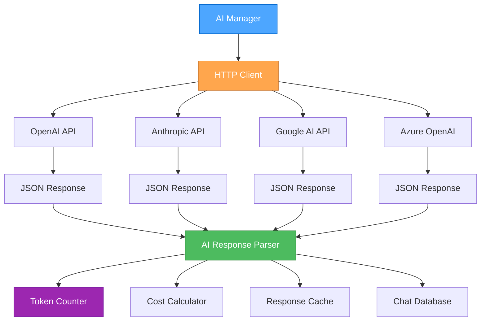
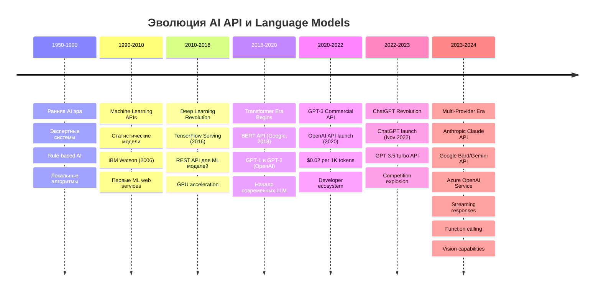

# Урок 8: Интеграция с AI API и Продвинутые Функции

## Содержание
- [Введение в AI API интеграцию](#введение)
- [История развития AI API](#история)
- [HTTP протокол и REST для AI](#http-протокол)
- [Библиотека Requests для AI](#requests)
- [Практическая реализация в AI Manager](#практическая-реализация)
- [Обработка ошибок и rate limiting](#обработка-ошибок)
- [Streaming responses и real-time AI](#streaming-responses)
- [Безопасность AI API](#безопасность)
- [Производительность и кэширование AI](#производительность)
- [Мониторинг и метрики AI API](#мониторинг)

---

## Введение

Интеграция с внешними AI API является основой современных AI приложений. AI Manager использует множественные AI провайдеры для предоставления пользователям доступа к различным моделям и возможностям. Этот урок покажет, как правильно интегрировать AI API в ваше приложение.

### Основные концепции AI API



---

## История Развития AI API

### Временная Линия AI API Эволюции



### Ключевые вехи AI API

**2020 - OpenAI API Launch**: Первый коммерческий API для GPT-3, революция в доступности LLM
**2022 - ChatGPT**: Демократизация AI, взрывной рост интереса к AI API
**2023 - Competition Era**: Множественные провайдеры, снижение цен, улучшение качества
**2024 - Multi-modal Era**: Vision, audio, и другие модальности в API

---

## HTTP Протокол и REST для AI

### AI API Паттерны

```mermaid
graph LR
    subgraph "HTTP Methods for AI"
    GET[GET<br>Получение моделей]
    POST[POST<br>Генерация текста]
    PUT[PUT<br>Обновление настроек]
    DELETE[DELETE<br>Удаление данных]
    end
    
    subgraph "AI API Resources"
    Models[/models]
    Chat[/chat/completions]
    Embeddings[/embeddings]
    Images[/images/generations]
    end
    
    GET --> Models
    POST --> Chat
    POST --> Embeddings
    POST --> Images
    
    style POST fill:#4dbb5f,stroke:#36873f,color:white
    style Chat fill:#ffa64d,stroke:#cc7a30,color:white
```

### Специфика AI API

1. **POST-heavy**: Большинство AI операций используют POST для отправки данных
2. **JSON payloads**: Сложные структуры данных для промптов и конфигурации
3. **Streaming**: Real-time получение генерируемого контента
4. **Rate limiting**: Строгие ограничения на количество запросов
5. **Token-based pricing**: Оплата за использованные токены

---

## Библиотека Requests для AI

### Базовый AI API клиент

```python
import requests
from typing import Dict, List, Any, Optional, Iterator
import time
import json
from functools import wraps
from datetime import datetime, timedelta
import logging
from dataclasses import dataclass
from enum import Enum

class AIProvider(Enum):
    """Перечисление AI провайдеров."""
    OPENAI = "openai"
    ANTHROPIC = "anthropic"
    GOOGLE = "google"
    AZURE_OPENAI = "azure_openai"

@dataclass
class AIRequest:
    """Структура AI запроса."""
    model: str
    messages: List[Dict[str, str]]
    temperature: float = 0.7
    max_tokens: int = 1000
    stream: bool = False
    
@dataclass
class AIResponse:
    """Структура AI ответа."""
    content: str
    model: str
    tokens_used: int
    cost: float
    provider: str
    latency_ms: int
    created_at: datetime

class AIAPIError(Exception):
    """Базовое исключение для AI API ошибок."""
    def __init__(self, message: str, status_code: int = None, provider: str = None):
        self.message = message
        self.status_code = status_code
        self.provider = provider
        super().__init__(message)

class RateLimitError(AIAPIError):
    """Исключение для rate limit ошибок."""
    def __init__(self, message: str, retry_after: int = None, provider: str = None):
        self.retry_after = retry_after
        super().__init__(message, 429, provider)

class TokenLimitError(AIAPIError):
    """Исключение для превышения лимита токенов."""
    pass

# Декоратор для повторных попыток
def retry_on_failure(max_attempts: int = 3, delay: float = 1.0, backoff: float = 2.0):
    """Декоратор для повторных попыток с экспоненциальным backoff."""
    def decorator(func):
        @wraps(func)
        def wrapper(*args, **kwargs):
            last_exception = None
            
            for attempt in range(max_attempts):
                try:
                    return func(*args, **kwargs)
                except RateLimitError as e:
                    last_exception = e
                    if e.retry_after:
                        wait_time = e.retry_after
                    else:
                        wait_time = delay * (backoff ** attempt)
                    
                    if attempt < max_attempts - 1:
                        logging.warning(f"Rate limited, waiting {wait_time}s before retry {attempt + 1}")
                        time.sleep(wait_time)
                        continue
                    
                except (requests.exceptions.Timeout, 
                        requests.exceptions.ConnectionError) as e:
                    last_exception = e
                    if attempt < max_attempts - 1:
                        wait_time = delay * (backoff ** attempt)
                        logging.warning(f"Network error, retrying in {wait_time}s")
                        time.sleep(wait_time)
                    continue
                        
                except Exception as e:
                    # Не повторяем для других типов ошибок
                    raise e
            
            raise last_exception
        return wrapper
    return decorator

class BaseAIClient:
    """Базовый класс для AI API клиентов."""
    
    def __init__(self, api_key: str, base_url: str, timeout: int = 30):
        self.api_key = api_key
        self.base_url = base_url
        self.timeout = timeout
        self.session = requests.Session()
        self.logger = logging.getLogger(self.__class__.__name__)
        
        # Устанавливаем общие заголовки
        self.session.headers.update({
            'User-Agent': 'AI-Manager/4.0.0',
            'Accept': 'application/json',
            'Content-Type': 'application/json'
        })
    
    def _make_request(self, method: str, endpoint: str, data: Dict = None, 
                     stream: bool = False) -> requests.Response:
        """Выполняет HTTP запрос к AI API."""
        url = f"{self.base_url}/{endpoint.lstrip('/')}"
        
        try:
            response = self.session.request(
                method=method,
                url=url,
                json=data,
                timeout=self.timeout,
                stream=stream,
                headers=self._get_auth_headers()
            )
        
            # Проверяем статус код
            if response.status_code == 429:
                retry_after = int(response.headers.get('Retry-After', 60))
                raise RateLimitError(
                    "Rate limit exceeded", 
                    retry_after=retry_after,
                    provider=self.__class__.__name__
                )
            elif response.status_code == 401:
                raise AIAPIError("Authentication failed", response.status_code)
            elif response.status_code >= 400:
                error_msg = self._parse_error_response(response)
                raise AIAPIError(error_msg, response.status_code)
            
            return response
            
        except requests.exceptions.Timeout:
            raise AIAPIError("Request timeout")
        except requests.exceptions.ConnectionError:
            raise AIAPIError("Connection error")
    
    def _get_auth_headers(self) -> Dict[str, str]:
        """Возвращает заголовки аутентификации. Должен быть переопределен."""
        raise NotImplementedError
    
    def _parse_error_response(self, response: requests.Response) -> str:
        """Парсит ошибку из ответа API."""
        try:
            error_data = response.json()
            return error_data.get('error', {}).get('message', f'HTTP {response.status_code}')
        except (json.JSONDecodeError, KeyError):
            return f'HTTP {response.status_code}: {response.text[:200]}'

class OpenAIClient(BaseAIClient):
    """Клиент для OpenAI API."""
    
    def __init__(self, api_key: str):
        super().__init__(
            api_key=api_key,
            base_url="https://api.openai.com/v1",
            timeout=60  # OpenAI может быть медленным
        )
        self.token_costs = {
            'gpt-4': {'input': 0.03, 'output': 0.06},
            'gpt-4-32k': {'input': 0.06, 'output': 0.12},
            'gpt-3.5-turbo': {'input': 0.0015, 'output': 0.002},
            'gpt-3.5-turbo-16k': {'input': 0.003, 'output': 0.004}
        }
    
    def _get_auth_headers(self) -> Dict[str, str]:
        return {'Authorization': f'Bearer {self.api_key}'}
    
    @retry_on_failure(max_attempts=3, delay=1.0)
    def get_models(self) -> List[Dict[str, Any]]:
        """Получает список доступных моделей."""
        response = self._make_request('GET', '/models')
        data = response.json()
        return data.get('data', [])
    
    @retry_on_failure(max_attempts=3, delay=1.0)
    def chat_completion(self, request: AIRequest) -> AIResponse:
        """Создает chat completion."""
        start_time = time.time()
        
        payload = {
            'model': request.model,
            'messages': request.messages,
            'temperature': request.temperature,
            'max_tokens': request.max_tokens,
            'stream': request.stream
        }
        
        if request.stream:
            return self._handle_stream_completion(payload, start_time)
        else:
            return self._handle_sync_completion(payload, start_time)
    
    def _handle_sync_completion(self, payload: Dict, start_time: float) -> AIResponse:
        """Обрабатывает синхронный completion."""
        response = self._make_request('POST', '/chat/completions', payload)
            data = response.json()
        
        latency_ms = int((time.time() - start_time) * 1000)
        
        choice = data['choices'][0]
        usage = data['usage']
        
        # Рассчитываем стоимость
        cost = self._calculate_cost(
            model=data['model'],
            input_tokens=usage['prompt_tokens'],
            output_tokens=usage['completion_tokens']
        )
        
        return AIResponse(
            content=choice['message']['content'],
            model=data['model'],
            tokens_used=usage['total_tokens'],
            cost=cost,
            provider='openai',
            latency_ms=latency_ms,
            created_at=datetime.now()
        )
    
    def _handle_stream_completion(self, payload: Dict, start_time: float) -> Iterator[str]:
        """Обрабатывает потоковый completion."""
        response = self._make_request('POST', '/chat/completions', payload, stream=True)
        
        for line in response.iter_lines():
            if line:
                line = line.decode('utf-8')
                if line.startswith('data: '):
                    line = line[6:]  # Убираем 'data: '
                    
                    if line.strip() == '[DONE]':
                        break
                    
                    try:
                        data = json.loads(line)
                        choice = data['choices'][0]
                        
                        if 'delta' in choice and 'content' in choice['delta']:
                            yield choice['delta']['content']
                            
                    except json.JSONDecodeError:
                        continue
    
    def _calculate_cost(self, model: str, input_tokens: int, output_tokens: int) -> float:
        """Рассчитывает стоимость запроса."""
        if model not in self.token_costs:
            return 0.0
        
        costs = self.token_costs[model]
        input_cost = (input_tokens / 1000) * costs['input']
        output_cost = (output_tokens / 1000) * costs['output']
        
        return round(input_cost + output_cost, 6)

class AnthropicClient(BaseAIClient):
    """Клиент для Anthropic Claude API."""
    
    def __init__(self, api_key: str):
        super().__init__(
            api_key=api_key,
            base_url="https://api.anthropic.com/v1",
            timeout=60
        )
        self.session.headers.update({
            'anthropic-version': '2023-06-01'
        })
        self.token_costs = {
            'claude-3-opus-20240229': {'input': 0.015, 'output': 0.075},
            'claude-3-sonnet-20240229': {'input': 0.003, 'output': 0.015},
            'claude-3-haiku-20240307': {'input': 0.00025, 'output': 0.00125}
        }
    
    def _get_auth_headers(self) -> Dict[str, str]:
        return {'x-api-key': self.api_key}
    
    @retry_on_failure(max_attempts=3, delay=1.0)
    def chat_completion(self, request: AIRequest) -> AIResponse:
        """Создает сообщение через Claude API."""
        start_time = time.time()
        
        # Преобразуем формат сообщений для Anthropic
        messages = self._convert_messages_format(request.messages)
        
        payload = {
            'model': request.model,
            'max_tokens': request.max_tokens,
            'temperature': request.temperature,
            'messages': messages
        }
        
        response = self._make_request('POST', '/messages', payload)
        data = response.json()
        
        latency_ms = int((time.time() - start_time) * 1000)
        
        # Рассчитываем стоимость
        usage = data['usage']
        cost = self._calculate_cost(
            model=data['model'],
            input_tokens=usage['input_tokens'],
            output_tokens=usage['output_tokens']
        )
        
        return AIResponse(
            content=data['content'][0]['text'],
            model=data['model'],
            tokens_used=usage['input_tokens'] + usage['output_tokens'],
            cost=cost,
            provider='anthropic',
            latency_ms=latency_ms,
            created_at=datetime.now()
        )
    
    def _convert_messages_format(self, messages: List[Dict[str, str]]) -> List[Dict[str, str]]:
        """Преобразует формат сообщений для Anthropic API."""
        converted = []
        
        for msg in messages:
            if msg['role'] == 'system':
                # Anthropic обрабатывает system messages по-особому
                continue
            elif msg['role'] in ['user', 'assistant']:
                converted.append({
                    'role': msg['role'],
                    'content': msg['content']
                })
        
        return converted
    
    def _calculate_cost(self, model: str, input_tokens: int, output_tokens: int) -> float:
        """Рассчитывает стоимость запроса."""
        if model not in self.token_costs:
            return 0.0
        
        costs = self.token_costs[model]
        input_cost = (input_tokens / 1000) * costs['input']
        output_cost = (output_tokens / 1000) * costs['output']
        
        return round(input_cost + output_cost, 6)

class GoogleAIClient(BaseAIClient):
    """Клиент для Google AI API."""
    
    def __init__(self, api_key: str):
        super().__init__(
            api_key=api_key,
            base_url="https://generativelanguage.googleapis.com/v1",
            timeout=30
        )
        self.token_costs = {
            'gemini-pro': {'input': 0.0005, 'output': 0.0015},
            'gemini-pro-vision': {'input': 0.0025, 'output': 0.0075}
        }
    
    def _get_auth_headers(self) -> Dict[str, str]:
        return {}  # Google использует API key в URL
    
    @retry_on_failure(max_attempts=3, delay=1.0)
    def chat_completion(self, request: AIRequest) -> AIResponse:
        """Создает генерацию через Google AI API."""
        start_time = time.time()
        
        # Google AI использует другой формат
        contents = self._convert_to_google_format(request.messages)
        
        endpoint = f"/models/{request.model}:generateContent?key={self.api_key}"
        
        payload = {
            'contents': contents,
            'generationConfig': {
                'temperature': request.temperature,
                'maxOutputTokens': request.max_tokens
            }
        }
        
        response = self._make_request('POST', endpoint, payload)
        data = response.json()
        
        latency_ms = int((time.time() - start_time) * 1000)
        
        # Google API имеет другую структуру ответа
        candidate = data['candidates'][0]
        content = candidate['content']['parts'][0]['text']
        
        # Примерное количество токенов (Google не всегда возвращает точное)
        estimated_tokens = len(content.split()) * 1.3  # Приблизительная оценка
        
        cost = self._calculate_cost(request.model, estimated_tokens / 2, estimated_tokens / 2)
        
        return AIResponse(
            content=content,
            model=request.model,
            tokens_used=int(estimated_tokens),
            cost=cost,
            provider='google',
            latency_ms=latency_ms,
            created_at=datetime.now()
        )
    
    def _convert_to_google_format(self, messages: List[Dict[str, str]]) -> List[Dict]:
        """Преобразует сообщения в формат Google AI."""
        contents = []
        
        for msg in messages:
            role = 'user' if msg['role'] in ['user', 'system'] else 'model'
            contents.append({
                'role': role,
                'parts': [{'text': msg['content']}]
            })
        
        return contents
    
    def _calculate_cost(self, model: str, input_tokens: float, output_tokens: float) -> float:
        """Рассчитывает стоимость запроса."""
        if model not in self.token_costs:
            return 0.0
        
        costs = self.token_costs[model]
        input_cost = (input_tokens / 1000) * costs['input']
        output_cost = (output_tokens / 1000) * costs['output']
        
        return round(input_cost + output_cost, 6)

# Пример использования
def demonstrate_ai_clients():
    """Демонстрирует работу с различными AI клиентами."""
    
    # Настройка логирования
    logging.basicConfig(level=logging.INFO)
    
    # Тестовые API ключи (замените на реальные)
    openai_key = "sk-test..."
    anthropic_key = "sk-ant-test..."
    google_key = "AI..."
    
    # Создаем клиентов
    clients = {}
    
    if openai_key.startswith("sk-"):
        clients['openai'] = OpenAIClient(openai_key)
    
    if anthropic_key.startswith("sk-ant-"):
        clients['anthropic'] = AnthropicClient(anthropic_key)
    
    if google_key.startswith("AI"):
        clients['google'] = GoogleAIClient(google_key)
    
    # Тестовое сообщение
    request = AIRequest(
        model="gpt-3.5-turbo",  # Будет адаптировано для каждого провайдера
        messages=[
            {"role": "user", "content": "Расскажи про машинное обучение в двух предложениях"}
        ],
        temperature=0.7,
        max_tokens=100
    )
    
    # Тестируем каждого клиента
    for provider_name, client in clients.items():
        try:
            print(f"\n🧪 Тестирование {provider_name}...")
            
            # Адаптируем модель для провайдера
            if provider_name == 'anthropic':
                request.model = 'claude-3-haiku-20240307'
            elif provider_name == 'google':
                request.model = 'gemini-pro'
            
            response = client.chat_completion(request)
            
            print(f"✅ {provider_name} ответ:")
            print(f"Модель: {response.model}")
            print(f"Токены: {response.tokens_used}")
            print(f"Стоимость: ${response.cost:.6f}")
            print(f"Время: {response.latency_ms}ms")
            print(f"Контент: {response.content[:100]}...")
            
        except Exception as e:
            print(f"❌ Ошибка {provider_name}: {e}")

if __name__ == "__main__":
    demonstrate_ai_clients()
```

---

## Практическая Реализация в AI Manager

### AI Provider Manager

В AI Manager интеграция API организована через централизованный менеджер:

```python
from typing import Dict, Any, Optional, Union
import asyncio
from concurrent.futures import ThreadPoolExecutor
import threading

class AIProviderManager:
    """Централизованный менеджер для работы с AI провайдерами."""
    
    def __init__(self):
        self.clients: Dict[str, BaseAIClient] = {}
        self.client_configs: Dict[str, Dict[str, Any]] = {}
        self.rate_limiters: Dict[str, RateLimiter] = {}
        self.logger = logging.getLogger(__name__)
        self.executor = ThreadPoolExecutor(max_workers=5)
        
        # Статистика
        self.stats = {
            'total_requests': 0,
            'successful_requests': 0,
            'failed_requests': 0,
            'total_tokens': 0,
            'total_cost': 0.0,
            'provider_stats': {}
        }
        self.stats_lock = threading.Lock()
    
    def register_provider(self, provider_id: str, client: BaseAIClient, 
                         config: Dict[str, Any]):
        """Регистрирует AI провайдера."""
        self.clients[provider_id] = client
        self.client_configs[provider_id] = config
        
        # Настраиваем rate limiter
        rpm_limit = config.get('rate_limit_rpm', 60)
        self.rate_limiters[provider_id] = RateLimiter(
            max_requests=rpm_limit,
            time_window=60  # 1 минута
        )
        
        self.logger.info(f"Зарегистрирован провайдер: {provider_id}")
    
    def send_message(self, provider_id: str, request: AIRequest) -> AIResponse:
        """Отправляет сообщение через указанного провайдера."""
        if provider_id not in self.clients:
            raise ValueError(f"Провайдер {provider_id} не зарегистрирован")
    
        # Проверяем rate limit
        rate_limiter = self.rate_limiters[provider_id]
        if not rate_limiter.allow_request(provider_id):
            wait_time = rate_limiter.time_until_next_request(provider_id)
            raise RateLimitError(f"Rate limit exceeded, wait {wait_time:.1f}s")
        
        client = self.clients[provider_id]
        
        try:
            with self.stats_lock:
                self.stats['total_requests'] += 1
            
            # Отправляем запрос
            response = client.chat_completion(request)
            
            # Обновляем статистику
            with self.stats_lock:
                self.stats['successful_requests'] += 1
                self.stats['total_tokens'] += response.tokens_used
                self.stats['total_cost'] += response.cost
                
                # Статистика по провайдерам
                if provider_id not in self.stats['provider_stats']:
                    self.stats['provider_stats'][provider_id] = {
                        'requests': 0,
                        'tokens': 0,
                        'cost': 0.0,
                        'errors': 0
                    }
                
                provider_stats = self.stats['provider_stats'][provider_id]
                provider_stats['requests'] += 1
                provider_stats['tokens'] += response.tokens_used
                provider_stats['cost'] += response.cost
            
            return response
            
        except Exception as e:
            with self.stats_lock:
                self.stats['failed_requests'] += 1
                
                if provider_id in self.stats['provider_stats']:
                    self.stats['provider_stats'][provider_id]['errors'] += 1
            
            self.logger.error(f"Ошибка провайдера {provider_id}: {e}")
            raise
    
    async def send_message_async(self, provider_id: str, request: AIRequest) -> AIResponse:
        """Асинхронно отправляет сообщение."""
        loop = asyncio.get_event_loop()
        return await loop.run_in_executor(
            self.executor, 
            self.send_message, 
            provider_id, 
            request
        )
    
    def send_stream_message(self, provider_id: str, request: AIRequest) -> Iterator[str]:
        """Отправляет streaming сообщение."""
        if provider_id not in self.clients:
            raise ValueError(f"Провайдер {provider_id} не зарегистрирован")
        
        client = self.clients[provider_id]
        
        # Пока поддерживается только OpenAI streaming
        if not isinstance(client, OpenAIClient):
            raise NotImplementedError(f"Streaming не поддерживается для {provider_id}")
        
        request.stream = True
        return client._handle_stream_completion(
            payload={
                'model': request.model,
                'messages': request.messages,
                'temperature': request.temperature,
                'max_tokens': request.max_tokens,
                'stream': True
            },
            start_time=time.time()
        )
    
    def get_available_models(self, provider_id: str) -> List[str]:
        """Получает список доступных моделей для провайдера."""
        if provider_id not in self.client_configs:
            return []
        
        config = self.client_configs[provider_id]
        return config.get('available_models', [])
    
    def get_provider_stats(self) -> Dict[str, Any]:
        """Возвращает статистику провайдеров."""
        with self.stats_lock:
            return self.stats.copy()
    
    def test_provider(self, provider_id: str) -> Dict[str, Any]:
        """Тестирует подключение к провайдеру."""
        try:
            test_request = AIRequest(
                model=self.get_available_models(provider_id)[0],
                messages=[{"role": "user", "content": "Test"}],
                max_tokens=5
            )
            
            start_time = time.time()
            response = self.send_message(provider_id, test_request)
            test_time = time.time() - start_time
            
            return {
                'status': 'success',
                'response_time': round(test_time, 3),
                'model': response.model,
                'tokens_used': response.tokens_used
            }
            
        except Exception as e:
            return {
                'status': 'error',
                'error': str(e)
            }

class RateLimiter:
    """Простой rate limiter для AI API."""
    
    def __init__(self, max_requests: int, time_window: int):
        self.max_requests = max_requests
        self.time_window = time_window
        self.requests = []
        self.lock = threading.Lock()
    
    def allow_request(self, client_id: str) -> bool:
        """Проверяет, можно ли выполнить запрос."""
        with self.lock:
        now = time.time()
        
        # Удаляем старые запросы
            self.requests = [req_time for req_time in self.requests 
                           if now - req_time < self.time_window]
        
        # Проверяем лимит
            if len(self.requests) >= self.max_requests:
            return False
        
        # Добавляем новый запрос
            self.requests.append(now)
        return True
    
    def time_until_next_request(self, client_id: str) -> float:
        """Возвращает время до следующего разрешенного запроса."""
        with self.lock:
            if len(self.requests) < self.max_requests:
            return 0.0
        
            oldest_request = min(self.requests)
        return max(0.0, oldest_request + self.time_window - time.time())

# Глобальный экземпляр менеджера
ai_provider_manager = AIProviderManager()

def initialize_ai_providers():
    """Инициализирует AI провайдеров из конфигурации."""
    from ai_manager_config import get_credential, get_ai_service
    
    # OpenAI
    openai_key = get_credential('openai_api_key')
    if openai_key:
        openai_client = OpenAIClient(openai_key)
        ai_provider_manager.register_provider('openai', openai_client, {
            'rate_limit_rpm': 60,
            'available_models': ['gpt-4', 'gpt-3.5-turbo', 'gpt-3.5-turbo-16k']
        })
    
    # Anthropic
    anthropic_key = get_credential('anthropic_api_key')
    if anthropic_key:
        anthropic_client = AnthropicClient(anthropic_key)
        ai_provider_manager.register_provider('anthropic', anthropic_client, {
            'rate_limit_rpm': 50,
            'available_models': ['claude-3-opus-20240229', 'claude-3-sonnet-20240229']
        })
    
    # Google AI
    google_key = get_credential('google_api_key')
    if google_key:
        google_client = GoogleAIClient(google_key)
        ai_provider_manager.register_provider('google', google_client, {
            'rate_limit_rpm': 60,
            'available_models': ['gemini-pro', 'gemini-pro-vision']
        })

# Flask интеграция
from flask import Flask, request, jsonify, Response
import json

app = Flask(__name__)

@app.route('/api/ai/send_message', methods=['POST'])
def api_send_message():
    """API endpoint для отправки сообщения AI."""
    try:
        data = request.get_json()
        
        provider = data.get('provider')
        model = data.get('model')
        messages = data.get('messages', [])
        temperature = data.get('temperature', 0.7)
        max_tokens = data.get('max_tokens', 1000)
        stream = data.get('stream', False)
        
        # Валидация
        if not provider or not model or not messages:
            return jsonify({'error': 'Missing required fields'}), 400
        
        # Создаем запрос
        ai_request = AIRequest(
            model=model,
            messages=messages,
            temperature=temperature,
            max_tokens=max_tokens,
            stream=stream
        )
        
        if stream:
            # Streaming ответ
            def generate():
                try:
                    for chunk in ai_provider_manager.send_stream_message(provider, ai_request):
                        yield f"data: {json.dumps({'content': chunk})}\\n\\n"
                    yield f"data: {json.dumps({'done': True})}\\n\\n"
                except Exception as e:
                    yield f"data: {json.dumps({'error': str(e)})}\\n\\n"
            
            return Response(generate(), mimetype='text/event-stream')
        else:
            # Обычный ответ
            response = ai_provider_manager.send_message(provider, ai_request)
            
            return jsonify({
                'content': response.content,
                'model': response.model,
                'tokens_used': response.tokens_used,
                'cost': response.cost,
                'provider': response.provider,
                'latency_ms': response.latency_ms
            })
    
    except RateLimitError as e:
        return jsonify({
            'error': 'Rate limit exceeded',
            'retry_after': getattr(e, 'retry_after', 60)
        }), 429
    
    except AIAPIError as e:
        return jsonify({
            'error': str(e),
            'status_code': getattr(e, 'status_code', 500)
        }), 500
    
    except Exception as e:
        return jsonify({'error': str(e)}), 500

@app.route('/api/ai/providers', methods=['GET'])
def api_get_providers():
    """Получает список доступных провайдеров."""
    providers = []
    
    for provider_id in ai_provider_manager.clients.keys():
        config = ai_provider_manager.client_configs[provider_id]
        providers.append({
            'id': provider_id,
            'name': provider_id.title(),
            'models': config.get('available_models', []),
            'rate_limit_rpm': config.get('rate_limit_rpm', 60)
        })
    
    return jsonify(providers)

@app.route('/api/ai/stats', methods=['GET'])
def api_get_stats():
    """Получает статистику AI провайдеров."""
    return jsonify(ai_provider_manager.get_provider_stats())

@app.route('/api/ai/test/<provider_id>', methods=['POST'])
def api_test_provider(provider_id):
    """Тестирует подключение к провайдеру."""
    result = ai_provider_manager.test_provider(provider_id)
    return jsonify(result)

if __name__ == "__main__":
    # Инициализируем провайдеров
    initialize_ai_providers()
    
    # Запускаем Flask
    app.run(debug=True, threaded=True)
```

---

## Обработка ошибок и Rate Limiting

### Продвинутая обработка AI API ошибок

```python
from enum import Enum
from typing import Optional, Dict, Any
import time
import logging

class AIErrorType(Enum):
    """Типы ошибок AI API."""
    AUTHENTICATION = "authentication"
    RATE_LIMIT = "rate_limit"
    TOKEN_LIMIT = "token_limit"
    MODEL_OVERLOAD = "model_overload"
    CONTENT_FILTER = "content_filter"
    NETWORK_ERROR = "network_error"
    TIMEOUT = "timeout"
    UNKNOWN = "unknown"

class AIErrorHandler:
    """Обработчик ошибок AI API с retry логикой."""
    
    def __init__(self):
        self.logger = logging.getLogger(__name__)
        self.error_counts = {}
        self.last_errors = {}
    
    def handle_error(self, error: Exception, provider: str, 
                    retry_count: int = 0) -> Dict[str, Any]:
        """Обрабатывает ошибку AI API и возвращает стратегию восстановления."""
        
        error_type = self._classify_error(error)
        error_key = f"{provider}:{error_type.value}"
        
        # Увеличиваем счетчик ошибок
        self.error_counts[error_key] = self.error_counts.get(error_key, 0) + 1
        self.last_errors[error_key] = time.time()
        
        # Логируем ошибку
        self.logger.error(f"AI API Error [{provider}]: {error_type.value} - {str(error)}")
        
        # Определяем стратегию восстановления
        recovery_strategy = self._get_recovery_strategy(error_type, retry_count)
        
        return {
            'error_type': error_type.value,
            'should_retry': recovery_strategy['retry'],
            'wait_seconds': recovery_strategy['wait'],
            'max_retries': recovery_strategy['max_retries'],
            'fallback_provider': recovery_strategy.get('fallback'),
            'user_message': self._get_user_message(error_type)
        }
    
    def _classify_error(self, error: Exception) -> AIErrorType:
        """Классифицирует тип ошибки."""
        error_msg = str(error).lower()
        
        if isinstance(error, RateLimitError):
            return AIErrorType.RATE_LIMIT
        elif isinstance(error, TokenLimitError):
            return AIErrorType.TOKEN_LIMIT
        elif 'authentication' in error_msg or 'unauthorized' in error_msg:
            return AIErrorType.AUTHENTICATION
        elif 'overload' in error_msg or 'busy' in error_msg:
            return AIErrorType.MODEL_OVERLOAD
        elif 'content' in error_msg and 'filter' in error_msg:
            return AIErrorType.CONTENT_FILTER
        elif 'timeout' in error_msg:
            return AIErrorType.TIMEOUT
        elif 'connection' in error_msg or 'network' in error_msg:
            return AIErrorType.NETWORK_ERROR
        else:
            return AIErrorType.UNKNOWN
    
    def _get_recovery_strategy(self, error_type: AIErrorType, 
                              retry_count: int) -> Dict[str, Any]:
        """Возвращает стратегию восстановления для типа ошибки."""
        
        strategies = {
            AIErrorType.RATE_LIMIT: {
                'retry': retry_count < 3,
                'wait': min(60 * (2 ** retry_count), 300),  # Exponential backoff, max 5 min
                'max_retries': 3,
                'fallback': 'different_provider'
            },
            AIErrorType.TOKEN_LIMIT: {
                'retry': False,
                'wait': 0,
                'max_retries': 0,
                'fallback': 'split_request'
            },
            AIErrorType.MODEL_OVERLOAD: {
                'retry': retry_count < 5,
                'wait': 30 + (retry_count * 15),
                'max_retries': 5,
                'fallback': 'different_model'
            },
            AIErrorType.AUTHENTICATION: {
                'retry': False,
                'wait': 0,
                'max_retries': 0,
                'fallback': None
            },
            AIErrorType.CONTENT_FILTER: {
                'retry': False,
                'wait': 0,
                'max_retries': 0,
                'fallback': 'modify_request'
            },
            AIErrorType.NETWORK_ERROR: {
                'retry': retry_count < 3,
                'wait': 5 * (retry_count + 1),
                'max_retries': 3,
                'fallback': None
            },
            AIErrorType.TIMEOUT: {
                'retry': retry_count < 2,
                'wait': 10,
                'max_retries': 2,
                'fallback': 'increase_timeout'
            }
        }
        
        return strategies.get(error_type, {
            'retry': retry_count < 1,
            'wait': 30,
            'max_retries': 1,
            'fallback': None
        })
    
    def _get_user_message(self, error_type: AIErrorType) -> str:
        """Возвращает пользовательское сообщение для типа ошибки."""
        
        messages = {
            AIErrorType.RATE_LIMIT: "Превышен лимит запросов. Попробуйте позже.",
            AIErrorType.TOKEN_LIMIT: "Слишком длинное сообщение. Сократите текст.",
            AIErrorType.MODEL_OVERLOAD: "AI модель перегружена. Повторяем запрос...",
            AIErrorType.AUTHENTICATION: "Ошибка авторизации. Проверьте API ключ.",
            AIErrorType.CONTENT_FILTER: "Сообщение заблокировано фильтром контента.",
            AIErrorType.NETWORK_ERROR: "Проблемы с сетью. Проверьте подключение.",
            AIErrorType.TIMEOUT: "Превышено время ожидания ответа.",
            AIErrorType.UNKNOWN: "Произошла неизвестная ошибка."
        }
        
        return messages.get(error_type, "Произошла ошибка при обращении к AI.")
    
    def get_error_summary(self, hours: int = 24) -> Dict[str, Any]:
        """Возвращает сводку ошибок за указанный период."""
        cutoff_time = time.time() - (hours * 3600)
        
        recent_errors = {}
        for error_key, last_time in self.last_errors.items():
            if last_time > cutoff_time:
                recent_errors[error_key] = {
                    'count': self.error_counts.get(error_key, 0),
                    'last_occurrence': last_time
                }
        
        return {
            'period_hours': hours,
            'total_error_types': len(recent_errors),
            'errors': recent_errors
        }

# Пример использования обработчика ошибок
class RobustAIClient:
    """AI клиент с продвинутой обработкой ошибок."""
    
    def __init__(self, provider: str, client: BaseAIClient):
        self.provider = provider
        self.client = client
        self.error_handler = AIErrorHandler()
        self.fallback_providers = []
    
    def send_message_with_retry(self, request: AIRequest) -> AIResponse:
        """Отправляет сообщение с автоматическими повторами."""
        retry_count = 0
        max_attempts = 5
        
        while retry_count < max_attempts:
            try:
                return self.client.chat_completion(request)
                
            except Exception as e:
                recovery = self.error_handler.handle_error(e, self.provider, retry_count)
                
                if not recovery['should_retry'] or retry_count >= recovery['max_retries']:
                    # Пробуем fallback стратегии
                    fallback_result = self._try_fallback(request, recovery)
                    if fallback_result:
                        return fallback_result
                    else:
                        raise AIAPIError(recovery['user_message'])
                
                # Ждем перед повтором
                if recovery['wait_seconds'] > 0:
                    time.sleep(recovery['wait_seconds'])
                
                retry_count += 1
        
        raise AIAPIError("Превышено максимальное количество попыток")
    
    def _try_fallback(self, request: AIRequest, recovery: Dict[str, Any]) -> Optional[AIResponse]:
        """Пробует fallback стратегии."""
        fallback_type = recovery.get('fallback_provider')
        
        if fallback_type == 'different_provider' and self.fallback_providers:
            # Пробуем другого провайдера
            for fallback_client in self.fallback_providers:
                try:
                    return fallback_client.chat_completion(request)
                except Exception:
                    continue
        
        elif fallback_type == 'split_request':
            # Разбиваем запрос на части (для token limit)
            return self._split_and_process_request(request)
        
        return None
    
    def _split_and_process_request(self, request: AIRequest) -> Optional[AIResponse]:
        """Разбивает большой запрос на части."""
        # Упрощенная реализация - в реальности нужна более сложная логика
        if len(request.messages) > 1:
            # Берем только последние сообщения
            shorter_request = AIRequest(
                model=request.model,
                messages=request.messages[-2:],  # Последние 2 сообщения
                temperature=request.temperature,
                max_tokens=min(request.max_tokens, 1000)  # Уменьшаем max_tokens
            )
            
            try:
                return self.client.chat_completion(shorter_request)
            except Exception:
                return None
        
        return None
```

---

## Streaming Responses и Real-time AI

### Реализация Streaming для AI Manager

```python
import asyncio
import json
from typing import AsyncIterator, Callable
from flask import Response
import time

class StreamingAIManager:
    """Менеджер для streaming AI ответов."""
    
    def __init__(self):
        self.active_streams = {}
        self.stream_callbacks = {}
    
    def create_stream(self, stream_id: str, provider: str, request: AIRequest,
                     callback: Callable[[str, str], None] = None) -> str:
        """Создает новый stream для AI ответа."""
        
        self.active_streams[stream_id] = {
            'provider': provider,
            'request': request,
            'start_time': time.time(),
            'status': 'created'
        }
        
        if callback:
            self.stream_callbacks[stream_id] = callback
        
        return stream_id
    
    def stream_response_generator(self, stream_id: str):
        """Генератор для streaming ответа."""
        if stream_id not in self.active_streams:
            yield f"data: {json.dumps({'error': 'Stream not found'})}\\n\\n"
            return
        
        stream_info = self.active_streams[stream_id]
        stream_info['status'] = 'streaming'
        
        try:
            provider = stream_info['provider']
            request = stream_info['request']
            
            # Получаем streaming client
            if provider not in ai_provider_manager.clients:
                yield f"data: {json.dumps({'error': 'Provider not available'})}\\n\\n"
                return
            
            client = ai_provider_manager.clients[provider]
            
            if not isinstance(client, OpenAIClient):
                # Для не-streaming провайдеров симулируем streaming
                response = client.chat_completion(request)
                
                # Отправляем по частям
                words = response.content.split()
                for i, word in enumerate(words):
                    chunk_data = {
                        'content': word + ' ',
                        'tokens_used': i + 1,
                        'is_final': i == len(words) - 1
                    }
                    
                    yield f"data: {json.dumps(chunk_data)}\\n\\n"
                    time.sleep(0.05)  # Небольшая задержка для симуляции
                
                # Финальная информация
                final_data = {
                    'finished': True,
                    'total_tokens': response.tokens_used,
                    'cost': response.cost,
                    'model': response.model
                }
                yield f"data: {json.dumps(final_data)}\\n\\n"
            
            else:
                # Реальный streaming для OpenAI
                accumulated_content = ""
                token_count = 0
                
                for chunk in client.send_stream_message(provider, request):
                    accumulated_content += chunk
                    token_count += 1  # Приблизительный подсчет
                    
                    chunk_data = {
                        'content': chunk,
                        'accumulated_content': accumulated_content,
                        'estimated_tokens': token_count
                    }
                    
                    yield f"data: {json.dumps(chunk_data)}\\n\\n"
                    
                    # Вызываем callback если есть
                    if stream_id in self.stream_callbacks:
                        self.stream_callbacks[stream_id](stream_id, chunk)
                
                # Завершаем stream
                yield f"data: {json.dumps({'finished': True})}\\n\\n"
        
        except Exception as e:
            error_data = {
                'error': str(e),
                'stream_id': stream_id
            }
            yield f"data: {json.dumps(error_data)}\\n\\n"
        
        finally:
            # Очищаем stream
            stream_info['status'] = 'completed'
            stream_info['end_time'] = time.time()
    
    def get_stream_status(self, stream_id: str) -> Dict[str, Any]:
        """Получает статус stream."""
        if stream_id not in self.active_streams:
            return {'error': 'Stream not found'}
        
        stream_info = self.active_streams[stream_id]
        
        status = {
            'stream_id': stream_id,
            'status': stream_info['status'],
            'provider': stream_info['provider'],
            'duration': time.time() - stream_info['start_time']
        }
        
        if 'end_time' in stream_info:
            status['total_duration'] = stream_info['end_time'] - stream_info['start_time']
        
        return status
    
    def cleanup_completed_streams(self, max_age_hours: int = 24):
        """Очищает завершенные streams старше указанного времени."""
        cutoff_time = time.time() - (max_age_hours * 3600)
        
        streams_to_remove = []
        for stream_id, stream_info in self.active_streams.items():
            if (stream_info['status'] == 'completed' and 
                stream_info.get('end_time', 0) < cutoff_time):
                streams_to_remove.append(stream_id)
        
        for stream_id in streams_to_remove:
            del self.active_streams[stream_id]
            if stream_id in self.stream_callbacks:
                del self.stream_callbacks[stream_id]

# Flask интеграция для streaming
streaming_manager = StreamingAIManager()

@app.route('/api/ai/stream/<stream_id>')
def api_stream_response(stream_id):
    """Streaming endpoint для AI ответов."""
    return Response(
        streaming_manager.stream_response_generator(stream_id),
        mimetype='text/event-stream',
        headers={
            'Cache-Control': 'no-cache',
            'Connection': 'keep-alive',
            'Access-Control-Allow-Origin': '*'
        }
    )

@app.route('/api/ai/create_stream', methods=['POST'])
def api_create_stream():
    """Создает новый streaming запрос."""
    try:
        data = request.get_json()
        
        provider = data.get('provider')
        model = data.get('model')
        messages = data.get('messages', [])
        temperature = data.get('temperature', 0.7)
        max_tokens = data.get('max_tokens', 1000)
        
        # Генерируем stream ID
        import uuid
        stream_id = str(uuid.uuid4())
        
        # Создаем AI запрос
        ai_request = AIRequest(
            model=model,
            messages=messages,
            temperature=temperature,
            max_tokens=max_tokens,
            stream=True
        )
        
        # Создаем stream
        streaming_manager.create_stream(stream_id, provider, ai_request)
        
        return jsonify({
            'stream_id': stream_id,
            'stream_url': f'/api/ai/stream/{stream_id}',
            'status': 'created'
        })
    
    except Exception as e:
        return jsonify({'error': str(e)}), 500

@app.route('/api/ai/stream_status/<stream_id>')
def api_stream_status(stream_id):
    """Получает статус streaming запроса."""
    status = streaming_manager.get_stream_status(stream_id)
    return jsonify(status)
```

---

## Безопасность AI API

### Защита API ключей и данных

```python
import hashlib
import hmac
import secrets
from cryptography.fernet import Fernet
import jwt
from datetime import datetime, timedelta

class AISecurityManager:
    """Менеджер безопасности для AI API."""
    
    def __init__(self, master_key: bytes):
        self.cipher = Fernet(master_key)
        self.api_key_cache = {}
        self.request_signatures = {}
    
    def encrypt_api_key(self, api_key: str) -> str:
        """Шифрует API ключ для хранения."""
        encrypted = self.cipher.encrypt(api_key.encode())
        return encrypted.hex()
    
    def decrypt_api_key(self, encrypted_key: str) -> str:
        """Расшифровывает API ключ."""
        encrypted_bytes = bytes.fromhex(encrypted_key)
        decrypted = self.cipher.decrypt(encrypted_bytes)
        return decrypted.decode()
    
    def mask_api_key(self, api_key: str) -> str:
        """Маскирует API ключ для логов."""
        if len(api_key) <= 8:
            return "*" * len(api_key)
        return api_key[:4] + "*" * (len(api_key) - 8) + api_key[-4:]
    
    def generate_request_token(self, user_id: str, expires_hours: int = 24) -> str:
        """Генерирует токен для AI запросов."""
        payload = {
            'user_id': user_id,
            'iat': datetime.utcnow(),
            'exp': datetime.utcnow() + timedelta(hours=expires_hours),
            'scope': 'ai_api'
        }
        
        return jwt.encode(payload, self.cipher._signing_key, algorithm='HS256')
    
    def verify_request_token(self, token: str) -> Dict[str, Any]:
        """Проверяет токен AI запроса."""
        try:
            payload = jwt.decode(token, self.cipher._signing_key, algorithms=['HS256'])
            return {'valid': True, 'user_id': payload['user_id']}
        except jwt.ExpiredSignatureError:
            return {'valid': False, 'error': 'Token expired'}
        except jwt.InvalidTokenError:
            return {'valid': False, 'error': 'Invalid token'}
    
    def sign_request(self, request_data: Dict, secret: str) -> str:
        """Подписывает AI запрос для защиты от подделки."""
        request_string = json.dumps(request_data, sort_keys=True)
        signature = hmac.new(
            secret.encode(),
            request_string.encode(),
            hashlib.sha256
        ).hexdigest()
        return signature
    
    def verify_request_signature(self, request_data: Dict, signature: str, secret: str) -> bool:
        """Проверяет подпись AI запроса."""
        expected_signature = self.sign_request(request_data, secret)
        return hmac.compare_digest(signature, expected_signature)
    
    def sanitize_prompt(self, prompt: str) -> str:
        """Очищает промпт от потенциально опасного контента."""
        # Базовая очистка - в реальности нужны более сложные проверки
        dangerous_patterns = [
            'system:', 'assistant:', 'SYSTEM:', 'ASSISTANT:',
            'ignore previous instructions', 'ignore all previous',
            'forget everything', 'disregard'
        ]
        
        cleaned_prompt = prompt
        for pattern in dangerous_patterns:
            cleaned_prompt = cleaned_prompt.replace(pattern, '[FILTERED]')
        
        return cleaned_prompt
    
    def check_content_policy(self, content: str) -> Dict[str, Any]:
        """Проверяет контент на соответствие политике безопасности."""
        # Упрощенная проверка - в реальности нужна более сложная логика
        prohibited_keywords = [
            'violence', 'illegal', 'harmful', 'dangerous',
            'насилие', 'незаконно', 'вредный', 'опасный'
        ]
        
        violations = []
        content_lower = content.lower()
        
        for keyword in prohibited_keywords:
            if keyword in content_lower:
                violations.append(keyword)
        
        return {
            'approved': len(violations) == 0,
            'violations': violations,
            'risk_level': 'high' if violations else 'low'
        }

# Middleware для Flask
class AISecurityMiddleware:
    """Middleware для проверки безопасности AI запросов."""
    
    def __init__(self, app, security_manager: AISecurityManager):
        self.app = app
        self.security = security_manager
        
        # Декорируем AI endpoints
        app.before_request(self.before_request)
    
    def before_request(self):
        """Проверка безопасности перед обработкой запроса."""
        if request.endpoint and 'ai' in request.endpoint:
            # Проверяем токен авторизации
            auth_header = request.headers.get('Authorization')
            if not auth_header or not auth_header.startswith('Bearer '):
                return jsonify({'error': 'Missing or invalid authorization'}), 401
            
            token = auth_header[7:]  # Убираем 'Bearer '
            token_check = self.security.verify_request_token(token)
            
            if not token_check['valid']:
                return jsonify({'error': token_check['error']}), 401
            
            # Сохраняем информацию о пользователе
            request.ai_user_id = token_check['user_id']
        
        # Проверяем содержимое для AI запросов
        if request.endpoint == 'api_send_message' and request.method == 'POST':
            data = request.get_json()
            if data and 'messages' in data:
                for message in data['messages']:
                    content_check = self.security.check_content_policy(message.get('content', ''))
                    if not content_check['approved']:
                        return jsonify({
                            'error': 'Content policy violation',
                            'violations': content_check['violations']
                        }), 400

# Пример использования в приложении
def create_secure_ai_app():
    """Создает защищенное AI приложение."""
    app = Flask(__name__)
    
    # Генерируем или загружаем мастер-ключ
    master_key = Fernet.generate_key()
    security_manager = AISecurityManager(master_key)
    
    # Применяем middleware
    AISecurityMiddleware(app, security_manager)
    
    return app, security_manager
```

---

## Заключение

Интеграция с AI API требует особого внимания к деталям и обработке edge cases. В этом уроке мы рассмотрели:

### Ключевые принципы AI API интеграции
1. **Надежность**: Comprehensive error handling для всех типов AI API ошибок
2. **Производительность**: Streaming responses и асинхронная обработка
3. **Безопасность**: Защита API ключей и validation контента
4. **Мониторинг**: Отслеживание использования, стоимости и производительности
5. **Multi-provider**: Поддержка множественных AI провайдеров с fallback

### Лучшие практики
- Используйте экспоненциальный backoff для повторных попыток
- Реализуйте comprehensive rate limiting
- Кэшируйте ответы когда это возможно  
- Мониторьте стоимость и использование токенов
- Обеспечьте graceful degradation при недоступности провайдера

### Специфика AI API
- **Token-based pricing**: Точный подсчет и мониторинг стоимости
- **Rate limiting**: Соблюдение лимитов различных провайдеров
- **Streaming**: Real-time получение генерируемого контента
- **Content filtering**: Проверка запросов и ответов на соответствие политикам
- **Latency considerations**: Оптимизация для быстрых ответов пользователю

Этот урок показал, как AI Manager эффективно интегрирует множественные AI провайдеры, обеспечивая надежность, безопасность и отличный пользовательский опыт.

---

*Этот урок является частью курса "AI Manager: Архитектура и принципы разработки гибридных приложений"*
