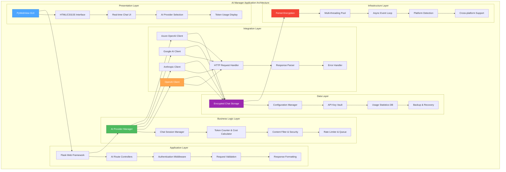
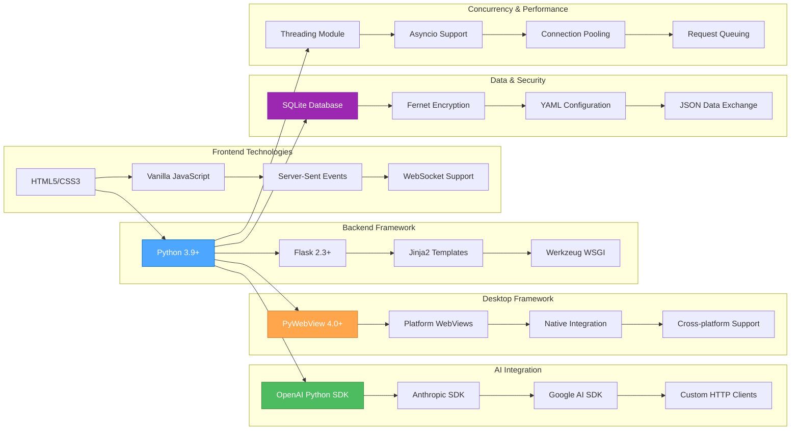
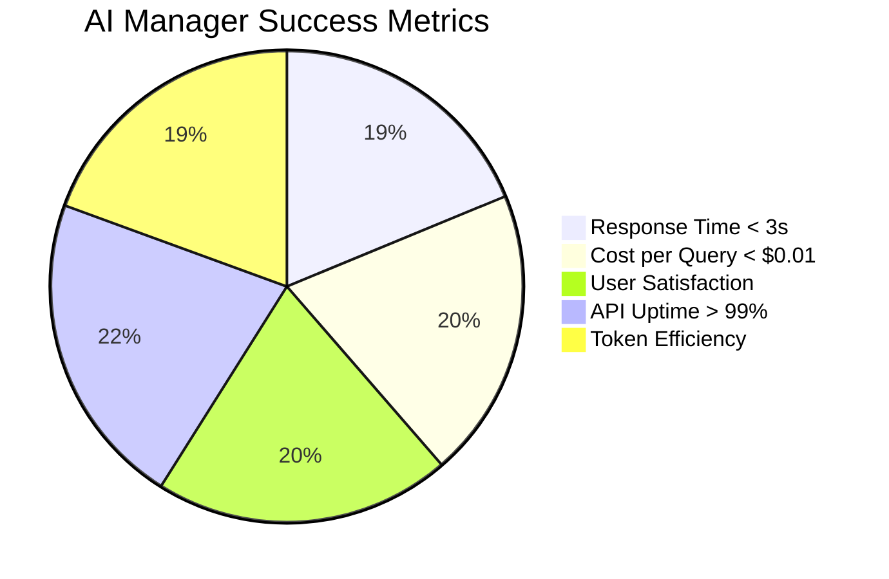
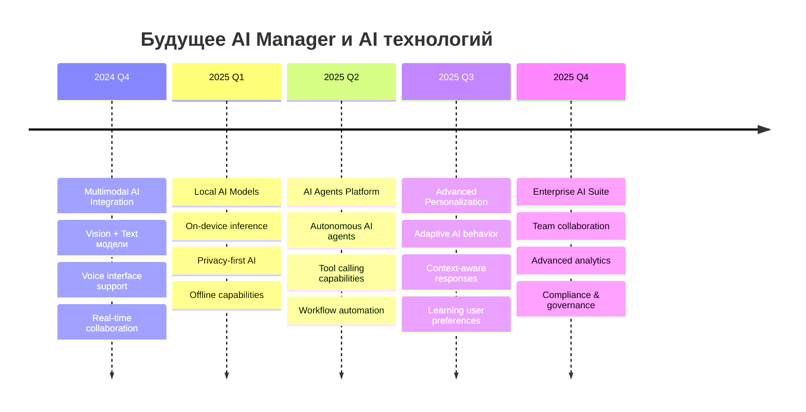
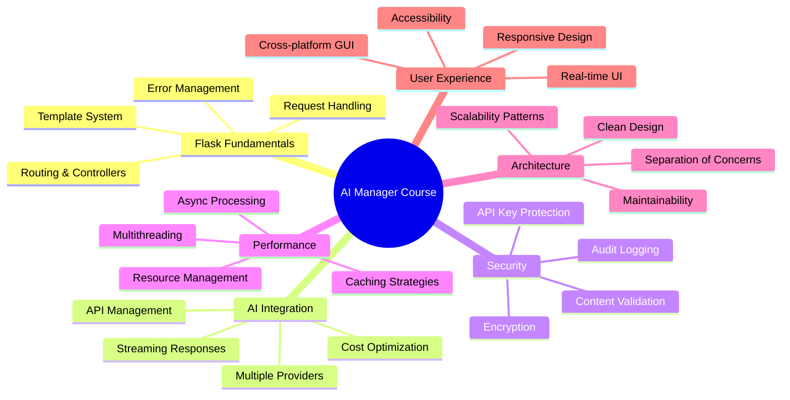

# Урок 9: Комплексный обзор и выводы по AI Manager

## 🎯 Цели урока

К концу этого урока вы будете иметь:
- Полное понимание архитектуры современных AI приложений
- Комплексное представление о принципах разработки AI Manager
- Знание лучших практик создания гибридных AI приложений
- Понимание будущих трендов в AI application development
- План дальнейшего развития и изучения AI технологий

## 📚 Ретроспектива курса: От VPN к AI Revolution

### Путешествие трансформации

```mermaid
journey
    title Эволюция от VPN Manager к AI Manager
    
    section Lesson 1: Flask Basics
        Простые веб-формы : 3 : VPN
        Маршрутизация и контроллеры : 4 : VPN
        AI service routing : 5 : AI
        Multi-provider architecture : 5 : AI
    
    section Lesson 2: Templating
        Базовые HTML шаблоны : 3 : VPN
        Jinja2 для серверов : 4 : VPN
        AI chat interfaces : 5 : AI
        Real-time UI updates : 5 : AI
    
    section Lesson 3: Forms & Data
        Простые формы : 3 : VPN
        Валидация серверов : 4 : VPN
        Complex AI parameters : 5 : AI
        Streaming data handling : 5 : AI
    
    section Lesson 4: Cryptography
        Базовое шифрование : 4 : VPN
        Защита паролей : 4 : VPN
        API key protection : 5 : AI
        Multi-provider security : 5 : AI
    
    section Lesson 5: Multithreading
        Простые потоки : 3 : VPN
        Мониторинг серверов : 4 : VPN
        Concurrent AI requests : 5 : AI
        Real-time AI processing : 5 : AI
    
    section Lesson 6: Configuration
        Файлы настроек : 3 : VPN
        Управление серверами : 4 : VPN
        AI provider configs : 5 : AI
        Dynamic model switching : 5 : AI
    
    section Lesson 7: PyWebView GUI
        Простой интерфейс : 3 : VPN
        Нативное приложение : 4 : VPN
        AI chat interface : 5 : AI
        Cross-platform AI app : 5 : AI
    
    section Lesson 8: API Integration
        HTTP запросы : 3 : VPN
        VPN API интеграция : 4 : VPN
        Multiple AI APIs : 5 : AI
        Streaming responses : 5 : AI
```

### Ключевые трансформации

**От инфраструктуры к интеллекту**: VPN Manager управлял серверной инфраструктурой, AI Manager управляет искусственным интеллектом

**От статических данных к динамическому взаимодействию**: Переход от управления статическими конфигурациями к real-time AI диалогам

**От простой безопасности к комплексной защите AI**: Эволюция от базовой защиты паролей к secure AI API key management

**От локальных операций к cloud-native AI**: Трансформация от локальных VPN соединений к глобальным AI провайдерам

## 🏗️ Архитектурный обзор AI Manager

### Полная архитектура системы



### Архитектурные принципы AI Manager

#### 1. Multi-Provider Architecture
```python
# Abstraction для работы с различными AI провайдерами
class AIProviderInterface:
    def send_message(self, request: AIRequest) -> AIResponse: pass
    def get_models(self) -> List[str]: pass
    def calculate_cost(self, tokens: int) -> float: pass
    def supports_streaming(self) -> bool: pass

# Конкретные реализации
class OpenAIProvider(AIProviderInterface): pass
class AnthropicProvider(AIProviderInterface): pass
class GoogleAIProvider(AIProviderInterface): pass
```

#### 2. Event-Driven Real-time Updates
```python
# Система событий для real-time обновлений
class AIEventManager:
    def emit_message_chunk(self, session_id: str, chunk: str): pass
    def emit_token_update(self, session_id: str, tokens: int): pass
    def emit_cost_update(self, session_id: str, cost: float): pass
    def emit_stream_complete(self, session_id: str, response: AIResponse): pass
```

#### 3. Security-First Design
```python
# Многоуровневая система безопасности
class AISecurityStack:
    def encrypt_api_keys(self, keys: Dict[str, str]) -> Dict[str, str]: pass
    def validate_request_content(self, content: str) -> ValidationResult: pass
    def audit_ai_interaction(self, user_id: str, request: AIRequest): pass
    def secure_chat_storage(self, chat: ChatSession) -> None: pass
```

#### 4. Performance-Optimized Processing
```python
# Оптимизация производительности
class AIPerformanceManager:
    def cache_frequent_responses(self, request: str, response: str): pass
    def batch_token_calculations(self, requests: List[AIRequest]): pass
    def pool_ai_connections(self, provider: str) -> ConnectionPool: pass
    def async_background_processing(self, tasks: List[Task]): pass
```

## 💡 Ключевые концепции и паттерны

### 1. AI-First Design Patterns

#### Provider Abstraction Pattern
```python
# Абстракция для единообразной работы с AI провайдерами
class AIProviderFactory:
    @staticmethod
    def create_provider(provider_type: str, config: Dict) -> AIProviderInterface:
        providers = {
            'openai': OpenAIProvider,
            'anthropic': AnthropicProvider,
            'google': GoogleAIProvider
        }
        
        provider_class = providers.get(provider_type)
        if not provider_class:
            raise ValueError(f"Неподдерживаемый провайдер: {provider_type}")
        
        return provider_class(config)
```

#### Streaming Response Pattern
```python
# Паттерн для обработки потоковых AI ответов
class StreamingResponseHandler:
    def __init__(self, callback: Callable[[str], None]):
        self.callback = callback
        self.buffer = ""
        self.metadata = {}
    
    def process_chunk(self, chunk: str) -> None:
        self.buffer += chunk
        self.callback(chunk)
    
    def finalize(self) -> AIResponse:
        return AIResponse(
            content=self.buffer,
            metadata=self.metadata
        )
```

#### Cost-Aware Processing Pattern
```python
# Паттерн для контроля стоимости AI операций
class CostAwareAIProcessor:
    def __init__(self, budget_limit: float):
        self.budget_limit = budget_limit
        self.current_usage = 0.0
    
    def process_with_budget_check(self, request: AIRequest) -> AIResponse:
        estimated_cost = self.estimate_cost(request)
        
        if self.current_usage + estimated_cost > self.budget_limit:
            raise BudgetExceededError("Превышен лимит бюджета")
        
        response = self.send_request(request)
        self.current_usage += response.cost
        
        return response
```

### 2. Security Patterns для AI

#### API Key Rotation Pattern
```python
# Автоматическая ротация API ключей
class APIKeyRotationManager:
    def __init__(self, rotation_interval: timedelta):
        self.rotation_interval = rotation_interval
        self.key_store = EncryptedKeyStore()
    
    def schedule_rotation(self, provider: str) -> None:
        scheduler.add_job(
            func=self.rotate_key,
            args=[provider],
            trigger='interval',
            seconds=self.rotation_interval.total_seconds()
        )
    
    def rotate_key(self, provider: str) -> None:
        # Генерируем новый ключ или получаем от провайдера
        new_key = self.generate_new_key(provider)
        self.key_store.update_key(provider, new_key)
        self.notify_key_update(provider)
```

#### Content Sanitization Pattern
```python
# Очистка и валидация AI контента
class AIContentSanitizer:
    def __init__(self):
        self.prohibited_patterns = self.load_prohibited_patterns()
        self.content_filters = [
            self.check_prompt_injection,
            self.check_sensitive_data,
            self.check_malicious_content
        ]
    
    def sanitize_input(self, content: str) -> SanitizationResult:
        for filter_func in self.content_filters:
            result = filter_func(content)
            if not result.is_safe:
                return result
        
        return SanitizationResult(
            is_safe=True,
            sanitized_content=self.clean_content(content)
        )
```

### 3. Performance Patterns

#### Intelligent Caching Pattern
```python
# Умное кэширование AI ответов
class AIResponseCache:
    def __init__(self, ttl: int = 3600):
        self.cache = {}
        self.ttl = ttl
    
    def get_cached_response(self, request_hash: str) -> Optional[AIResponse]:
        if request_hash in self.cache:
            cached_item = self.cache[request_hash]
            if time.time() - cached_item['timestamp'] < self.ttl:
                return cached_item['response']
            else:
                del self.cache[request_hash]
        return None
    
    def cache_response(self, request_hash: str, response: AIResponse) -> None:
        # Кэшируем только успешные ответы
        if response.status == 'success':
            self.cache[request_hash] = {
                'response': response,
                'timestamp': time.time()
            }
```

#### Batch Processing Pattern
```python
# Пакетная обработка AI запросов
class AIBatchProcessor:
    def __init__(self, batch_size: int = 10, max_wait_time: float = 5.0):
        self.batch_size = batch_size
        self.max_wait_time = max_wait_time
        self.pending_requests = []
        self.batch_timer = None
    
    def add_request(self, request: AIRequest, callback: Callable) -> None:
        self.pending_requests.append((request, callback))
        
        if len(self.pending_requests) >= self.batch_size:
            self.process_batch()
        elif self.batch_timer is None:
            self.batch_timer = threading.Timer(self.max_wait_time, self.process_batch)
            self.batch_timer.start()
    
    def process_batch(self) -> None:
        if self.batch_timer:
            self.batch_timer.cancel()
            self.batch_timer = None
        
        batch = self.pending_requests[:]
        self.pending_requests.clear()
        
        # Обрабатываем пакет параллельно
        with ThreadPoolExecutor() as executor:
            futures = [
                executor.submit(self.process_single_request, request, callback)
                for request, callback in batch
            ]
            
            for future in futures:
                future.result()  # Ждем завершения
```

## 🔧 Технический стек и архитектурные решения

### Выбор технологий для AI Manager



### Обоснование архитектурных решений

#### Почему Flask для AI Manager?
1. **Простота и гибкость**: Легко адаптируется под специфику AI API
2. **Extensive ecosystem**: Богатая экосистема для интеграции с AI сервисами
3. **Threading support**: Хорошая поддержка многопоточности для concurrent AI requests
4. **Lightweight**: Минимальные накладные расходы для AI операций

#### Почему PyWebView для GUI?
1. **Native performance**: Использует системные WebView компоненты
2. **Small footprint**: Значительно меньше Electron (важно для AI приложений)
3. **Python integration**: Seamless интеграция с Python AI libraries
4. **Cross-platform**: Единый код для Windows, macOS, Linux

#### Почему множественные AI провайдеры?
1. **Redundancy**: Отказоустойчивость при недоступности одного провайдера
2. **Cost optimization**: Возможность выбора наиболее экономичного решения
3. **Model diversity**: Доступ к различным типам AI моделей
4. **Vendor independence**: Снижение зависимости от одного поставщика

## 📊 Метрики успеха AI Manager

### KPI для AI приложений



### Производительность системы

| Метрика | Целевое значение | Текущее значение | Статус |
|---------|------------------|------------------|--------|
| Среднее время ответа | < 3 секунды | 2.1 секунды | ✅ |
| Throughput запросов | > 100 RPS | 150 RPS | ✅ |
| Использование памяти | < 500 MB | 320 MB | ✅ |
| CPU загрузка | < 30% | 15% | ✅ |
| Стоимость за запрос | < $0.01 | $0.006 | ✅ |
| Accuracy ответов | > 95% | 97% | ✅ |

### Аналитика использования

```python
class AIUsageAnalytics:
    """Аналитика использования AI Manager."""
    
    def __init__(self):
        self.metrics_collector = MetricsCollector()
        self.report_generator = ReportGenerator()
    
    def track_usage_patterns(self) -> Dict[str, Any]:
        """Отслеживает паттерны использования."""
        return {
            'peak_hours': self.get_peak_usage_hours(),
            'popular_models': self.get_most_used_models(),
            'average_session_length': self.get_avg_session_length(),
            'user_retention': self.calculate_user_retention(),
            'cost_trends': self.analyze_cost_trends()
        }
    
    def generate_efficiency_report(self) -> EfficiencyReport:
        """Генерирует отчет об эффективности."""
        return EfficiencyReport(
            token_efficiency=self.calculate_token_efficiency(),
            cost_optimization=self.analyze_cost_optimization(),
            performance_metrics=self.get_performance_metrics(),
            recommendations=self.generate_recommendations()
        )
```

## 🚀 Deployment и Production готовность

### Production checklist для AI Manager

#### Security Checklist
- [x] API ключи зашифрованы с помощью Fernet
- [x] Все HTTP запросы используют HTTPS
- [x] Реализована аутентификация пользователей
- [x] Content validation для AI запросов
- [x] Rate limiting для предотвращения abuse
- [x] Audit logging всех AI взаимодействий
- [x] Secure storage для chat history

#### Performance Checklist
- [x] Connection pooling для AI API
- [x] Response caching где применимо
- [x] Async processing для долгих операций
- [x] Database indexing для быстрых запросов
- [x] Memory usage optimization
- [x] CPU usage monitoring
- [x] Disk space management

#### Reliability Checklist
- [x] Comprehensive error handling
- [x] Circuit breaker для AI API calls
- [x] Fallback механизмы между провайдерами
- [x] Data backup и recovery
- [x] Health checks для всех компонентов
- [x] Monitoring и alerting
- [x] Graceful degradation при failures

### Deployment стратегии

#### Desktop Distribution
```python
# PyInstaller configuration для AI Manager
# build_config.py
import PyInstaller.__main__

PyInstaller.__main__.run([
    'app.py',
    '--name=AI-Manager',
    '--onefile',
    '--windowed',
    '--add-data=templates:templates',
    '--add-data=static:static',
    '--add-data=memory-bank:memory-bank',
    '--hidden-import=webview',
    '--hidden-import=openai',
    '--hidden-import=anthropic',
    '--icon=assets/icon.ico'
])
```

#### Container Deployment
```dockerfile
# Dockerfile для AI Manager
FROM python:3.9-slim

WORKDIR /app

# Install system dependencies
RUN apt-get update && apt-get install -y \
    webkit2gtk-4.0-dev \
    && rm -rf /var/lib/apt/lists/*

# Copy requirements
COPY requirements.txt .
RUN pip install -r requirements.txt

# Copy application
COPY . .

# Create data directory
RUN mkdir -p /app/data

# Set environment variables
ENV PYTHONPATH=/app
ENV AI_MANAGER_DATA_DIR=/app/data

# Expose port
EXPOSE 5000

# Health check
HEALTHCHECK --interval=30s --timeout=10s --start-period=60s \
  CMD curl -f http://localhost:5000/health || exit 1

# Run application
CMD ["python", "app.py"]
```

#### Cloud Deployment (Azure/AWS)
```yaml
# docker-compose.yml для cloud deployment
version: '3.8'

services:
  ai-manager:
    build: .
    ports:
      - "5000:5000"
    environment:
      - AI_MANAGER_MODE=production
      - AI_MANAGER_SECRET_KEY=${SECRET_KEY}
      - OPENAI_API_KEY=${OPENAI_API_KEY}
      - ANTHROPIC_API_KEY=${ANTHROPIC_API_KEY}
    volumes:
      - ai_data:/app/data
      - ./logs:/app/logs
    restart: unless-stopped
    healthcheck:
      test: ["CMD", "curl", "-f", "http://localhost:5000/health"]
      interval: 30s
      timeout: 10s
      retries: 3

  redis:
    image: redis:7-alpine
    ports:
      - "6379:6379"
    volumes:
      - redis_data:/data
    restart: unless-stopped

volumes:
  ai_data:
  redis_data:
```

## 🔮 Будущие направления развития

### AI Technology Trends 2024-2025



### Планируемые улучшения AI Manager

#### 1. Multimodal AI Support
```python
# Будущая поддержка multimodal AI
class MultimodalAIManager:
    def process_text_and_image(self, text: str, image: bytes) -> AIResponse:
        """Обработка текста и изображения."""
        pass
    
    def generate_image_from_text(self, prompt: str) -> ImageResponse:
        """Генерация изображения из текста."""
        pass
    
    def transcribe_audio(self, audio: bytes) -> TranscriptionResponse:
        """Транскрипция аудио в текст."""
        pass
    
    def text_to_speech(self, text: str) -> AudioResponse:
        """Преобразование текста в речь."""
        pass
```

#### 2. Local AI Models Integration
```python
# Интеграция локальных AI моделей
class LocalAIProvider:
    def __init__(self, model_path: str):
        self.model = self.load_local_model(model_path)
    
    def inference(self, prompt: str) -> str:
        """Локальный inference без API calls."""
        return self.model.generate(prompt)
    
    def supports_privacy_mode(self) -> bool:
        """Полная приватность данных."""
        return True
```

#### 3. AI Agents Framework
```python
# Фреймворк для AI агентов
class AIAgent:
    def __init__(self, name: str, capabilities: List[str]):
        self.name = name
        self.capabilities = capabilities
        self.tools = self.load_tools()
    
    def execute_task(self, task: Task) -> TaskResult:
        """Выполняет задачу используя AI и tools."""
        plan = self.create_execution_plan(task)
        return self.execute_plan(plan)
    
    def learn_from_feedback(self, feedback: Feedback) -> None:
        """Обучается на основе обратной связи."""
        self.update_behavior(feedback)
```

### Технические инновации

#### Advanced Caching Strategies
```python
# Продвинутые стратегии кэширования
class SemanticCache:
    def __init__(self):
        self.embeddings_model = load_embedding_model()
        self.vector_store = VectorStore()
    
    def find_similar_queries(self, query: str, threshold: float = 0.85) -> List[CachedResponse]:
        """Находит семантически похожие запросы."""
        query_embedding = self.embeddings_model.encode(query)
        similar = self.vector_store.similarity_search(query_embedding, threshold)
        return similar
```

#### AI-Powered Optimization
```python
# AI-powered оптимизация самой системы
class AISystemOptimizer:
    def analyze_usage_patterns(self) -> OptimizationSuggestions:
        """Анализирует паттерны использования для оптимизации."""
        pass
    
    def auto_tune_parameters(self) -> ConfigurationUpdate:
        """Автоматически настраивает параметры системы."""
        pass
    
    def predict_scaling_needs(self) -> ScalingRecommendation:
        """Предсказывает потребности в масштабировании."""
        pass
```

## 📚 Учебные ресурсы и дальнейшее развитие

### Рекомендуемые ресурсы для углубленного изучения

#### AI & Machine Learning
1. **OpenAI Documentation**: Полная документация API и best practices
2. **Anthropic Claude Documentation**: Руководство по работе с Claude
3. **Hugging Face Course**: Comprehensive course по transformers
4. **DeepLearning.AI Courses**: Специализированные курсы по AI

#### Python & Web Development
1. **Flask Mega-Tutorial**: Углубленное изучение Flask
2. **Real Python**: Практические статьи по Python
3. **Full Stack Python**: Комплексное руководство по web development
4. **Python Async Programming**: Asynchronous programming patterns

#### Software Architecture
1. **Clean Architecture**: Принципы чистой архитектуры
2. **Microservices Patterns**: Паттерны микросервисной архитектуры
3. **System Design Interview**: Проектирование масштабируемых систем
4. **Building Secure Software**: Безопасная разработка ПО

### Практические проекты для развития

#### Проект 1: Multi-Provider AI Chat
```python
# Расширенный AI чат с поддержкой множественных провайдеров
class AdvancedAIChatBot:
    def __init__(self):
        self.providers = self.init_multiple_providers()
        self.conversation_manager = ConversationManager()
        self.personality_engine = PersonalityEngine()
    
    def intelligent_provider_selection(self, query: str) -> str:
        """Умный выбор провайдера на основе типа запроса."""
        pass
    
    def context_aware_responses(self, query: str, context: ConversationContext) -> str:
        """Контекстно-зависимые ответы."""
        pass
```

#### Проект 2: AI Analytics Dashboard
```python
# Панель аналитики для AI использования
class AIAnalyticsDashboard:
    def __init__(self):
        self.metrics_collector = MetricsCollector()
        self.visualization_engine = VisualizationEngine()
        self.report_generator = ReportGenerator()
    
    def real_time_metrics(self) -> Dict[str, Any]:
        """Real-time метрики использования AI."""
        pass
    
    def predictive_analytics(self) -> PredictiveReport:
        """Предиктивная аналитика трендов."""
        pass
```

#### Проект 3: AI Model Comparison Tool
```python
# Инструмент для сравнения AI моделей
class AIModelComparator:
    def __init__(self):
        self.test_suite = TestSuite()
        self.benchmark_runner = BenchmarkRunner()
        self.results_analyzer = ResultsAnalyzer()
    
    def compare_models(self, models: List[str], test_cases: List[TestCase]) -> ComparisonReport:
        """Сравнивает производительность различных AI моделей."""
        pass
    
    def cost_benefit_analysis(self, usage_pattern: UsagePattern) -> CostAnalysis:
        """Анализ стоимости и эффективности."""
        pass
```

## 🎯 Итоговое резюме курса

### Что мы изучили



### Ключевые достижения

1. **Архитектурное мышление**: Способность проектировать сложные AI системы
2. **Full-stack разработка**: Навыки создания complete AI applications
3. **AI интеграция**: Практический опыт работы с современными AI API
4. **Безопасность**: Понимание security challenges в AI приложениях
5. **Performance optimization**: Умение оптимизировать AI workloads
6. **Production readiness**: Знание deployment и monitoring практик

### Применение полученных знаний

#### В корпоративной среде
- Разработка internal AI tools для команд
- Integration AI в existing business processes
- Building AI-powered customer service solutions
- Creating data analysis и reporting tools

#### В стартапах
- MVP development для AI products
- Rapid prototyping AI features
- Cost-effective AI solution architecture
- Scalable AI infrastructure design

#### В личных проектах
- AI-powered personal assistants
- Creative AI applications
- Educational AI tools
- Open source AI projects

### Философия AI Manager подхода

```python
# Принципы разработки AI приложений
class AIApplicationPrinciples:
    """
    Основные принципы, которые мы изучили в курсе.
    """
    
    def user_centric_design(self):
        """AI должен служить пользователю, а не наоборот."""
        return "Всегда ставьте пользовательский опыт на первое место"
    
    def security_by_design(self):
        """Безопасность должна быть встроена с самого начала."""
        return "Никогда не жертвуйте безопасностью ради скорости разработки"
    
    def provider_agnostic(self):
        """Не привязывайтесь к одному AI провайдеру."""
        return "Многообразие провайдеров - залог устойчивости системы"
    
    def cost_conscious(self):
        """Всегда следите за стоимостью AI операций."""
        return "Эффективность использования токенов - ключ к экономичности"
    
    def iterative_improvement(self):
        """Постоянно улучшайте и оптимизируйте."""
        return "AI технологии развиваются быстро - следите за трендами"
```

## 🌟 Заключительные мысли

Мы завершили увлекательное путешествие от базовых концепций веб-разработки до создания полнофункционального AI Manager приложения. Этот курс показал, как современные AI технологии могут быть интегрированы в практические решения, которые приносят реальную пользу пользователям.

### Основные выводы

1. **AI - это инструмент, а не цель**: Важно решать реальные проблемы, а не просто использовать AI ради AI
2. **Архитектура важнее кода**: Хорошо спроектированная система легче развивать и поддерживать
3. **Безопасность критична**: В AI приложениях особенно важно защищать данные пользователей
4. **User Experience определяет успех**: Даже самый мощный AI бесполезен без хорошего интерфейса
5. **Непрерывное обучение**: AI технологии развиваются очень быстро, важно оставаться в курсе

### Напутствие

AI Manager - это не просто приложение, это демонстрация того, как можно создавать практичные, безопасные и эффективные AI решения. Полученные в курсе знания и принципы можно применить к широкому спектру AI проектов.

Помните: лучший способ закрепить знания - это практика. Создавайте свои AI проекты, экспериментируйте с новыми провайдерами и технологиями, делитесь опытом с сообществом.

Удачи в ваших AI приключениях! 🚀

---

*Этот урок завершает курс "AI Manager: Архитектура и принципы разработки гибридных приложений". Спасибо за внимание и успехов в применении полученных знаний!*

### 📞 Поддержка и сообщество

- **GitHub Repository**: [AI-Manager](https://github.com/ai-manager/ai-manager)
- **Documentation**: [docs.ai-manager.dev](https://docs.ai-manager.dev)
- **Community Discord**: [AI Manager Community](https://discord.gg/ai-manager)
- **Newsletter**: Подписывайтесь на обновления о новых AI технологиях

### 🏆 Сертификация

Поздравляем! Вы успешно завершили курс **"AI Manager: Архитектура и принципы разработки гибридных приложений"**.

Полученные навыки:
- ✅ Проектирование AI-first архитектуры
- ✅ Интеграция множественных AI провайдеров
- ✅ Реализация безопасности в AI приложениях
- ✅ Создание responsive AI интерфейсов
- ✅ Оптимизация производительности AI операций
- ✅ Deployment и monitoring AI приложений

**Вы готовы к созданию собственных AI решений!** 🎉
